# 1 文档基本信息

## 1.1 文档目的

本文档用于定义《多租户配置化数据建模与报表平台》在 V1.0 的需求边界、核心概念、关键行为约束与跨团队统一口径，作为产品/研发/测试/运维的共同基线。

## 1.2 产品能力概览

平台提供以下核心能力域（V1.0）：多租户、配置化建模、可视化任务流（ETL）、报表（数据集/图表/仪表盘）、权限（资源/行/列）与审计、LLM 辅助命名（本地 ollama）。

## 1.3 适用读者与使用方式

适用读者包括：产品经理、后端研发、前端研发、测试工程师、运维/平台管理员、业务方/实施顾问；使用方式为“先统一概念与边界，再在技术设计中落到实现”。

## 1.4 范围边界

### 1.4.1 In Scope（V1.0 必做）

- 多租户与平台后台：GlobalUser/Tenant/TenantUser 管理；租户停用后禁止访问并停止调度。
- 租户工作区框架：租户切换；Modeling / Flows / Reports / Settings 四大模块导航。
- Modeling：表资源树、表结构管理、表数据基础 CRUD、关系管理。
- Flows：资源树、DAG 画布（Source/Transform/Sink）、调度与 Run 记录。
- Reports：Datasets（基于来源表生成可复用数据集表）、Charts（探索分析并保存为图表资产）、Dashboards（资源树、布局、添加图表实例、分享与导出）。
- 权限与 DSL：统一过滤 JSON DSL；资源级权限；行/列权限配置与应用。

### 1.4.2 Out of Scope（V1.0 明确不做）

字段类型在线变更、跨租户联邦查询、字段级血缘可视化、通知中心/消息中心（Flow 运行通知除外）、多语言国际化。

## 1.5 成功指标与质量红线

- 任务流运行：每日 Flow Run 成功率目标 ≥ 99%；关注平均运行耗时用于优化。
- 权限稳定性红线：不允许未授权用户看到敏感数据；不允许合法用户被完全阻断。

---

# 2 整体情况（技术视角）

> 本章仅描述整体架构与关键链路（请求/查询/执行），不出现具体接口定义。

## 2.1 系统空间划分与访问边界

系统从产品与访问边界上分为两类工作空间：平台后台（面向 Platform Admin）与租户工作区（面向租户内用户）。平台管理员可查看租户元信息但默认不直接访问租户业务数据；租户用户只能访问自身租户。

## 2.2 模块与核心资产总览

### 2.2.1 租户工作区模块

租户工作区包含：Modeling、Flows、Reports（Datasets/Charts/Dashboards）、Tenant Settings（用户/角色/权限）。

### 2.2.2 核心资产与依赖关系

- Dataset：基于来源表生成“可复用数据集表”，封装字段选择、base_filter 与刷新策略，用于稳定支撑下游分析展示。
- Chart：在可视化查询中保存的“查询配置 + 可视化配置”，归属某 Dataset，可复用。
- Dashboard：聚合多个图表实例（DashboardItem），包含布局等配置。

推荐的端到端链路为：创建数据集 → 保存图表 → 创建仪表盘并添加图表。

### 2.2.3 平台后台（Platform Admin Console）能力域

平台后台面向 Platform Admin，包含平台用户（GlobalUser）管理、租户（Tenant）管理、租户成员（TenantUser）管理等能力。

## 2.3 总体逻辑架构图（概念级）

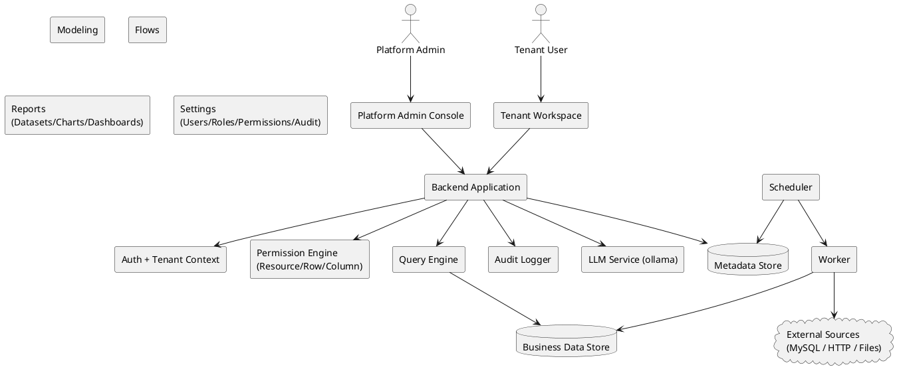

说明：平台在“交互入口（后台/工作区）”之下共享统一的身份认证、租户上下文、权限、审计与查询执行能力；Flows 的执行由调度器触发并由执行器实际跑节点逻辑。

## 2.4 关键链路一：请求链路（统一鉴权与租户上下文）

**目标**：任何进入后端的请求都必须同时完成“身份识别（GlobalUser）”与“租户上下文确定（Tenant + TenantUser）”，并在进入业务逻辑前完成权限决策。

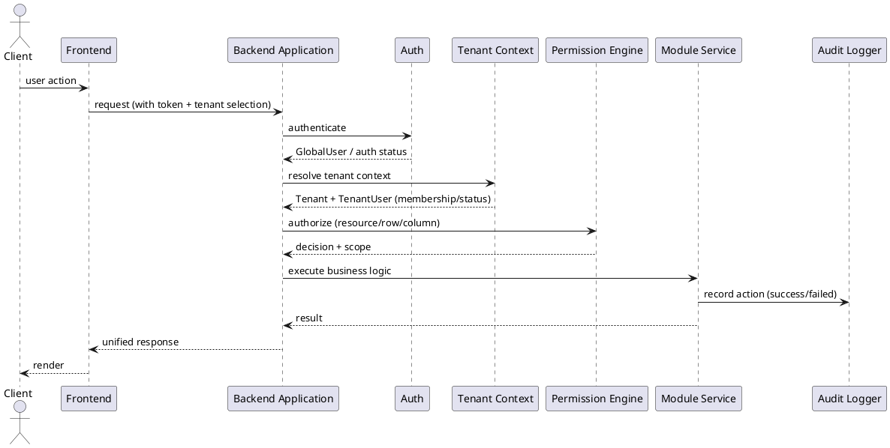

- 租户隔离的关键点在于：后端必须校验用户是否属于该租户且租户处于可用状态，并据此决定是否继续处理。
- 租户被停用（SUSPENDED）时：租户用户无法访问工作区，调度类 Flow 不再触发。

## 2.5 关键链路二：查询链路（表/数据集/图表/仪表盘共用）

**统一目标**：所有“读数据”的场景共享同一条查询链路：先做权限裁剪（资源/行/列），再把业务过滤转成统一 FilterDSL，并以统一顺序叠加到最终查询。

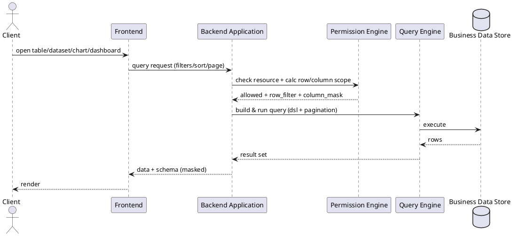

- 行/列权限需要在“表数据页、Flow 节点查询、Dataset/Chart 查询”等所有入口一致生效。
- Charts 与 Dashboards 属于报表资产化与复用体系的一部分：Chart 可被多个仪表盘复用，Dashboard 聚合多个图表实例。

## 2.6 关键链路三：执行链路（Flow 调度与运行）

**统一目标**：Flows 的“调度触发/手动触发”最终都会落到一次 Run（运行实例），Run 以节点为单位执行，写入内部表或对外写入。

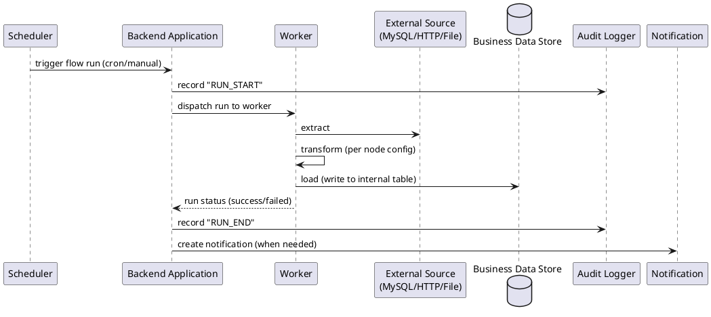

通知范围在 V1.0 限定为“任务流运行结果提醒”：手动触发完成（成功/失败）与调度触发失败；成功的调度运行通常不通知。

## 2.7 全局能力的产品约束对架构的影响

- 全局搜索：V1.0 不提供跨模块全局搜索，各模块仅在自身列表页提供搜索/筛选能力。
- 国际化：V1.0 不提供语言切换；时间/日期/数字格式可统一采用固定格式（如 `YYYY-MM-DD HH:mm:ss`）。

---

# 3 全局规范（只写规则）

## 3.1 多租户隔离规范（强制）

### 3.1.1 数据隔离原则

- 所有与业务数据相关的表（含元数据与实际数据表）必须包含 `tenant_id`。
- 所有查询/修改必须约束在当前租户：WHERE 条件必须包含 `tenant_id = 当前租户`。
- 禁止跨租户 JOIN 或写入（即使同库同实例）。

### 3.1.2 访问路径与成员校验

- 访问租户工作区时，必须同时校验：用户属于该租户（TenantUser 存在且 ACTIVE）+ 租户处于 ACTIVE 状态。

### 3.1.3 租户停用行为（SUSPENDED）

- 租户停用后：租户下所有用户无法访问工作区；调度型 Flow 不再触发新的 Run；重新启用后恢复。

## 3.2 角色与访问边界规范

- 平台维度存在 Platform Admin；租户维度存在 Owner / Data Engineer / Analyst / Viewer 等角色分工，实际权限以 Role 配置为准。
- 平台后台仅允许平台管理员访问，其身份由 GlobalUser 上的 `is_platform_admin` 标识决定。

## 3.3 API 响应与错误码规范（统一）

### 3.3.1 响应结构（成功/失败统一壳）

所有 API 统一返回结构（字段语义固定）：`success`、`code`、`message`、`data`、`trace_id`。

### 3.3.2 错误码命名规则

- 统一前缀：`ERR_` + 模块前缀 + 简要说明。
- 模块前缀建议集合：USER*/TENANT*/MODEL*/FLOW*/REPORT*/PERM*/LLM\_。

### 3.3.3 错误展示统一要求（面向用户）

- 权限相关错误需要给出明确可执行的提示（如联系租户管理员）。

## 3.4 FilterDSL（统一过滤 JSON）规范

### 3.4.1 目标约束

- 所有过滤条件在任何场景下必须转换为统一 JSON DSL，以实现语义一致、安全可控、可视化编辑与可扩展。

### 3.4.2 结构定义

- DSL 节点只有两类：Group（`{ op, conditions }`）与 Condition（`{ field, operator, value }`）；顶层可以是 Group 或单 Condition。

### 3.4.3 操作符集合与类型约束

- 操作符集合包含：比较、集合、范围、文本、空值判断等；前端必须根据字段类型限制可选 operator，避免生成不可执行 DSL。

### 3.4.4 动态变量（内置变量）

- DSL 支持内置变量：CURRENT_USER_ID / CURRENT_TENANT_ID / CURRENT_DATE / CURRENT_DATETIME，由后端解析。

### 3.4.5 版本与兼容性

- V1 允许未来增加 operator 或结构字段，但不得改变既有字段语义；如需多版本可在顶层增加 version 字段。

## 3.5 行级权限（RowPermission）规范

### 3.5.1 合并规则

- 同一（role, table）下允许 0~N 条规则，规则间以 OR 合并；若该角色未配置规则，视为不施加额外行级限制（前提是资源级 TABLE_DATA 允许）。
- 用户多角色合并：对各角色的 row_filter 再做 OR（行权限是“放开的合集”，不会因多角色被收窄）。

### 3.5.2 与业务过滤的叠加顺序（统一口径）

对任意查询统一顺序：Dataset.base_filter → 业务过滤（Chart/Flow 等配置）→ RowPermission；三者以 AND 组合，任何业务过滤不得绕过行级权限。

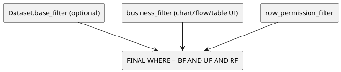

## 3.6 列级权限（ColumnPermission）规范

### 3.6.1 权限级别定义

列权限级别为：HIDDEN（不可见）、READONLY（可见不可改）、READWRITE（可见可改），并规定查询结果、表数据页、字段选择器等一致行为。

### 3.6.2 多角色合并规则

- 若所有角色均为 HIDDEN → 最终 HIDDEN；否则：任一 READWRITE 优先，其次 READONLY。

## 3.7 删除策略规范（如启用软删除）

- 若对某实体引入 `is_deleted` 实现逻辑删除，则必须在该实体对应章节明确说明删除语义为“软删除”，并保证前端不展示被软删除记录。

## 3.8 全局功能开关与统一格式

- 全局搜索：V1 不做。
- 通知：仅任务流运行结果相关。
- 国际化：V1 不提供语言切换；时间/日期格式可统一采用 `YYYY-MM-DD HH:mm:ss`。

# 第 4 章 多租户与认证体系

> 目标：定义“平台级账号（GlobalUser）—租户（Tenant）—租户成员（TenantUser）”三层身份体系、认证会话、平台后台访问控制、租户上下文装载与租户停用行为，保证：
> 1）平台后台仅 Platform Admin 可访问；2）租户工作区严格租户隔离；3）租户停用后前台不可访问且调度停止。

---

## 4.1 身份域与多租户边界

### 4.1.1 核心对象关系（概念级）

- **GlobalUser（平台用户）**：平台级账号，可加入多个租户；禁用后不可登录任何租户。
- **Tenant（租户）**：平台中的逻辑隔离单元，字段包含 `code/name/status/plan`；当 `SUSPENDED` 时前台不可访问且停止调度。
- **TenantUser（租户用户）**：GlobalUser 在某个租户内的成员关系；`(tenant_id,user_id)` 唯一，且每租户至少 1 个 `is_owner=true`。

### 4.1.2 平台后台与租户前台的访问边界

- 平台后台（`/admin/*`）仅 `is_platform_admin=true` 的 GlobalUser 可访问。
- 平台管理员默认仅查看租户**元信息**，不通过前台身份直接查看租户业务数据；如需运维排查须走专用接口并记录审计。

---

## 4.2 数据模型（表结构）

> 字段类型以 MySQL 为准（示例：`BIGINT/ VARCHAR / TINYINT / DATETIME / JSON`）。`created_at/updated_at` 统一由后端维护。

### 4.2.1 `global_user`（平台用户）

| 字段名            |         类型 | 是否可空 |            默认值 | 枚举/约束          | 说明                                   |
| ----------------- | -----------: | :------: | ----------------: | ------------------ | -------------------------------------- |
| id                |       BIGINT |    否    |                 — | PK                 | 主键                                   |
| login_name        |  VARCHAR(64) |    否    |                 — | 全局唯一；不可修改 | 登录名                                 |
| display_name      |  VARCHAR(64) |    否    |                 — | —                  | 显示名                                 |
| email             | VARCHAR(128) |    否    |                 — | 格式校验           | 邮箱                                   |
| password_hash     | VARCHAR(255) |    否    |                 — | —                  | 密码哈希（bcrypt/argon2）              |
| is_platform_admin |   TINYINT(1) |    否    |                 0 | 0/1                | 平台管理员标识                         |
| status            |  VARCHAR(16) |    否    |            ACTIVE | ACTIVE/DISABLED    | 禁用后无法登录任何租户                 |
| last_tenant_id    |       BIGINT |    是    |              NULL | FK→tenant.id       | 最近一次进入的租户（用于下次登录跳转） |
| last_login_at     |     DATETIME |    是    |              NULL | —                  | 最近一次登录时间                       |
| created_at        |     DATETIME |    否    | CURRENT_TIMESTAMP | —                  | 创建时间                               |
| updated_at        |     DATETIME |    否    | CURRENT_TIMESTAMP | —                  | 更新时间                               |

**索引**

- 唯一索引：`uk_global_user_login_name(login_name)`
- 唯一索引：`uk_global_user_email(email)`
- 普通索引：`idx_global_user_status(status)`（后台筛选）
- 普通索引：`idx_global_user_is_platform_admin(is_platform_admin)`（后台筛选）

---

### 4.2.2 `tenant`（租户）

| 字段名     |         类型 | 是否可空 |            默认值 | 枚举/约束            | 说明                          |
| ---------- | -----------: | :------: | ----------------: | -------------------- | ----------------------------- |
| id         |       BIGINT |    否    |                 — | PK                   | 主键                          |
| code       |  VARCHAR(64) |    否    |                 — | 全局唯一；不可修改   | 租户编码                      |
| name       | VARCHAR(128) |    否    |                 — | —                    | 租户名称（**允许编辑**）      |
| status     |  VARCHAR(16) |    否    |            ACTIVE | ACTIVE/SUSPENDED     | SUSPENDED：前台 403、调度停止 |
| plan       |  VARCHAR(16) |    否    |             BASIC | BASIC/PRO/ENTERPRISE | 套餐                          |
| created_at |     DATETIME |    否    | CURRENT_TIMESTAMP | —                    | 创建时间                      |
| updated_at |     DATETIME |    否    | CURRENT_TIMESTAMP | —                    | 更新时间                      |

**索引**

- 唯一索引：`uk_tenant_code(code)`
- 普通索引：`idx_tenant_status(status)`
- 普通索引：`idx_tenant_plan(plan)`
- 普通索引：`idx_tenant_name(name)`（模糊检索可配合前缀索引/全文索引视规模决定）

---

### 4.2.3 `tenant_user`（租户成员）

| 字段名     |        类型 | 是否可空 |            默认值 | 枚举/约束         | 说明                        |
| ---------- | ----------: | :------: | ----------------: | ----------------- | --------------------------- |
| id         |      BIGINT |    否    |                 — | PK                | 主键                        |
| tenant_id  |      BIGINT |    否    |                 — | FK→tenant.id      | 租户                        |
| user_id    |      BIGINT |    否    |                 — | FK→global_user.id | 平台用户                    |
| status     | VARCHAR(16) |    否    |            ACTIVE | ACTIVE/DISABLED   | 仅影响该租户内访问          |
| is_owner   |  TINYINT(1) |    否    |                 0 | 0/1               | 租户 Owner（至少存在 1 个） |
| last_login |    DATETIME |    是    |              NULL | —                 | 最近一次进入该租户时间      |
| created_at |    DATETIME |    否    | CURRENT_TIMESTAMP | —                 | 创建时间                    |
| updated_at |    DATETIME |    否    | CURRENT_TIMESTAMP | —                 | 更新时间                    |

**索引**

- 唯一索引：`uk_tenant_user(tenant_id, user_id)`
- 普通索引：`idx_tenant_user_tenant(tenant_id)`（租户成员列表）
- 普通索引：`idx_tenant_user_user(user_id)`（用户所属租户枚举）
- 普通索引：`idx_tenant_user_status(tenant_id, status)`（筛选）

---

### 4.2.4 `auth_session`（登录会话 / RefreshToken 存储）

> PRD 未限定 token/cookie 方案；为满足“退出登录”“多端会话管理”“禁用用户立即失效”等工程需求，本章给出可落地的 V1 会话表设计。

| 字段名             |         类型 | 是否可空 |            默认值 | 枚举/约束                 | 说明                   |
| ------------------ | -----------: | :------: | ----------------: | ------------------------- | ---------------------- |
| id                 |       BIGINT |    否    |                 — | PK                        | 主键                   |
| user_id            |       BIGINT |    否    |                 — | FK→global_user.id         | 账号                   |
| refresh_token_hash | VARCHAR(255) |    否    |                 — | 唯一（同一 token 不重复） | refresh token 哈希存储 |
| status             |  VARCHAR(16) |    否    |            ACTIVE | ACTIVE/REVOKED/EXPIRED    | 会话状态               |
| issued_at          |     DATETIME |    否    | CURRENT_TIMESTAMP | —                         | 签发时间               |
| expires_at         |     DATETIME |    否    |                 — | —                         | 过期时间               |
| revoked_at         |     DATETIME |    是    |              NULL | —                         | 撤销时间               |
| meta               |         JSON |    是    |              NULL | —                         | UA/IP/设备信息（可选） |

**`meta` JSON 结构定义**

| 字段       | 类型   | 必填 | 枚举/上限 | 示例           | 说明                 |
| ---------- | ------ | :--: | --------- | -------------- | -------------------- |
| user_agent | string |  否  | ≤512      | `"Chrome/..."` | 浏览器 UA            |
| ip         | string |  否  | ≤64       | `"1.2.3.4"`    | 登录 IP              |
| device_id  | string |  否  | ≤64       | `"web-xxx"`    | 客户端生成的设备标识 |

**索引**

- 唯一索引：`uk_auth_session_refresh_hash(refresh_token_hash)`
- 普通索引：`idx_auth_session_user(user_id, status)`
- 普通索引：`idx_auth_session_expires(expires_at)`

---

## 4.3 认证与会话（Auth）

### 4.3.1 认证形态

- **Access Token（JWT）**：短期有效（例如 15 分钟），用于鉴权与携带 `user_id/is_platform_admin` 等声明。
- **Refresh Token**：长期有效（例如 7–30 天），服务端落库 `auth_session`，用于换发 access token 与“退出登录/禁用即失效”。

> `/api/me` 用于登录后获取当前用户信息，并包含 `is_platform_admin` 用于是否展示平台后台入口。

---

## 4.4 租户上下文（TenantContext）与停用行为

### 4.4.1 租户上下文装载规则

- 前端路由中存在 `tenantId`（租户切换时 URL 更新）。
- 后端对“租户域接口”统一要求携带 `X-Tenant-Id`（由前端用路由参数注入）；服务端中间件执行：

  1. 解析 `X-Tenant-Id`
  2. 校验 Tenant 存在
  3. 校验 Tenant 状态为 ACTIVE（否则 403）
  4. 校验 TenantUser 存在且为 ACTIVE（否则 403）
  5. 将 `tenant/tenant_user` 挂载到 RequestContext，供后续权限与数据访问使用

### 4.4.2 租户切换与“最近租户”记忆

- 若用户仅属于一个租户：登录后直接进入该租户工作区。
- 若属于多个租户：首次登录展示租户选择或顶部下拉；下拉仅展示状态为 ACTIVE 的租户并支持搜索。
- 系统需记住最近一次进入的租户，用于下次登录直接跳转。

落地规则：当发生以下任一事件，更新 `global_user.last_tenant_id`：

- 调用 `POST /api/tenants/switch` 成功；
- 任意一次租户域请求通过 TenantContext 校验（以请求头的 `X-Tenant-Id` 为准）；

### 4.4.3 访问被停用租户

- 当用户尝试进入 `SUSPENDED` 租户：后端返回 403；前端展示“租户已停用”提示页且不展示业务菜单。
- 当租户状态从 ACTIVE → SUSPENDED：该租户下 CRON 调度的 Flow 不再触发新的 Run；在运行中的 Flow 可自然结束（是否强杀由运维策略决定）。

---

## 4.5 关键链路图（PlantUML）

### 4.5.1 租户域 API 请求链路（带 TenantContext）

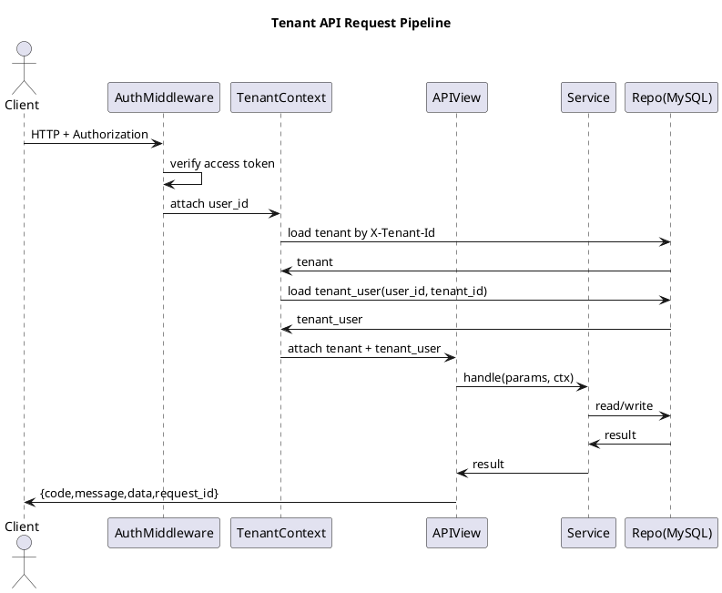

### 4.5.2 平台后台（/admin/\*）请求链路（AdminGuard）

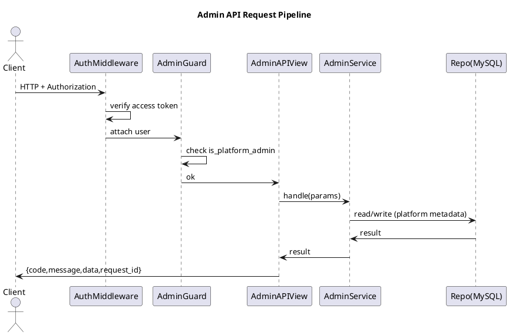

### 4.5.3 登录后租户跳转（单租户 / 多租户 / 最近租户）

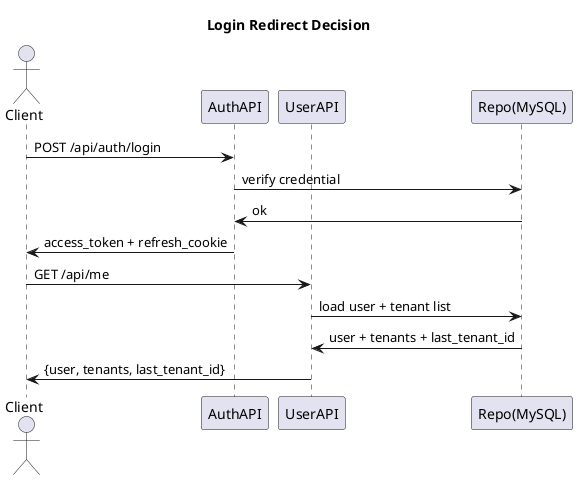

### 4.5.4 顶部租户切换（只展示 ACTIVE）

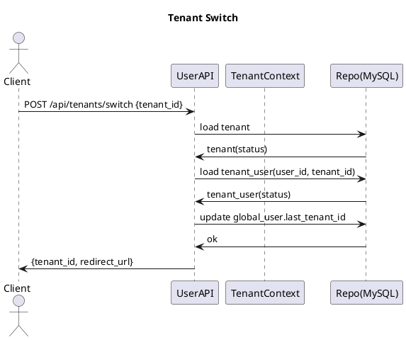

---

## 4.6 接口清单（本章范围）

> 说明：
>
> - **租户域接口**统一要求：登录态 + `X-Tenant-Id`（除非接口本身是全局接口）。
> - **平台后台接口**统一要求：登录态 + `is_platform_admin=true`，且路径位于 `/admin/*`（页面与接口）。

### 4.6.1 全局认证与用户态

1. `POST /api/auth/login`（登录）
2. `POST /api/auth/logout`（退出登录）
3. `POST /api/auth/refresh`（换发 access token）
4. `GET /api/me`（获取当前用户信息、可访问租户列表、is_platform_admin）

### 4.6.2 租户选择与切换（Tenant Workspace Shell）

5. `POST /api/tenants/switch`（切换租户并记录最近租户）
6. `GET /api/tenants`（列出当前用户可访问的 ACTIVE 租户，用于下拉与搜索）

### 4.6.3 平台后台（Platform Admin）接口组（必须单独成组）

> 平台后台能力：GlobalUser 管理、Tenant 管理、TenantUser 管理。
> **补齐项（必须实现）**：编辑租户时允许修改租户名称（`name`），不得遗漏。

7. `GET /admin/api/users`（GlobalUser 列表：搜索/筛选）

8. `POST /admin/api/users`（创建 GlobalUser：含初始密码策略）

9. `PATCH /admin/api/users/{id}`（编辑 GlobalUser：显示名/邮箱/is_platform_admin/status）

10. `POST /admin/api/users/{id}/enable`（启用）

11. `POST /admin/api/users/{id}/disable`（禁用）

12. `POST /admin/api/users/{id}/reset_password`（可选：重置密码）

13. `GET /admin/api/tenants`（Tenant 列表：搜索/筛选）

14. `POST /admin/api/tenants`（创建 Tenant：code/name/plan/status）

15. `PATCH /admin/api/tenants/{id}`（编辑 Tenant：**name/plan/status**；code 不可改）

16. `POST /admin/api/tenants/{id}/enable`（启用）

17. `POST /admin/api/tenants/{id}/suspend`（停用）

18. `GET /admin/api/tenants/{tenantId}/users`（租户成员列表）

19. `POST /admin/api/tenants/{tenantId}/users`（添加成员：从 GlobalUser 搜索添加，可批量，可设 Owner，可选初始角色）

20. `PATCH /admin/api/tenants/{tenantId}/users/{tenantUserId}`（修改成员：状态/Owner/角色）

21. `DELETE /admin/api/tenants/{tenantId}/users/{tenantUserId}`（移除成员：删除 TenantUser）

---

## 4.7 接口实现规范（逐接口：入参/出参/校验/错误码/伪代码）

> 统一响应封装（本章落地约定）：
>
> - 成功：`{ code: "OK", message: "OK", data: <object>, request_id: <string> }`
> - 失败：`{ code: <string>, message: <string>, data: null, request_id: <string>, details?: <object> }`

---

### 4.7.1 `POST /api/auth/login`

**请求 Body**

| 字段       | 类型   | 必填 | 约束  | 说明                      |
| ---------- | ------ | :--: | ----- | ------------------------- |
| login_name | string |  是  | 1–64  | 登录名                    |
| password   | string |  是  | 8–128 | 明文密码（仅 HTTPS 传输） |

**响应 data**

| 字段         | 类型   | 必填 | 说明                                                       |
| ------------ | ------ | :--: | ---------------------------------------------------------- |
| access_token | string |  是  | JWT                                                        |
| expires_in   | int    |  是  | 秒                                                         |
| user         | object |  是  | `{id, login_name, display_name, email, is_platform_admin}` |

**校验与异常分支**

- `login_name` 不存在 → 登录失败（不暴露是否存在，统一提示）。
- GlobalUser.status=DISABLED → 拒绝登录。
- 密码不匹配 → 登录失败。
- 登录成功 → 写入 `global_user.last_login_at`；创建 `auth_session`；下发 refresh cookie（HttpOnly）。

**错误码**

- `AUTH_INVALID_CREDENTIALS`（401）
- `AUTH_USER_DISABLED`（403）
- `AUTH_TOO_MANY_ATTEMPTS`（429）
- `VALIDATION_REQUIRED`（400）
- `VALIDATION_FORMAT`（400）
- `SECURITY_TLS_REQUIRED`（400）
- `SESSION_CREATE_FAILED`（500）
- `INTERNAL_ERROR`（500）

**伪代码（Service/Repo 可映射）**

```text
AuthService.login(login_name, password, request_meta):
  user = GlobalUserRepo.find_by_login_name(login_name)
  if user is None: return error(AUTH_INVALID_CREDENTIALS, 401)
  if user.status != "ACTIVE": return error(AUTH_USER_DISABLED, 403)
  if not PasswordHasher.verify(password, user.password_hash):
      RateLimit.bump(login_name, ip)
      return error(AUTH_INVALID_CREDENTIALS, 401)

  access = Jwt.issue({user_id:user.id, is_platform_admin:user.is_platform_admin}, ttl=900)
  refresh = Token.random()
  AuthSessionRepo.create(user_id=user.id, refresh_hash=hash(refresh), meta=request_meta, expires_at=now+30d)

  GlobalUserRepo.update_last_login(user.id, now)
  return ok({access_token:access, expires_in:900, user:PublicUser(user)}, set_cookie_refresh=refresh)
```

---

### 4.7.2 `GET /api/me`

> 登录后前端通过 `/api/me` 获取当前用户信息，并包含 `is_platform_admin` 用于平台后台入口控制。

**请求 Header**

- `Authorization: Bearer <access_token>`

**响应 data**

| 字段    | 类型   | 必填 | 说明                                                                               |
| ------- | ------ | :--: | ---------------------------------------------------------------------------------- |
| user    | object |  是  | `{id, login_name, display_name, email, is_platform_admin, status, last_tenant_id}` |
| tenants | array  |  是  | 用户可访问租户列表（仅 ACTIVE）                                                    |

`tenants[]` 结构：

| 字段      | 类型   | 必填 | 说明                 |
| --------- | ------ | :--: | -------------------- |
| tenant_id | number |  是  | 租户 ID              |
| code      | string |  是  | 租户编码             |
| name      | string |  是  | 租户名称             |
| plan      | string |  是  | BASIC/PRO/ENTERPRISE |

**校验与异常分支**

- token 无效/过期 → 401
- GlobalUser 被禁用 → 403（并可主动撤销其所有会话）
- 返回的 tenants 必须过滤 `tenant.status=ACTIVE`

**错误码**

- `AUTH_UNAUTHORIZED`（401）
- `AUTH_TOKEN_EXPIRED`（401）
- `AUTH_USER_DISABLED`（403）
- `DATA_INTEGRITY_ERROR`（500）
- `RATE_LIMITED`（429）
- `VALIDATION_HEADER_MISSING`（400）
- `INTERNAL_ERROR`（500）
- `SERVICE_UNAVAILABLE`（503）

**伪代码**

```text
UserService.me(user_id):
  user = GlobalUserRepo.get(user_id)
  if user.status != "ACTIVE": return error(AUTH_USER_DISABLED, 403)

  tenant_users = TenantUserRepo.list_by_user(user_id, status="ACTIVE")
  tenant_ids = [tu.tenant_id for tu in tenant_users]
  tenants = TenantRepo.list_by_ids(tenant_ids, status="ACTIVE")  # 只返回 ACTIVE
  return ok({user:PublicUser(user), tenants:MapTenants(tenants), last_tenant_id:user.last_tenant_id})
```

---

### 4.7.3 `POST /api/tenants/switch`

> 切换后 URL 中 `tenantId` 更新并跳转工作区首页；系统需记住最近一次进入的租户。

**请求 Body**

| 字段      | 类型   | 必填 | 约束 | 说明     |
| --------- | ------ | :--: | ---- | -------- |
| tenant_id | number |  是  | >0   | 目标租户 |

**响应 data**

| 字段         | 类型   | 必填 | 说明                                           |
| ------------ | ------ | :--: | ---------------------------------------------- |
| tenant_id    | number |  是  | 切换成功的租户                                 |
| redirect_url | string |  是  | 前端跳转地址（例如 `/t/{tenant_id}/modeling`） |

**校验与异常分支**

- tenant 不存在 → 404
- tenant.status=SUSPENDED → 403（前端展示“租户已停用”页）
- TenantUser 不存在/被禁用 → 403
- 切换成功 → 更新 `global_user.last_tenant_id`

**错误码**

- `AUTH_UNAUTHORIZED`（401）
- `TENANT_NOT_FOUND`（404）
- `TENANT_SUSPENDED`（403）
- `TENANT_ACCESS_DENIED`（403）
- `TENANT_USER_DISABLED`（403）
- `VALIDATION_REQUIRED`（400）
- `CONFLICT_STATE_CHANGED`（409）
- `INTERNAL_ERROR`（500）

**伪代码**

```text
TenantService.switch_tenant(user_id, tenant_id):
  tenant = TenantRepo.get(tenant_id)
  if tenant is None: return error(TENANT_NOT_FOUND, 404)
  if tenant.status != "ACTIVE": return error(TENANT_SUSPENDED, 403)

  tu = TenantUserRepo.get_by_unique(tenant_id, user_id)
  if tu is None: return error(TENANT_ACCESS_DENIED, 403)
  if tu.status != "ACTIVE": return error(TENANT_USER_DISABLED, 403)

  GlobalUserRepo.update_last_tenant(user_id, tenant_id)
  return ok({tenant_id:tenant_id, redirect_url: "/t/"+tenant_id+"/modeling"})
```

---

## 4.8 平台后台（Platform Admin）接口组（逐接口）

> 平台后台仅 `is_platform_admin=true` 可访问；未登录 401，非平台管理员 403。

> 注意：平台后台“编辑租户”必须支持修改租户名称（`name`），租户编码（`code`）不可修改。

以下接口均要求：

- Header：`Authorization: Bearer <access_token>`
- 路径前缀：`/admin/api/*`

---

### 4.8.1 `GET /admin/api/users`（GlobalUser 列表）

**Query 参数**

| 参数              | 类型   | 必填 | 约束            | 说明                                      |
| ----------------- | ------ | :--: | --------------- | ----------------------------------------- |
| q                 | string |  否  | ≤128            | 按 login_name/display_name/email 模糊查询 |
| status            | string |  否  | ACTIVE/DISABLED | 状态筛选                                  |
| is_platform_admin | bool   |  否  | true/false      | 管理员筛选                                |
| page              | int    |  否  | ≥1              | 分页                                      |
| page_size         | int    |  否  | 1–200           | 分页                                      |

**响应 data**

| 字段  | 类型  | 必填 | 说明     |
| ----- | ----- | :--: | -------- |
| total | int   |  是  | 总数     |
| items | array |  是  | 用户列表 |

`items[]` 字段（与后台展示一致）

**错误码**

- `AUTH_UNAUTHORIZED`（401）
- `ADMIN_FORBIDDEN`（403）
- `VALIDATION_PAGINATION`（400）
- `VALIDATION_FORMAT`（400）
- `RATE_LIMITED`（429）
- `DB_QUERY_TIMEOUT`（504）
- `INTERNAL_ERROR`（500）
- `SERVICE_UNAVAILABLE`（503）

**伪代码**

```text
AdminUserService.list(q, status, is_platform_admin, page, page_size):
  AdminGuard.require_platform_admin()
  return GlobalUserRepo.search(q, status, is_platform_admin, page, page_size)
```

---

### 4.8.2 `POST /admin/api/tenants`（创建租户）

**请求 Body**（来自 PRD 表单字段）

| 字段                   | 类型          | 必填 | 枚举/约束            | 说明                                 |
| ---------------------- | ------------- | :--: | -------------------- | ------------------------------------ |
| code                   | string        |  是  | 全局唯一；1–64       | 租户编码                             |
| name                   | string        |  是  | 1–128                | 租户名称                             |
| plan                   | string        |  是  | BASIC/PRO/ENTERPRISE | 套餐                                 |
| status                 | string        |  否  | ACTIVE/SUSPENDED     | 默认 ACTIVE                          |
| initial_owner_user_ids | array<number> |  是  | 至少 1 个            | 用于满足“每租户至少一个 Owner”的约束 |

**响应 data**

| 字段      | 类型   | 必填 | 说明      |
| --------- | ------ | :--: | --------- |
| tenant_id | number |  是  | 新租户 ID |

**校验与异常分支**

- code 重复 → 409
- initial_owner_user_ids 中存在不存在/禁用 GlobalUser → 400/403
- 创建 Tenant 成功后必须在同一事务内写入对应 TenantUser（is_owner=1）

**错误码**

- `AUTH_UNAUTHORIZED`（401）
- `ADMIN_FORBIDDEN`（403）
- `TENANT_CODE_DUPLICATE`（409）
- `VALIDATION_REQUIRED`（400）
- `VALIDATION_ENUM`（400）
- `OWNER_REQUIRED`（400）
- `USER_NOT_FOUND`（400）
- `INTERNAL_ERROR`（500）

**伪代码（含事务）**

```text
AdminTenantService.create(payload):
  AdminGuard.require_platform_admin()

  validate code unique
  validate plan/status enum
  validate initial_owner_user_ids non-empty

  tx.begin()
    tenant_id = TenantRepo.insert(code,name,plan,status)
    for uid in initial_owner_user_ids:
        u = GlobalUserRepo.get(uid)
        if u is None: tx.rollback(); return error(USER_NOT_FOUND, 400)
        if u.status != "ACTIVE": tx.rollback(); return error(AUTH_USER_DISABLED, 403)
        TenantUserRepo.insert(tenant_id, uid, status="ACTIVE", is_owner=1)
  tx.commit()
  return ok({tenant_id:tenant_id})
```

---

### 4.8.3 `PATCH /admin/api/tenants/{id}`（编辑租户：必须支持改名称）

> 编辑 Tenant：`code` 不可修改；可修改 `name/plan/status`。

**请求 Path**

- `id`: tenant id

**请求 Body**

| 字段   | 类型   | 必填 | 枚举/约束            | 说明                     |
| ------ | ------ | :--: | -------------------- | ------------------------ |
| name   | string |  否  | 1–128                | 租户名称（**补齐必做**） |
| plan   | string |  否  | BASIC/PRO/ENTERPRISE | 套餐                     |
| status | string |  否  | ACTIVE/SUSPENDED     | 状态                     |

**状态变更语义**

- `SUSPENDED`：该租户所有 TenantUser 前台访问 403，Flow 调度停止触发新的 Run。
- `ACTIVE`：恢复访问与调度。

**错误码**

- `AUTH_UNAUTHORIZED`（401）
- `ADMIN_FORBIDDEN`（403）
- `TENANT_NOT_FOUND`（404）
- `VALIDATION_ENUM`（400）
- `VALIDATION_FORMAT`（400）
- `CONFLICT_NO_OWNER`（409）（若后续实现要求启用前必须存在 Owner）
- `SCHEDULER_UPDATE_FAILED`（500）
- `INTERNAL_ERROR`（500）

**伪代码**

```text
AdminTenantService.update(tenant_id, patch):
  AdminGuard.require_platform_admin()
  tenant = TenantRepo.get(tenant_id)
  if tenant is None: return error(TENANT_NOT_FOUND, 404)

  if "name" in patch: validate len/name
  if "plan" in patch: validate enum
  if "status" in patch: validate enum

  tx.begin()
    TenantRepo.update_fields(tenant_id, patch)
    if patch.status changed to "SUSPENDED":
        SchedulerService.pause_all_cron_flows(tenant_id)   # 仅停止触发，不强杀运行中实例
    if patch.status changed to "ACTIVE":
        SchedulerService.resume_all_cron_flows(tenant_id)
  tx.commit()
  return ok({})
```

---

### 4.8.4 `POST /admin/api/tenants/{tenantId}/users`（添加成员，支持批量）

> 添加成员：从 GlobalUser 搜索添加，可批量；可选设 Owner；可选初始角色；平台后台不提供注册新用户流程。

**请求 Body**

| 字段             | 类型          | 必填 | 约束  | 说明                             |
| ---------------- | ------------- | :--: | ----- | -------------------------------- |
| user_ids         | array<number> |  是  | 1–200 | GlobalUser.id 列表               |
| set_owner        | bool          |  否  | —     | 是否将新增成员设为 Owner         |
| initial_role_ids | array<number> |  否  | —     | 初始角色（角色表详见权限体系章） |

**响应 data**

| 字段    | 类型  | 必填 | 说明                              |
| ------- | ----- | :--: | --------------------------------- |
| created | int   |  是  | 创建数量                          |
| skipped | int   |  是  | 已存在跳过数量                    |
| items   | array |  是  | 创建结果明细（含 tenant_user_id） |

**校验与异常分支**

- tenant 不存在 → 404
- tenant.status=SUSPENDED 时是否允许“后台加人”：允许（平台操作不受前台限制），但新增成员仍需满足约束
- user_ids 任一不存在 → 400
- `(tenant_id,user_id)` 已存在 → 跳过或 409（建议返回明细）
- 若设置/取消 Owner 导致租户无 Owner → 阻止并提示

**错误码**

- `AUTH_UNAUTHORIZED`（401）
- `ADMIN_FORBIDDEN`（403）
- `TENANT_NOT_FOUND`（404）
- `USER_NOT_FOUND`（400）
- `CONFLICT_MEMBER_EXISTS`（409）
- `CONFLICT_NO_OWNER`（409）
- `VALIDATION_LIMIT_EXCEEDED`（400）
- `INTERNAL_ERROR`（500）

**伪代码（含事务与批量）**

```text
AdminTenantUserService.add_members(tenant_id, user_ids, set_owner, role_ids):
  AdminGuard.require_platform_admin()
  if TenantRepo.get(tenant_id) is None: return error(TENANT_NOT_FOUND, 404)

  tx.begin()
    results = []
    for uid in user_ids:
      if GlobalUserRepo.get(uid) is None:
         tx.rollback(); return error(USER_NOT_FOUND, 400)
      if TenantUserRepo.exists(tenant_id, uid):
         results.append({uid, status:"SKIPPED_EXISTS"})
         continue
      tu_id = TenantUserRepo.insert(tenant_id, uid, status="ACTIVE", is_owner=set_owner?1:0)
      if role_ids not empty: TenantUserRoleRepo.batch_insert(tu_id, role_ids)
      results.append({uid, tenant_user_id:tu_id, status:"CREATED"})
    ensure_owner_invariant(tenant_id)  # 至少 1 个 owner，否则 rollback
  tx.commit()
  return ok(summary(results))
```

# 5 权限体系

## 5.0 章节定位与阅读顺序

本章定义租户侧权限体系的**完整模型与授权规则**，包括：

- 资源级权限（RolePermission）：对表/Flow/Dataset/Dashboard 的查看、编辑与管理授权；
- 行级权限（RowPermission）：基于统一 FilterDSL 的行过滤规则；
- 列级权限（ColumnPermission）：字段隐藏/只读/可写；
- 授权载体（ResourceTree 授权）：目录默认权限、继承、覆盖、多角色合并；
- 权限引擎（PermissionEngine）：输入、输出、算法与伪代码；
- Settings 权限配置相关接口：角色、成员角色、资源权限、行/列权限。

资源树“目录结构维护（CRUD/move/path）”、查询引擎（QueryBuilder/Runner）、通知、LLM 辅助等**通用能力的实现细节**在第 6 章；本章仅定义这些能力所需的**权限判定口径与授权规则**。

---

## 5.1 目标与范围

### 5.1.1 目标

- 在同一租户内，支持按角色对不同资源（表/Flow/Dataset/Dashboard）授予 `NONE/VIEW/EDIT/MANAGE` 等级权限。
- 支持在同一张表上，按角色配置：
  - 行级访问边界（RowPermission，FilterDSL）；
  - 列级可见与可写边界（ColumnPermission）。
- 支持目录（Folder）作为授权载体：
  - Folder 节点可配置默认权限；
  - 子资源节点未显式配置时，继承最近祖先 Folder 默认权限；
  - 显式配置覆盖继承；
  - 单角色内“向上回溯取最大”，多角色间“再取最大”。
- 在数据查询链路中，保证“业务过滤不能绕过行权限”，并支持 `TABLE_DATA=MANAGE` 绕过行权限（本期默认策略）。
- 变更可追溯：权限相关变更必须落审计（审计详情见第 10 章，本章定义对接点与字段要求）。

### 5.1.2 非目标

- 跨租户共享数据/跨租户授权（本期不做）。
- “管理员也受行权限限制”的细粒度开关（预留为后续版本）。

---

## 5.2 权限对象与关系

### 5.2.1 权限对象

- **TenantUser**：租户成员（身份与租户上下文见第 4 章）。
- **Role**：租户内角色（可内置、可自定义）。
- **RolePermission**：资源级授权记录（绑定到资源树节点）。
- **RowPermission**：行权限规则（绑定到表）。
- **ColumnPermission**：列权限规则（绑定到表字段）。
- **ResourceTreeNode**：授权载体与资源组织节点（目录/资源节点），结构维护见第 6 章。

### 5.2.2 PlantUML：权限域对象关系图

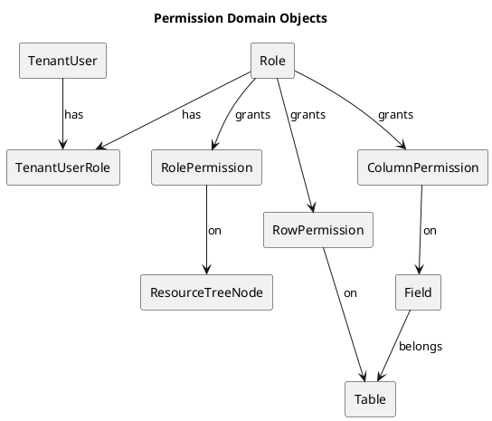

---

## 5.3 权限等级与资源类型

### 5.3.1 资源类型（resource_type）

资源级权限覆盖以下类型（与产品范围保持一致）：

- `TABLE_SCHEMA`：表结构（字段新增/修改/删除、关系配置等“建模结构”类能力）；
- `TABLE_DATA`：表数据（增删改查记录、导入、数据预览等“数据访问”类能力）；
- `FLOW`：任务流；
- `DATASET`：数据集；
- `DASHBOARD`：仪表盘。

> 说明：`TABLE_SCHEMA` 与 `TABLE_DATA` 是同一张表的“双权限项”，规则见 5.6。

### 5.3.2 权限等级（permission）

- `NONE`：无权限；
- `VIEW`：仅查看；
- `EDIT`：允许编辑内容，但不包含删除、移动、配置权限等管理类操作；
- `MANAGE`：管理权限（删除、移动、配置权限、Owner 转移等）。

### 5.3.3 等级比较规则

- 等级顺序：`NONE < VIEW < EDIT < MANAGE`
- “取最大值”指按该顺序比较后的最大等级。

---

## 5.4 授权载体：资源树授权与继承合并

### 5.4.1 授权载体定义

- 资源通过 **ResourceTreeNode** 组织成树（按 scope 分不同资源树）。
- **Folder 节点**（`node_type=FOLDER`）：
  - 仅组织层级；
  - 可作为授权载体设置默认权限（RolePermission 指向该节点）。
- **资源节点**（`node_type=RESOURCE`）：
  - 代表某个具体资源（表、Flow、Dataset、Dashboard）；
  - 可显式设置权限（RolePermission 指向该节点）。

### 5.4.2 scope 与 resource_type 映射（授权口径）

| scope（资源树范围） | 资源节点 ref_type | 对应 resource_type                             |
| ------------------- | ----------------- | ---------------------------------------------- |
| TABLE               | TABLE             | `TABLE_SCHEMA` 与 `TABLE_DATA`（同表双权限项） |
| FLOW                | FLOW              | `FLOW`                                         |
| DATASET             | DATASET           | `DATASET`                                      |
| DASHBOARD           | DASHBOARD         | `DASHBOARD`                                    |

> 表资源节点在授权时必须同时处理 `TABLE_SCHEMA` 与 `TABLE_DATA` 两类权限项（见 5.6）。

### 5.4.3 Folder 默认权限与继承覆盖

- Folder 节点允许配置“默认权限”；
- 对于该 Folder 下**未单独配置**权限的子资源节点：使用最近祖先 Folder 的默认权限；
- 一旦在资源节点上**显式配置**权限：以资源节点配置为准，覆盖 Folder 默认值。

### 5.4.4 单角色权限计算（向上回溯取最大）

对某角色 role 在资源节点 R 上的资源级权限：

1. 从资源节点 R 开始，向上回溯祖先链，直到根 Folder；
2. 收集该角色在沿途节点上的权限设置（RolePermission 记录）；
3. 取其中最大权限等级，得到 `perm(role, R)`。

### 5.4.5 多角色合并（用户最终资源权限）

对某用户 U（拥有多个角色）与资源节点 R：

- `perm(U, R) = max(perm(role1, R), perm(role2, R), ...)`

### 5.4.6 PlantUML：资源权限计算（继承 + 多角色合并）

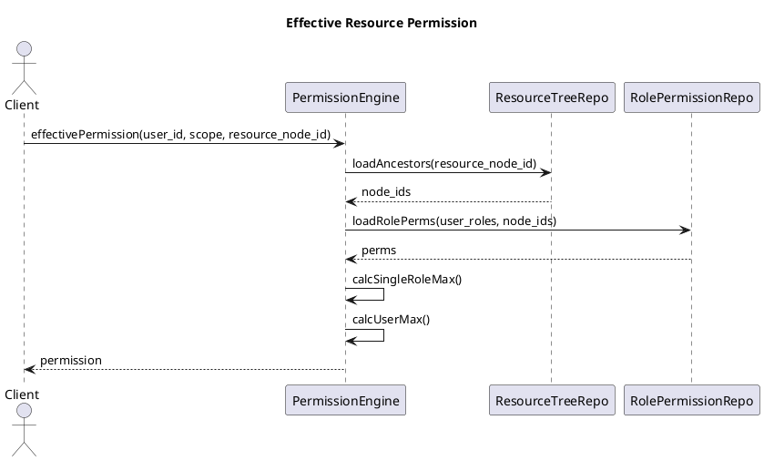

---

## 5.5 资源级权限（RolePermission）

### 5.5.1 RolePermission 的含义

RolePermission 表示：

> “某角色在某个资源树节点上的权限等级”。

节点可以是 Folder（默认权限）或资源节点（显式权限）。

### 5.5.2 覆盖规则总结（必须实现）

- 显式节点权限覆盖继承的 Folder 默认权限；
- 单角色在多处配置时取最大；
- 多角色合并再取最大；
- 若最终为 `NONE`，视为不可见且不可访问。

### 5.5.3 资源可见性与按钮可用性

- **可见性**：
  - `perm(U,R) == NONE`：资源在列表与树中不可见（后端必须过滤）；
  - `perm(U,R) >= VIEW`：可见。
- **按钮/操作**（后端必须强校验，前端仅作为提示）：
  - 查看详情：`>= VIEW`
  - 编辑：`>= EDIT`
  - 删除/移动/配置权限：`>= MANAGE`

---

## 5.6 表的“双权限项”约定（TABLE_SCHEMA / TABLE_DATA）

### 5.6.1 为什么需要双权限项

对表的访问分为两类：

- **结构类**：新增字段、修改字段、关系管理等（建模结构）；
- **数据类**：行数据的查询、导入、增删改等（数据访问）。

两者需要独立授权，因此表资源节点在 RolePermission 中必须支持：

- `resource_type=TABLE_SCHEMA`
- `resource_type=TABLE_DATA`

### 5.6.2 双权限项的授权与计算

- 表资源节点在加载权限时，对同一 `resource_tree_node_id` 必须分别计算：
  - `perm_schema(U, table_node)`
  - `perm_data(U, table_node)`
- Folder 默认权限若应用于表，必须对两项分别继承与合并（允许只配其一或两项均配）。

### 5.6.3 表操作与权限映射（后端强校验口径）

| 操作                                       | 需要权限                                             |
| ------------------------------------------ | ---------------------------------------------------- |
| 表结构新增/改名/删字段、关系维护           | `TABLE_SCHEMA >= EDIT`（管理类变更要求 `>= MANAGE`） |
| 表数据查询（预览、Dataset 读取、报表查询） | `TABLE_DATA >= VIEW`                                 |
| 表数据写入（增删改、导入）                 | `TABLE_DATA >= EDIT`                                 |
| 配置表的行/列权限                          | `TABLE_DATA >= MANAGE`（本期默认）                   |

---

## 5.7 行级权限（RowPermission）

### 5.7.1 定义与目标

RowPermission 用于控制：

> 在同一张表中，不同角色可访问哪些行数据。

RowPermission 基于统一 FilterDSL（见第 6 章 QueryEngine 的 DSL 编译约束），并与业务过滤叠加。

### 5.7.2 叠加规则（必须实现）

三类过滤按 **AND** 组合：

- `base_filter`：资产（如 Dataset）定义的基础过滤；
- `business_filter`：业务侧页面筛选（用户当次输入）；
- `row_permission_filter`：行权限过滤。

总 WHERE：

`WHERE = base_filter AND business_filter AND row_permission_filter`

约束：

- 业务过滤不得绕过行权限；
- 行权限只会收紧结果集，不会扩大结果集。

### 5.7.3 MANAGE 绕过策略（本期默认）

若用户对某表的 `TABLE_DATA` 有任一角色获得 `MANAGE`：

- 本期默认策略：该用户对该表**不受行权限限制**（row_permission_filter 绕过）。

### 5.7.4 多角色行权限合并策略（强约束）

同一用户多个角色对同一表存在多条 RowPermission 时：

- 合并为 `OR`（扩大可见行的集合），再与业务过滤 `AND`：
  - `row_permission_filter = (rp_role1) OR (rp_role2) OR ...`
- 若某角色未配置 RowPermission，则该角色对该表的行权限视为“无可见行”（即该角色不贡献可见集合）。
- 若触发 MANAGE 绕过，则 `row_permission_filter = TRUE`。

### 5.7.5 PlantUML：查询 WHERE 组合（含绕过）

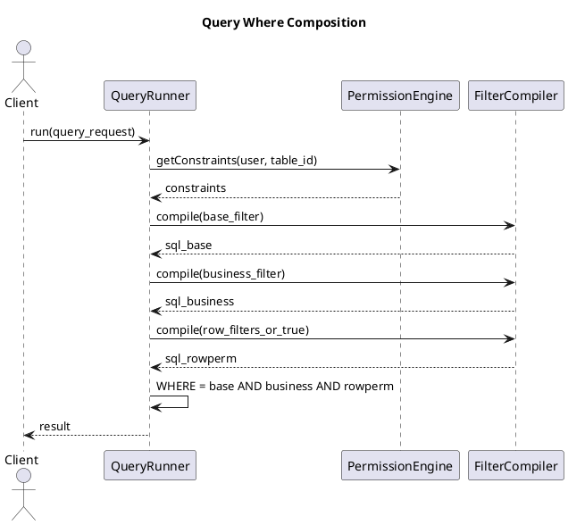

---

## 5.8 列级权限（ColumnPermission）

### 5.8.1 权限等级与行为

列权限用于控制字段的可见与可写性：

- `HIDDEN`：不可见（后端不得返回该字段；查询 SQL 中不得选择该列；写入时不得接受该字段）；
- `READONLY`：可见但不可写（写入时拒绝该字段）；
- `READWRITE`：可见且可写（仍需受 `TABLE_DATA` 权限约束）。

### 5.8.2 多角色列权限合并策略（强约束）

对同一字段 field：

1. 若任一角色为 `HIDDEN` → 最终为 `HIDDEN`；
2. 否则若任一角色为 `READWRITE` → 最终为 `READWRITE`；
3. 否则若任一角色为 `READONLY` → 最终为 `READONLY`；
4. 若没有任何配置 → 使用系统默认（建议 `READWRITE`）。

### 5.8.3 列权限与 TABLE_DATA 的约束关系

- 最终列权限仍受资源级 `TABLE_DATA` 控制：
  - 若 `perm_data(U, table) < EDIT`：
    - 即使某字段列权限为 `READWRITE`，也不允许写入；
  - 若 `perm_data(U, table) < VIEW`：
    - 不允许查询该表（优先按资源级拒绝）。

---

## 5.9 权限引擎（PermissionEngine）

### 5.9.1 输入与输出契约

输入：

- `tenant_id`
- `tenant_user_id`
- `roles[]`（通过 TenantUserRole 加载）
- `scope` / `resource_tree_node_id` / `table_id` 等

输出（最小集合）：

- `perm_schema` / `perm_data`（表双权限项）
- `bypass_row_permission: bool`
- `row_permission_filters[]`
- `allowed_columns[]`（HIDDEN 已剔除；附带 readonly 标记）
- `writable_columns[]`

### 5.9.2 缓存与失效（本期最小实现）

- 本期允许无缓存（直接读库），但必须保证性能：
  - RolePermission/RowPermission/ColumnPermission 加载必须按索引走；
- 若引入缓存（可选）：
  - key 至少包含 `(tenant_id, tenant_user_id, scope)`；
  - 权限变更必须触发失效（见 5.13 对接）。

### 5.9.3 伪代码（可映射到 Service/Repo）

```text
function getTableConstraints(tenant_id, tenant_user_id, table_node_id, table_id):
  roles = RoleRepo.listRolesOfUser(tenant_id, tenant_user_id)

  perm_data = calcEffectiveResourcePerm(roles, table_node_id, "TABLE_DATA")
  perm_schema = calcEffectiveResourcePerm(roles, table_node_id, "TABLE_SCHEMA")

  if perm_data == NONE:
    return error PERMISSION_DENIED

  bypass_row = (perm_data == MANAGE)

  row_filters = []
  if not bypass_row:
    for role in roles:
      dsl = RowPermissionRepo.getByRoleAndTable(tenant_id, role.id, table_id)
      if dsl exists and dsl.status == ACTIVE:
        row_filters.append(dsl.filter_dsl)

  fields = FieldRepo.listByTable(tenant_id, table_id)
  col_map = ColumnPermissionRepo.listByRolesAndTable(tenant_id, roles, table_id)

  allowed = []
  writable = []
  for f in fields:
    level = mergeColumnLevelAcrossRoles(roles, col_map, f.id)
    if level == HIDDEN:
      continue
    readonly = (level == READONLY) or (perm_data < EDIT)
    allowed.append({field_id:f.id, code:f.code, readonly:readonly})
    if not readonly:
      writable.append(f.code)

  return {
    perm_data, perm_schema,
    bypass_row,
    row_filters,
    allowed_columns: allowed,
    writable_columns: writable
  }
```

---

## 5.10 数据表设计（MySQL）

说明：ResourceTreeNode 表结构见第 6.2；本章仅定义其作为授权载体的引用字段（`resource_tree_node_id`）。

### 5.10.1 `role`（角色）

| 字段名      | 类型         | 是否可空 | 默认值            | 枚举/约束                    | 说明         |
| ----------- | ------------ | -------: | ----------------- | ---------------------------- | ------------ |
| id          | bigint       |       否 | —                 | PK                           | 角色 ID      |
| tenant_id   | bigint       |       否 | —                 | FK(tenant.id)                | 租户隔离     |
| code        | varchar(64)  |       否 | —                 | 租户内唯一；建议全大写下划线 | 角色编码     |
| name        | varchar(64)  |       否 | —                 | —                            | 角色名称     |
| description | varchar(255) |       是 | null              | —                            | 角色说明     |
| is_builtin  | tinyint(1)   |       否 | 0                 | 0/1                          | 是否系统内置 |
| status      | varchar(16)  |       否 | ACTIVE            | ACTIVE/DISABLED              | 状态         |
| created_at  | datetime     |       否 | CURRENT_TIMESTAMP | —                            | 创建时间     |
| created_by  | bigint       |       否 | —                 | FK(tenant_user.id)           | 创建人       |
| updated_at  | datetime     |       否 | CURRENT_TIMESTAMP | ON UPDATE                    | 更新时间     |
| updated_by  | bigint       |       否 | —                 | FK(tenant_user.id)           | 更新人       |

索引：

- 唯一索引：`uk_role_code (tenant_id, code)`
- 普通索引：`idx_role_status (tenant_id, status)`

### 5.10.2 `tenant_user_role`（成员-角色关系）

| 字段名         | 类型     | 是否可空 | 默认值            | 枚举/约束          | 说明     |
| -------------- | -------- | -------: | ----------------- | ------------------ | -------- |
| id             | bigint   |       否 | —                 | PK                 | 记录 ID  |
| tenant_id      | bigint   |       否 | —                 | FK(tenant.id)      | 租户隔离 |
| tenant_user_id | bigint   |       否 | —                 | FK(tenant_user.id) | 成员 ID  |
| role_id        | bigint   |       否 | —                 | FK(role.id)        | 角色 ID  |
| created_at     | datetime |       否 | CURRENT_TIMESTAMP | —                  | 创建时间 |
| created_by     | bigint   |       否 | —                 | FK(tenant_user.id) | 操作人   |

索引：

- 唯一索引：`uk_user_role (tenant_id, tenant_user_id, role_id)`
- 普通索引：`idx_role_users (tenant_id, role_id)`

### 5.10.3 `role_permission`（资源级权限）

| 字段名                | 类型        | 是否可空 | 默认值            | 枚举/约束                                      | 说明     |
| --------------------- | ----------- | -------: | ----------------- | ---------------------------------------------- | -------- |
| id                    | bigint      |       否 | —                 | PK                                             | 记录 ID  |
| tenant_id             | bigint      |       否 | —                 | FK(tenant.id)                                  | 租户隔离 |
| role_id               | bigint      |       否 | —                 | FK(role.id)                                    | 角色 ID  |
| resource_type         | varchar(32) |       否 | —                 | TABLE_SCHEMA/TABLE_DATA/FLOW/DATASET/DASHBOARD | 资源类型 |
| resource_tree_node_id | bigint      |       否 | —                 | FK(resource_tree_node.id)                      | 授权节点 |
| permission            | varchar(16) |       否 | NONE              | NONE/VIEW/EDIT/MANAGE                          | 权限等级 |
| created_at            | datetime    |       否 | CURRENT_TIMESTAMP | —                                              | 创建时间 |
| created_by            | bigint      |       否 | —                 | FK(tenant_user.id)                             | 创建人   |
| updated_at            | datetime    |       否 | CURRENT_TIMESTAMP | ON UPDATE                                      | 更新时间 |
| updated_by            | bigint      |       否 | —                 | FK(tenant_user.id)                             | 更新人   |

索引：

- 唯一索引：`uk_role_perm (tenant_id, role_id, resource_type, resource_tree_node_id)`
- 普通索引：`idx_perm_node (tenant_id, resource_tree_node_id)`
- 普通索引：`idx_perm_role (tenant_id, role_id)`

### 5.10.4 `row_permission`（行权限）

| 字段名     | 类型        | 是否可空 | 默认值            | 枚举/约束            | 说明       |
| ---------- | ----------- | -------: | ----------------- | -------------------- | ---------- |
| id         | bigint      |       否 | —                 | PK                   | 规则 ID    |
| tenant_id  | bigint      |       否 | —                 | FK(tenant.id)        | 租户隔离   |
| role_id    | bigint      |       否 | —                 | FK(role.id)          | 角色 ID    |
| table_id   | bigint      |       否 | —                 | FK(table.id)         | 表 ID      |
| name       | varchar(64) |       是 | null              | —                    | 规则名称   |
| filter_dsl | json        |       否 | —                 | 必须为合法 FilterDSL | 行过滤条件 |
| status     | varchar(16) |       否 | ACTIVE            | ACTIVE/DISABLED      | 状态       |
| created_at | datetime    |       否 | CURRENT_TIMESTAMP | —                    | 创建时间   |
| created_by | bigint      |       否 | —                 | FK(tenant_user.id)   | 创建人     |
| updated_at | datetime    |       否 | CURRENT_TIMESTAMP | ON UPDATE            | 更新时间   |
| updated_by | bigint      |       否 | —                 | FK(tenant_user.id)   | 更新人     |

`filter_dsl` JSON 结构定义（强制）：

| 字段                       | 类型   | 必填 | 枚举/上限                                                       | 说明     | 示例              |
| -------------------------- | ------ | ---: | --------------------------------------------------------------- | -------- | ----------------- |
| op                         | string |   是 | and/or                                                          | 组合逻辑 | "and"             |
| conditions                 | array  |   是 | 长度 1..200                                                     | 条件数组 | []                |
| conditions[].field         | string |   是 | ≤128                                                            | 字段编码 | "owner_id"        |
| conditions[].operator      | string |   是 | eq/ne/in/contains/gt/gte/lt/lte/is_null/not_null                | 操作符   | "eq"              |
| conditions[].value         | any    |   否 | —                                                               | 值或变量 | 123               |
| conditions[].value.**var** | string |   否 | CURRENT_USER_ID/CURRENT_TENANT_ID/CURRENT_DATE/CURRENT_DATETIME | 变量引用 | "CURRENT_USER_ID" |

索引：

- 唯一索引：`uk_rowperm (tenant_id, role_id, table_id)`
- 普通索引：`idx_rowperm_table (tenant_id, table_id)`

### 5.10.5 `column_permission`（列权限）

| 字段名       | 类型        | 是否可空 | 默认值            | 枚举/约束                 | 说明     |
| ------------ | ----------- | -------: | ----------------- | ------------------------- | -------- |
| id           | bigint      |       否 | —                 | PK                        | 记录 ID  |
| tenant_id    | bigint      |       否 | —                 | FK(tenant.id)             | 租户隔离 |
| role_id      | bigint      |       否 | —                 | FK(role.id)               | 角色 ID  |
| table_id     | bigint      |       否 | —                 | FK(table.id)              | 表 ID    |
| field_id     | bigint      |       否 | —                 | FK(field.id)              | 字段 ID  |
| access_level | varchar(16) |       否 | READWRITE         | HIDDEN/READONLY/READWRITE | 列权限   |
| created_at   | datetime    |       否 | CURRENT_TIMESTAMP | —                         | 创建时间 |
| created_by   | bigint      |       否 | —                 | FK(tenant_user.id)        | 创建人   |
| updated_at   | datetime    |       否 | CURRENT_TIMESTAMP | ON UPDATE                 | 更新时间 |
| updated_by   | bigint      |       否 | —                 | FK(tenant_user.id)        | 更新人   |

索引：

- 唯一索引：`uk_colperm (tenant_id, role_id, table_id, field_id)`
- 普通索引：`idx_colperm_role_table (tenant_id, role_id, table_id)`

---

## 5.11 接口清单与实现细则（租户侧 Settings：角色/授权/行列权限）

访问控制总则：本章所有“权限配置/成员角色调整”接口必须要求调用者具备 Settings 管理能力。  
本期最小实现：仅 Owner 可写；Data Engineer 仅可读（按默认角色约束）。

### 5.11.1 通用错误码（本章复用）

| code                   | HTTP | 场景                |
| ---------------------- | ---: | ------------------- |
| UNAUTHORIZED           |  401 | 未登录/Token 无效   |
| TENANT_CONTEXT_INVALID |  401 | 缺少/非法租户上下文 |
| TENANT_SUSPENDED       |  403 | 租户非 ACTIVE       |
| PERMISSION_DENIED      |  403 | 权限不足            |
| PARAM_INVALID          |  400 | 入参校验失败        |
| RESOURCE_NOT_FOUND     |  404 | 资源不存在          |
| CONFLICT               |  409 | 唯一冲突/状态冲突   |
| PRECONDITION_FAILED    |  412 | 前置条件不满足      |
| RATE_LIMITED           |  429 | 频控                |
| INTERNAL_ERROR         |  500 | 未分类内部错误      |

### 5.11.2 接口清单

- `GET /api/tenants/{tenant_id}/roles`
- `POST /api/tenants/{tenant_id}/roles`
- `PATCH /api/tenants/{tenant_id}/roles/{role_id}`
- `DELETE /api/tenants/{tenant_id}/roles/{role_id}`
- `POST /api/tenants/{tenant_id}/users/{tenant_user_id}/roles`
- `DELETE /api/tenants/{tenant_id}/users/{tenant_user_id}/roles/{role_id}`
- `POST /api/tenants/{tenant_id}/users/{tenant_user_id}/owner`
- `DELETE /api/tenants/{tenant_id}/users/{tenant_user_id}/owner`
- `GET /api/tenants/{tenant_id}/roles/{role_id}/resource-permissions?scope=...`
- `PUT /api/tenants/{tenant_id}/roles/{role_id}/resource-permissions?scope=...`
- `GET /api/tenants/{tenant_id}/tables/{table_id}/column-permissions?role_id=...`
- `PUT /api/tenants/{tenant_id}/tables/{table_id}/column-permissions?role_id=...`
- `GET /api/tenants/{tenant_id}/tables/{table_id}/row-permissions?role_id=...`
- `POST /api/tenants/{tenant_id}/tables/{table_id}/row-permissions?role_id=...`
- `PATCH /api/tenants/{tenant_id}/tables/{table_id}/row-permissions/{row_perm_id}`
- `DELETE /api/tenants/{tenant_id}/tables/{table_id}/row-permissions/{row_perm_id}`

> 具体每个接口的“字段级入参/出参、校验规则、异常分支、错误码、伪代码”应逐一展开到可实现粒度（同本章前述示例格式）。本文件为更新版骨架，后续可继续扩写每个接口的完整细则。

---

## 5.12 关键流程（编号步骤 + 异常分支）

### 5.12.1 “查询表数据”全链路权限应用（资源 + 列 + 行）

正常流程（示例：表数据查询）：

1. 客户端携带 token 与租户上下文访问查询接口；
2. 后端鉴权成功，解析 tenant_id、tenant_user_id；
3. 校验租户状态为 ACTIVE；
4. 解析本次查询目标 table_id 与对应表资源节点 table_node_id；
5. PermissionEngine 加载用户角色列表；
6. 计算 perm_data（TABLE_DATA）与 perm_schema（TABLE_SCHEMA）；
7. 若 perm_data == NONE：拒绝（403）；
8. 判断是否 perm_data == MANAGE，若是则 bypass_row=true；
9. 加载字段列表 fields；
10. 加载列权限（按角色），合并得出 allowed_columns 与 writable_columns；
11. 若业务请求的 select_fields 含 HIDDEN 字段：拒绝（400）；
12. 若请求包含写入字段且字段不在 writable_columns：拒绝（403）；
13. 若 bypass_row=false：加载每个角色的 RowPermission DSL；
14. 将 RowPermission 合并为 OR；
15. 将 base_filter、business_filter、row_permission_filter 按 AND 组合；
16. QueryEngine 编译 FilterDSL 为 SQL WHERE；
17. 执行查询，返回 columns（已裁剪）与 rows；
18. 写入审计（QUERY_RUN），包含 table_id、行数、耗时、是否绕过行权限。

异常分支（必须覆盖）：

- A1：租户不存在或不匹配 → TENANT_CONTEXT_INVALID
- A2：租户 SUSPENDED → TENANT_SUSPENDED
- A3：table_id 不存在 → RESOURCE_NOT_FOUND
- A4：权限不足 → PERMISSION_DENIED
- A5：FilterDSL 校验失败 → PARAM_INVALID
- A6：查询超时/数据库异常 → INTERNAL_ERROR（并记录错误原因摘要到审计）

---

## 5.13 权限变更审计对接（本章最小实现）

权限相关操作必须记录审计事件（写入点在 Service 层）：

- 角色：CREATE_ROLE / UPDATE_ROLE / DELETE_ROLE
- 成员角色：BIND_ROLE / UNBIND_ROLE / SET_OWNER / UNSET_OWNER
- 资源权限：SAVE_RESOURCE_PERMISSION
- 行权限：ROW_PERMISSION_CREATE / ROW_PERMISSION_UPDATE / ROW_PERMISSION_DELETE
- 列权限：COLUMN_PERMISSION_SAVE

审计字段最小要求：

- tenant_id、actor_tenant_user_id、module=SETTINGS
- action、target_type、target_id
- summary（不含敏感数据；可包含 role_id、scope、数量等）
- request_id（贯穿链路）

---

# 6 通用能力

## 6.0 章节定位与阅读顺序

本章定义跨模块复用的通用能力实现细节，包括：

- 资源树服务（Resource Tree）：目录/资源节点结构维护、移动、排序、懒加载；
- 查询引擎（QueryEngine：QueryBuilder/Runner）：统一查询执行、FilterDSL 编译、分页与限制；
- 租户工作区壳（Workspace Shell）：租户切换与基本信息加载（与第 4 章协作）；
- 站内通知（Notification）：列表/未读数/标记已读；
- LLM 辅助：编码/命名建议接口。

本章涉及权限校验时，仅引用第 5 章定义的口径（例如“需要 MANAGE”），不重复定义授权规则。

---

## 6.1 通用约束

### 6.1.1 统一返回结构（引用第 3 章）

接口返回统一采用：

- `code`：错误码或 OK；
- `message`：可读提示；
- `data`：业务数据；
- `request_id`：请求追踪 ID。

### 6.1.2 通用限制（本期最小实现）

- 默认分页：`limit<=200`，`offset<=10000`；
- 查询返回行数：默认 `<=200`，预览可更小（如 50）；
- CSV 导出最大行数：`<= 100000`；
- 资源树最大层级：`depth<=20`；
- Folder 同级同名禁止。

---

## 6.2 资源树服务（Resource Tree）

### 6.2.1 能力范围

- 按 scope 管理四类资源树：TABLE/FLOW/DATASET/DASHBOARD；
- 支持 Folder 组织与资源节点挂载；
- 支持懒加载 children；
- 支持重命名、移动、删除空目录、同级排序。

### 6.2.2 数据模型与约束

#### 6.2.2.1 `resource_tree_node`

| 字段名     | 类型          | 是否可空 | 默认值            | 枚举/约束                      | 说明                           |
| ---------- | ------------- | -------: | ----------------- | ------------------------------ | ------------------------------ |
| id         | bigint        |       否 | —                 | PK                             | 节点 ID                        |
| tenant_id  | bigint        |       否 | —                 | FK(tenant.id)                  | 租户隔离                       |
| scope      | varchar(32)   |       否 | —                 | TABLE/FLOW/DATASET/DASHBOARD   | 资源树范围                     |
| node_type  | varchar(16)   |       否 | —                 | FOLDER/RESOURCE                | 节点类型                       |
| name       | varchar(128)  |       否 | —                 | 同父同 scope 同 node_type 唯一 | 展示名称                       |
| parent_id  | bigint        |       是 | null              | FK(resource_tree_node.id)      | 父节点（根为 null）            |
| ref_type   | varchar(32)   |       是 | null              | TABLE/FLOW/DATASET/DASHBOARD   | 资源节点类型（仅 RESOURCE）    |
| ref_id     | bigint        |       是 | null              | —                              | 资源 ID（仅 RESOURCE）         |
| sort_order | int           |       否 | 0                 | ≥0                             | 同级排序                       |
| path       | varchar(1024) |       否 | "/"               | 必须以 `/` 开头结尾            | 物化路径（示例：`/12/45/78/`） |
| depth      | int           |       否 | 0                 | 0..20                          | 层级深度                       |
| is_deleted | tinyint(1)    |       否 | 0                 | 0/1                            | 软删除                         |
| created_by | bigint        |       否 | —                 | FK(tenant_user.id)             | 创建人                         |
| created_at | datetime      |       否 | CURRENT_TIMESTAMP | —                              | 创建时间                       |
| updated_by | bigint        |       否 | —                 | FK(tenant_user.id)             | 更新人                         |
| updated_at | datetime      |       否 | CURRENT_TIMESTAMP | ON UPDATE                      | 更新时间                       |

索引：

- 唯一索引：`uk_tree_name (tenant_id, scope, parent_id, node_type, name)`
- 普通索引：`idx_tree_parent (tenant_id, scope, parent_id, sort_order)`
- 普通索引：`idx_tree_ref (tenant_id, scope, ref_type, ref_id)`
- 普通索引：`idx_tree_path (tenant_id, scope, path(255))`

### 6.2.3 核心流程图（PlantUML）

#### 6.2.3.1 获取 children（懒加载）

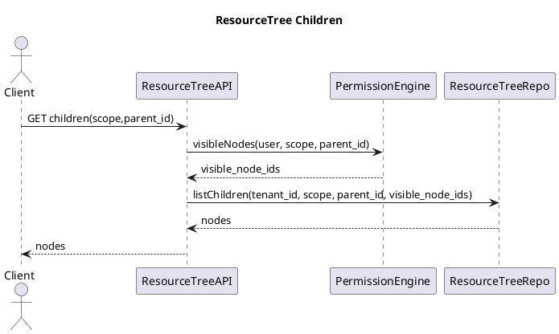

#### 6.2.3.2 移动节点（拖拽）

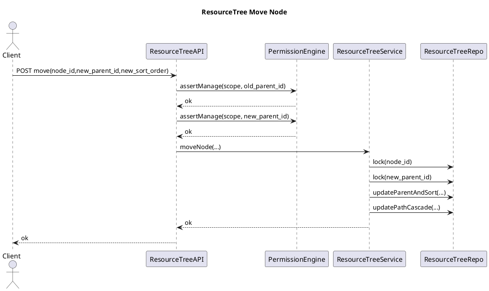

### 6.2.4 接口清单

- `GET /api/resource-trees/{scope}/children?parent_id={id|null}`
- `POST /api/resource-trees/{scope}/folders`
- `PATCH /api/resource-trees/{scope}/nodes/{id}`
- `POST /api/resource-trees/{scope}/move`
- `DELETE /api/resource-trees/{scope}/folders/{id}`
- `POST /api/resource-trees/{scope}/reorder`

---

## 6.3 查询引擎（Query Engine：QueryBuilder/Runner）

### 6.3.1 目标

- 为建模/Flow/报表模块提供统一的查询执行入口；
- 统一承载 FilterDSL 的编译与安全约束；
- 统一分页、排序、字段裁剪（列权限）、行过滤（行权限）应用。

### 6.3.2 核心对象

#### 6.3.2.1 QueryRequest（JSON）

| 字段            | 类型   | 必填 | 约束          | 说明               |
| --------------- | ------ | ---: | ------------- | ------------------ |
| datasource_type | string |   是 | TABLE/DATASET | 数据源类型         |
| datasource_id   | bigint |   是 | —             | 表 ID 或数据集 ID  |
| select_fields   | array  |   否 | ≤ 200         | 选择字段 code 列表 |
| filter          | object |   否 | FilterDSL     | 业务过滤           |
| sort            | array  |   否 | ≤ 10          | 排序               |
| paging          | object |   否 | —             | 分页               |
| paging.limit    | int    |   否 | 1..200        | 返回行数           |
| paging.offset   | int    |   否 | 0..10000      | 偏移               |

### 6.3.3 执行链路（PlantUML）

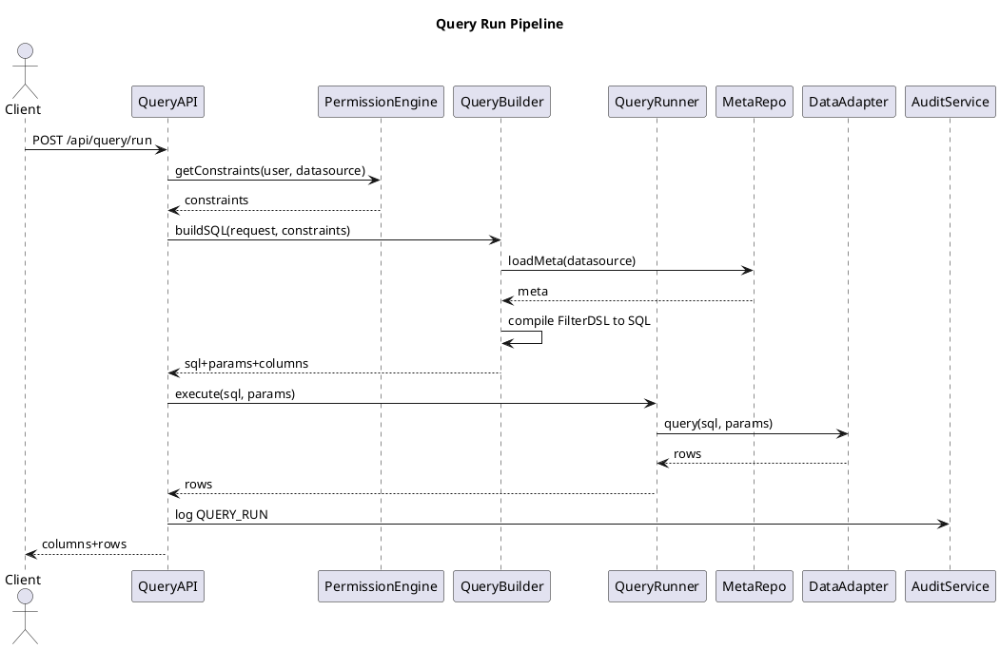

### 6.3.4 接口

- `POST /api/query/run`
- `POST /api/query/validate`
- `POST /api/query/export/csv`

### 6.3.5 FilterDSL 编译器实现要点（安全边界）

必须满足：

- 字段白名单：仅允许当前 datasource 的字段；
- 操作符白名单：eq/ne/in/contains/gt/gte/lt/lte/is_null/not_null；
- 值类型校验：in 必须 array；contains 必须 string；
- 变量替换：允许 CURRENT_USER_ID 等变量；
- 禁止注入：所有值必须参数化，禁止拼接原始字符串到 SQL。

---

## 6.4 站内通知（In-App Notification）

### 6.4.1 数据表

#### 6.4.1.1 `notification`

| 字段名                   | 类型         | 是否可空 | 默认值            | 枚举/约束          | 说明             |
| ------------------------ | ------------ | -------: | ----------------- | ------------------ | ---------------- |
| id                       | bigint       |       否 | —                 | PK                 | 通知 ID          |
| tenant_id                | bigint       |       否 | —                 | —                  | 租户             |
| recipient_tenant_user_id | bigint       |       否 | —                 | FK(tenant_user.id) | 接收人           |
| event_type               | varchar(64)  |       否 | —                 | 事件枚举           | 类型             |
| title                    | varchar(128) |       否 | —                 | —                  | 标题             |
| content                  | json         |       否 | —                 | JSON               | 内容（用于跳转） |
| is_read                  | tinyint(1)   |       否 | 0                 | 0/1                | 是否已读         |
| created_at               | datetime     |       否 | CURRENT_TIMESTAMP | —                  | 创建时间         |

content JSON 结构（最小）：

| 字段        | 类型   | 必填 | 枚举/上限              | 说明         | 示例                |
| ----------- | ------ | ---: | ---------------------- | ------------ | ------------------- |
| url         | string |   否 | ≤512                   | 前端跳转 URL | "/flows/123/runs/9" |
| entity_type | string |   否 | FLOW/DATASET/DASHBOARD | 关联实体     | "FLOW"              |
| entity_id   | bigint |   否 | —                      | 关联 ID      | 123                 |

索引：

- 普通索引：`idx_notif_user (tenant_id, recipient_tenant_user_id, is_read, created_at DESC)`

### 6.4.2 接口

- `GET /api/notifications?unread_only=0|1&limit=&offset=`
- `GET /api/notifications/unread-count`
- `POST /api/notifications/mark-read`

---

## 6.5 LLM 辅助（编码/命名建议）

### 6.5.1 接口

- `POST /api/assist/code-suggest`
