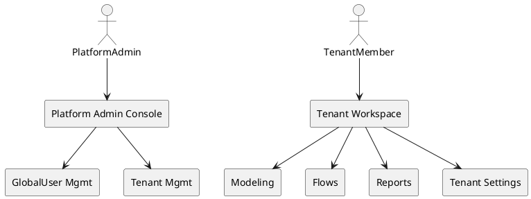
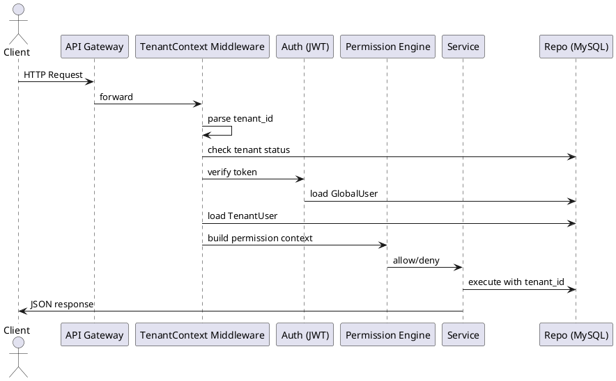
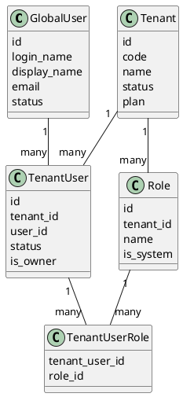
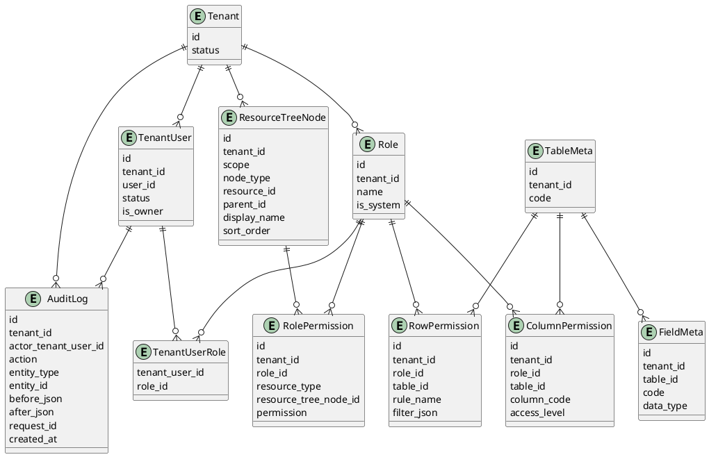
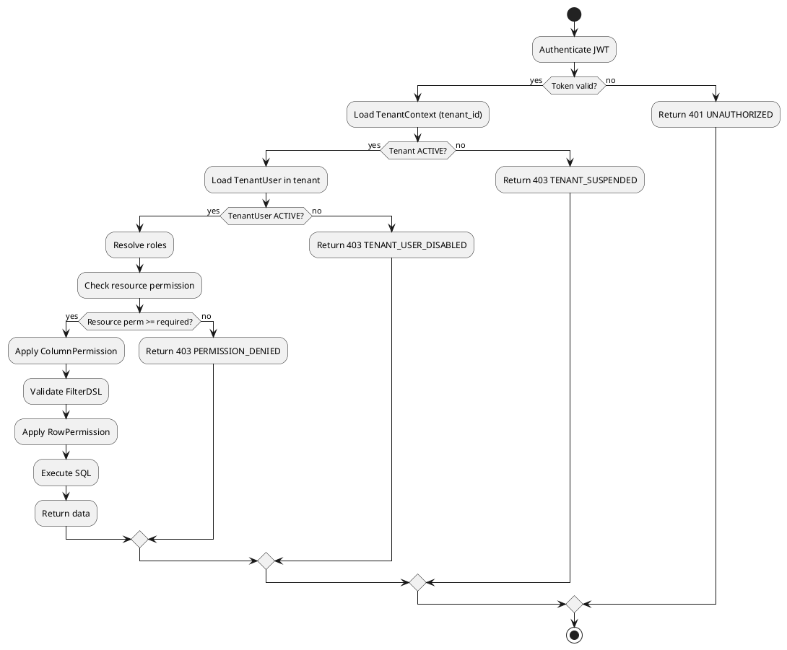
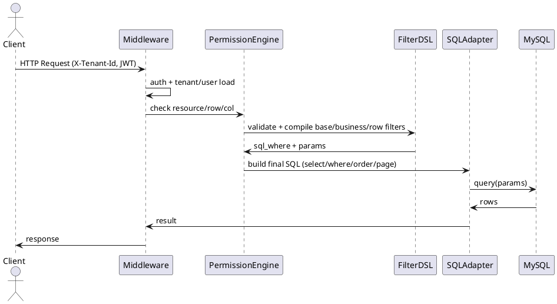
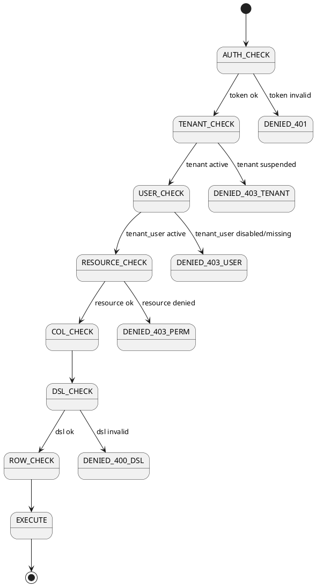

## 0. 文档说明

### 0.1 文档目的与读者

#### 0.1.1 文档定位

* 本文档是《多租户配置化数据建模与报表平台》的**技术设计文档（TDD）**，目标是把 PRD 的 0–3 章内容落成**工程可实现的强约束规范**，用于：

  1. 后端/前端/测试对齐“同一件事到底如何实现”；
  2. 明确每个概念对应的数据结构、请求链路、权限与隔离方式；
  3. 给测试提供可枚举的验收点与边界条件。

> PRD 里提到平台能力包含：多租户、配置化建模、可视化 Flow、报表（Dataset/Chart/Dashboard）、权限与审计、LLM 辅助命名等。本文档的 0–3 章负责把这些能力的“顶层规则”落成工程规范，后续章节再展开每个模块的接口与实现细节。

#### 0.1.2 适用读者与交付物

* **后端研发**：需要按本文档实现数据模型、鉴权、租户隔离、错误码、时间与删除策略等“横切能力”。
* **前端研发**：需要按本文档实现租户切换、模块访问边界、错误展示一致性、编码字段只读等交互。
* **测试工程师**：需要基于本文档的强约束输出用例：隔离/权限/状态/错误码/时间格式/删除依赖检查。
* **运维/平台管理员**：需要按本文档理解租户停用后的系统行为（禁止访问、停止调度等）。

#### 0.1.3 必须遵守的“规范关键词”

为避免“大家各写各的”，本文档使用以下关键词表达强约束：

* **必须**：不允许偏离，否则视为实现缺陷（会导致安全/一致性问题）。
* **禁止**：任何情况下不允许出现。
* **默认**：未配置时系统自动采用的行为。
* **返回错误码**：出现异常时必须按 3.5 的响应结构返回。

---

### 0.2 术语约定（英文缩写说明）

本小节只列“工程实现必须对齐”的术语与边界（与 PRD 的缩写一致）。

#### 0.2.1 平台与租户相关

* **Platform**：整个平台（平台后台 + 所有租户工作区）。
* **GlobalUser**：平台级唯一账号（登录主体）。一个 GlobalUser 可加入多个租户。
* **Tenant**：租户，隔离单位（公司/部门/项目空间）。
* **TenantUser**：GlobalUser 在某租户下的成员身份（权限与角色挂在这里）。

工程落地要求：

1. **鉴权与权限计算的主体是 TenantUser**（不是 GlobalUser）；
2. 每个请求都必须能确定“当前 tenant_id + tenant_user_id”。

#### 0.2.2 权限与资源

* **Role**：租户内的权限集合（Owner/DataEngineer/Analyst/Viewer 等内置角色，以及自定义角色）。
* **Resource**：可授权实体（表、Flow、Dataset、Dashboard 等）。
* **ResourceTree**：资源目录树；按 `scope` 分为 TABLE / FLOW / DATASET / DASHBOARD 四棵树。
* **RolePermission**：角色对资源（或目录）的权限配置。
* **RowPermission / ColumnPermission**：行/列级权限；RowPermission 采用统一 DSL。

工程落地要求：

1. **资源权限、行权限、列权限三者同时生效**；任何数据读取必须先过资源权限，再叠加行/列限制；
2. RowPermission 的过滤表达式必须与系统统一 DSL 结构一致（后续章节详述，3 章只定义“必须统一”。）

#### 0.2.3 建模/流程/报表关键实体

* **Table / Field / Relation**：建模核心；Relation 在 V1 不单独建表，从 Field 的 REFERENCE 配置推导。
* **Flow / Node / Run / Schedule**：ETL 与调度体系。
* **Dataset / Chart / Dashboard / DashboardItem**：报表资产化与复用单元（图表不承载布局，布局在 DashboardItem）。

---

### 0.3 版本历史与评审记录

#### 0.3.1 版本管理规则

* 每次修改必须更新：版本号、日期、作者、变更内容、评审人。
* 重大变更（权限语义、删除策略、隔离方式、错误码结构、时间格式）必须：

  1. 在版本记录中单独列条目；
  2. 触发专项评审（后端/前端/测试/安全至少各 1 人）。

#### 0.3.2 冻结规则（对开发的强约束）

* 进入“开发冻结”后：

  * 任何与“权限/隔离/数据结构”相关的修改，必须同步更新：数据库迁移、API 契约、测试用例基线；
  * 不允许出现“代码已改、文档未改、测试不知道”的状态。

---

## 1. 产品概述（Overview）

### 1.1 背景 & 痛点（技术视角复述）

PRD 的痛点包含：建模成本高、ETL 门槛高、报表与权限混乱、多租户复用困难。
在技术设计里，这些痛点对应必须解决的工程问题：

1. **建模成本高 → 元数据驱动 + 约束型 DDL**

* 必须有“表/字段元数据”作为单一事实源（SSOT），并能确定性生成物理表结构。
* 必须有强约束：字段类型子集、不可随意在线变更类型（PRD 已明确 V1 不支持在线类型迁移）。

2. **ETL 门槛高 → Flow DAG 配置化 + 可观测 Run**

* Flow 的拓扑与节点配置必须持久化为 `config_json`，Run 必须记录节点级 stats。

3. **权限混乱 → 资源权限 + 行/列权限统一落地**

* 必须定义 RolePermission/RowPermission/ColumnPermission 的统一数据结构与合并逻辑入口（权限引擎）。

4. **多租户复用困难 → tenant_id 强隔离**

* 任何与业务数据相关的实体必须带 `tenant_id`，任何查询必须带 `tenant_id=当前租户`，禁止跨租户 JOIN。

---

### 1.2 产品定位 & 价值主张（技术落地要点）

产品定位：面向企业内部或 SaaS 的多租户配置化数据建模与报表平台。

技术落地必须支撑三类价值：

* **业务自助**：Dataset/Chart/Dashboard 的资产化与复用必须稳定（数据集表是下游唯一数据来源）。
* **工程可运维**：Flow Run 记录、失败定位必须可视化（至少到节点级错误）。
* **安全可控**：权限的任何缺陷都属于 P0（不允许越权看到数据）。

---

### 1.3 与竞品/现有方案的对比（转成设计约束）

PRD 对比了传统 BI、脚本数仓、Airflow。
对技术设计而言，必须固化为以下约束：

1. **禁止用户拼 SQL**：过滤、查询必须走统一 DSL → 安全映射 SQL。
2. **平台内置多租户**：不允许“靠约定”隔离，必须每次请求链路强校验。
3. **报表层复用单位**：Chart 不含布局，布局属于 DashboardItem（否则复用会失真）。

---

### 1.4 目标用户 & Persona（技术侧映射）

PRD 定义了平台管理员、租户 Owner、数据工程师、分析师、查看者。
技术设计必须把这些 persona 映射为：

* **可登录主体**：GlobalUser
* **可授权主体**：TenantUser（附带多个 Role）
* **可授权对象**：ResourceTree 节点与具体资源（Table/Flow/Dataset/Dashboard）

---

### 1.5 使用典型场景（端到端链路的工程落地点）

PRD 的端到端示例（建模→ETL→权限→Dataset→Dashboard）要求我们在技术上保证：

1. **建模创建表/字段后，物理表必须可被 Flow 写入**；
2. **Row/Column 权限必须在：表数据页、Dataset 刷新、Chart 查询、Dashboard 展示全链路一致生效**；
3. **Flow 调度与租户停用联动**（停用后不再触发）。

---

### 1.6 范围说明（In Scope / Out-of-Scope → 实现边界）

V1.0 In Scope/Out-of-Scope 在 PRD 已明确。
技术设计必须将其固化为“禁止实现/禁止承诺”的边界：

* **禁止**实现字段类型在线迁移；禁止对外承诺可自动把 string 转 int。
* **禁止**跨租户联邦查询与跨租户数据共享。
* **默认**不做通知中心（任务失败 IM 推送）。

---

### 1.7 成功指标（转成可埋点与可验收项）

PRD 指标包括活跃租户、Run 成功率、仪表盘打开次数、权限 bug 零容忍等。
技术设计必须提供以下“可统计字段/事件”：

* 事件：login_success、tenant_switch、flow_run_created、flow_run_finished、dashboard_open、chart_query。
* 指标计算口径：

  * Flow Run 成功率 = SUCCESS / (SUCCESS+FAILED)，按 tenant/day 聚合。
  * 仪表盘打开次数：dashboard_open 事件 count，按 tenant/dashboard/day 聚合。
* 权限类缺陷验收：任意越权读取视为阻断上线。

---

## 2. 系统角色与访问边界

### 2.1 顶层架构视角（工程分区）

系统分为两个工作空间：平台后台、租户工作区。

#### 2.1.1 逻辑分区 PlantUML



#### 2.1.2 访问关系强约束

* 平台管理员在平台后台可查看租户**元信息**，默认**不直接访问租户业务数据**。
* 租户内用户只能访问其所属租户；同一 GlobalUser 可加入多个租户并切换视角。

工程落地要求（必须实现）：

1. **Token 只代表 GlobalUser 身份**；“当前租户”必须由请求上下文确定，并校验该 GlobalUser 是否属于该租户（TenantUser 存在且 ACTIVE）。
2. 租户工作区所有 API 必须拒绝“未提供 tenant 上下文”的请求（除登录/列出可加入租户等少数公共接口）。

---

### 2.2 用户角色定义（实现为系统内置 Role）

PRD 的角色定义如下：Platform Admin、Tenant Owner、Data Engineer、Analyst、Viewer。

#### 2.2.1 系统内置角色落库规则（必须）

* 每个 Tenant 初始化时必须创建（或确保存在）四个系统角色：

  * Owner、DataEngineer、Analyst、Viewer
* 系统角色字段 `is_system=true`，并施加以下约束：

  * **禁止删除**；
  * 允许修改 `description`；
  * 角色 `name` 在租户内唯一。

#### 2.2.2 Owner 的强能力边界

* Owner 具备租户用户管理、角色/权限配置（含行列权限）能力。
  工程要求：
* “保证每个租户至少 1 个 Owner”必须由数据库约束 + 服务端校验共同保障：

  * 数据库层：不强做复杂约束（MySQL 不易表达），但必须有审计与修复脚本；
  * 服务层：任何“取消某成员 Owner 身份 / 删除成员”的操作，若会导致 Owner 数量变 0，必须返回错误 `ERR_TENANT_OWNER_REQUIRED`。

---

### 2.3 角色与模块访问矩阵（落成权限枚举）

PRD 给出了默认矩阵。
技术设计要把“模块能力”转成**可校验的权限点（Permission Points）**，统一用于后端鉴权与前端按钮显隐。

#### 2.3.1 权限点命名规范（必须）

* 统一格式：`{RESOURCE_TYPE}:{ACTION}`

  * RESOURCE_TYPE：TABLE_SCHEMA / TABLE_DATA / FLOW / DATASET / CHART / DASHBOARD / TENANT_SETTING
  * ACTION：VIEW / EDIT / MANAGE / RUN / SCHEDULE / GRANT 等
* 示例：

  * `TABLE_SCHEMA:EDIT`（改字段）
  * `TABLE_DATA:VIEW`（查数据）
  * `FLOW:RUN`（手动运行）
  * `DASHBOARD:MANAGE`（删除/移动/改权限）

> 注意：PRD 的 RolePermission 里 resource_type 覆盖 TABLE_SCHEMA/TABLE_DATA/FLOW/DATASET/DASHBOARD。Chart 在 V1 作为“列表管理资产”，其权限建议绑定到 Dataset（即：能管理 Dataset 才能创建/删除其下图表）。此点在后续报表章节会展开；2–3 章只规定“不得出现 Chart 自己一套完全独立的权限体系”，避免重复设计。

---

### 2.4 多租户隔离边界（必须实现的安全红线）

PRD 已给出隔离原则与停用行为。
本节把它落成工程级“必须/禁止”。

#### 2.4.1 数据隔离（必须）

1. **所有租户内实体表必须包含 tenant_id**（包括元数据表与业务数据表）。
2. 任意查询/更新/删除必须在 WHERE 条件带 `tenant_id=当前租户`。
3. **禁止跨租户 JOIN**（即使同库同实例也禁止）。

工程落地方式（必须至少做到）：

* ORM 层：为“租户内模型”提供 `TenantQuerySet`，默认自动追加 tenant_id 过滤；任何绕过必须在代码评审中判定为高危。
* SQL 构造层：统一通过 Query Builder 生成 SQL，Builder 必须强制注入 tenant_id 条件。
* 审计层：若检测到未携带 tenant_id 的租户内查询，必须记录安全日志（trace_id + user_id + endpoint）。

#### 2.4.2 访问路径隔离（必须）

* 前端进入租户工作区时，URL 或请求头必须携带租户标识（实现方式二选一，但必须一致）：

  * 方式 A：URL path：`/tenants/{tenantId}/...`
  * 方式 B：Header：`X-Tenant-Id: {tenantId}`
* 后端必须做“双重校验”：

  1. GlobalUser 是否属于该租户（TenantUser 存在且 ACTIVE）；
  2. Tenant 是否 ACTIVE（非 SUSPENDED）。

#### 2.4.3 租户停用行为（必须）

当 Tenant.status = SUSPENDED：

* 租户工作区所有接口返回 `ERR_TENANT_SUSPENDED`；
* 所有 CRON 调度停止触发；
* 正在运行的 Flow：允许自然结束（不强杀），但 Run 记录必须标记其 tenant 已停用（便于运维分析）。

#### 2.4.4 请求链路（Tenant API）校验顺序 PlantUML



---

## 3. 核心概念与全局规范

### 3.1 核心领域概念（数据模型与关系）

PRD 明确了核心实体：GlobalUser、Tenant、TenantUser、Role、TenantUserRole、ResourceTree、RolePermission、RowPermission、ColumnPermission，以及 Table/Field/Flow/Dataset/Chart/Dashboard 等。
本节把这些概念固化为工程可实现的数据关系与约束。

#### 3.1.1 身份与授权 ER（PlantUML）



关键约束（必须）：

* GlobalUser.login_name 平台唯一；禁用后无法登录任何租户。
* TenantUser(tenant_id, user_id) 唯一；每个租户至少 1 个 is_owner=true。
* Role(name) 在同租户唯一；系统内置角色不可删除。

#### 3.1.2 资源树 ResourceTree（必须一类资源一棵树）

PRD：TABLE / FLOW / DATASET / DASHBOARD 各自独立资源树。
工程实现要求：

* ResourceTree 表必须包含：

  * tenant_id、scope、type、resource_id、parent_id、display_name、sort_order。
* 约束（必须）：

  1. **目录禁止挂载在具体资源之下**（即 parent 必须是 FOLDER 或 null）。
  2. 用户只看得到“自己有权限的资源节点及其父目录”（前端树构建必须做父链补齐）。
  3. 对 FOLDER 配置的权限必须向下继承作为默认值（后续权限章详细定义继承与覆盖）。

#### 3.1.3 表/字段/关系（Relation 推导而非建表）

* Table 对应底层物理表，命名规则形如 `t_{tenantId}_{tableCode}`（可在后续技术章节细化，但必须保证 tenant 隔离）。
* Field 的 `ui_type` 决定逻辑类型；REFERENCE 字段存储“指向 ref_table 的关系”，底层类型与 ref_field 对齐。
* V1 **不为 Relation 单独建表**，由 `ui_type=REFERENCE` 的字段推导关系：

  * “从当前表指向谁”：查当前表的 REFERENCE 字段；
  * “当前表被谁指向”：查 ref_table_id=当前表 的字段。

#### 3.1.4 Flow / Run / Schedule（可观测性必须内置）

* Flow 必须持久化：schedule_type、cron_expr、config_json。
* Run 必须记录：trigger_type、状态、起止时间、error_message、node_stats_json。
* 调度要求：必须记录最近一次触发时间与结果；租户停用时不触发。

#### 3.1.5 Dataset / Chart / Dashboard（报表资产边界必须清晰）

* Dataset：来源表/视图 → 生成可复用数据集表；下游只读数据集表，不直接读来源表。
* Chart：保存 query_config + viz_config，不含布局。
* Dashboard：保存 layout_json + 可选 filters_json；DashboardItem 引用 Chart 并携带布局。

---

### 3.2 全局 ID 与业务编码规范（接口/DB/前端一致）

#### 3.2.1 主键 ID 统一规范（必须）

* 主键统一 BIGINT 自增（或等价实现）；对外作为不透明整数，不承诺连续性与含义。
* tenant_id 使用规范：所有租户内实体必须包含 tenant_id；API 禁止跨租户传入 ID 访问其他租户数据。

工程落地要求：

* 任何“按 id 查记录”的 Repo 方法，必须额外接收 tenant_id 参数并参与过滤；
* 任何“批量 id 查询”必须校验查询结果全部属于同 tenant_id，否则返回 `ERR_CROSS_TENANT_ACCESS`。

#### 3.2.2 业务编码 code 规范（必须）

PRD 规定：字符集 `[a-z0-9_]+`，snake_case，长度 1–50，以字母开头，禁止保留字；Tenant.code 全局唯一，Table.code 租户内唯一，Field.code 表内唯一。

工程落地要求（必须）：

* 后端必须提供 “code 生成与去重”能力：LLM 生成 + 后端清洗 + 冲突加后缀。
* 前端默认 code 只读，不允许手工编辑（避免影响下游引用）。

---

### 3.3 时间、时区与日期处理规范（必须统一）

PRD 规定：数据库 datetime 存 UTC；API 传 ISO8601；前端按租户默认时区显示；输入按租户时区解释再转 UTC；DSL 日期/时间格式固定。

工程落地要求（必须）：

1. 数据库层：所有 `*_at` 字段存 UTC。
2. API 层：

   * datetime：ISO8601（例 `"2025-12-10T08:30:00Z"`）；date：`YYYY-MM-DD`。
3. 前端层：

   * 展示统一 `YYYY-MM-DD HH:mm`（按租户时区换算）。
4. DSL 中：

   * 日期：`YYYY-MM-DD`；日期时间：`YYYY-MM-DD HH:mm:ss`，按租户时区解释再转 UTC。
   * 特殊变量 `CURRENT_DATE` / `CURRENT_DATETIME` 必须由后端在执行前展开。

---

### 3.4 软删除、状态字段统一约定（必须按实体类型执行）

PRD 明确：优先 status 表示可用性；V1 多数实体采用“物理删除 + 依赖检查”；审计类记录按归档清理。

工程落地要求（必须）：

1. status 的语义必须严格一致：ACTIVE / DISABLED / SUSPENDED 等。
2. 对 Table/Field/Flow/Dataset/Dashboard 的删除：

   * **必须先做依赖检查**（被引用则禁止删除并返回清晰错误）。
   * 无依赖则物理删除（并同步删除 ResourceTree 节点、权限记录等关联数据，具体在后续章节定义）。
3. 对用户/租户/成员关系：

   * 不做物理删除，改 status（保留审计轨迹）。

---

### 3.5 错误码 & 错误提示统一规范（前后端必须一致）

PRD 给出统一响应结构与错误码命名建议，以及前端展示要求。

#### 3.5.1 API 响应结构（必须一字不差）

```json
{
  "success": false,
  "code": "ERR_PERMISSION_DENIED",
  "message": "您没有权限执行此操作",
  "data": null,
  "trace_id": "optional-debug-id"
}
```

字段含义与要求：success/code/message/data/trace_id。

#### 3.5.2 错误码规则（必须）

* 统一前缀 `ERR_`；例如：无权限、租户停用、表被引用、DSL 不合法等。
* 模块前缀建议：USER_/TENANT_/MODEL_/FLOW_/REPORT_/PERM_/LLM_。

#### 3.5.3 前端展示强约束（必须）

* 权限错误：提示“无权限 + 联系管理员”；不暴露后端堆栈。
* 校验错误：必须定位到具体字段与原因。
* 业务约束错误（如删除依赖）：必须列出关键依赖资源名，帮助用户自行处理。
# 4. 公共能力：统一过滤 DSL 与权限体系（可直接实现）

> 本章覆盖：统一过滤 DSL（FilterDSL）引擎、资源级权限（RolePermission）、行级权限（RowPermission）、列级权限（ColumnPermission）、以及运行时“强校验”落地方式。所有权限控制以**后端强校验**为准，前端仅改善体验。 

---

## 4.0 范围、前置依赖、缺失信息处理

### 4.0.1 本章范围

1. FilterDSL：结构定义、校验、变量注入、SQL 编译、安全约束与错误返回（不做 silent ignore）。 
2. 资源树与资源级权限：按 scope 构建资源树；Folder 默认权限向下继承；资源节点显式配置覆盖默认值；单角色与多角色合并算法。  
3. 行权限：同一（role, table）0~N 规则 OR；多角色再 OR；与业务过滤按 AND 叠加；TABLE_DATA=MANAGE 本期默认绕过行权限。  
4. 列权限：HIDDEN / READONLY / READWRITE；多角色合并规则；对查询、排序、写入接口的强制约束。  
5. 审计：所有权限变更必须可追溯（本章给出 MVP 审计落表与写入点）。 

### 4.0.2 前置依赖（本章会直接读写/引用）

* Tenant / TenantUser / Role / TenantUserRole（租户成员与角色体系）  
* ResourceTree（按 scope 的资源树） 
* Table / Field（建模元信息；FilterDSL 的 field 必须是 Field.code）  

### 4.0.3 缺失信息清单 + MVP ASSUMPTION + 替代方案（只选一个落地）

| 缺失点                                                       | PRD现状       | MVP 落地方案（ASSUMPTION）                                                                                       | 替代方案（不选）                                |
| --------------------------------------------------------- | ----------- | ---------------------------------------------------------------------------------------------------------- | --------------------------------------- |
| ColumnPermission 未配置字段的默认 access_level                    | PRD未写默认值    | **ASSUMPTION-CP-DEFAULT：默认 READWRITE**。理由：列权限用于“隐藏/只读敏感字段”，未配置即不额外收紧；最终写入仍受 TABLE_DATA 权限约束。               | 默认 HIDDEN（需要全量配置，成本高）                   |
| RolePermission 中 `resource_id` 可能是 Folder 节点ID或资源ID（潜在冲突） | PRD允许二者     | **ASSUMPTION-RP-TARGET：统一存 `resource_tree_node_id`**（Folder/Resource 都是 ResourceTreeNode），避免 id 冲突，继承计算更直接 | 继续用 resource_id + is_folder 字段（多字段、易误用） |
| 权限配置并发冲突处理                                                | PRD未写       | **ASSUMPTION-CONFLICT：Last-Write-Wins + 审计记录**；所有写接口采用“整表替换/批量 upsert”，并用数据库事务保证原子性                        | 乐观锁 version（需要全链路处理冲突 UI）               |
| 审计日志格式与查询方式                                               | PRD说第13章统一  | **ASSUMPTION-AUDIT：本期先落 audit_log 表**，记录 before/after JSON、actor、request_id；查询接口可后续增强（但写入点本章给全）            | 仅写应用日志（不可检索、不可结构化）                      |

---

## 4.1 数据模型与 ER 图（含字段字典）

### 4.1.1 ER 图（PlantUML）



### 4.1.2 表结构（DDL 级约束 + 索引）

> 数据库：MySQL 8；所有表必须包含 `tenant_id` 并参与索引；所有写操作必须写入审计表 `audit_log`（见 4.1.4）。

#### 4.1.2.1 resource_tree_node（资源树）

* 逻辑字段来自 PRD：`id/tenant_id/scope/type(resource)/resource_id/parent_id/display_name/sort_order`，并要求“目录禁止挂载在具体资源之下”。 

**DDL（MVP）**

```sql
CREATE TABLE resource_tree_node (
  id BIGINT PRIMARY KEY AUTO_INCREMENT,
  tenant_id BIGINT NOT NULL,
  scope VARCHAR(16) NOT NULL,              -- TABLE/FLOW/DATASET/DASHBOARD
  node_type VARCHAR(16) NOT NULL,          -- FOLDER/TABLE/FLOW/DATASET/DASHBOARD
  resource_id BIGINT NULL,                 -- 非 FOLDER 时指向对应资源主键
  parent_id BIGINT NULL,
  display_name VARCHAR(128) NOT NULL,
  sort_order INT NOT NULL DEFAULT 0,
  created_at DATETIME NOT NULL,
  updated_at DATETIME NOT NULL,
  UNIQUE KEY uk_tenant_scope_parent_name (tenant_id, scope, parent_id, display_name),
  KEY idx_tenant_scope_parent (tenant_id, scope, parent_id),
  KEY idx_tenant_scope_node_type (tenant_id, scope, node_type)
);
```

**强约束（后端校验，任何写接口必须执行）**

1. `scope` ∈ {TABLE, FLOW, DATASET, DASHBOARD}。
2. `node_type=FOLDER` ⇒ `resource_id IS NULL`。
3. `node_type!=FOLDER` ⇒ `resource_id IS NOT NULL` 且该 `resource_id` 必须存在于对应资源表。
4. **禁止把 Folder 挂在 Resource 节点下**：若 `parent_id` 指向的节点 `node_type!=FOLDER` ⇒ 返回错误 `ERR_TREE_FOLDER_UNDER_RESOURCE`（409）。
5. 同一（tenant_id, scope, parent_id）下 `display_name` 唯一（重复返回 409）。

#### 4.1.2.2 role_permission（资源级权限）

* 覆盖类型：TABLE_SCHEMA / TABLE_DATA / FLOW / DATASET / DASHBOARD。 
* 权限等级：NONE / VIEW / EDIT / MANAGE；MANAGE 包含删除、移动、配置权限等。 

**DDL（采用 ASSUMPTION-RP-TARGET：resource_tree_node_id）**

```sql
CREATE TABLE role_permission (
  id BIGINT PRIMARY KEY AUTO_INCREMENT,
  tenant_id BIGINT NOT NULL,
  role_id BIGINT NOT NULL,
  resource_type VARCHAR(16) NOT NULL,            -- TABLE_SCHEMA/TABLE_DATA/FLOW/DATASET/DASHBOARD
  resource_tree_node_id BIGINT NOT NULL,         -- 指向 folder 或 resource 节点
  permission VARCHAR(16) NOT NULL,               -- NONE/VIEW/EDIT/MANAGE
  created_at DATETIME NOT NULL,
  updated_at DATETIME NOT NULL,
  UNIQUE KEY uk_role_res (tenant_id, role_id, resource_type, resource_tree_node_id),
  KEY idx_tenant_role (tenant_id, role_id),
  KEY idx_tenant_resnode (tenant_id, resource_tree_node_id),
  CONSTRAINT fk_rp_role FOREIGN KEY(role_id) REFERENCES role(id),
  CONSTRAINT fk_rp_node FOREIGN KEY(resource_tree_node_id) REFERENCES resource_tree_node(id)
);
```

#### 4.1.2.3 row_permission（行权限）

* 每条规则是 FilterDSL；同一（role, table）0~N 条规则，角色内 OR；多角色再 OR；与业务过滤按 AND 叠加。  

**DDL**

```sql
CREATE TABLE row_permission (
  id BIGINT PRIMARY KEY AUTO_INCREMENT,
  tenant_id BIGINT NOT NULL,
  role_id BIGINT NOT NULL,
  table_id BIGINT NOT NULL,
  rule_name VARCHAR(64) NOT NULL,
  filter_json JSON NOT NULL,
  created_at DATETIME NOT NULL,
  updated_at DATETIME NOT NULL,
  UNIQUE KEY uk_role_table_rule (tenant_id, role_id, table_id, rule_name),
  KEY idx_tenant_table (tenant_id, table_id),
  KEY idx_tenant_role_table (tenant_id, role_id, table_id)
);
```

#### 4.1.2.4 column_permission（列权限）

* access_level：HIDDEN / READONLY / READWRITE。 

**DDL**

```sql
CREATE TABLE column_permission (
  id BIGINT PRIMARY KEY AUTO_INCREMENT,
  tenant_id BIGINT NOT NULL,
  role_id BIGINT NOT NULL,
  table_id BIGINT NOT NULL,
  column_code VARCHAR(64) NOT NULL,
  access_level VARCHAR(16) NOT NULL,          -- HIDDEN/READONLY/READWRITE
  created_at DATETIME NOT NULL,
  updated_at DATETIME NOT NULL,
  UNIQUE KEY uk_role_table_col (tenant_id, role_id, table_id, column_code),
  KEY idx_tenant_table (tenant_id, table_id),
  KEY idx_tenant_role_table (tenant_id, role_id, table_id)
);
```

#### 4.1.2.5 audit_log（权限审计 MVP）

> PRD要求：角色/权限变更必须产生日志，本期至少保证后端可追溯。 

**DDL**

```sql
CREATE TABLE audit_log (
  id BIGINT PRIMARY KEY AUTO_INCREMENT,
  tenant_id BIGINT NOT NULL,
  actor_tenant_user_id BIGINT NOT NULL,
  action VARCHAR(64) NOT NULL,               -- e.g. ROLE_PERMISSION_REPLACE / ROW_PERMISSION_REPLACE / COLUMN_PERMISSION_REPLACE
  entity_type VARCHAR(64) NOT NULL,          -- e.g. role_permission / row_permission / column_permission / resource_tree_node
  entity_id VARCHAR(64) NOT NULL,            -- 支持批量：可填 role_id 或 "role:{id}:table:{id}"
  before_json JSON NULL,
  after_json JSON NULL,
  request_id VARCHAR(64) NOT NULL,
  created_at DATETIME NOT NULL,
  KEY idx_tenant_time (tenant_id, created_at),
  KEY idx_tenant_actor (tenant_id, actor_tenant_user_id)
);
```

---

### 4.1.3 字段字典表（必须包含：来源/更新时机/是否可编辑/审计策略）

> 说明：依赖表（Tenant/TenantUser/Role/TenantUserRole/Table/Field）仅列出本章用到字段；本章新增表全部列出。

#### 4.1.3.1 resource_tree_node 字段字典

| 字段           | 类型           | 来源         | 更新时机   | 是否可编辑     | 审计策略                                |
| ------------ | ------------ | ---------- | ------ | --------- | ----------------------------------- |
| id           | BIGINT       | DB 生成      | 创建时    | 否         | 不单独审计（通过 action 记录整体变更）             |
| tenant_id    | BIGINT       | 上下文 Tenant | 创建时    | 否         | 写入 audit_log.after_json             |
| scope        | VARCHAR(16)  | 前端选择       | 创建/移动时 | 否（创建后禁止改） | 修改 scope 禁止；若尝试返回 400 并审计失败请求（应用日志） |
| node_type    | VARCHAR(16)  | 创建类型       | 创建时    | 否（创建后禁止改） | 禁止改；失败记录应用日志                        |
| resource_id  | BIGINT       | 资源表主键      | 创建时    | 否         | 仅创建时记录                              |
| parent_id    | BIGINT       | 前端拖拽/选择    | 移动时    | 是         | 变更前后写 audit_log（before/after）       |
| display_name | VARCHAR(128) | 前端输入       | 重命名时   | 是         | 变更前后写 audit_log                     |
| sort_order   | INT          | 前端拖拽排序     | 排序时    | 是         | 批量排序：记录批量 after_json（包含节点列表与顺序）     |
| created_at   | DATETIME     | 系统时间       | 创建时    | 否         | 固定写入                                |
| updated_at   | DATETIME     | 系统时间       | 任意更新   | 否         | 固定写入                                |

#### 4.1.3.2 role_permission 字段字典

| 字段                    | 类型          | 来源         | 更新时机 | 是否可编辑            | 审计策略                                    |
| --------------------- | ----------- | ---------- | ---- | ---------------- | --------------------------------------- |
| id                    | BIGINT      | DB 生成      | 创建时  | 否                | 批量替换写入 before/after                     |
| tenant_id             | BIGINT      | 上下文 Tenant | 创建时  | 否                | 同上                                      |
| role_id               | BIGINT      | URL path   | 替换时  | 否                | entity_id=role_id，before/after 包含全量权限配置 |
| resource_type         | VARCHAR(16) | 请求体        | 替换时  | 否（每次替换固定一个 type） | 同上                                      |
| resource_tree_node_id | BIGINT      | 请求体        | 替换时  | 是（通过替换实现）        | 同上                                      |
| permission            | VARCHAR(16) | 请求体        | 替换时  | 是                | 同上                                      |
| created_at/updated_at | DATETIME    | 系统时间       | 写入时  | 否                | 同上                                      |

#### 4.1.3.3 row_permission 字段字典

| 字段                    | 类型          | 来源         | 更新时机 | 是否可编辑 | 审计策略                             |
| --------------------- | ----------- | ---------- | ---- | ----- | -------------------------------- |
| id                    | BIGINT      | DB 生成      | 创建时  | 否     | 替换：before/after 全量               |
| tenant_id             | BIGINT      | 上下文 Tenant | 创建时  | 否     | 同上                               |
| role_id               | BIGINT      | URL path   | 替换时  | 否     | entity_id=`role:{id}:table:{id}` |
| table_id              | BIGINT      | URL path   | 替换时  | 否     | 同上                               |
| rule_name             | VARCHAR(64) | 请求体        | 替换时  | 是     | 同上                               |
| filter_json           | JSON        | 请求体        | 替换时  | 是     | 同上（必须记录完整 DSL）                   |
| created_at/updated_at | DATETIME    | 系统时间       | 写入时  | 否     | 同上                               |

#### 4.1.3.4 column_permission 字段字典

| 字段                    | 类型          | 来源         | 更新时机 | 是否可编辑 | 审计策略                             |
| --------------------- | ----------- | ---------- | ---- | ----- | -------------------------------- |
| id                    | BIGINT      | DB 生成      | 创建时  | 否     | 替换：before/after 全量               |
| tenant_id             | BIGINT      | 上下文 Tenant | 创建时  | 否     | 同上                               |
| role_id               | BIGINT      | URL path   | 替换时  | 否     | entity_id=`role:{id}:table:{id}` |
| table_id              | BIGINT      | URL path   | 替换时  | 否     | 同上                               |
| column_code           | VARCHAR(64) | 请求体        | 替换时  | 是     | 同上                               |
| access_level          | VARCHAR(16) | 请求体        | 替换时  | 是     | 同上                               |
| created_at/updated_at | DATETIME    | 系统时间       | 写入时  | 否     | 同上                               |

#### 4.1.3.5 audit_log 字段字典

| 字段                     | 类型          | 来源             | 更新时机 | 是否可编辑 | 审计策略  |
| ---------------------- | ----------- | -------------- | ---- | ----- | ----- |
| id                     | BIGINT      | DB 生成          | 创建时  | 否     | 自身不审计 |
| tenant_id              | BIGINT      | 上下文 Tenant     | 写入时  | 否     | 自身不审计 |
| actor_tenant_user_id   | BIGINT      | 上下文 TenantUser | 写入时  | 否     | 自身不审计 |
| action                 | VARCHAR(64) | 服务层常量          | 写入时  | 否     | 自身不审计 |
| entity_type/entity_id  | VARCHAR     | 服务层拼接          | 写入时  | 否     | 自身不审计 |
| before_json/after_json | JSON        | 服务层组装          | 写入时  | 否     | 自身不审计 |
| request_id             | VARCHAR(64) | 中间件生成          | 写入时  | 否     | 自身不审计 |
| created_at             | DATETIME    | 系统时间           | 写入时  | 否     | 自身不审计 |

---

## 4.2 FilterDSL 引擎（结构、校验、变量、SQL 编译）

### 4.2.1 DSL 结构（PRD一致）

* Group：`{ op, conditions }`，`op` 只能是 `"and"`/`"or"`；
* Condition：`{ field, operator, value }`，`field` 必须是 `Field.code`；
* 顶层可为 Group 或单独 Condition。 

### 4.2.2 操作符与类型约束（必须强校验）

* operator 白名单与 value 形态：`in/not_in` 必须数组；`between` 必须长度 2 数组；`is_null/is_not_null` value 省略或 null。  
* 不同字段类型允许的 operator 必须按 PRD 过滤。 

### 4.2.3 特殊变量注入（必须按枚举）

* 变量格式固定：`{"__var__": "<NAME>"}`；前端只能从枚举选择，不允许自由填写。 
* 内置变量：CURRENT_USER_ID / CURRENT_TENANT_ID / CURRENT_DATE / CURRENT_DATETIME。 

### 4.2.4 DSL → SQL 约束（安全边界）

强制规则（违反任一条都必须返回 4xx，带明确原因）：

1. 仅支持 AND/OR；不支持 NOT；不支持 SQL 函数/子查询。 
2. 禁止 SQL 直写；DSL 不提供任何可注入 SQL 的字段。 
3. field 必须属于当前上下文 Field.code；禁止点号/表别名跨表写法。 
4. operator 必须在白名单。 
5. 字段不存在/类型不匹配/结构非法：返回 4xx；禁止“默认放宽”或 silent ignore。 

### 4.2.5 实现细节：校验与编译（伪代码 + DB/事务点）

#### 4.2.5.1 上下文字段目录（FieldCatalog）

**输入**

* `tenant_id`
* `context_type`：`TABLE`（本章所有 DSL 校验最小实现只支持 TABLE；Dataset/Chart 复用时传入相同 catalog 构造方式）
* `context_id`：`table_id`

**构造规则**

1. 查询 `field_meta`（或你系统中的 Field 表）得到 `{code, data_type}` 列表；
2. 生成 `allowed_fields: Dict[str, DataType]`；
3. **必须**额外生成 `code -> sql_expr` 映射：本章统一为 `` `t`.`<column_name>` ``（实际列名若与 code 不一致，则在 Field 表内必须存在 `physical_name` 字段；缺失则按 code=physical_name 处理）。

> ASSUMPTION-FIELD-PHYSICAL：Field.code 默认等于物理列名；如不等，需要 Field 表提供 `physical_name` 并在 catalog 构造时使用它。

#### 4.2.5.2 校验函数（validate_filter_dsl）

* 运行时复杂度约束（ASSUMPTION-DSL-LIMITS，防止极端配置拖垮 DB）：

  * 最大深度 `MAX_DEPTH=8`
  * 最大节点数 `MAX_NODES=200`
  * 违反即 400 `ERR_FILTER_DSL_TOO_COMPLEX`

伪代码（关键校验点必须实现）：

```python
def validate_filter_dsl(node, catalog, depth=1, counter=0):
    if depth > MAX_DEPTH:
        raise Err("ERR_FILTER_DSL_TOO_DEEP")

    counter += 1
    if counter > MAX_NODES:
        raise Err("ERR_FILTER_DSL_TOO_COMPLEX")

    if is_group(node):
        op = node.get("op")
        if op not in ("and", "or"):
            raise Err("ERR_FILTER_DSL_INVALID_OP")
        conditions = node.get("conditions")
        if not isinstance(conditions, list) or len(conditions) == 0:
            raise Err("ERR_FILTER_DSL_EMPTY_CONDITIONS")
        for child in conditions:
            validate_filter_dsl(child, catalog, depth+1, counter)
        return

    # condition
    field = node.get("field")
    operator = node.get("operator")
    if field not in catalog.allowed_fields:
        raise Err("ERR_FILTER_DSL_FIELD_NOT_ALLOWED")
    if operator not in OPERATOR_WHITELIST:
        raise Err("ERR_FILTER_DSL_OPERATOR_NOT_ALLOWED")

    dtype = catalog.allowed_fields[field]
    if operator not in ALLOWED_OPERATORS_BY_TYPE[dtype]:
        raise Err("ERR_FILTER_DSL_OPERATOR_TYPE_MISMATCH")

    # value validation (including __var__)
    if operator in ("is_null", "is_not_null"):
        return

    value = node.get("value", None)
    if is_var(value):
        var_name = value.get("__var__")
        if var_name not in VAR_ENUM:
            raise Err("ERR_FILTER_DSL_VAR_NOT_ALLOWED")
        # dtype compatibility check for var (e.g. CURRENT_DATE only for date/datetime)
        check_var_compatible(var_name, dtype)
        return

    # operator-specific shape
    if operator in ("in", "not_in"):
        if not isinstance(value, list) or len(value) == 0:
            raise Err("ERR_FILTER_DSL_IN_REQUIRES_NONEMPTY_ARRAY")
    if operator == "between":
        if not isinstance(value, list) or len(value) != 2:
            raise Err("ERR_FILTER_DSL_BETWEEN_REQUIRES_2_ARRAY")

    # dtype-specific value parsing (date/datetime format)
    check_value_type_and_format(value, dtype)
```

#### 4.2.5.3 编译函数（compile_filter_dsl_to_sql）

**强制要求**

* 必须参数化：禁止把 value 拼进 SQL 字符串；
* 输出：`(sql_fragment: str, params: list)`；
* LIKE 类操作必须转义 `%`/`_`（ASSUMPTION-LIKE-ESC：使用 `ESCAPE '\\'`）。

伪代码（核心映射必须实现）：

```python
def compile(node, catalog, ctx):
    if is_group(node):
        parts, params = [], []
        for child in node["conditions"]:
            s, p = compile(child, catalog, ctx)
            parts.append(f"({s})")
            params.extend(p)
        joiner = " AND " if node["op"] == "and" else " OR "
        return joiner.join(parts), params

    field_code = node["field"]
    operator = node["operator"]
    sql_expr = catalog.sql_expr[field_code]  # e.g. `t`.`amount`
    value = node.get("value")

    if operator == "is_null":
        return f"{sql_expr} IS NULL", []
    if operator == "is_not_null":
        return f"{sql_expr} IS NOT NULL", []

    if is_var(value):
        value = resolve_var(value["__var__"], ctx)  # CURRENT_USER_ID etc.

    if operator == "=":
        if value is None:
            return f"{sql_expr} IS NULL", []
        return f"{sql_expr} = %s", [value]
    if operator == "!=":
        if value is None:
            return f"{sql_expr} IS NOT NULL", []
        return f"{sql_expr} <> %s", [value]
    if operator in (">", ">=", "<", "<="):
        return f"{sql_expr} {operator} %s", [value]
    if operator in ("in", "not_in"):
        placeholders = ",".join(["%s"] * len(value))
        op = "IN" if operator == "in" else "NOT IN"
        return f"{sql_expr} {op} ({placeholders})", list(value)
    if operator == "between":
        return f"{sql_expr} BETWEEN %s AND %s", [value[0], value[1]]
    if operator in ("contains", "not_contains", "starts_with", "ends_with"):
        like_val = build_like_value(operator, value)  # add % accordingly, escape
        op = "LIKE" if operator in ("contains","starts_with","ends_with") else "NOT LIKE"
        return f"{sql_expr} {op} %s ESCAPE '\\\\'", [like_val]

    raise Err("ERR_FILTER_DSL_OPERATOR_NOT_SUPPORTED")
```

---

## 4.3 资源树与资源级权限（RolePermission）

### 4.3.1 资源树 scope 与节点类型

* 每类资源独立一棵树：scope=TABLE/FLOW/DATASET/DASHBOARD。 
* 节点类型：FOLDER + 对应资源节点（TABLE/FLOW/DATASET/DASHBOARD）。 
* 前端展示：用户只看到“有权限的资源节点及其父目录”；Folder 权限作为默认权限向下继承；目录禁止挂载在具体资源之下。 

### 4.3.2 RolePermission 资源类型与等级

* resource_type：TABLE_SCHEMA / TABLE_DATA / FLOW / DATASET / DASHBOARD。 
* permission：NONE < VIEW < EDIT < MANAGE。 

### 4.3.3 单角色权限计算（Folder 默认 + 资源显式覆盖）

PRD要点：

* Folder 节点可配置“默认权限”；未单独配置权限的子资源使用最近祖先 Folder 默认权限；资源节点显式配置覆盖默认值。 
* 单角色内部：从资源节点向上回溯收集权限设置，取最大等级。 

**落地算法（可执行，解决“覆盖 vs max”的冲突）**

> 规则优先级（必须实现）
> 1）若资源节点自身存在显式 role_permission：**直接使用该值**（覆盖默认）；
> 2）否则：在祖先 Folder 链上收集 role_permission，取最大等级（满足 PRD 的“max”）；
> 3）若链上也不存在：返回 NONE。

伪代码：

```python
PERM_ORDER = {"NONE":0,"VIEW":1,"EDIT":2,"MANAGE":3}

def single_role_permission(role_id, resource_type, res_node_id):
    node = ResourceTreeNode.get(id=res_node_id)
    # 1) resource-node explicit
    rp = RolePermission.get_optional(role_id=role_id, resource_type=resource_type, resource_tree_node_id=res_node_id)
    if rp is not None:
        return rp.permission

    # 2) ancestors folder defaults: max
    cur = node.parent_id
    best = "NONE"
    while cur is not None:
        pnode = ResourceTreeNode.get(id=cur)
        if pnode.node_type == "FOLDER":
            prp = RolePermission.get_optional(role_id=role_id, resource_type=resource_type, resource_tree_node_id=pnode.id)
            if prp is not None and PERM_ORDER[prp.permission] > PERM_ORDER[best]:
                best = prp.permission
        cur = pnode.parent_id
    return best
```

### 4.3.4 多角色合并（Effective Resource Permission）

* 用户对资源 R 的最终 permission：对所有角色取最大值。 

伪代码：

```python
def effective_permission(tenant_user_id, resource_type, res_node_id):
    role_ids = get_roles(tenant_user_id)
    best = "NONE"
    for rid in role_ids:
        p = single_role_permission(rid, resource_type, res_node_id)
        if PERM_ORDER[p] > PERM_ORDER[best]:
            best = p
    return best
```

### 4.3.5 资源树“可见性”计算（以 TABLE 为例，必须实现）

* 若用户对表 T：TABLE_SCHEMA=NONE 且 TABLE_DATA=NONE ⇒ 不在资源树展示该表；否则展示。 
* Folder：若递归下没有任何可见资源，可隐藏；若存在任意可见资源，展示该 Folder（即便用户无 Folder 的管理权限）。 

**实现要求**

1. 后端提供 `list_visible_tree(scope)`：返回“可见资源节点 + 必要父目录”的树形结构；
2. 计算过程必须以 RolePermission（effective）为准，不允许前端自行推断；
3. 输出节点必须包含：`id,node_type,resource_id,display_name,parent_id,sort_order`。

---

## 4.4 行级权限（RowPermission）

### 4.4.1 规则合并与“无规则”语义（必须与 PRD 一致）

* 对（role, table）：0~N 条规则；角色内 OR 合并。 
* 若某角色在该表无任何规则：该角色不施加额外行限制（等价“全量可见”，前提 TABLE_DATA 允许）。 
* 多角色再 OR：`final_row_filter(user,t) = OR_over_roles(row_filter(role_i,t))`。 

> 直接推论（必须按语义实现）：只要用户拥有任一“无规则角色”，其 row filter 即为 TRUE（不额外限制）。

### 4.4.2 与业务过滤叠加顺序（必须实现且不可绕过）

查询统一约定（表数据页/Flow 节点查询/Dataset/Chart 查询）：

1. Dataset.base_filter（若存在）
2. Chart/Flow 节点业务过滤
3. RowPermission 行权限
   三者按 AND：`base_filter AND business_filter AND row_permission_filter`，业务过滤不能绕过行权限。 

### 4.4.3 TABLE_DATA=MANAGE 绕过行权限（本期必须实现）

* 若用户在该表 TABLE_DATA 上任一角色为 MANAGE：本期默认策略——不受行级权限限制。 

伪代码：

```python
def final_row_filter_sql(tenant_user_id, table_id, catalog, ctx):
    if effective_table_data_perm(tenant_user_id, table_id) == "MANAGE":
        return "1=1", []

    role_ids = get_roles(tenant_user_id)

    # 角色无规则 => TRUE
    role_sql_parts = []
    role_params = []
    for rid in role_ids:
        rules = RowPermission.list(role_id=rid, table_id=table_id)
        if len(rules) == 0:
            return "1=1", []  # 任一角色全量 => 全量
        # role inner OR
        parts, params = [], []
        for r in rules:
            validate_filter_dsl(r.filter_json, catalog)
            s, p = compile(r.filter_json, catalog, ctx)
            parts.append(f"({s})")
            params.extend(p)
        role_sql_parts.append("(" + " OR ".join(parts) + ")")
        role_params.extend(params)

    # multi-role OR
    return "(" + " OR ".join(role_sql_parts) + ")", role_params
```

---

## 4.5 列级权限（ColumnPermission）

### 4.5.1 权限级别与行为（必须实现）

* HIDDEN：查询结果不返回；列表不展示；Chart 选择器不列出；若历史 Chart 引用但当前用户 HIDDEN，后端可直接返回字段权限错误。 
* READONLY：可见但不可编辑；API 不接受修改；前端传入值后端需“忽略或报错”（本章必须选定一种）。 
* READWRITE：正常读写。 

**本章落地选择（必须统一）**

* ASSUMPTION-RO-WRITE：对 READONLY 字段，若写接口传入该字段：**直接报错 400** `ERR_COLUMN_READONLY`（不忽略），避免“前端 bug 导致静默丢字段”。

### 4.5.2 多角色合并（必须实现）

合并规则（PRD）：

1. 收集用户所有角色在该字段上的权限；
2. 若所有角色都是 HIDDEN ⇒ 最终 HIDDEN；
3. 否则：任一 READWRITE ⇒ READWRITE；否则任一 READONLY ⇒ READONLY。 

结合 ASSUMPTION-CP-DEFAULT（未配置默认 READWRITE）：

* 若某字段对任一角色未配置 ⇒ 该角色视为 READWRITE ⇒ 最终几乎总是 READWRITE；
* 因此 **想隐藏某字段，必须对用户可能拥有的所有角色显式配置 HIDDEN**（这是策略结果，需在权限配置 UI 中提示管理员）。

### 4.5.3 与 TABLE_DATA 资源级权限的关系（必须实现）

* 即使列权限最终为 READWRITE，如果 TABLE_DATA < EDIT，仍不允许修改。 

### 4.5.4 排序约束（必须实现）

* 被隐藏字段不可用于排序；若请求排序字段被隐藏，后端必须返回错误并提示前端重置排序。 

---

## 4.6 运行时权限校验：流程图、时序图、状态机图（PlantUML）

### 4.6.1 权限校验流程图（PlantUML）



### 4.6.2 查询请求时序图（PlantUML）



### 4.6.3 权限校验状态机图（PlantUML）



---

## 4.7 核心流程（每个流程≥15步，含异常分支；可直接照做实现）

### 4.7.1 流程 A：表数据查询（含 base_filter + business_filter + row_permission + column_permission）

> 适用场景：表数据页、Flow 节点查询、Dataset/Chart 查询（过滤叠加顺序必须一致）。 

**步骤（实现必须逐条落地）**

1. 读取请求头 `Authorization` 与 `X-Tenant-Id`。
2. 校验 JWT；解析 `global_user_id`。
3. 异常分支 A1：JWT 缺失/过期/签名错误 ⇒ 返回 401 `ERR_AUTH_INVALID_TOKEN`。
4. 加载 Tenant：`tenant_id=X-Tenant-Id`。
5. 异常分支 A2：Tenant 不存在 ⇒ 404 `ERR_TENANT_NOT_FOUND`。
6. 校验 Tenant.status=ACTIVE（SUSPENDED 禁止访问）。 
7. 异常分支 A3：Tenant=SUSPENDED ⇒ 403 `ERR_TENANT_SUSPENDED`。
8. 加载 TenantUser（tenant_id + global_user_id）。 
9. 异常分支 A4：TenantUser 不存在 ⇒ 403 `ERR_TENANT_USER_NOT_FOUND`。
10. 校验 TenantUser.status=ACTIVE。 
11. 异常分支 A5：TenantUser=DISABLED ⇒ 403 `ERR_TENANT_USER_DISABLED`。
12. 解析目标表 `table_id`；校验 table 属于 tenant。
13. 异常分支 A6：table 不存在/不属于 tenant ⇒ 404 `ERR_TABLE_NOT_FOUND`。
14. 计算资源级权限：对该表对应的 ResourceTreeNode，取 effective TABLE_DATA 权限。 
15. 异常分支 A7：TABLE_DATA < VIEW ⇒ 403 `ERR_PERMISSION_TABLE_DATA_VIEW_REQUIRED`。
16. 计算列级权限：对请求的 select 列集合，逐列得到最终 access_level（多角色合并 + 默认 READWRITE）。 
17. 从 select 列中剔除 HIDDEN；若 select 结果为空 ⇒ 异常分支 A8：400 `ERR_NO_VISIBLE_COLUMNS`。
18. 校验排序字段：若排序字段为 HIDDEN ⇒ 异常分支 A9：400 `ERR_SORT_BY_HIDDEN_COLUMN`。 
19. 构造 FieldCatalog（4.2.5.1）。
20. 解析并校验 Dataset.base_filter（若有）：validate_filter_dsl；失败 ⇒ 异常分支 A10：400 `ERR_DATASET_BASE_FILTER_INVALID`。
21. 解析并校验 business_filter：validate_filter_dsl；失败 ⇒ 异常分支 A11：400 `ERR_BUSINESS_FILTER_INVALID`。
22. 计算行权限：若 TABLE_DATA=MANAGE ⇒ row_filter=TRUE；否则按 4.4 OR 规则编译；失败 ⇒ 异常分支 A12：400 `ERR_ROW_PERMISSION_INVALID`。 
23. 将 base_filter、business_filter、row_filter 按 AND 组合成最终 WHERE。 
24. 生成最终 SQL（SELECT 可见列、WHERE、ORDER、LIMIT/OFFSET），所有参数化。
25. 执行 SQL；若 DB 超时/语法错误 ⇒ 异常分支 A13：500 `ERR_DB_QUERY_FAILED`（同时写应用日志，包含 request_id）。
26. 返回结果：仅包含可见列；分页信息；request_id。

---

### 4.7.2 流程 B：替换角色资源权限（RolePermission Replace）

> 目标：管理员对某角色在某 scope 下配置 Folder 默认权限与资源节点权限；多次编辑必须原子替换；必须审计。

**步骤**

1. 认证 + Tenant/TenantUser 检查（复用流程 A 的 1~11）。
2. 鉴权：仅 `TenantUser.is_owner=true` 可调用（ASSUMPTION-ADMIN-ONLY）；否则 403 `ERR_PERMISSION_OWNER_REQUIRED`。 
3. 读取 path：`role_id`；校验 role 属于 tenant。 
4. 异常分支 B1：role 不存在 ⇒ 404 `ERR_ROLE_NOT_FOUND`。
5. 解析请求体：`resource_type`、`items[]`（每项包含 `resource_tree_node_id` 与 `permission`）。
6. 异常分支 B2：resource_type 不在枚举 ⇒ 400 `ERR_ENUM_INVALID_RESOURCE_TYPE`。 
7. 异常分支 B3：permission 不在枚举 ⇒ 400 `ERR_ENUM_INVALID_PERMISSION`。 
8. 校验每个 `resource_tree_node_id` 存在且属于 tenant。
9. 异常分支 B4：node 不存在/跨租户 ⇒ 404 `ERR_RESOURCE_NODE_NOT_FOUND`。
10. 校验 node.scope 与 resource_type 匹配（必须实现映射）：

    * TABLE_SCHEMA/TABLE_DATA ⇒ scope=TABLE
    * FLOW ⇒ scope=FLOW
    * DATASET ⇒ scope=DATASET
    * DASHBOARD ⇒ scope=DASHBOARD
11. 异常分支 B5：scope 不匹配 ⇒ 400 `ERR_RESOURCE_SCOPE_MISMATCH`。
12. 开启数据库事务 `BEGIN`。
13. 读取替换前全量配置：`SELECT * FROM role_permission WHERE tenant_id=? AND role_id=? AND resource_type=? FOR UPDATE`（用于审计 before_json）。
14. 删除旧配置：`DELETE ...`。
15. 批量插入新配置（逐条 upsert 也可，但必须保证 uk 不冲突）：

    * 若 items 内有重复 node_id ⇒ 异常分支 B6：400 `ERR_DUPLICATE_NODE_IN_PAYLOAD`，回滚。
16. 写入 audit_log：

    * action=`ROLE_PERMISSION_REPLACE`
    * entity_id=`role:{role_id}:type:{resource_type}`
    * before_json=旧列表；after_json=新列表
17. `COMMIT`。
18. 返回 200：包含 `replaced_count`。
19. 异常分支 B7：DB 约束失败（uk 冲突/外键）⇒ 回滚，500 `ERR_DB_INTEGRITY_ERROR`。
20. 异常分支 B8：审计写入失败 ⇒ 回滚，500 `ERR_AUDIT_WRITE_FAILED`（禁止“权限写成功但审计失败”）。

---

### 4.7.3 流程 C：替换行权限规则（RowPermission Replace）

**步骤**

1. 认证 + Tenant/TenantUser 检查。
2. 鉴权：仅 owner（ASSUMPTION-ADMIN-ONLY）或具备该表 TABLE_DATA=MANAGE（可选扩展；本章不启用）才能修改行权限；否则 403 `ERR_PERMISSION_DENIED`。
3. 校验 role_id/table_id 属于 tenant。
4. 异常分支 C1：role/table 不存在 ⇒ 404。
5. 解析 rules[]：每项 `rule_name`、`filter_json`。
6. 异常分支 C2：rule_name 为空/长度>64/重复 ⇒ 400 `ERR_RULE_NAME_INVALID_OR_DUPLICATE`。
7. 构造 FieldCatalog（table 维度）。
8. 对每条 filter_json 执行 validate_filter_dsl（4.2.5.2）。
9. 异常分支 C3：DSL 结构非法/字段不在上下文/operator 不匹配 ⇒ 400 `ERR_FILTER_DSL_INVALID`（返回字段级原因）。
10. 开启事务 `BEGIN`。
11. `SELECT * FROM row_permission WHERE tenant_id=? AND role_id=? AND table_id=? FOR UPDATE` 作为 before_json。
12. `DELETE` 旧规则。
13. `INSERT` 新规则（逐条写入 created_at/updated_at）。
14. 写入 audit_log：action=`ROW_PERMISSION_REPLACE`，entity_id=`role:{id}:table:{id}`。
15. `COMMIT`。
16. 返回 replaced_count。
17. 异常分支 C4：DB 写入失败/JSON 无法落库 ⇒ 回滚，500 `ERR_DB_WRITE_FAILED`。
18. 异常分支 C5：审计失败 ⇒ 回滚，500 `ERR_AUDIT_WRITE_FAILED`。

---

### 4.7.4 流程 D：替换列权限配置（ColumnPermission Replace）

**步骤**

1. 认证 + Tenant/TenantUser 检查。
2. 鉴权：仅 owner（ASSUMPTION-ADMIN-ONLY）；否则 403。
3. 校验 role_id/table_id 属于 tenant。
4. 解析 items[]：`column_code`、`access_level`。
5. 异常分支 D1：access_level 非枚举 ⇒ 400 `ERR_ENUM_INVALID_ACCESS_LEVEL`。 
6. 校验 column_code 必须存在于该表 Field.code 列表。 
7. 异常分支 D2：column_code 不存在 ⇒ 400 `ERR_COLUMN_NOT_FOUND`。
8. 校验 payload 内 column_code 不重复。
9. 异常分支 D3：重复 ⇒ 400 `ERR_DUPLICATE_COLUMN_IN_PAYLOAD`。
10. 开启事务。
11. 读取旧配置 FOR UPDATE（before_json）。
12. 删除旧配置。
13. 插入新配置。
14. 写入 audit_log：action=`COLUMN_PERMISSION_REPLACE`。
15. 提交。
16. 返回 replaced_count。
17. 异常分支 D4：DB 约束/外键失败 ⇒ 回滚 500。
18. 异常分支 D5：审计失败 ⇒ 回滚 500。

---

## 4.8 接口设计（每个接口≥8个错误码场景；含入参/出参/校验/DB点/事务/幂等）

> 统一响应结构（ASSUMPTION-RESP）：
> 成功：`{ "code": 0, "message": "OK", "data": {...}, "request_id": "..." }`
> 失败：`{ "code": <非0>, "message": "...", "detail": {...}, "request_id": "..." }`

### 4.8.1 POST /api/filterdsl/validate（FilterDSL 校验）

**用途**：保存 RowPermission / Dataset.base_filter / 业务过滤前的后端强校验（前端校验不作为安全边界）。 

**Request**

```json
{
  "context_type": "TABLE",
  "context_id": 123,
  "filter_json": { "op": "and", "conditions": [ ... ] }
}
```

**校验**

1. context_type 只能为 TABLE（本章最小实现）。
2. table_id 必须存在且属于 tenant。
3. filter_json 必须符合 4.2 全部规则；失败返回 400，detail 给出错误路径（如 `conditions[1].conditions[0].field`）。

**Response**

```json
{
  "code": 0,
  "message": "OK",
  "data": { "normalized_filter": { ... } },
  "request_id": "req_xxx"
}
```

**DB 点**

* 只读：Table + Field（构造 catalog）。

**幂等**

* 纯校验接口：天然幂等。

**错误码场景（≥8）**

| HTTP |  code | 场景                     | message                           |
| ---- | ----: | ---------------------- | --------------------------------- |
| 401  | 40101 | 未登录/Token缺失            | AUTH_REQUIRED                     |
| 401  | 40102 | Token无效/过期             | AUTH_INVALID_TOKEN                |
| 403  | 40301 | Tenant=SUSPENDED       | TENANT_SUSPENDED                  |
| 403  | 40302 | TenantUser不存在          | TENANT_USER_NOT_FOUND             |
| 403  | 40303 | TenantUser=DISABLED    | TENANT_USER_DISABLED              |
| 404  | 40403 | Table不存在/跨租户           | TABLE_NOT_FOUND                   |
| 400  | 40031 | DSL结构非法(op/conditions) | FILTER_DSL_INVALID_STRUCTURE      |
| 400  | 40032 | field 不在上下文/含点号        | FILTER_DSL_FIELD_NOT_ALLOWED      |
| 400  | 40033 | operator 不在白名单         | FILTER_DSL_OPERATOR_NOT_ALLOWED   |
| 400  | 40034 | operator 与字段类型不匹配      | FILTER_DSL_OPERATOR_TYPE_MISMATCH |

---

### 4.8.2 PUT /api/roles/{role_id}/permissions/resource（替换 RolePermission：按 resource_type）

**Request**

```json
{
  "resource_type": "TABLE_DATA",
  "items": [
    { "resource_tree_node_id": 1001, "permission": "VIEW" },
    { "resource_tree_node_id": 1002, "permission": "MANAGE" }
  ]
}
```

**校验（必须逐条实现）**

1. 仅 owner 可调用（ASSUMPTION-ADMIN-ONLY）。
2. role_id 必须存在且 tenant_id 匹配。
3. resource_type ∈ 枚举；permission ∈ 枚举。 
4. node_id 必须存在且属于 tenant。
5. node.scope 与 resource_type 映射必须匹配（见 4.7.2 步骤 10）。
6. items 内 node_id 不允许重复。

**DB/事务**

* 事务内：旧配置 FOR UPDATE → DELETE → INSERT → 写 audit_log → COMMIT。

**幂等**

* 以 PUT 语义“最终态替换”实现幂等（相同 payload 多次提交结果一致）；审计仍记录每次提交（可通过 request_id 区分）。
* 若你需要“幂等不重复写审计”，必须引入 idempotency-key 表；本章不启用（保持最小实现）。

**错误码场景（≥8）**

| HTTP |  code | 场景                        |
| ---- | ----: | ------------------------- |
| 401  | 40101 | 未登录                       |
| 403  | 40304 | 非 owner 调用                |
| 404  | 40402 | role 不存在/跨租户              |
| 400  | 40011 | resource_type 非法          |
| 400  | 40012 | permission 非法             |
| 404  | 40404 | resource_tree_node 不存在    |
| 400  | 40013 | scope 与 resource_type 不匹配 |
| 400  | 40014 | payload 内重复 node_id       |
| 500  | 50001 | DB 写入/约束失败                |
| 500  | 50002 | audit 写入失败（必须回滚）          |

---

### 4.8.3 PUT /api/roles/{role_id}/tables/{table_id}/permissions/row（替换 RowPermission）

**Request**

```json
{
  "rules": [
    { "rule_name": "sales_own_customer", "filter_json": { "field":"owner_id","operator":"=","value":{"__var__":"CURRENT_USER_ID"} } }
  ]
}
```

**校验**

1. 仅 owner 可调用（本章）。
2. role/table 必须存在且属于 tenant。
3. rules 中 rule_name：非空、<=64、不可重复。
4. 每条 filter_json 必须通过 validate_filter_dsl（上下文=TABLE）。

**DB/事务**

* 事务内：旧规则 FOR UPDATE → DELETE → INSERT → audit → COMMIT。

**幂等**

* PUT 最终态替换幂等（同 payload 重复提交结果一致）。

**错误码场景（≥8）**

| HTTP |  code | 场景                |
| ---- | ----: | ----------------- |
| 401  | 40101 | 未登录               |
| 403  | 40304 | 非 owner           |
| 404  | 40402 | role 不存在          |
| 404  | 40403 | table 不存在         |
| 400  | 40021 | rule_name 空/超长/重复 |
| 400  | 40031 | DSL 结构非法          |
| 400  | 40032 | field 不允许/不在表字段中  |
| 400  | 40034 | operator 与类型不匹配   |
| 500  | 50001 | DB 写失败            |
| 500  | 50002 | audit 写失败         |

---

### 4.8.4 PUT /api/roles/{role_id}/tables/{table_id}/permissions/column（替换 ColumnPermission）

**Request**

```json
{
  "items": [
    { "column_code": "id_card_no", "access_level": "HIDDEN" },
    { "column_code": "audit_status", "access_level": "READONLY" }
  ]
}
```

**校验**

1. 仅 owner。
2. role/table 存在且属于 tenant。
3. column_code 必须存在于 Field.code。 
4. access_level ∈ {HIDDEN, READONLY, READWRITE}。 
5. payload 不允许重复 column_code。

**DB/事务**

* 同 RowPermission：FOR UPDATE + replace + audit。

**错误码场景（≥8）**

| HTTP |  code | 场景                     |
| ---- | ----: | ---------------------- |
| 401  | 40101 | 未登录                    |
| 403  | 40304 | 非 owner                |
| 404  | 40402 | role 不存在               |
| 404  | 40403 | table 不存在              |
| 400  | 40041 | access_level 非法        |
| 400  | 40042 | column_code 不存在        |
| 400  | 40043 | payload 重复 column_code |
| 500  | 50001 | DB 写失败                 |
| 500  | 50002 | audit 写失败              |
| 500  | 50003 | 字段元信息缺失导致 catalog 构造失败 |

---

## 4.9 错误码表（总表，供实现统一）

|  code | HTTP | 错误名                               | 触发点                         | 是否需要 detail    |
| ----: | ---: | --------------------------------- | --------------------------- | -------------- |
| 40101 |  401 | AUTH_REQUIRED                     | 缺 Authorization             | 否              |
| 40102 |  401 | AUTH_INVALID_TOKEN                | JWT 无效/过期                   | 否              |
| 40301 |  403 | TENANT_SUSPENDED                  | tenant.status=SUSPENDED     | 否              |
| 40302 |  403 | TENANT_USER_NOT_FOUND             | tenant_user 缺失              | 否              |
| 40303 |  403 | TENANT_USER_DISABLED              | tenant_user.status=DISABLED | 否              |
| 40304 |  403 | PERMISSION_DENIED                 | owner/资源级权限不足               | 否              |
| 40402 |  404 | ROLE_NOT_FOUND                    | role 不存在/跨租户                | 否              |
| 40403 |  404 | TABLE_NOT_FOUND                   | table 不存在/跨租户               | 否              |
| 40404 |  404 | RESOURCE_NODE_NOT_FOUND           | 资源树节点不存在                    | 否              |
| 40031 |  400 | FILTER_DSL_INVALID_STRUCTURE      | op/conditions 结构错误          | 是（path）        |
| 40032 |  400 | FILTER_DSL_FIELD_NOT_ALLOWED      | field 不在 catalog/含点号        | 是（field）       |
| 40033 |  400 | FILTER_DSL_OPERATOR_NOT_ALLOWED   | operator 非白名单               | 是（operator）    |
| 40034 |  400 | FILTER_DSL_OPERATOR_TYPE_MISMATCH | 类型约束不匹配                     | 是（field,dtype） |
| 40042 |  400 | COLUMN_NOT_FOUND                  | column_code 不存在             | 是（column_code） |
| 40051 |  400 | SORT_BY_HIDDEN_COLUMN             | 排序字段被隐藏                     | 是（column_code） |
| 50001 |  500 | DB_WRITE_FAILED                   | DB 写入异常                     | 否              |
| 50002 |  500 | AUDIT_WRITE_FAILED                | 审计写入失败（回滚）                  | 否              |

---

## 4.10 测试用例表（覆盖 DSL/资源权限/行列权限/绕过策略）

| 用例ID       | 场景                                 | 前置                          | 步骤                              | 期望                        |
| ---------- | ---------------------------------- | --------------------------- | ------------------------------- | ------------------------- |
| TC-DSL-001 | Group op 非法                        | 登录                          | validate(op="xor")              | 40032/40031，detail 指向 op  |
| TC-DSL-002 | field 不在表字段                        | 表存在                         | validate(field="xxx")           | 40032                     |
| TC-DSL-003 | 数值字段使用 contains                    | amount 为数值                  | validate(amount contains "1")   | 40034                     |
| TC-DSL-004 | 变量格式非法                             | -                           | value={"var":"CURRENT_USER_ID"} | 40031                     |
| TC-DSL-005 | in 空数组                             | -                           | value=[]                        | 40031（实现可细分）              |
| TC-RP-001  | 资源权限 NONE 禁止查询                     | 用户无 TABLE_DATA              | 查询表数据                           | 403                       |
| TC-RP-002  | Folder 默认 VIEW 生效                  | 未对资源显式配置                    | 查询该资源                           | permission=VIEW           |
| TC-RP-003  | 资源显式 VIEW 覆盖 Folder MANAGE         | Folder=MANAGE，resource=VIEW | effective                       | 返回 VIEW（按本章算法）            |
| TC-ROW-001 | 单角色两规则 OR                          | 两规则互斥                       | 查询                              | 返回规则并集                    |
| TC-ROW-002 | 多角色再 OR                            | roleA/roleB                 | 查询                              | 返回并集                      |
| TC-ROW-003 | 任一角色无规则 => 全量                      | roleA无规则                    | 查询                              | row_filter=TRUE           |
| TC-ROW-004 | TABLE_DATA=MANAGE 绕过               | 用户 MANAGE                   | 查询                              | 不应用 row_permission        |
| TC-COL-001 | HIDDEN 不返回                         | 配置 HIDDEN                   | 查询                              | 响应无该列                     |
| TC-COL-002 | HIDDEN 排序报错                        | sort by hidden              | 查询                              | 400 SORT_BY_HIDDEN_COLUMN |
| TC-COL-003 | READONLY 写入报错                      | update 包含 readonly 字段       | 写接口                             | 400 ERR_COLUMN_READONLY   |
| TC-COL-004 | TABLE_DATA<VIEW 时即便列READWRITE也不允许写 | TABLE_DATA=VIEW             | update                          | 403                       |

---

## 4.11 任务拆分表（可直接排期开发）

| 任务ID  | 模块          | 交付物                                                                                             | 依赖          | 负责人 |
| ----- | ----------- | ----------------------------------------------------------------------------------------------- | ----------- | --- |
| T-401 | permissions | role_permission/row_permission/column_permission/resource_tree_node/audit_log migration + model | DB          | 后端  |
| T-402 | permissions | PermissionEngine：effective resource/row/col 计算                                                  | T-401       | 后端  |
| T-403 | filterdsl   | validate + compile（含变量注入）单测                                                                     | Table/Field | 后端  |
| T-404 | api         | 4个接口实现（validate / replace resource / replace row / replace column）                              | T-401~403   | 后端  |
| T-405 | api         | 统一错误码 + detail 规范                                                                               | T-404       | 后端  |
| T-406 | runtime     | 查询执行链路接入：base_filter + business_filter + row + col + sort 校验                                    | SQLAdapter  | 后端  |
| T-407 | audit       | 审计写入点：所有 replace 接口必须写 audit_log                                                                | T-404       | 后端  |
| T-408 | frontend    | 权限配置 UI：资源树+权限矩阵、行权限编辑器、列权限配置表                                                                  | 后端接口        | 前端  |
| T-409 | qa          | 用例覆盖（按 4.10）+ 回归                                                                                | 全部          | QA  |

---

## 4.12 章末验收清单 + 开发自测用例清单

### 4.12.1 验收清单（逐条对照）

1. FilterDSL：字段/操作符/类型约束/变量注入/SQL 参数化全部按 4.2 实现，且映射失败返回 4xx，不存在 silent ignore。 
2. RowPermission：角色内 OR、多角色 OR、与 base/business AND 叠加顺序一致；TABLE_DATA=MANAGE 绕过生效。 
3. ColumnPermission：HIDDEN 不返回且不可排序；READONLY 写入报错；最终写入受 TABLE_DATA<EDIT 限制。  
4. RolePermission：Folder 默认权限向下继承；资源显式配置覆盖；多角色取最大；可见性规则与 PRD 一致（TABLE_SCHEMA=NONE 且 TABLE_DATA=NONE 不展示）。  
5. 后端强校验：所有涉及权限的接口都在后端校验资源/行/列权限；前端隐藏按钮不作为安全边界。 
6. 审计：每次权限替换写入 audit_log，且审计失败必须回滚（不允许“权限改了但无审计”）。 
7. 4个接口：每个接口错误码场景≥8，且返回结构统一包含 request_id。
8. PlantUML 工件齐全：ER/时序/状态机/权限流程图均可渲染，且无 note、无样式。

### 4.12.2 开发自测用例清单（最低集）

* 自测-01：validate_filterdsl 覆盖 10 类错误（结构、op、field、operator、类型、变量、in/between 形态）。
* 自测-02：role_permission replace：scope 不匹配时返回 400；同 payload 重复提交结果一致；审计表有两条记录（request_id 不同）。
* 自测-03：row_permission：存在“无规则角色”时查询结果不受行权限限制；MANAGE 绕过生效。
* 自测-04：column_permission：HIDDEN 字段从响应剔除；sort by hidden 返回 400；READONLY 写入返回 400。
* 自测-05：资源树可见性：对某表同时 TABLE_SCHEMA=NONE 且 TABLE_DATA=NONE 时该表节点不返回；Folder 仅在其下存在可见资源时返回。 
