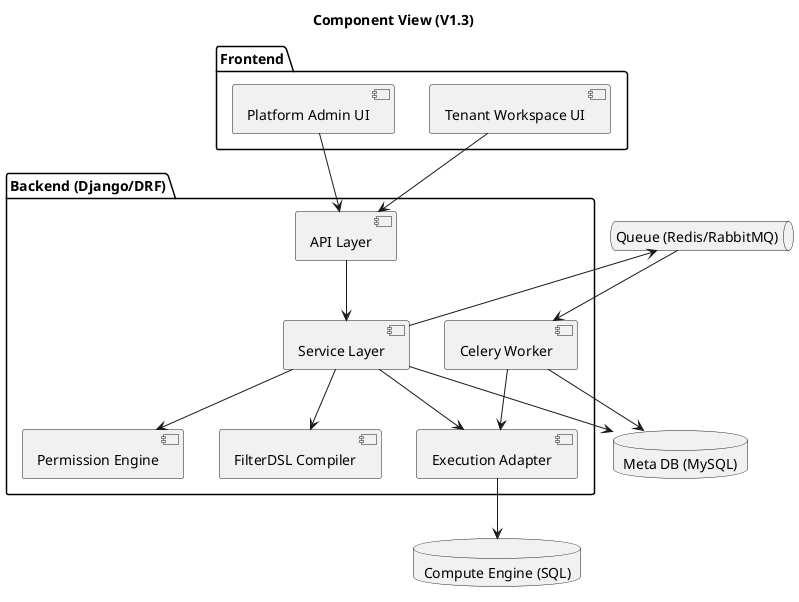
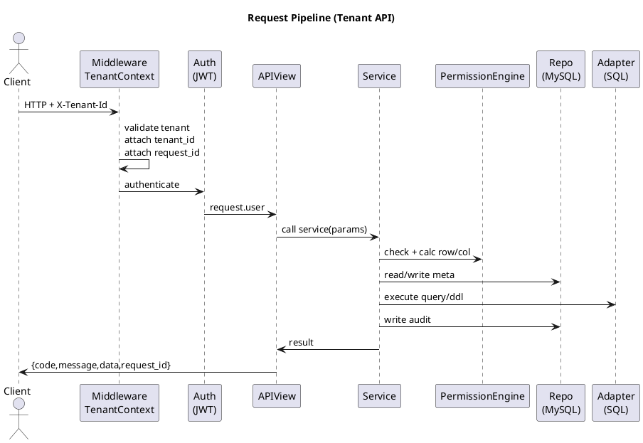
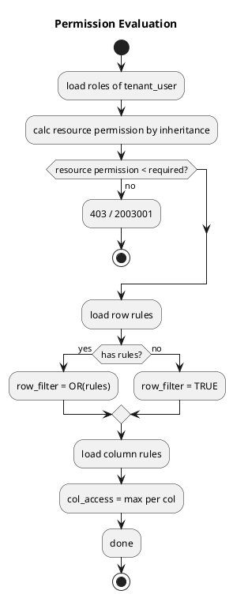
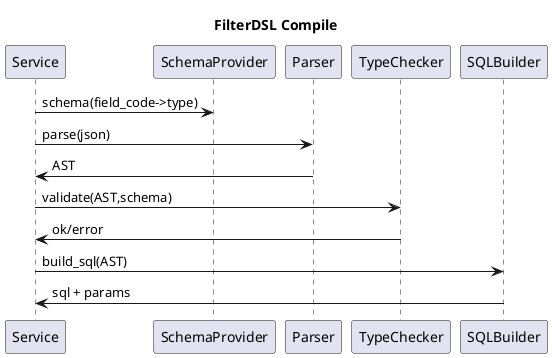
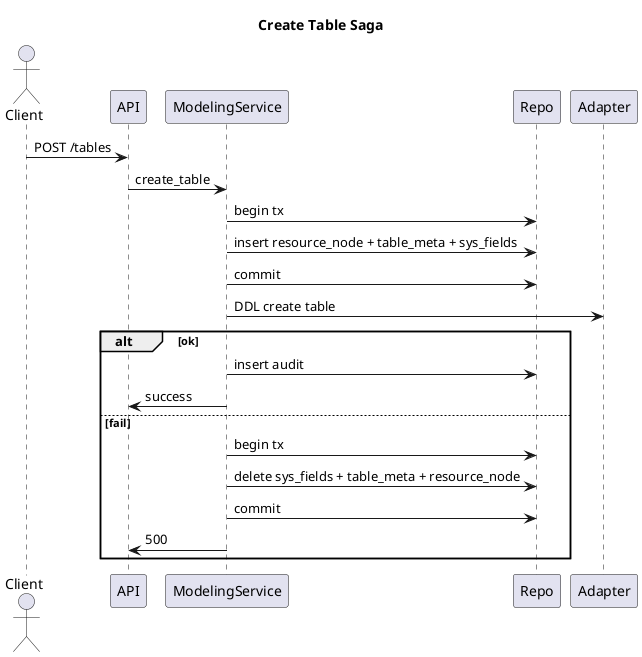
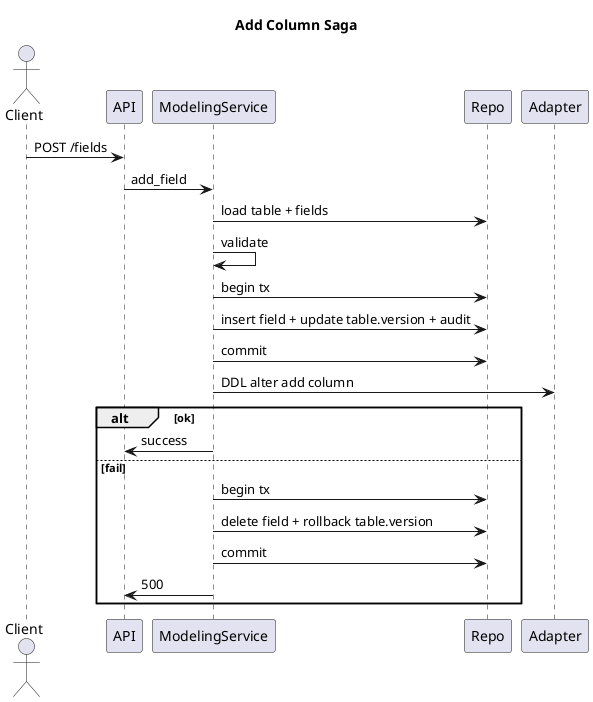
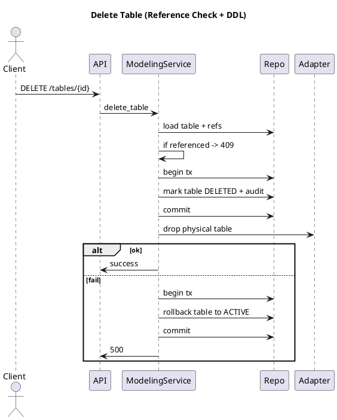
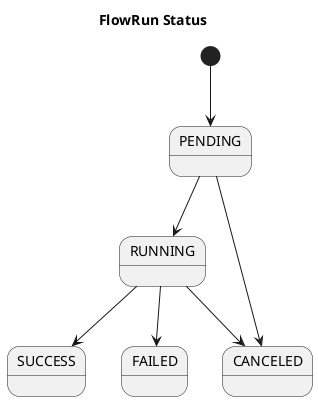
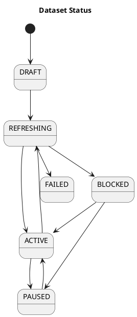

# 多租户配置化数据建模与报表平台 —— 技术设计文档（V1.3 超详细可实现）

- 文档版本：V1.3（超详细可实现）
- 对应 PRD：`prd.md`（本会话上传）
- 技术栈假设：Backend=Django+DRF；MetaDB=MySQL；Async=Celery；计算引擎=SQL Engine（统一走 Adapter）
- 前提：新系统，无存量迁移；仅初始化建表与后续 schema 变更
- PlantUML 约束：**不使用 note 元素**；不设置 skinparam/样式，全部默认


---

## 0. 开发必须遵守的交付要求（硬性）
1. **横切能力必须全局复用**：统一返回体、统一错误码、统一异常处理、统一租户上下文、统一权限引擎、统一 FilterDSL、统一审计、统一分页排序。
2. **接口必须写死**：权限点、入参/出参、校验、事务边界、并发控制、失败补偿、审计写入；禁止仅写“提供 XXX 接口”。
3. **复杂流程必须配 PlantUML**：请求管线、权限计算、建表/加字段/删表、Flow 运行、Dataset 刷新、Chart 查询、Dashboard 打开（含局部降级）。
4. **开发人员按本文逐步实现即可**：本文未写到的行为默认“不允许”，不要自行发明。


---

## 1. 总体架构

### 1.1 逻辑分层（固定）
- API 层（DRF ViewSet）：只做 HTTP、Serializer 校验、调用 Service、统一响应。
- Service 层：事务、权限、并发、引用保护、编排 Adapter、写审计。
- Repo/DAO 层：ORM CRUD + 常用查询。
- Permission Engine：资源级/行级/列级合并。
- FilterDSL Compiler：解析、类型校验、参数化 SQL。
- Execution Adapter：对接具体引擎（DDL/Query/Insert/Swap）。
- Worker（Celery）：FlowRun/DatasetRefresh/ExportJob 等长任务。


### 1.2 组件图（PlantUML）



### 1.3 请求处理管线（PlantUML：时序图）



---

## 2. 全局规范（任何模块不得绕开）

### 2.1 统一返回体

**成功：**
```json
{
  "code": 0,
  "message": "ok",
  "data": {},
  "request_id": "req_01J..."
}
```
**失败：**
```json
{
  "code": 2001001,
  "message": "参数错误：field_code 不合法",
  "detail": {"field":"field_code","reason":"must match ^[a-z][a-z0-9_]{0,63}$"},
  "request_id": "req_01J..."
}
```

### 2.2 HTTP 状态码与业务 code

| HTTP | 场景 | code 范围 |
| --- | --- | --- |
| 400 | 参数/DSL/Schema 校验失败 | 2001xxx |
| 401 | 未登录/Token 失效 | 2002xxx |
| 403 | 权限不足（含行/列/资源） | 2003xxx |
| 404 | 资源不存在 | 2004xxx |
| 409 | 冲突（并发/唯一/引用保护/正在运行） | 2005xxx/22xx/23xx |
| 422 | 业务校验不通过（BLOCKED/不合规） | 2006xxx/23xx |
| 500 | 系统错误/引擎异常 | 2999xxx |

### 2.3 错误码（必须落常量）

| code | message | 触发条件 |
| --- | --- | --- |
| 2001001 | 参数错误 | serializer 校验失败/缺字段/字段多余 |
| 2001002 | DSL 不合法 | FilterDSL 解析/类型校验失败 |
| 2002001 | 未登录 | Authorization 缺失 |
| 2002002 | Token 已过期 | JWT exp 过期 |
| 2003001 | 资源权限不足 | RolePermission 不满足 |
| 2003002 | 行权限不足 | RowPermission 导致目标行不可见/不可更新 |
| 2003003 | 列权限不足 | ColumnPermission=HIDDEN 或写入非 READWRITE |
| 2004001 | 资源不存在 | id 不存在/已删除 |
| 2005001 | 资源冲突 | 唯一键冲突/乐观锁 version 冲突 |
| 2005002 | 资源被引用 | 删除/修改被引用资源 |
| 2205001 | Flow 已在运行 | 同 Flow 同时仅允许 1 个 RUNNING |
| 2305001 | Dataset 刷新中 | 同 Dataset 同时仅允许 1 个 REFRESHING |
| 2306001 | Dataset Owner 不合规 | Owner 行/列覆盖不满足快照 |
| 2405001 | 导出任务进行中 | 同 chart/dashboard 仅允许 1 个 RUNNING export |
| 2999001 | 系统错误 | 未捕获异常/Adapter error |

### 2.4 分页/排序/过滤（统一）
- `page` 默认 1；`size` 默认 20 上限 200
- `sort` 多字段逗号分隔，字段白名单校验；`-field` 表示倒序
- `filter_json` 使用 FilterDSL
- 返回：`{items,page,size,total}`

### 2.5 租户上下文（TenantContext）
- Tenant API 必须带 `X-Tenant-Id`；平台 API 禁止携带。
- MetaDB 所有租户数据表必须有 tenant_id，并在 Repo/Service 层强制过滤。

### 2.6 code 字段规范（role_code/table_code/field_code/...）
- 目的：稳定引用（配置/DSL/导入导出/复制）+可读。
- 正则：`^[a-z][a-z0-9_]{0,63}$`。
- 唯一：role_code 在 tenant 内唯一；table_code 在 tenant 内唯一；field_code 在 table 内唯一。
- 生成：display_name slug；冲突 `_2/_3...`。
- 变更：**创建后不可改**（只改 display_name）。

### 2.7 权限引擎（资源/行/列）
- 资源权限：NONE < VIEW < EDIT < MANAGE；同用户多角色取最大值。
- 资源树继承：子节点继承最近祖先显式权限。
- 行权限：同表多规则 OR 合并；无规则 => TRUE（不限制）。
- 列权限：多角色取最宽：READWRITE > READONLY > HIDDEN；未配置默认 READONLY。


#### 2.7.1 权限计算（PlantUML：活动图）



### 2.8 FilterDSL（统一）
- Group：`{"op":"and|or","conditions":[...]}`
- Condition：`{"field":"amount","operator":">=","value":100}`
- 必须参数化 SQL，不允许拼 value。


#### 2.8.1 DSL 编译（PlantUML：时序图）



### 2.9 审计（AuditLog）
- 所有写操作必须写审计（Create/Update/Delete/Run/Refresh/Permission change）。
- 最小字段：tenant_id, request_id, actor, action, resource_type/id, before_json, after_json, created_at。


---

## 3. 物理表与类型映射（Adapter 必须实现）

| data_type | 物理类型（默认） | 备注 |
| --- | --- | --- |
| TEXT | VARCHAR(500) 或 TEXT | 默认 VARCHAR(500)，超过则 TEXT（配置） |
| INT | BIGINT | 默认 0 需校验可转 int |
| DECIMAL | DECIMAL(18,6) | 默认 0 需校验可转 decimal |
| DATE | DATE | 默认值 yyyy-mm-dd |
| DATETIME | DATETIME | UTC 存储 |
| BOOL | TINYINT(1) | 0/1 |
| RELATION | 与目标字段一致 | 实际存储目标主键类型 |

- 系统字段固定：`id`(varchar(26)), `created_at`(datetime), `updated_at`(datetime)。
- 物理表名规则：
  - Table：`t_{tenant.code}__{table.code}`
  - Dataset：`d_{tenant.code}__{dataset_id}`（建议用 id，避免 code 变更风险）


---

## 4. MetaDB 数据模型（字段写死）
以下为必须字段（可在末尾追加自用字段，但不得改含义）。


### 4.1 table_meta

| 字段 | 类型 | 必填 | 说明 |
| --- | --- | --- | --- |
| id | varchar(26) PK | 是 | tb_ |
| tenant_id | varchar(26) | 是 | IDX |
| display_name | varchar(50) | 是 | 可改 |
| code | varchar(64) | 是 | 不可改 |
| table_type | varchar(20) | 是 | DIM/FACT/CONFIG/OTHER |
| description | varchar(200) | 否 |  |
| resource_node_id | varchar(26) | 是 | resource_tree_node.id |
| status | varchar(20) | 是 | ACTIVE/DELETED |
| version | int | 是 | 乐观锁 |
| created_at | datetime | 是 | UTC |
| updated_at | datetime | 是 | UTC |

**唯一约束：**
- UNIQUE(tenant_id, code)

**索引：**
- IDX(tenant_id, resource_node_id)


### 4.2 table_field

| 字段 | 类型 | 必填 | 说明 |
| --- | --- | --- | --- |
| id | varchar(26) PK | 是 | fd_ |
| tenant_id | varchar(26) | 是 | IDX |
| table_id | varchar(26) | 是 | IDX |
| display_name | varchar(50) | 是 | 可改 |
| code | varchar(64) | 是 | 不可改 |
| data_type | varchar(20) | 是 | TEXT/INT/DECIMAL/DATE/DATETIME/BOOL/RELATION |
| is_primary_key | tinyint | 是 | 仅允许 1 个 |
| is_required | tinyint | 是 | NOT NULL |
| default_value | varchar(200) | 否 | 字符串存储，写入前按类型校验 |
| description | varchar(200) | 否 |  |
| is_internal | tinyint | 是 | 系统字段不可删改 |
| ref_table_id | varchar(26) | 否 | RELATION 目标 |
| ref_field_code | varchar(64) | 否 | RELATION 目标字段 |
| sort_order | int | 是 |  |
| created_at | datetime | 是 |  |
| updated_at | datetime | 是 |  |

**唯一约束：**
- UNIQUE(tenant_id, table_id, code)

**索引：**
- IDX(tenant_id, table_id)


### 4.3 flow

| 字段 | 类型 | 必填 | 说明 |
| --- | --- | --- | --- |
| id | varchar(26) PK | 是 | fl_ |
| tenant_id | varchar(26) | 是 | IDX |
| name | varchar(50) | 是 |  |
| code | varchar(64) | 是 | 不可改 |
| description | varchar(200) | 否 |  |
| resource_node_id | varchar(26) | 是 | resource_tree_node |
| dag_version | int | 是 | 乐观锁 |
| schedule_cron | varchar(64) | 否 | cron（可空） |
| schedule_timezone | varchar(64) | 否 | 默认 tenant.timezone |
| schedule_enabled | tinyint | 是 | 0/1 |
| status | varchar(20) | 是 | ACTIVE/DELETED |
| created_by | varchar(26) | 是 | tenant_user_id |
| updated_by | varchar(26) | 是 | tenant_user_id |
| created_at | datetime | 是 |  |
| updated_at | datetime | 是 |  |

**唯一约束：**
- UNIQUE(tenant_id, code)

**索引：**
- IDX(tenant_id, resource_node_id)


### 4.4 flow_node

| 字段 | 类型 | 必填 | 说明 |
| --- | --- | --- | --- |
| id | varchar(26) PK | 是 | fn_ |
| tenant_id | varchar(26) | 是 | IDX |
| flow_id | varchar(26) | 是 | IDX |
| node_key | varchar(64) | 是 | 前端 DAG 内唯一 key |
| node_type | varchar(30) | 是 | SQL/TABLE_SOURCE/TABLE_SINK/CALC_FIELD/FILTER/JOIN |
| name | varchar(50) | 是 | 节点名 |
| config_json | json | 是 | 强校验 |
| sort_order | int | 是 | 拓扑序缓存（可选） |
| created_at | datetime | 是 |  |
| updated_at | datetime | 是 |  |

**唯一约束：**
- UNIQUE(tenant_id, flow_id, node_key)

**索引：**
- IDX(tenant_id, flow_id)


### 4.5 flow_edge

| 字段 | 类型 | 必填 | 说明 |
| --- | --- | --- | --- |
| id | varchar(26) PK | 是 | fe_ |
| tenant_id | varchar(26) | 是 | IDX |
| flow_id | varchar(26) | 是 | IDX |
| src_node_key | varchar(64) | 是 |  |
| dst_node_key | varchar(64) | 是 |  |
| created_at | datetime | 是 |  |

**唯一约束：**
- UNIQUE(tenant_id, flow_id, src_node_key, dst_node_key)


### 4.6 flow_run

| 字段 | 类型 | 必填 | 说明 |
| --- | --- | --- | --- |
| id | varchar(26) PK | 是 | fr_ |
| tenant_id | varchar(26) | 是 | IDX |
| flow_id | varchar(26) | 是 | IDX |
| status | varchar(20) | 是 | PENDING/RUNNING/SUCCESS/FAILED/CANCELED |
| trigger_type | varchar(20) | 是 | MANUAL/SCHEDULE |
| started_at | datetime | 否 |  |
| finished_at | datetime | 否 |  |
| error_message | varchar(500) | 否 |  |
| created_by | varchar(26) | 是 | tenant_user_id |
| created_at | datetime | 是 |  |

**索引：**
- IDX(tenant_id, flow_id, status)


### 4.7 node_run

| 字段 | 类型 | 必填 | 说明 |
| --- | --- | --- | --- |
| id | varchar(26) PK | 是 | nr_ |
| tenant_id | varchar(26) | 是 | IDX |
| flow_run_id | varchar(26) | 是 | IDX |
| node_key | varchar(64) | 是 |  |
| status | varchar(20) | 是 | PENDING/RUNNING/SUCCESS/FAILED/SKIPPED |
| started_at | datetime | 否 |  |
| finished_at | datetime | 否 |  |
| row_count | bigint | 否 |  |
| error_message | varchar(500) | 否 |  |

**唯一约束：**
- UNIQUE(tenant_id, flow_run_id, node_key)


---

## 5. 接口实现细则（逐接口写死）
每个接口都必须严格实现：权限、校验、事务、并发、错误码、审计。


## 5.1 平台后台（/api/platform）


### 5.1.1 创建租户

- Method：`POST`
- Path：`/api/platform/tenants`
- Auth：JWT + is_platform_admin=true
- Tenant Header：禁止
- 权限：平台管理员


**Request JSON Schema：**

| 字段 | 类型 | 必填 | 约束/说明 | 示例 |
| --- | --- | --- | --- | --- |
| name | string | 是 | 1-50 | "XX公司" |
| code | string | 是 | ^[a-z][a-z0-9_]{0,49}$ 全局唯一 | "acme" |
| timezone | string | 是 | IANA TZ | "Asia/Tokyo" |


**Response.data：**

`{id,name,code,timezone,status,created_at}`


**可能错误：**
- 400/2001001 参数错误
- 409/2005001 code 冲突
- 403/2003001 非平台管理员


**实现步骤：**
1. 校验平台管理员
2. 校验字段与 timezone
3. 写 tenant(status=ACTIVE)
4. 写审计 TENANT_CREATE
5. 返回


**审计：** 必须（tenant_id 为空）


---

## 6. 租户设置（Users/Roles/Permissions）
resource_type：SETTINGS。


### 6.1 成员列表

- Method：`GET`
- Path：`/api/tenants/users`
- Auth：JWT
- Tenant Header：必须
- 权限：SETTINGS>=VIEW


**Request：** 无


**Response.data：**

`{items:[{tenant_user_id, name, email, status, roles:[{id,name,code}]}], page,size,total}`


**可能错误：**
- 403/2003001 无 SETTINGS VIEW


**实现步骤：**
1. 校验 SETTINGS>=VIEW
2. 联表查询并分页
3. 返回


**审计：** 否


### 6.2 给成员分配角色（全量覆盖）

- Method：`PUT`
- Path：`/api/tenants/users/{tenant_user_id}/roles`
- Auth：JWT
- Tenant Header：必须
- 权限：SETTINGS>=MANAGE


**Request JSON Schema：**

| 字段 | 类型 | 必填 | 约束/说明 | 示例 |
| --- | --- | --- | --- | --- |
| role_ids | array | 是 | role_id 列表（全量覆盖） | ["rl_x","rl_y"] |


**Response.data：**

`{tenant_user_id, role_ids}`


**可能错误：**
- 404/2004001 tenant_user/role 不存在或跨租户
- 403/2003001 无 SETTINGS MANAGE


**实现步骤：**
1. 校验 SETTINGS>=MANAGE
2. 校验 tenant_user_id 属于本 tenant
3. 校验 role_ids 全部属于本 tenant
4. 事务：删除旧 tenant_user_role；bulk insert 新的
5. 写审计 USER_ROLE_SET（before/after 角色列表）
6. 返回


**审计：** 必须


### 6.3 新建角色

- Method：`POST`
- Path：`/api/tenants/roles`
- Auth：JWT
- Tenant Header：必须
- 权限：SETTINGS>=MANAGE


**Request JSON Schema：**

| 字段 | 类型 | 必填 | 约束/说明 | 示例 |
| --- | --- | --- | --- | --- |
| name | string | 是 | 1-50 | "分析师" |
| code | string | 是 | ^[a-z][a-z0-9_]{0,49}$ tenant 内唯一 | "analyst" |


**Response.data：**

`{id,name,code}`


**可能错误：**
- 409/2005001 code 冲突
- 403/2003001 无 SETTINGS MANAGE


**实现步骤：**
1. 校验 SETTINGS>=MANAGE
2. 校验 code 正则
3. 插入 role
4. 写审计 ROLE_CREATE
5. 返回


**审计：** 必须


### 6.4 保存资源权限（RolePermission 批量覆盖）

- Method：`PUT`
- Path：`/api/tenants/roles/{role_id}/resource-permissions`
- Auth：JWT
- Tenant Header：必须
- 权限：SETTINGS>=MANAGE


**Request JSON Schema：**

| 字段 | 类型 | 必填 | 约束/说明 | 示例 |
| --- | --- | --- | --- | --- |
| resource_type | string | 是 | TABLE_SCHEMA/TABLE_DATA/FLOW/DATASET/CHART/DASHBOARD/SETTINGS | "TABLE_DATA" |
| items | array | 是 | [{resource_node_id,permission}] | [...] |


**Response.data：**

`{updated_count}`


**可能错误：**
- 400/2001001 枚举非法
- 404/2004001 role/node 不存在
- 403/2003001 无 SETTINGS MANAGE


**实现步骤：**
1. 校验 SETTINGS>=MANAGE
2. 校验 role_id 属于本 tenant
3. 校验 resource_type 枚举
4. 校验每个 resource_node_id 属于本 tenant
5. 事务：delete old by (role_id,resource_type)；insert new
6. 写审计 ROLE_PERMISSION_UPDATE
7. 返回


**审计：** 必须


### 6.5 保存列权限（ColumnPermission 批量覆盖，按表）

- Method：`PUT`
- Path：`/api/tenants/roles/{role_id}/tables/{table_id}/column-permissions`
- Auth：JWT
- Tenant Header：必须
- 权限：SETTINGS>=MANAGE


**Request JSON Schema：**

| 字段 | 类型 | 必填 | 约束/说明 | 示例 |
| --- | --- | --- | --- | --- |
| items | array | 是 | [{column_code,access_level}] | [...] |


**Response.data：**

`{updated_count}`


**可能错误：**
- 404/2004001 role/table/column 不存在
- 400/2001001 access_level 非法
- 403/2003001 无 SETTINGS MANAGE


**实现步骤：**
1. 校验 SETTINGS>=MANAGE
2. 校验 role_id/table_id 属于本 tenant
3. 校验 column_code 存在于 table_field.code
4. 事务：delete old by (role_id,table_id)；insert new
5. 写审计 COLUMN_PERMISSION_UPDATE
6. 返回


**审计：** 必须


**备注：**
默认 READONLY：实现方式是读取时对缺失列补 READONLY；不需要为每列写记录。


### 6.6 保存行权限（RowPermission：新增一条规则）

- Method：`POST`
- Path：`/api/tenants/roles/{role_id}/tables/{table_id}/row-permissions`
- Auth：JWT
- Tenant Header：必须
- 权限：SETTINGS>=MANAGE


**Request JSON Schema：**

| 字段 | 类型 | 必填 | 约束/说明 | 示例 |
| --- | --- | --- | --- | --- |
| rule_name | string | 是 | 1-50 | "仅本人" |
| filter_json | object | 是 | FilterDSL（字段必须存在于表） | {} |


**Response.data：**

`{row_permission_id}`


**可能错误：**
- 400/2001002 DSL 不合法
- 403/2003001 无 SETTINGS MANAGE


**实现步骤：**
1. 校验 SETTINGS>=MANAGE
2. 校验 role_id/table_id 属于本 tenant
3. 用表 schema 校验 filter_json（字段存在+类型匹配）
4. 插入 row_permission
5. 写审计 ROW_PERMISSION_CREATE
6. 返回


**审计：** 必须


---

## 7. 建模（Modeling）
资源：TABLE（资源权限分两类：TABLE_SCHEMA 与 TABLE_DATA）。


### 7.1 建表/改表/删表（PlantUML 图索引）
- 7.3 建表 Saga
- 7.4 加字段 Saga
- 7.6 删表（引用检查+DDL）Saga


### 7.1 获取表树

- Method：`GET`
- Path：`/api/modeling/tree`
- Auth：JWT
- Tenant Header：必须
- 权限：TABLE_SCHEMA 或 TABLE_DATA 任一 >= VIEW


**Request：** 无


**Response.data：**

树：folder+table resource nodes


**可能错误：**
- 无（无权限则返回空树）


**实现步骤：**
1. 计算每个表节点是否可见：schema>NONE 或 data>NONE
2. 补齐祖先 folder
3. 组装树并返回


**审计：** 否


### 7.2 获取表详情（含字段列表）

- Method：`GET`
- Path：`/api/modeling/tables/{table_id}`
- Auth：JWT
- Tenant Header：必须
- 权限：TABLE_SCHEMA>=VIEW 或 TABLE_DATA>=VIEW


**Request：** 无


**Response.data：**

`{table:{...}, fields:[...], permissions:{schema_perm,data_perm}}`


**可能错误：**
- 404/2004001 表不存在
- 403/2003001 无权限


**实现步骤：**
1. 加载 table_meta；不存在 404
2. 计算 schema_perm 与 data_perm（同一 table node）
3. 若二者都 < VIEW 则 403
4. 加载 table_field 列表按 sort_order
5. 返回


**审计：** 否


### 7.3 新建表（Meta+DDL）

- Method：`POST`
- Path：`/api/modeling/tables`
- Auth：JWT
- Tenant Header：必须
- 权限：目标 folder 上 TABLE_SCHEMA>=EDIT


**Request JSON Schema：**

| 字段 | 类型 | 必填 | 约束/说明 | 示例 |
| --- | --- | --- | --- | --- |
| display_name | string | 是 | 1-50 | "订单表" |
| table_type | string | 是 | DIM/FACT/CONFIG/OTHER | "FACT" |
| description | string | 否 | <=200 | "..." |
| folder_node_id | string | 否 | rt_ folder | "rt_x" |


**Response.data：**

`{id,code,resource_node_id,version}`


**可能错误：**
- 403/2003001 无 TABLE_SCHEMA EDIT
- 500/2999001 DDL 失败


**实现步骤：**
1. 校验 folder_node_id 合法（MODELING/FOLDER）
2. 权限校验 TABLE_SCHEMA>=EDIT（folder）
3. 生成 table_code（不可改）
4. 事务：创建 resource_tree_node(RESOURCE,TABLE)+table_meta(version=1)+系统字段
5. Adapter.create_table(物理表名,字段定义)
6. 若 DDL 失败：补偿删除 meta 记录
7. 写审计 TABLE_CREATE
8. 返回


**审计：** 必须


### 7.3.1 建表 Saga（PlantUML）



### 7.4 新增字段（Meta+DDL）

- Method：`POST`
- Path：`/api/modeling/tables/{table_id}/fields`
- Auth：JWT
- Tenant Header：必须
- 权限：TABLE_SCHEMA>=EDIT


**Request JSON Schema：**

| 字段 | 类型 | 必填 | 约束/说明 | 示例 |
| --- | --- | --- | --- | --- |
| display_name | string | 是 | 1-50 | "金额" |
| data_type | string | 是 | TEXT/INT/DECIMAL/DATE/DATETIME/BOOL/RELATION | "DECIMAL" |
| is_required | boolean | 否 | 默认 false | false |
| default_value | string | 否 | 按类型校验 | "0" |
| description | string | 否 | <=200 | "..." |
| ref_table_id | string | 否 | RELATION 必填 | "tb_user" |
| ref_field_code | string | 否 | RELATION 默认目标主键 | "id" |
| table_version | int | 是 | 乐观锁 | 1 |


**Response.data：**

`{field_id,code,table_version_new}`


**可能错误：**
- 409/2005001 table_version 冲突
- 422/2006001 主键/默认值/RELATION 不合法
- 500/2999001 DDL 失败


**实现步骤：**
1. 加载 table_meta+fields
2. 权限校验 TABLE_SCHEMA>=EDIT
3. 校验 table_version
4. 生成 field_code，不可改
5. 校验类型+default_value+RELATION 引用
6. 事务：insert table_field；table_meta.version+=1；写审计
7. Adapter.add_column(DDL)
8. DDL 失败：补偿删除该 field 并回滚 version
9. 返回


**审计：** 必须


### 7.4.1 加字段 Saga（PlantUML）



### 7.5 修改字段（不允许改 code/data_type）

- Method：`PATCH`
- Path：`/api/modeling/tables/{table_id}/fields/{field_id}`
- Auth：JWT
- Tenant Header：必须
- 权限：TABLE_SCHEMA>=EDIT


**Request JSON Schema：**

| 字段 | 类型 | 必填 | 约束/说明 | 示例 |
| --- | --- | --- | --- | --- |
| display_name | string | 否 | 1-50 | "金额(新)" |
| description | string | 否 | <=200 | "..." |
| is_required | boolean | 否 | 若从 false->true，需要校验无 NULL 值 | true |
| default_value | string | 否 | 按类型校验 | "0" |
| table_version | int | 是 | 乐观锁 | 2 |


**Response.data：**

`{field_id,table_version_new}`


**可能错误：**
- 409/2005001 version 冲突
- 422/2006001 将 is_required=true 但表存在 NULL
- 500/2999001 DDL 失败（当 required 变更需要 alter）


**实现步骤：**
1. 加载 table_meta+field
2. 权限校验 TABLE_SCHEMA>=EDIT
3. 校验 table_version
4. 若 is_required 从 false->true：Adapter.query 检查该列是否存在 NULL；若有则 422
5. 事务：更新 field 可改字段；table_meta.version+=1；写审计
6. 若 required 变更需要 DDL：Adapter.alter_column_set_not_null
7. 返回


**审计：** 必须


### 7.6 删除表（引用检查+DDL）

- Method：`DELETE`
- Path：`/api/modeling/tables/{table_id}`
- Auth：JWT
- Tenant Header：必须
- 权限：TABLE_SCHEMA>=MANAGE


**Request：** 无


**Response.data：**

`{deleted:true}`


**可能错误：**
- 403/2003001 无 TABLE_SCHEMA MANAGE
- 409/2005002 被引用（Flow/Dataset/Relation）
- 500/2999001 DDL 删除失败


**实现步骤：**
1. 加载 table；权限校验 TABLE_SCHEMA>=MANAGE
2. 调用 ReferenceService.check_table_not_referenced(table_id)：
  - flow_node.config_json 内是否引用 table_id
  - dataset.source_table_id 是否引用
  - table_field.REF_RELATION 是否引用
  - 若引用存在 -> 409/2005002（detail 返回引用列表）
3. 事务：标记 table_meta.status=DELETED；resource_tree_node 仍保留但可在树中隐藏；写审计 TABLE_DELETE
4. Adapter.drop_table(物理表名)
5. DDL 失败：回滚 status=ACTIVE；返回 500
6. 返回


**审计：** 必须


### 7.6.1 删表 Saga（PlantUML）



### 7.7 新增一行数据

- Method：`POST`
- Path：`/api/modeling/tables/{table_id}/data`
- Auth：JWT
- Tenant Header：必须
- 权限：TABLE_DATA>=EDIT


**Request JSON Schema：**

| 字段 | 类型 | 必填 | 约束/说明 | 示例 |
| --- | --- | --- | --- | --- |
| row | object | 是 | key=field_code；不得包含 HIDDEN 列 | {"amount":10} |


**Response.data：**

`{id, row}`


**可能错误：**
- 403/2003003 写入包含无权列
- 403/2003002 行权限不足（写入后不可见则禁止）
- 400/2001001 类型不匹配/缺 required
- 500/2999001 插入失败


**实现步骤：**
1. 权限校验 TABLE_DATA>=EDIT
2. 列校验：对 row.keys 做 column_permission 校验，必须 READWRITE；否则 403/2003003
3. 字段类型校验：按 table_field.data_type 解析/转换；required 字段不可缺且不可为 null
4. 行权限校验：将 row 代入当前用户 row_filter，若不满足则 403/2003002（避免写入后不可见）
5. 生成 id（varchar(26)）+ created_at/updated_at
6. Adapter.insert_one(physical_table, row)
7. 写审计 TABLE_DATA_INSERT（before 空/after row 摘要）
8. 返回


**审计：** 必须


### 7.8 更新一行数据

- Method：`PATCH`
- Path：`/api/modeling/tables/{table_id}/data/{row_id}`
- Auth：JWT
- Tenant Header：必须
- 权限：TABLE_DATA>=EDIT


**Request JSON Schema：**

| 字段 | 类型 | 必填 | 约束/说明 | 示例 |
| --- | --- | --- | --- | --- |
| patch | object | 是 | 仅允许写 READWRITE 列 | {"amount":20} |


**Response.data：**

`{id, row}`


**可能错误：**
- 404/2004001 行不存在（或不可见）
- 403/2003002 行权限不足
- 403/2003003 列权限不足


**实现步骤：**
1. 权限校验 TABLE_DATA>=EDIT
2. 计算 row_filter；先 SELECT 该 row_id 并带 where=row_filter，若查不到 -> 404（不可见视为不存在）
3. 列校验：patch 列必须 READWRITE
4. 类型校验/required 约束（必要时合并 old_row）
5. Adapter.update_by_id(where id=row_id AND row_filter)
6. 写审计 TABLE_DATA_UPDATE（before/after 摘要）
7. 返回


**审计：** 必须


### 7.9 删除一行数据

- Method：`DELETE`
- Path：`/api/modeling/tables/{table_id}/data/{row_id}`
- Auth：JWT
- Tenant Header：必须
- 权限：TABLE_DATA>=EDIT


**Request：** 无


**Response.data：**

`{deleted:true}`


**可能错误：**
- 404/2004001 行不存在（或不可见）
- 403/2003002 行权限不足


**实现步骤：**
1. 权限校验 TABLE_DATA>=EDIT
2. SELECT by id with row_filter，查不到 -> 404
3. Adapter.delete_by_id(where id=row_id AND row_filter)
4. 写审计 TABLE_DATA_DELETE（before 摘要/after 空）
5. 返回


**审计：** 必须


### 7.10 表数据查询（行/列权限+DSL）

- Method：`POST`
- Path：`/api/modeling/tables/{table_id}/data/query`
- Auth：JWT
- Tenant Header：必须
- 权限：TABLE_DATA>=VIEW


**Request JSON Schema：**

| 字段 | 类型 | 必填 | 约束/说明 | 示例 |
| --- | --- | --- | --- | --- |
| page | int | 否 | 默认 1 | 1 |
| size | int | 否 | 默认 20，上限 200 | 20 |
| sort | string | 否 | 字段白名单 | "-created_at" |
| filter_json | object | 否 | FilterDSL | {} |


**Response.data：**

`{items:[row],page,size,total}`（仅可见列）


**可能错误：**
- 403/2003001 无 TABLE_DATA VIEW
- 400/2001002 DSL 不合法


**实现步骤：**
1. 权限校验 TABLE_DATA>=VIEW
2. 列权限计算：hidden 列不返回；sort 字段必须可见，否则 400/2001001
3. where = AND(row_filter, filter_json)
4. 编译 where 并执行 SELECT+COUNT
5. 返回


**审计：** 否


---

## 8. 任务流（Flows）
资源：FLOW。


### 8.1 FlowRun 状态机（PlantUML）



### 8.2 创建 Flow

- Method：`POST`
- Path：`/api/flows`
- Auth：JWT
- Tenant Header：必须
- 权限：FLOW>=EDIT（目录）


**Request JSON Schema：**

| 字段 | 类型 | 必填 | 约束/说明 | 示例 |
| --- | --- | --- | --- | --- |
| name | string | 是 | 1-50 | "订单清洗" |
| description | string | 否 | <=200 | "..." |
| folder_node_id | string | 否 | rt_ folder | "rt_flow" |


**Response.data：**

`{flow_id, code, dag_version}`（dag_version=1，初始空 DAG）


**可能错误：**
- 403/2003001 无 FLOW EDIT


**实现步骤：**
1. 校验目录权限 FLOW>=EDIT
2. 生成 flow.code（不可改）
3. 事务：创建 resource_node + flow(dag_version=1,schedule_enabled=false)
4. 写审计 FLOW_CREATE
5. 返回


**审计：** 必须


### 8.3 保存 DAG（全量覆盖）

- Method：`PUT`
- Path：`/api/flows/{flow_id}/dag`
- Auth：JWT
- Tenant Header：必须
- 权限：FLOW>=EDIT


**Request JSON Schema：**

| 字段 | 类型 | 必填 | 约束/说明 | 示例 |
| --- | --- | --- | --- | --- |
| dag_version | int | 是 | 乐观锁 | 1 |
| nodes | array | 是 | 见 8.3.1 节点 schema | [...] |
| edges | array | 是 | [{src_node_key,dst_node_key}] | [...] |


**Response.data：**

`{flow_id, dag_version_new}`


**可能错误：**
- 409/2005001 dag_version 冲突
- 422/2006001 DAG 校验失败（有环/孤儿/引用不存在/越权）


**实现步骤：**
1. 加载 flow；权限校验 FLOW>=EDIT；校验 dag_version
2. 校验 nodes/edges：
  - node_key 唯一
  - edge 引用存在
  - 无环（topo sort）
  - 必须存在至少 1 个 sink

3. 对每个 node.config_json 强校验（见 8.3.1）
4. 对涉及 table 的节点做越权校验：
  - TABLE_SOURCE：需要对 source_table 具备 TABLE_DATA>=VIEW
  - TABLE_SINK：需要对 target_table 具备 TABLE_DATA>=EDIT

5. 事务：删除旧 flow_node/flow_edge；bulk insert 新；flow.dag_version+=1；写审计 FLOW_DAG_UPDATE
6. 返回


**审计：** 必须


#### 8.3.1 Flow 节点 Schema（必须严格校验）

| node_type | config_json 结构（摘要） | 强校验要点 |
| --- | --- | --- |
| SQL | {sql:string, output_columns:[{code,type}], output_table_tmp:boolean} | sql 必须只允许 SELECT（禁止 DDL/DML）；output_columns 必填 |
| TABLE_SOURCE | {table_id:string, select_columns:[code], filter_json?:object} | table_id 必填；select_columns 非空且存在于表 |
| FILTER | {filter_json:object} | FilterDSL 必填；字段来自输入流 schema |
| JOIN | {join_type:INNER|LEFT, on:[{left,right}], right_input:string} | on 非空；字段存在 |
| CALC_FIELD | {expressions:[{new_code,expr,type}]} | expr 仅允许白名单函数/操作符；new_code 正则且不冲突 |
| TABLE_SINK | {table_id:string, mode:OVERWRITE|APPEND, mapping:[{src_code,dst_code}]} | OVERWRITE/APPEND；mapping 不能为空 |

- SQL 节点的安全：V1.3 必须做简单禁用：仅允许以 `select` 开头；禁止 `;`；禁止关键字 `drop/alter/insert/update/delete/create`（大小写不敏感）。


### 8.4 配置 Schedule

- Method：`PUT`
- Path：`/api/flows/{flow_id}/schedule`
- Auth：JWT
- Tenant Header：必须
- 权限：FLOW>=MANAGE


**Request JSON Schema：**

| 字段 | 类型 | 必填 | 约束/说明 | 示例 |
| --- | --- | --- | --- | --- |
| cron | string | 是 | 标准 cron | "0 2 * * *" |
| timezone | string | 否 | IANA TZ，默认 tenant.timezone | "Asia/Tokyo" |
| enabled | boolean | 是 | true/false | true |


**Response.data：**

`{flow_id, cron, timezone, enabled}`


**可能错误：**
- 400/2001001 cron 不合法/时区不合法
- 403/2003001 无 FLOW MANAGE


**实现步骤：**
1. 权限校验 FLOW>=MANAGE
2. 校验 cron（用 croniter）
3. 校验 timezone（zoneinfo）
4. 事务：更新 flow.schedule_*；写审计 FLOW_SCHEDULE_UPDATE
5. 返回


**审计：** 必须


### 8.5 触发运行（手动）

- Method：`POST`
- Path：`/api/flows/{flow_id}/runs`
- Auth：JWT
- Tenant Header：必须
- 权限：FLOW>=EDIT


**Request：** 无


**Response.data：**

`{flow_run_id,status}`


**可能错误：**
- 409/2205001 已有 RUNNING
- 403/2003001 无 FLOW EDIT


**实现步骤：**
1. 权限校验 FLOW>=EDIT
2. 事务：检查是否存在 RUNNING 的 flow_run（行锁）-> 有则 409/2205001
3. 创建 flow_run(PENDING) + node_run(PENDING)
4. 投递 Worker execute_flow_run
5. 写审计 FLOW_RUN_TRIGGER
6. 返回


**审计：** 必须


### 8.6 取消运行

- Method：`POST`
- Path：`/api/flows/runs/{flow_run_id}/cancel`
- Auth：JWT
- Tenant Header：必须
- 权限：FLOW>=EDIT（所属 flow）


**Request：** 无


**Response.data：**

`{flow_run_id,status}`（CANCELED）


**可能错误：**
- 404/2004001 flow_run 不存在
- 409/2005001 已结束不可取消


**实现步骤：**
1. 加载 flow_run；校验所属 flow 的 FLOW>=EDIT
2. 若 status in (SUCCESS,FAILED,CANCELED) -> 409/2005001
3. 更新 flow_run.status=CANCELED
4. Worker 侧应定期检查 canceled 标记并停止后续节点（V1.3 允许粗粒度：只阻止后续节点，不强杀正在运行的 SQL）
5. 写审计 FLOW_RUN_CANCEL
6. 返回


**审计：** 必须


### 8.7 Worker 执行 FlowRun（PlantUML：时序图）

```plantuml
@startuml
title Execute FlowRun

participant Worker as W
participant FlowService as S
participant Repo as R
participant Adapter as A

W -> S : execute_flow_run(flow_run_id)
S -> R : load flow_run + dag
S -> R : update flow_run RUNNING
S -> S : topo sort
loop node
  S -> R : update node_run RUNNING
  S -> A : execute node
(create temp table)
  alt ok
    S -> R : node_run SUCCESS
  else fail
    S -> R : node_run FAILED
    S -> S : mark flow_run FAILED and stop
    break
  end
end
S -> R : update flow_run SUCCESS/FAILED
@enduml
```

---

## 9. 数据集（Datasets）
资源：DATASET。


### 9.1 Dataset 状态机（PlantUML）



### 9.2 创建数据集

- Method：`POST`
- Path：`/api/datasets`
- Auth：JWT
- Tenant Header：必须
- 权限：DATASET 目录>=EDIT 且 来源表 TABLE_DATA>=VIEW


**Request JSON Schema：**

| 字段 | 类型 | 必填 | 约束/说明 | 示例 |
| --- | --- | --- | --- | --- |
| name | string | 是 | 1-50 | "订单分析" |
| description | string | 否 | <=200 | "..." |
| source_table_id | string | 是 | tb_ | "tb_order" |
| allowed_columns | array | 是 | field_code 非空 | ["id","amount"] |
| base_filter_json | object | 否 | FilterDSL | {} |
| folder_node_id | string | 否 | rt_ folder | "rt_ds" |
| owner_tenant_user_id | string | 否 | 默认创建者 | "tu_x" |


**Response.data：**

`{dataset_id,status=DRAFT,version}`


**可能错误：**
- 400/2001001 字段不存在/allowed_columns 空
- 400/2001002 base_filter_json 不合法
- 403/2003001 无权限


**实现步骤：**
1. 校验目录 DATASET>=EDIT
2. 校验 source_table 存在且 TABLE_DATA>=VIEW
3. 校验 allowed_columns 全部存在且去重
4. 快照 row_scope_filter = creator 的有效 row_filter（对 source_table）
5. final_scope = AND(row_scope_filter, base_filter_json or TRUE)
6. 事务：insert dataset(status=DRAFT,version=1)+resource_node；写审计 DATASET_CREATE
7. Adapter.create_table(dataset physical table)
8. 返回


**审计：** 必须


### 9.3 更新数据集（只改 name/description/base_filter/allowed_columns；变更后必须 refresh 才生效）

- Method：`PATCH`
- Path：`/api/datasets/{dataset_id}`
- Auth：JWT
- Tenant Header：必须
- 权限：DATASET>=EDIT


**Request JSON Schema：**

| 字段 | 类型 | 必填 | 约束/说明 | 示例 |
| --- | --- | --- | --- | --- |
| name | string | 否 | 1-50 | "订单分析(新)" |
| description | string | 否 | <=200 | "..." |
| allowed_columns | array | 否 | 若传则非空且字段存在 | ["id","amount"] |
| base_filter_json | object | 否 | FilterDSL | {} |
| version | int | 是 | 乐观锁 | 1 |


**Response.data：**

`{dataset_id,version_new,status}`（status 保持不变）


**可能错误：**
- 409/2005001 version 冲突
- 400/2001002 DSL 不合法
- 422/2006001 变更 allowed_columns 与现有物理表不兼容（需重建）


**实现步骤：**
1. 权限校验 DATASET>=EDIT
2. 加载 dataset 校验 version
3. 若 allowed_columns 变更：校验字段存在且 owner 对这些列有权限（可延迟到 refresh，但 V1.3 建议这里先校验列可见性）
4. 校验 base_filter_json
5. 重新计算 final_scope_filter_json（用原快照 row_scope_filter + 新 base_filter）
6. 事务：更新 dataset 字段；version+=1；写审计 DATASET_UPDATE
7. 返回


**审计：** 必须


**备注：**
变更 allowed_columns 后，物理表列集可能变化；V1.3 规定 refresh 时以 allowed_columns 为准进行 staging 重建并 swap。


### 9.4 刷新数据集（异步 FULL）

- Method：`POST`
- Path：`/api/datasets/{dataset_id}/refresh`
- Auth：JWT
- Tenant Header：必须
- 权限：DATASET>=EDIT


**Request：** 无


**Response.data：**

`{refresh_run_id,status}`


**可能错误：**
- 409/2305001 已在刷新
- 422/2306001 Owner 不合规 -> BLOCKED


**实现步骤：**
1. 权限校验 DATASET>=EDIT
2. 若 dataset.status=REFRESHING -> 409/2305001
3. Owner 合规校验（列+行覆盖）：不合规则标记 BLOCKED 并 422/2306001
4. 创建 refresh_run(PENDING)；更新 dataset.status=REFRESHING
5. 投递 Worker
6. 写审计 DATASET_REFRESH_TRIGGER
7. 返回


**审计：** 必须


### 9.5 暂停/恢复数据集

- Method：`POST`
- Path：`/api/datasets/{dataset_id}/toggle-pause`
- Auth：JWT
- Tenant Header：必须
- 权限：DATASET>=MANAGE


**Request JSON Schema：**

| 字段 | 类型 | 必填 | 约束/说明 | 示例 |
| --- | --- | --- | --- | --- |
| paused | boolean | 是 | true=暂停，false=恢复 | true |
| version | int | 是 | 乐观锁 | 3 |


**Response.data：**

`{dataset_id,status,version_new}`


**可能错误：**
- 409/2005001 version 冲突
- 409/2305001 REFRESHING 中不可暂停/恢复


**实现步骤：**
1. 权限校验 DATASET>=MANAGE
2. 校验 version
3. 若 status=REFRESHING -> 409/2305001
4. 更新 status=PAUSED 或 ACTIVE；version+=1；写审计 DATASET_TOGGLE_PAUSE
5. 返回


**审计：** 必须


### 9.6 Dataset 刷新执行（PlantUML）

```plantuml
@startuml
title Execute Dataset Refresh

participant Worker as W
participant DatasetService as S
participant Repo as R
participant Adapter as A

W -> S : execute_refresh(refresh_run_id)
S -> R : load dataset + source_table
S -> R : update refresh_run RUNNING
S -> A : create staging table
S -> A : insert-select into staging
from source where final_scope
S -> A : swap staging -> final
alt ok
  S -> R : dataset ACTIVE + last_success_at
  S -> R : refresh_run SUCCESS
else fail
  S -> R : dataset FAILED + last_error_message
  S -> R : refresh_run FAILED
end
@enduml
```

---

## 10. 图表（Charts）
资源：CHART。


### 10.1 创建图表

- Method：`POST`
- Path：`/api/charts`
- Auth：JWT
- Tenant Header：必须
- 权限：CHART 目录>=EDIT 且 dataset>=VIEW


**Request JSON Schema：**

| 字段 | 类型 | 必填 | 约束/说明 | 示例 |
| --- | --- | --- | --- | --- |
| name | string | 是 | 1-50 | "趋势" |
| description | string | 否 | <=200 | "..." |
| dataset_id | string | 是 | ds_ | "ds_x" |
| query_config | object | 是 | 强校验（见 10.1.1） | {} |
| viz_config | object | 是 | 强校验 | {} |
| folder_node_id | string | 否 | rt_ folder | "rt_ch" |


**Response.data：**

`{chart_id,version}`


**可能错误：**
- 400/2001001 schema 错误
- 403/2003001 无权限


**实现步骤：**
1. 校验目录 CHART>=EDIT
2. 校验 dataset>=VIEW
3. 强校验 query_config/viz_config
4. 事务：insert chart(version=1)+resource_node；写审计 CHART_CREATE
5. 返回


**审计：** 必须


#### 10.1.1 query_config 最小 schema（必须）

| 字段 | 类型 | 说明 |
| --- | --- | --- |
| dimensions | array | 维度字段 codes（可空） |
| metrics | array | [{field, agg:sum|count|avg|min|max, alias}]（至少 1） |
| filters | object | FilterDSL（可空） |
| group_by | array | 默认=dimensions |
| order_by | array | [{field, direction:asc|desc}]（可空） |
| limit | int | 默认 1000，上限 10000 |


### 10.2 更新图表（不允许改 dataset_id）

- Method：`PATCH`
- Path：`/api/charts/{chart_id}`
- Auth：JWT
- Tenant Header：必须
- 权限：CHART>=EDIT


**Request JSON Schema：**

| 字段 | 类型 | 必填 | 约束/说明 | 示例 |
| --- | --- | --- | --- | --- |
| name | string | 否 | 1-50 | "趋势(新)" |
| description | string | 否 | <=200 | "..." |
| query_config | object | 否 | 强校验 | {} |
| viz_config | object | 否 | 强校验 | {} |
| version | int | 是 | 乐观锁 | 1 |


**Response.data：**

`{chart_id,version_new}`


**可能错误：**
- 409/2005001 version 冲突
- 400/2001001 schema 错误


**实现步骤：**
1. 权限校验 CHART>=EDIT
2. 加载 chart 校验 version
3. 若 query_config 更新：强校验字段必须属于 dataset.allowed_columns 且 col_access!=HIDDEN（用 owner 快照列集 + 当前访问者列权限校验）
4. 事务：更新 chart；version+=1；写审计 CHART_UPDATE
5. 返回


**审计：** 必须


### 10.3 删除图表（软删除）

- Method：`DELETE`
- Path：`/api/charts/{chart_id}`
- Auth：JWT
- Tenant Header：必须
- 权限：CHART>=MANAGE


**Request：** 无


**Response.data：**

`{deleted:true}`


**可能错误：**
- 409/2005002 被 Dashboard 引用
- 403/2003001 无 CHART MANAGE


**实现步骤：**
1. 权限校验 CHART>=MANAGE
2. 引用检查：dashboard_item.chart_id 是否存在引用；有则 409/2005002
3. 事务：chart.status=DELETED；写审计 CHART_DELETE
4. 返回


**审计：** 必须


### 10.4 执行图表查询

- Method：`POST`
- Path：`/api/charts/{chart_id}/query`
- Auth：JWT
- Tenant Header：必须
- 权限：CHART>=VIEW 且 dataset>=VIEW


**Request JSON Schema：**

| 字段 | 类型 | 必填 | 约束/说明 | 示例 |
| --- | --- | --- | --- | --- |
| runtime_filter_json | object | 否 | FilterDSL | {} |
| limit_override | int | 否 | <=10000 | 1000 |


**Response.data：**

`{columns:[...],rows:[...],meta:{elapsed_ms,row_count}}`


**可能错误：**
- 400/2001002 runtime_filter_json 不合法
- 403/2003003 使用了隐藏列


**实现步骤：**
1. 校验 CHART>=VIEW 与 dataset>=VIEW（chart 可选择继承 dataset 权限，但本文要求 chart 独立授权，避免误共享）
2. 加载 chart+dataset，计算当前访问者 row_filter+col_access
3. 校验 query_config 所用字段均在 dataset.allowed_columns 且 col_access!=HIDDEN；否则 403/2003003
4. where = AND(dataset.final_scope_filter_json, row_filter, runtime_filter_json, query_config.filters)
5. 编译 where 并执行聚合 SQL
6. 返回


**审计：** 否


### 10.5 导出图表数据（异步）

- Method：`POST`
- Path：`/api/charts/{chart_id}/export`
- Auth：JWT
- Tenant Header：必须
- 权限：CHART>=VIEW


**Request JSON Schema：**

| 字段 | 类型 | 必填 | 约束/说明 | 示例 |
| --- | --- | --- | --- | --- |
| format | string | 是 | csv/xlsx | "csv" |
| runtime_filter_json | object | 否 | FilterDSL | {} |


**Response.data：**

`{export_job_id,status}`


**可能错误：**
- 409/2405001 已有导出任务 RUNNING


**实现步骤：**
1. 权限校验 CHART>=VIEW
2. 检查是否存在 RUNNING export_job(chart_id) -> 409/2405001
3. 创建 export_job(PENDING,format,params_json) 并投递 Worker
4. 写审计 CHART_EXPORT_TRIGGER
5. 返回


**审计：** 必须


**备注：**
下载接口：GET /api/exports/{export_job_id}/download（返回文件 URL 或直接流式下载）。对象存储可后续加。


---

## 11. 仪表盘（Dashboards）
资源：DASHBOARD。


### 11.1 打开仪表盘与局部降级（PlantUML）

```plantuml
@startuml
title Open Dashboard (Partial Degrade)

start
:load dashboard + items;
if (dashboard perm >= VIEW?) then (yes)
else (no)
  :403;
  stop
endif

:runtime_filter = dashboard.filters_json;
:for each item
  if (chart perm >= VIEW and dataset >= VIEW?) then (yes)
    :execute chart query;
    :item status=OK;
  else (no)
    :item status=DEGRADED;
  endif
endfor
:return layout + item_results;
stop
@enduml
```

### 11.2 创建仪表盘

- Method：`POST`
- Path：`/api/dashboards`
- Auth：JWT
- Tenant Header：必须
- 权限：DASHBOARD 目录>=EDIT


**Request JSON Schema：**

| 字段 | 类型 | 必填 | 约束/说明 | 示例 |
| --- | --- | --- | --- | --- |
| name | string | 是 | 1-50 | "看板" |
| description | string | 否 | <=200 | "..." |
| folder_node_id | string | 否 | rt_ folder | "rt_db" |
| layout_json | object | 是 | 布局 schema | {} |
| filters_json | object | 否 | 全局筛选 schema | {} |
| items | array | 是 | [{chart_id,position...}] | [...] |


**Response.data：**

`{dashboard_id,version}`


**可能错误：**
- 400/2001001 layout/items 不合法
- 403/2003001 无 DASHBOARD EDIT


**实现步骤：**
1. 权限校验 DASHBOARD>=EDIT（目录）
2. 校验 items：chart_id 存在；并校验创建者对 chart>=VIEW（否则拒绝）
3. 事务：insert dashboard(version=1)+items+resource_node；写审计 DASHBOARD_CREATE
4. 返回


**审计：** 必须


### 11.3 更新仪表盘（全量覆盖 layout/items/filters）

- Method：`PUT`
- Path：`/api/dashboards/{dashboard_id}`
- Auth：JWT
- Tenant Header：必须
- 权限：DASHBOARD>=EDIT


**Request JSON Schema：**

| 字段 | 类型 | 必填 | 约束/说明 | 示例 |
| --- | --- | --- | --- | --- |
| layout_json | object | 是 | 全量 | {} |
| filters_json | object | 否 | 全量 | {} |
| items | array | 是 | 全量 | [...] |
| version | int | 是 | 乐观锁 | 1 |


**Response.data：**

`{dashboard_id,version_new}`


**可能错误：**
- 409/2005001 version 冲突
- 400/2001001 schema 错误


**实现步骤：**
1. 权限校验 DASHBOARD>=EDIT
2. 加载 dashboard 校验 version
3. 校验 items 所有 chart_id 存在；并要求操作者对这些 chart >= VIEW（否则拒绝）
4. 事务：删除旧 dashboard_item；insert 新；更新 dashboard.layout/filters；version+=1；写审计 DASHBOARD_UPDATE
5. 返回


**审计：** 必须


### 11.4 删除仪表盘

- Method：`DELETE`
- Path：`/api/dashboards/{dashboard_id}`
- Auth：JWT
- Tenant Header：必须
- 权限：DASHBOARD>=MANAGE


**Request：** 无


**Response.data：**

`{deleted:true}`


**可能错误：**
- 403/2003001 无 DASHBOARD MANAGE


**实现步骤：**
1. 权限校验 DASHBOARD>=MANAGE
2. 事务：dashboard.status=DELETED；写审计 DASHBOARD_DELETE
3. 返回


**审计：** 必须


### 11.5 打开仪表盘（局部降级）

- Method：`GET`
- Path：`/api/dashboards/{dashboard_id}/open`
- Auth：JWT
- Tenant Header：必须
- 权限：DASHBOARD>=VIEW


**Request：** 无


**Response.data：**

`{dashboard, items:[{item_id,chart_id,status, data?, reason?}]}`


**可能错误：**
- 403/2003001 无 DASHBOARD VIEW


**实现步骤：**
1. 权限校验 DASHBOARD>=VIEW
2. 加载 dashboard+items
3. 逐 item：调用 ChartService.execute_query；若无权限则填 DEGRADED
4. 返回


**审计：** 否


---

## 12. 审计（Audit）


### 12.1 查询审计日志

- Method：`GET`
- Path：`/api/audit/logs`
- Auth：JWT
- Tenant Header：必须
- 权限：SETTINGS>=VIEW


**Request：** 无


**Response.data：**

`{items:[{id,action,resource_type,resource_id,actor,created_at,summary}],page,size,total}`


**可能错误：**
- 403/2003001 无 SETTINGS VIEW


**实现步骤：**
1. 权限校验 SETTINGS>=VIEW
2. 支持过滤：action/resource_type/resource_id/actor/time_range
3. 分页排序（created_at desc）
4. 返回


**审计：** 否


### 12.2 审计详情

- Method：`GET`
- Path：`/api/audit/logs/{audit_id}`
- Auth：JWT
- Tenant Header：必须
- 权限：SETTINGS>=VIEW


**Request：** 无


**Response.data：**

`{id,action,before_json,after_json,detail}`


**可能错误：**
- 404/2004001 不存在


**实现步骤：**
1. 权限校验 SETTINGS>=VIEW
2. 加载 audit_log
3. 返回


**审计：** 否


---

## 13. 统一实现清单（按清单逐项验收）

### 13.1 中间件/全局
- [ ] TenantContextMiddleware（X-Tenant-Id + request_id）
- [ ] 全局异常处理（映射 code）
- [ ] 统一分页器/排序白名单
- [ ] AuditService（写入统一）
- [ ] PermissionEngine（资源/行/列）
- [ ] FilterDSLCompiler（parse/validate/build_sql）
- [ ] ExecutionAdapter（DDL/Query/Insert/Update/Delete/Swap）

### 13.2 各模块
- [ ] Settings：角色、授权、行列权限
- [ ] Modeling：表/字段/数据 CRUD
- [ ] Flows：DAG 保存、运行、取消、schedule
- [ ] Datasets：创建/更新/刷新/暂停
- [ ] Charts：CRUD/查询/导出
- [ ] Dashboards：CRUD/open（局部降级）


---

## 14. 测试与验收（必须覆盖）
- 每个写接口至少 2 条失败用例：权限不足、参数/版本冲突。
- DDL Saga：模拟 Adapter 失败，验证补偿生效。
- Dashboard open：至少 1 个 item 降级但整体成功。
