# 1 文档基本信息

## 1.1 文档目的

本文档用于定义《多租户配置化数据建模与报表平台》在 V1.0 的需求边界、核心概念、关键行为约束与跨团队统一口径，作为产品/研发/测试/运维的共同基线。

## 1.2 产品能力概览

平台提供以下核心能力域（V1.0）：多租户、配置化建模、可视化任务流（ETL）、报表（数据集/图表/仪表盘）、权限（资源/行/列）与审计、LLM 辅助命名（本地 ollama）。

## 1.3 适用读者与使用方式

适用读者包括：产品经理、后端研发、前端研发、测试工程师、运维/平台管理员、业务方/实施顾问；使用方式为“先统一概念与边界，再在技术设计中落到实现”。

## 1.4 范围边界

### 1.4.1 In Scope（V1.0 必做）

- 多租户与平台后台：GlobalUser/Tenant/TenantUser 管理；租户停用后禁止访问并停止调度。
- 租户工作区框架：租户切换；Modeling / Flows / Reports / Settings 四大模块导航。
- Modeling：表资源树、表结构管理、表数据基础 CRUD、关系管理。
- Flows：资源树、DAG 画布（Source/Transform/Sink）、调度与 Run 记录。
- Reports：Datasets（基于来源表生成可复用数据集表）、Charts（探索分析并保存为图表资产）、Dashboards（资源树、布局、添加图表实例、分享与导出）。
- 权限与 DSL：统一过滤 JSON DSL；资源级权限；行/列权限配置与应用。

### 1.4.2 Out of Scope（V1.0 明确不做）

字段类型在线变更、跨租户联邦查询、字段级血缘可视化、通知中心/消息中心（任务失败推送到 IM 等）、多语言国际化。

## 1.5 成功指标与质量红线

- 任务流运行：每日 Flow Run 成功率目标 ≥ 99%；关注平均运行耗时用于优化。
- 权限稳定性红线：不允许未授权用户看到敏感数据；不允许合法用户被完全阻断。

---

# 2 整体情况（技术视角）

> 本章仅描述整体架构与关键链路（请求/查询/执行），不出现具体接口定义。

## 2.1 系统空间划分与访问边界

系统从产品与访问边界上分为两类工作空间：平台后台（面向 Platform Admin）与租户工作区（面向租户内用户）。平台管理员可查看租户元信息但默认不直接访问租户业务数据；租户用户只能访问自身租户。

## 2.2 模块与核心资产总览

### 2.2.1 租户工作区模块

租户工作区包含：Modeling、Flows、Reports（Datasets/Charts/Dashboards）、Tenant Settings（用户/角色/权限）。

### 2.2.2 核心资产与依赖关系

- Dataset：基于来源表生成“可复用数据集表”，封装字段选择、base_filter 与刷新策略，用于稳定支撑下游分析展示。
- Chart：在可视化查询中保存的“查询配置 + 可视化配置”，归属某 Dataset，可复用。
- Dashboard：聚合多个图表实例（DashboardItem），包含布局等配置。

推荐的端到端链路为：创建数据集 → 保存图表 → 创建仪表盘并添加图表。

### 2.2.3 平台后台（Platform Admin Console）能力域

平台后台面向 Platform Admin，包含平台用户（GlobalUser）管理、租户（Tenant）管理、租户成员（TenantUser）管理等能力。

## 2.3 总体逻辑架构图（概念级）

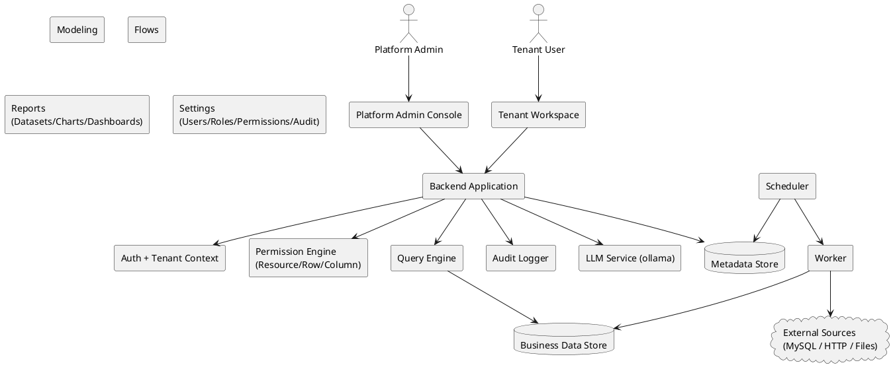

说明：平台在“交互入口（后台/工作区）”之下共享统一的身份认证、租户上下文、权限、审计与查询执行能力；Flows 的执行由调度器触发并由执行器实际跑节点逻辑。

## 2.4 关键链路一：请求链路（统一鉴权与租户上下文）

**目标**：任何进入后端的请求都必须同时完成“身份识别（GlobalUser）”与“租户上下文确定（Tenant + TenantUser）”，并在进入业务逻辑前完成权限决策。

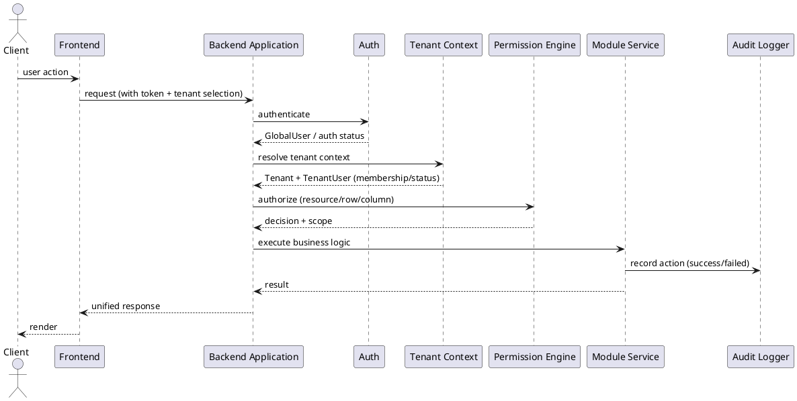

- 租户隔离的关键点在于：后端必须校验用户是否属于该租户且租户处于可用状态，并据此决定是否继续处理。
- 租户被停用（SUSPENDED）时：租户用户无法访问工作区，调度类 Flow 不再触发。

## 2.5 关键链路二：查询链路（表/数据集/图表/仪表盘共用）

**统一目标**：所有“读数据”的场景共享同一条查询链路：先做权限裁剪（资源/行/列），再把业务过滤转成统一 FilterDSL，并以统一顺序叠加到最终查询。

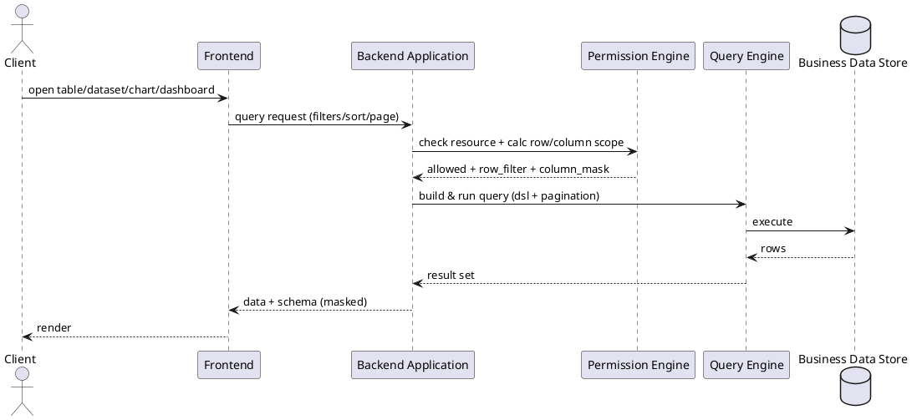

- 行/列权限需要在“表数据页、Flow 节点查询、Dataset/Chart 查询”等所有入口一致生效。
- Charts 与 Dashboards 属于报表资产化与复用体系的一部分：Chart 可被多个仪表盘复用，Dashboard 聚合多个图表实例。

## 2.6 关键链路三：执行链路（Flow 调度与运行）

**统一目标**：Flows 的“调度触发/手动触发”最终都会落到一次 Run（运行实例），Run 以节点为单位执行，写入内部表或对外写入。

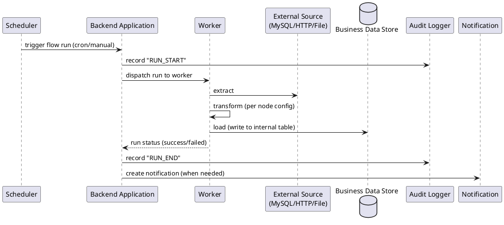

通知范围在 V1.0 限定为“任务流运行结果提醒”：手动触发完成（成功/失败）与调度触发失败；成功的调度运行通常不通知。

## 2.7 全局能力的产品约束对架构的影响

- 全局搜索：V1.0 不提供跨模块全局搜索，各模块仅在自身列表页提供搜索/筛选能力。
- 国际化：V1.0 不提供语言切换；时间/日期/数字格式可统一采用固定格式（如 `YYYY-MM-DD HH:mm:ss`）。

---

# 3 全局规范（只写规则）

## 3.1 多租户隔离规范（强制）

### 3.1.1 数据隔离原则

- 所有与业务数据相关的表（含元数据与实际数据表）必须包含 `tenant_id`。
- 所有查询/修改必须约束在当前租户：WHERE 条件必须包含 `tenant_id = 当前租户`。
- 禁止跨租户 JOIN 或写入（即使同库同实例）。

### 3.1.2 访问路径与成员校验

- 访问租户工作区时，必须同时校验：用户属于该租户（TenantUser 存在且 ACTIVE）+ 租户处于 ACTIVE 状态。

### 3.1.3 租户停用行为（SUSPENDED）

- 租户停用后：租户下所有用户无法访问工作区；调度型 Flow 不再触发新的 Run；重新启用后恢复。

## 3.2 角色与访问边界规范

- 平台维度存在 Platform Admin；租户维度存在 Owner / Data Engineer / Analyst / Viewer 等角色分工，实际权限以 Role 配置为准。
- 平台后台仅允许平台管理员访问，其身份由 GlobalUser 上的 `is_platform_admin` 标识决定。

## 3.3 API 响应与错误码规范（统一）

### 3.3.1 响应结构（成功/失败统一壳）

所有 API 统一返回结构（字段语义固定）：`success`、`code`、`message`、`data`、`trace_id`。

### 3.3.2 错误码命名规则

- 统一前缀：`ERR_` + 模块前缀 + 简要说明。
- 模块前缀建议集合：USER*/TENANT*/MODEL*/FLOW*/REPORT*/PERM*/LLM\_。

### 3.3.3 错误展示统一要求（面向用户）

- 权限相关错误需要给出明确可执行的提示（如联系租户管理员）。

## 3.4 FilterDSL（统一过滤 JSON）规范

### 3.4.1 目标约束

- 所有过滤条件在任何场景下必须转换为统一 JSON DSL，以实现语义一致、安全可控、可视化编辑与可扩展。

### 3.4.2 结构定义

- DSL 节点只有两类：Group（`{ op, conditions }`）与 Condition（`{ field, operator, value }`）；顶层可以是 Group 或单 Condition。

### 3.4.3 操作符集合与类型约束

- 操作符集合包含：比较、集合、范围、文本、空值判断等；前端必须根据字段类型限制可选 operator，避免生成不可执行 DSL。

### 3.4.4 动态变量（内置变量）

- DSL 支持内置变量：CURRENT_USER_ID / CURRENT_TENANT_ID / CURRENT_DATE / CURRENT_DATETIME，由后端解析。

### 3.4.5 版本与兼容性

- V1 允许未来增加 operator 或结构字段，但不得改变既有字段语义；如需多版本可在顶层增加 version 字段。

## 3.5 行级权限（RowPermission）规范

### 3.5.1 合并规则

- 同一（role, table）下允许 0~N 条规则，规则间以 OR 合并；若该角色未配置规则，视为不施加额外行级限制（前提是资源级 TABLE_DATA 允许）。
- 用户多角色合并：对各角色的 row_filter 再做 OR（行权限是“放开的合集”，不会因多角色被收窄）。

### 3.5.2 与业务过滤的叠加顺序（统一口径）

对任意查询统一顺序：Dataset.base_filter → 业务过滤（Chart/Flow 等配置）→ RowPermission；三者以 AND 组合，任何业务过滤不得绕过行级权限。

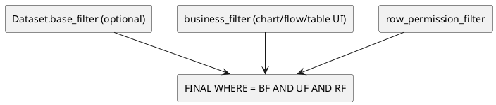

## 3.6 列级权限（ColumnPermission）规范

### 3.6.1 权限级别定义

列权限级别为：HIDDEN（不可见）、READONLY（可见不可改）、READWRITE（可见可改），并规定查询结果、表数据页、字段选择器等一致行为。

### 3.6.2 多角色合并规则

- 若所有角色均为 HIDDEN → 最终 HIDDEN；否则：任一 READWRITE 优先，其次 READONLY。

## 3.7 删除策略规范（如启用软删除）

- 若对某实体引入 `is_deleted` 实现逻辑删除，则必须在该实体对应章节明确说明删除语义为“软删除”，并保证前端不展示被软删除记录。

## 3.8 全局功能开关与统一格式

- 全局搜索：V1 不做。
- 通知：仅任务流运行结果相关。
- 国际化：V1 不提供语言切换；时间/日期格式可统一采用 `YYYY-MM-DD HH:mm:ss`。

# 第 4 章 多租户与认证体系

> 目标：定义“平台级账号（GlobalUser）—租户（Tenant）—租户成员（TenantUser）”三层身份体系、认证会话、平台后台访问控制、租户上下文装载与租户停用行为，保证：
> 1）平台后台仅 Platform Admin 可访问；2）租户工作区严格租户隔离；3）租户停用后前台不可访问且调度停止。

---

## 4.1 身份域与多租户边界

### 4.1.1 核心对象关系（概念级）

- **GlobalUser（平台用户）**：平台级账号，可加入多个租户；禁用后不可登录任何租户。
- **Tenant（租户）**：平台中的逻辑隔离单元，字段包含 `code/name/status/plan`；当 `SUSPENDED` 时前台不可访问且停止调度。
- **TenantUser（租户用户）**：GlobalUser 在某个租户内的成员关系；`(tenant_id,user_id)` 唯一，且每租户至少 1 个 `is_owner=true`。

### 4.1.2 平台后台与租户前台的访问边界

- 平台后台（`/admin/*`）仅 `is_platform_admin=true` 的 GlobalUser 可访问。
- 平台管理员默认仅查看租户**元信息**，不通过前台身份直接查看租户业务数据；如需运维排查须走专用接口并记录审计。

---

## 4.2 数据模型（表结构）

> 字段类型以 MySQL 为准（示例：`BIGINT/ VARCHAR / TINYINT / DATETIME / JSON`）。`created_at/updated_at` 统一由后端维护。

### 4.2.1 `global_user`（平台用户）

| 字段名            |         类型 | 是否可空 |            默认值 | 枚举/约束          | 说明                                   |
| ----------------- | -----------: | :------: | ----------------: | ------------------ | -------------------------------------- |
| id                |       BIGINT |    否    |                 — | PK                 | 主键                                   |
| login_name        |  VARCHAR(64) |    否    |                 — | 全局唯一；不可修改 | 登录名                                 |
| display_name      |  VARCHAR(64) |    否    |                 — | —                  | 显示名                                 |
| email             | VARCHAR(128) |    否    |                 — | 格式校验           | 邮箱                                   |
| password_hash     | VARCHAR(255) |    否    |                 — | —                  | 密码哈希（bcrypt/argon2）              |
| is_platform_admin |   TINYINT(1) |    否    |                 0 | 0/1                | 平台管理员标识                         |
| status            |  VARCHAR(16) |    否    |            ACTIVE | ACTIVE/DISABLED    | 禁用后无法登录任何租户                 |
| last_tenant_id    |       BIGINT |    是    |              NULL | FK→tenant.id       | 最近一次进入的租户（用于下次登录跳转） |
| last_login_at     |     DATETIME |    是    |              NULL | —                  | 最近一次登录时间                       |
| created_at        |     DATETIME |    否    | CURRENT_TIMESTAMP | —                  | 创建时间                               |
| updated_at        |     DATETIME |    否    | CURRENT_TIMESTAMP | —                  | 更新时间                               |

**索引**

- 唯一索引：`uk_global_user_login_name(login_name)`
- 唯一索引：`uk_global_user_email(email)`
- 普通索引：`idx_global_user_status(status)`（后台筛选）
- 普通索引：`idx_global_user_is_platform_admin(is_platform_admin)`（后台筛选）

---

### 4.2.2 `tenant`（租户）

| 字段名     |         类型 | 是否可空 |            默认值 | 枚举/约束            | 说明                          |
| ---------- | -----------: | :------: | ----------------: | -------------------- | ----------------------------- |
| id         |       BIGINT |    否    |                 — | PK                   | 主键                          |
| code       |  VARCHAR(64) |    否    |                 — | 全局唯一；不可修改   | 租户编码                      |
| name       | VARCHAR(128) |    否    |                 — | —                    | 租户名称（**允许编辑**）      |
| status     |  VARCHAR(16) |    否    |            ACTIVE | ACTIVE/SUSPENDED     | SUSPENDED：前台 403、调度停止 |
| plan       |  VARCHAR(16) |    否    |             BASIC | BASIC/PRO/ENTERPRISE | 套餐                          |
| created_at |     DATETIME |    否    | CURRENT_TIMESTAMP | —                    | 创建时间                      |
| updated_at |     DATETIME |    否    | CURRENT_TIMESTAMP | —                    | 更新时间                      |

**索引**

- 唯一索引：`uk_tenant_code(code)`
- 普通索引：`idx_tenant_status(status)`
- 普通索引：`idx_tenant_plan(plan)`
- 普通索引：`idx_tenant_name(name)`（模糊检索可配合前缀索引/全文索引视规模决定）

---

### 4.2.3 `tenant_user`（租户成员）

| 字段名     |        类型 | 是否可空 |            默认值 | 枚举/约束         | 说明                        |
| ---------- | ----------: | :------: | ----------------: | ----------------- | --------------------------- |
| id         |      BIGINT |    否    |                 — | PK                | 主键                        |
| tenant_id  |      BIGINT |    否    |                 — | FK→tenant.id      | 租户                        |
| user_id    |      BIGINT |    否    |                 — | FK→global_user.id | 平台用户                    |
| status     | VARCHAR(16) |    否    |            ACTIVE | ACTIVE/DISABLED   | 仅影响该租户内访问          |
| is_owner   |  TINYINT(1) |    否    |                 0 | 0/1               | 租户 Owner（至少存在 1 个） |
| last_login |    DATETIME |    是    |              NULL | —                 | 最近一次进入该租户时间      |
| created_at |    DATETIME |    否    | CURRENT_TIMESTAMP | —                 | 创建时间                    |
| updated_at |    DATETIME |    否    | CURRENT_TIMESTAMP | —                 | 更新时间                    |

**索引**

- 唯一索引：`uk_tenant_user(tenant_id, user_id)`
- 普通索引：`idx_tenant_user_tenant(tenant_id)`（租户成员列表）
- 普通索引：`idx_tenant_user_user(user_id)`（用户所属租户枚举）
- 普通索引：`idx_tenant_user_status(tenant_id, status)`（筛选）

---

### 4.2.4 `auth_session`（登录会话 / RefreshToken 存储）

> PRD 未限定 token/cookie 方案；为满足“退出登录”“多端会话管理”“禁用用户立即失效”等工程需求，本章给出可落地的 V1 会话表设计。

| 字段名             |         类型 | 是否可空 |            默认值 | 枚举/约束                 | 说明                   |
| ------------------ | -----------: | :------: | ----------------: | ------------------------- | ---------------------- |
| id                 |       BIGINT |    否    |                 — | PK                        | 主键                   |
| user_id            |       BIGINT |    否    |                 — | FK→global_user.id         | 账号                   |
| refresh_token_hash | VARCHAR(255) |    否    |                 — | 唯一（同一 token 不重复） | refresh token 哈希存储 |
| status             |  VARCHAR(16) |    否    |            ACTIVE | ACTIVE/REVOKED/EXPIRED    | 会话状态               |
| issued_at          |     DATETIME |    否    | CURRENT_TIMESTAMP | —                         | 签发时间               |
| expires_at         |     DATETIME |    否    |                 — | —                         | 过期时间               |
| revoked_at         |     DATETIME |    是    |              NULL | —                         | 撤销时间               |
| meta               |         JSON |    是    |              NULL | —                         | UA/IP/设备信息（可选） |

**`meta` JSON 结构定义**

| 字段       | 类型   | 必填 | 枚举/上限 | 示例           | 说明                 |
| ---------- | ------ | :--: | --------- | -------------- | -------------------- |
| user_agent | string |  否  | ≤512      | `"Chrome/..."` | 浏览器 UA            |
| ip         | string |  否  | ≤64       | `"1.2.3.4"`    | 登录 IP              |
| device_id  | string |  否  | ≤64       | `"web-xxx"`    | 客户端生成的设备标识 |

**索引**

- 唯一索引：`uk_auth_session_refresh_hash(refresh_token_hash)`
- 普通索引：`idx_auth_session_user(user_id, status)`
- 普通索引：`idx_auth_session_expires(expires_at)`

---

## 4.3 认证与会话（Auth）

### 4.3.1 认证形态

- **Access Token（JWT）**：短期有效（例如 15 分钟），用于鉴权与携带 `user_id/is_platform_admin` 等声明。
- **Refresh Token**：长期有效（例如 7–30 天），服务端落库 `auth_session`，用于换发 access token 与“退出登录/禁用即失效”。

> `/api/me` 用于登录后获取当前用户信息，并包含 `is_platform_admin` 用于是否展示平台后台入口。

---

## 4.4 租户上下文（TenantContext）与停用行为

### 4.4.1 租户上下文装载规则

- 前端路由中存在 `tenantId`（租户切换时 URL 更新）。
- 后端对“租户域接口”统一要求携带 `X-Tenant-Id`（由前端用路由参数注入）；服务端中间件执行：

  1. 解析 `X-Tenant-Id`
  2. 校验 Tenant 存在
  3. 校验 Tenant 状态为 ACTIVE（否则 403）
  4. 校验 TenantUser 存在且为 ACTIVE（否则 403）
  5. 将 `tenant/tenant_user` 挂载到 RequestContext，供后续权限与数据访问使用

### 4.4.2 租户切换与“最近租户”记忆

- 若用户仅属于一个租户：登录后直接进入该租户工作区。
- 若属于多个租户：首次登录展示租户选择或顶部下拉；下拉仅展示状态为 ACTIVE 的租户并支持搜索。
- 系统需记住最近一次进入的租户，用于下次登录直接跳转。

落地规则：当发生以下任一事件，更新 `global_user.last_tenant_id`：

- 调用 `POST /api/tenants/switch` 成功；
- 任意一次租户域请求通过 TenantContext 校验（以请求头的 `X-Tenant-Id` 为准）；

### 4.4.3 访问被停用租户

- 当用户尝试进入 `SUSPENDED` 租户：后端返回 403；前端展示“租户已停用”提示页且不展示业务菜单。
- 当租户状态从 ACTIVE → SUSPENDED：该租户下 CRON 调度的 Flow 不再触发新的 Run；在运行中的 Flow 可自然结束（是否强杀由运维策略决定）。

---

## 4.5 关键链路图（PlantUML）

### 4.5.1 租户域 API 请求链路（带 TenantContext）

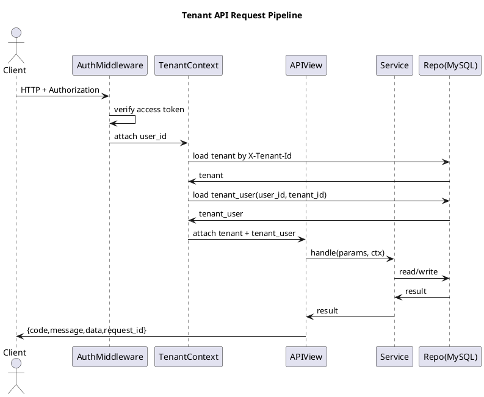

### 4.5.2 平台后台（/admin/\*）请求链路（AdminGuard）

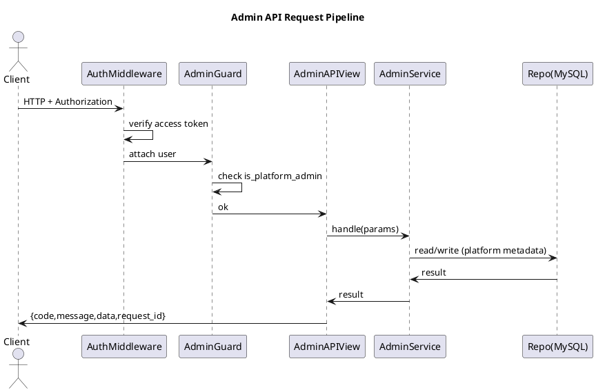

### 4.5.3 登录后租户跳转（单租户 / 多租户 / 最近租户）

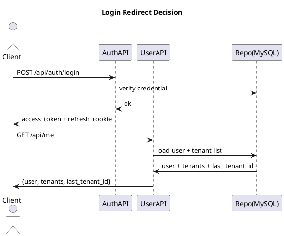

### 4.5.4 顶部租户切换（只展示 ACTIVE）

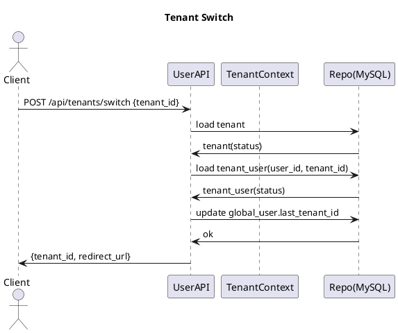

---

## 4.6 接口清单（本章范围）

> 说明：
>
> - **租户域接口**统一要求：登录态 + `X-Tenant-Id`（除非接口本身是全局接口）。
> - **平台后台接口**统一要求：登录态 + `is_platform_admin=true`，且路径位于 `/admin/*`（页面与接口）。

### 4.6.1 全局认证与用户态

1. `POST /api/auth/login`（登录）
2. `POST /api/auth/logout`（退出登录）
3. `POST /api/auth/refresh`（换发 access token）
4. `GET /api/me`（获取当前用户信息、可访问租户列表、is_platform_admin）

### 4.6.2 租户选择与切换（Tenant Workspace Shell）

5. `POST /api/tenants/switch`（切换租户并记录最近租户）
6. `GET /api/tenants`（列出当前用户可访问的 ACTIVE 租户，用于下拉与搜索）

### 4.6.3 平台后台（Platform Admin）接口组（必须单独成组）

> 平台后台能力：GlobalUser 管理、Tenant 管理、TenantUser 管理。
> **补齐项（必须实现）**：编辑租户时允许修改租户名称（`name`），不得遗漏。

7. `GET /admin/api/users`（GlobalUser 列表：搜索/筛选）

8. `POST /admin/api/users`（创建 GlobalUser：含初始密码策略）

9. `PATCH /admin/api/users/{id}`（编辑 GlobalUser：显示名/邮箱/is_platform_admin/status）

10. `POST /admin/api/users/{id}/enable`（启用）

11. `POST /admin/api/users/{id}/disable`（禁用）

12. `POST /admin/api/users/{id}/reset_password`（可选：重置密码）

13. `GET /admin/api/tenants`（Tenant 列表：搜索/筛选）

14. `POST /admin/api/tenants`（创建 Tenant：code/name/plan/status）

15. `PATCH /admin/api/tenants/{id}`（编辑 Tenant：**name/plan/status**；code 不可改）

16. `POST /admin/api/tenants/{id}/enable`（启用）

17. `POST /admin/api/tenants/{id}/suspend`（停用）

18. `GET /admin/api/tenants/{tenantId}/users`（租户成员列表）

19. `POST /admin/api/tenants/{tenantId}/users`（添加成员：从 GlobalUser 搜索添加，可批量，可设 Owner，可选初始角色）

20. `PATCH /admin/api/tenants/{tenantId}/users/{tenantUserId}`（修改成员：状态/Owner/角色）

21. `DELETE /admin/api/tenants/{tenantId}/users/{tenantUserId}`（移除成员：删除 TenantUser）

---

## 4.7 接口实现规范（逐接口：入参/出参/校验/错误码/伪代码）

> 统一响应封装（本章落地约定）：
>
> - 成功：`{ code: "OK", message: "OK", data: <object>, request_id: <string> }`
> - 失败：`{ code: <string>, message: <string>, data: null, request_id: <string>, details?: <object> }`

---

### 4.7.1 `POST /api/auth/login`

**请求 Body**

| 字段       | 类型   | 必填 | 约束  | 说明                      |
| ---------- | ------ | :--: | ----- | ------------------------- |
| login_name | string |  是  | 1–64  | 登录名                    |
| password   | string |  是  | 8–128 | 明文密码（仅 HTTPS 传输） |

**响应 data**

| 字段         | 类型   | 必填 | 说明                                                       |
| ------------ | ------ | :--: | ---------------------------------------------------------- |
| access_token | string |  是  | JWT                                                        |
| expires_in   | int    |  是  | 秒                                                         |
| user         | object |  是  | `{id, login_name, display_name, email, is_platform_admin}` |

**校验与异常分支**

- `login_name` 不存在 → 登录失败（不暴露是否存在，统一提示）。
- GlobalUser.status=DISABLED → 拒绝登录。
- 密码不匹配 → 登录失败。
- 登录成功 → 写入 `global_user.last_login_at`；创建 `auth_session`；下发 refresh cookie（HttpOnly）。

**错误码**

- `AUTH_INVALID_CREDENTIALS`（401）
- `AUTH_USER_DISABLED`（403）
- `AUTH_TOO_MANY_ATTEMPTS`（429）
- `VALIDATION_REQUIRED`（400）
- `VALIDATION_FORMAT`（400）
- `SECURITY_TLS_REQUIRED`（400）
- `SESSION_CREATE_FAILED`（500）
- `INTERNAL_ERROR`（500）

**伪代码（Service/Repo 可映射）**

```text
AuthService.login(login_name, password, request_meta):
  user = GlobalUserRepo.find_by_login_name(login_name)
  if user is None: return error(AUTH_INVALID_CREDENTIALS, 401)
  if user.status != "ACTIVE": return error(AUTH_USER_DISABLED, 403)
  if not PasswordHasher.verify(password, user.password_hash):
      RateLimit.bump(login_name, ip)
      return error(AUTH_INVALID_CREDENTIALS, 401)

  access = Jwt.issue({user_id:user.id, is_platform_admin:user.is_platform_admin}, ttl=900)
  refresh = Token.random()
  AuthSessionRepo.create(user_id=user.id, refresh_hash=hash(refresh), meta=request_meta, expires_at=now+30d)

  GlobalUserRepo.update_last_login(user.id, now)
  return ok({access_token:access, expires_in:900, user:PublicUser(user)}, set_cookie_refresh=refresh)
```

---

### 4.7.2 `GET /api/me`

> 登录后前端通过 `/api/me` 获取当前用户信息，并包含 `is_platform_admin` 用于平台后台入口控制。

**请求 Header**

- `Authorization: Bearer <access_token>`

**响应 data**

| 字段    | 类型   | 必填 | 说明                                                                               |
| ------- | ------ | :--: | ---------------------------------------------------------------------------------- |
| user    | object |  是  | `{id, login_name, display_name, email, is_platform_admin, status, last_tenant_id}` |
| tenants | array  |  是  | 用户可访问租户列表（仅 ACTIVE）                                                    |

`tenants[]` 结构：

| 字段      | 类型   | 必填 | 说明                 |
| --------- | ------ | :--: | -------------------- |
| tenant_id | number |  是  | 租户 ID              |
| code      | string |  是  | 租户编码             |
| name      | string |  是  | 租户名称             |
| plan      | string |  是  | BASIC/PRO/ENTERPRISE |

**校验与异常分支**

- token 无效/过期 → 401
- GlobalUser 被禁用 → 403（并可主动撤销其所有会话）
- 返回的 tenants 必须过滤 `tenant.status=ACTIVE`

**错误码**

- `AUTH_UNAUTHORIZED`（401）
- `AUTH_TOKEN_EXPIRED`（401）
- `AUTH_USER_DISABLED`（403）
- `DATA_INTEGRITY_ERROR`（500）
- `RATE_LIMITED`（429）
- `VALIDATION_HEADER_MISSING`（400）
- `INTERNAL_ERROR`（500）
- `SERVICE_UNAVAILABLE`（503）

**伪代码**

```text
UserService.me(user_id):
  user = GlobalUserRepo.get(user_id)
  if user.status != "ACTIVE": return error(AUTH_USER_DISABLED, 403)

  tenant_users = TenantUserRepo.list_by_user(user_id, status="ACTIVE")
  tenant_ids = [tu.tenant_id for tu in tenant_users]
  tenants = TenantRepo.list_by_ids(tenant_ids, status="ACTIVE")  # 只返回 ACTIVE
  return ok({user:PublicUser(user), tenants:MapTenants(tenants), last_tenant_id:user.last_tenant_id})
```

---

### 4.7.3 `POST /api/tenants/switch`

> 切换后 URL 中 `tenantId` 更新并跳转工作区首页；系统需记住最近一次进入的租户。

**请求 Body**

| 字段      | 类型   | 必填 | 约束 | 说明     |
| --------- | ------ | :--: | ---- | -------- |
| tenant_id | number |  是  | >0   | 目标租户 |

**响应 data**

| 字段         | 类型   | 必填 | 说明                                           |
| ------------ | ------ | :--: | ---------------------------------------------- |
| tenant_id    | number |  是  | 切换成功的租户                                 |
| redirect_url | string |  是  | 前端跳转地址（例如 `/t/{tenant_id}/modeling`） |

**校验与异常分支**

- tenant 不存在 → 404
- tenant.status=SUSPENDED → 403（前端展示“租户已停用”页）
- TenantUser 不存在/被禁用 → 403
- 切换成功 → 更新 `global_user.last_tenant_id`

**错误码**

- `AUTH_UNAUTHORIZED`（401）
- `TENANT_NOT_FOUND`（404）
- `TENANT_SUSPENDED`（403）
- `TENANT_ACCESS_DENIED`（403）
- `TENANT_USER_DISABLED`（403）
- `VALIDATION_REQUIRED`（400）
- `CONFLICT_STATE_CHANGED`（409）
- `INTERNAL_ERROR`（500）

**伪代码**

```text
TenantService.switch_tenant(user_id, tenant_id):
  tenant = TenantRepo.get(tenant_id)
  if tenant is None: return error(TENANT_NOT_FOUND, 404)
  if tenant.status != "ACTIVE": return error(TENANT_SUSPENDED, 403)

  tu = TenantUserRepo.get_by_unique(tenant_id, user_id)
  if tu is None: return error(TENANT_ACCESS_DENIED, 403)
  if tu.status != "ACTIVE": return error(TENANT_USER_DISABLED, 403)

  GlobalUserRepo.update_last_tenant(user_id, tenant_id)
  return ok({tenant_id:tenant_id, redirect_url: "/t/"+tenant_id+"/modeling"})
```

---

## 4.8 平台后台（Platform Admin）接口组（逐接口）

> 平台后台仅 `is_platform_admin=true` 可访问；未登录 401，非平台管理员 403。

> 注意：平台后台“编辑租户”必须支持修改租户名称（`name`），租户编码（`code`）不可修改。

以下接口均要求：

- Header：`Authorization: Bearer <access_token>`
- 路径前缀：`/admin/api/*`

---

### 4.8.1 `GET /admin/api/users`（GlobalUser 列表）

**Query 参数**

| 参数              | 类型   | 必填 | 约束            | 说明                                      |
| ----------------- | ------ | :--: | --------------- | ----------------------------------------- |
| q                 | string |  否  | ≤128            | 按 login_name/display_name/email 模糊查询 |
| status            | string |  否  | ACTIVE/DISABLED | 状态筛选                                  |
| is_platform_admin | bool   |  否  | true/false      | 管理员筛选                                |
| page              | int    |  否  | ≥1              | 分页                                      |
| page_size         | int    |  否  | 1–200           | 分页                                      |

**响应 data**

| 字段  | 类型  | 必填 | 说明     |
| ----- | ----- | :--: | -------- |
| total | int   |  是  | 总数     |
| items | array |  是  | 用户列表 |

`items[]` 字段（与后台展示一致）

**错误码**

- `AUTH_UNAUTHORIZED`（401）
- `ADMIN_FORBIDDEN`（403）
- `VALIDATION_PAGINATION`（400）
- `VALIDATION_FORMAT`（400）
- `RATE_LIMITED`（429）
- `DB_QUERY_TIMEOUT`（504）
- `INTERNAL_ERROR`（500）
- `SERVICE_UNAVAILABLE`（503）

**伪代码**

```text
AdminUserService.list(q, status, is_platform_admin, page, page_size):
  AdminGuard.require_platform_admin()
  return GlobalUserRepo.search(q, status, is_platform_admin, page, page_size)
```

---

### 4.8.2 `POST /admin/api/tenants`（创建租户）

**请求 Body**（来自 PRD 表单字段）

| 字段                   | 类型          | 必填 | 枚举/约束            | 说明                                 |
| ---------------------- | ------------- | :--: | -------------------- | ------------------------------------ |
| code                   | string        |  是  | 全局唯一；1–64       | 租户编码                             |
| name                   | string        |  是  | 1–128                | 租户名称                             |
| plan                   | string        |  是  | BASIC/PRO/ENTERPRISE | 套餐                                 |
| status                 | string        |  否  | ACTIVE/SUSPENDED     | 默认 ACTIVE                          |
| initial_owner_user_ids | array<number> |  是  | 至少 1 个            | 用于满足“每租户至少一个 Owner”的约束 |

**响应 data**

| 字段      | 类型   | 必填 | 说明      |
| --------- | ------ | :--: | --------- |
| tenant_id | number |  是  | 新租户 ID |

**校验与异常分支**

- code 重复 → 409
- initial_owner_user_ids 中存在不存在/禁用 GlobalUser → 400/403
- 创建 Tenant 成功后必须在同一事务内写入对应 TenantUser（is_owner=1）

**错误码**

- `AUTH_UNAUTHORIZED`（401）
- `ADMIN_FORBIDDEN`（403）
- `TENANT_CODE_DUPLICATE`（409）
- `VALIDATION_REQUIRED`（400）
- `VALIDATION_ENUM`（400）
- `OWNER_REQUIRED`（400）
- `USER_NOT_FOUND`（400）
- `INTERNAL_ERROR`（500）

**伪代码（含事务）**

```text
AdminTenantService.create(payload):
  AdminGuard.require_platform_admin()

  validate code unique
  validate plan/status enum
  validate initial_owner_user_ids non-empty

  tx.begin()
    tenant_id = TenantRepo.insert(code,name,plan,status)
    for uid in initial_owner_user_ids:
        u = GlobalUserRepo.get(uid)
        if u is None: tx.rollback(); return error(USER_NOT_FOUND, 400)
        if u.status != "ACTIVE": tx.rollback(); return error(AUTH_USER_DISABLED, 403)
        TenantUserRepo.insert(tenant_id, uid, status="ACTIVE", is_owner=1)
  tx.commit()
  return ok({tenant_id:tenant_id})
```

---

### 4.8.3 `PATCH /admin/api/tenants/{id}`（编辑租户：必须支持改名称）

> 编辑 Tenant：`code` 不可修改；可修改 `name/plan/status`。

**请求 Path**

- `id`: tenant id

**请求 Body**

| 字段   | 类型   | 必填 | 枚举/约束            | 说明                     |
| ------ | ------ | :--: | -------------------- | ------------------------ |
| name   | string |  否  | 1–128                | 租户名称（**补齐必做**） |
| plan   | string |  否  | BASIC/PRO/ENTERPRISE | 套餐                     |
| status | string |  否  | ACTIVE/SUSPENDED     | 状态                     |

**状态变更语义**

- `SUSPENDED`：该租户所有 TenantUser 前台访问 403，Flow 调度停止触发新的 Run。
- `ACTIVE`：恢复访问与调度。

**错误码**

- `AUTH_UNAUTHORIZED`（401）
- `ADMIN_FORBIDDEN`（403）
- `TENANT_NOT_FOUND`（404）
- `VALIDATION_ENUM`（400）
- `VALIDATION_FORMAT`（400）
- `CONFLICT_NO_OWNER`（409）（若后续实现要求启用前必须存在 Owner）
- `SCHEDULER_UPDATE_FAILED`（500）
- `INTERNAL_ERROR`（500）

**伪代码**

```text
AdminTenantService.update(tenant_id, patch):
  AdminGuard.require_platform_admin()
  tenant = TenantRepo.get(tenant_id)
  if tenant is None: return error(TENANT_NOT_FOUND, 404)

  if "name" in patch: validate len/name
  if "plan" in patch: validate enum
  if "status" in patch: validate enum

  tx.begin()
    TenantRepo.update_fields(tenant_id, patch)
    if patch.status changed to "SUSPENDED":
        SchedulerService.pause_all_cron_flows(tenant_id)   # 仅停止触发，不强杀运行中实例
    if patch.status changed to "ACTIVE":
        SchedulerService.resume_all_cron_flows(tenant_id)
  tx.commit()
  return ok({})
```

---

### 4.8.4 `POST /admin/api/tenants/{tenantId}/users`（添加成员，支持批量）

> 添加成员：从 GlobalUser 搜索添加，可批量；可选设 Owner；可选初始角色；平台后台不提供注册新用户流程。

**请求 Body**

| 字段             | 类型          | 必填 | 约束  | 说明                             |
| ---------------- | ------------- | :--: | ----- | -------------------------------- |
| user_ids         | array<number> |  是  | 1–200 | GlobalUser.id 列表               |
| set_owner        | bool          |  否  | —     | 是否将新增成员设为 Owner         |
| initial_role_ids | array<number> |  否  | —     | 初始角色（角色表详见权限体系章） |

**响应 data**

| 字段    | 类型  | 必填 | 说明                              |
| ------- | ----- | :--: | --------------------------------- |
| created | int   |  是  | 创建数量                          |
| skipped | int   |  是  | 已存在跳过数量                    |
| items   | array |  是  | 创建结果明细（含 tenant_user_id） |

**校验与异常分支**

- tenant 不存在 → 404
- tenant.status=SUSPENDED 时是否允许“后台加人”：允许（平台操作不受前台限制），但新增成员仍需满足约束
- user_ids 任一不存在 → 400
- `(tenant_id,user_id)` 已存在 → 跳过或 409（建议返回明细）
- 若设置/取消 Owner 导致租户无 Owner → 阻止并提示

**错误码**

- `AUTH_UNAUTHORIZED`（401）
- `ADMIN_FORBIDDEN`（403）
- `TENANT_NOT_FOUND`（404）
- `USER_NOT_FOUND`（400）
- `CONFLICT_MEMBER_EXISTS`（409）
- `CONFLICT_NO_OWNER`（409）
- `VALIDATION_LIMIT_EXCEEDED`（400）
- `INTERNAL_ERROR`（500）

**伪代码（含事务与批量）**

```text
AdminTenantUserService.add_members(tenant_id, user_ids, set_owner, role_ids):
  AdminGuard.require_platform_admin()
  if TenantRepo.get(tenant_id) is None: return error(TENANT_NOT_FOUND, 404)

  tx.begin()
    results = []
    for uid in user_ids:
      if GlobalUserRepo.get(uid) is None:
         tx.rollback(); return error(USER_NOT_FOUND, 400)
      if TenantUserRepo.exists(tenant_id, uid):
         results.append({uid, status:"SKIPPED_EXISTS"})
         continue
      tu_id = TenantUserRepo.insert(tenant_id, uid, status="ACTIVE", is_owner=set_owner?1:0)
      if role_ids not empty: TenantUserRoleRepo.batch_insert(tu_id, role_ids)
      results.append({uid, tenant_user_id:tu_id, status:"CREATED"})
    ensure_owner_invariant(tenant_id)  # 至少 1 个 owner，否则 rollback
  tx.commit()
  return ok(summary(results))
```

# 5 权限体系

## 5.0 章节定位与阅读顺序

本章定义租户侧权限体系的**完整模型与授权规则**，包括：

- 资源级权限（RolePermission）：对表/Flow/Dataset/Dashboard 的查看、编辑与管理授权；
- 行级权限（RowPermission）：基于统一 FilterDSL 的行过滤规则；
- 列级权限（ColumnPermission）：字段隐藏/只读/可写；
- 授权载体（ResourceTree 授权）：目录默认权限、继承、覆盖、多角色合并；
- 权限引擎（PermissionEngine）：输入、输出、算法与伪代码；
- Settings 权限配置相关接口：角色、成员角色、资源权限、行/列权限。

资源树“目录结构维护（CRUD/move/path）”、查询引擎（QueryBuilder/Runner）、通知、LLM 辅助等**通用能力的实现细节**在第 6 章；本章仅定义这些能力所需的**权限判定口径与授权规则**。

---

## 5.1 目标与范围

### 5.1.1 目标

- 在同一租户内，支持按角色对不同资源（表/Flow/Dataset/Dashboard）授予 `NONE/VIEW/EDIT/MANAGE` 等级权限。
- 支持在同一张表上，按角色配置：
  - 行级访问边界（RowPermission，FilterDSL）；
  - 列级可见与可写边界（ColumnPermission）。
- 支持目录（Folder）作为授权载体：
  - Folder 节点可配置默认权限；
  - 子资源节点未显式配置时，继承最近祖先 Folder 默认权限；
  - 显式配置覆盖继承；
  - 单角色内“向上回溯取最大”，多角色间“再取最大”。
- 在数据查询链路中，保证“业务过滤不能绕过行权限”，并支持 `TABLE_DATA=MANAGE` 绕过行权限（本期默认策略）。
- 变更可追溯：权限相关变更必须落审计（审计详情见第 10 章，本章定义对接点与字段要求）。

### 5.1.2 非目标

- 跨租户共享数据/跨租户授权（本期不做）。
- “管理员也受行权限限制”的细粒度开关（预留为后续版本）。

---

## 5.2 权限对象与关系

### 5.2.1 权限对象

- **TenantUser**：租户成员（身份与租户上下文见第 4 章）。
- **Role**：租户内角色（可内置、可自定义）。
- **RolePermission**：资源级授权记录（绑定到资源树节点）。
- **RowPermission**：行权限规则（绑定到表）。
- **ColumnPermission**：列权限规则（绑定到表字段）。
- **ResourceTreeNode**：授权载体与资源组织节点（目录/资源节点），结构维护见第 6 章。

### 5.2.2 PlantUML：权限域对象关系图

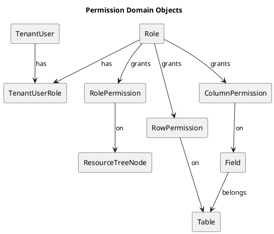

---

## 5.3 权限等级与资源类型

### 5.3.1 资源类型（resource_type）

资源级权限覆盖以下类型（与产品范围保持一致）：

- `TABLE_SCHEMA`：表结构（字段新增/修改/删除、关系配置等“建模结构”类能力）；
- `TABLE_DATA`：表数据（增删改查记录、导入、数据预览等“数据访问”类能力）；
- `FLOW`：任务流；
- `DATASET`：数据集；
- `DASHBOARD`：仪表盘。

> 说明：`TABLE_SCHEMA` 与 `TABLE_DATA` 是同一张表的“双权限项”，规则见 5.6。

### 5.3.2 权限等级（permission）

- `NONE`：无权限；
- `VIEW`：仅查看；
- `EDIT`：允许编辑内容，但不包含删除、移动、配置权限等管理类操作；
- `MANAGE`：管理权限（删除、移动、配置权限、Owner 转移等）。

### 5.3.3 等级比较规则

- 等级顺序：`NONE < VIEW < EDIT < MANAGE`
- “取最大值”指按该顺序比较后的最大等级。

---

## 5.4 授权载体：资源树授权与继承合并

### 5.4.1 授权载体定义

- 资源通过 **ResourceTreeNode** 组织成树（按 scope 分不同资源树）。
- **Folder 节点**（`node_type=FOLDER`）：
  - 仅组织层级；
  - 可作为授权载体设置默认权限（RolePermission 指向该节点）。
- **资源节点**（`node_type=RESOURCE`）：
  - 代表某个具体资源（表、Flow、Dataset、Dashboard）；
  - 可显式设置权限（RolePermission 指向该节点）。

### 5.4.2 scope 与 resource_type 映射（授权口径）

| scope（资源树范围） | 资源节点 ref_type | 对应 resource_type                             |
| ------------------- | ----------------- | ---------------------------------------------- |
| TABLE               | TABLE             | `TABLE_SCHEMA` 与 `TABLE_DATA`（同表双权限项） |
| FLOW                | FLOW              | `FLOW`                                         |
| DATASET             | DATASET           | `DATASET`                                      |
| DASHBOARD           | DASHBOARD         | `DASHBOARD`                                    |

> 表资源节点在授权时必须同时处理 `TABLE_SCHEMA` 与 `TABLE_DATA` 两类权限项（见 5.6）。

### 5.4.3 Folder 默认权限与继承覆盖

- Folder 节点允许配置“默认权限”；
- 对于该 Folder 下**未单独配置**权限的子资源节点：使用最近祖先 Folder 的默认权限；
- 一旦在资源节点上**显式配置**权限：以资源节点配置为准，覆盖 Folder 默认值。

### 5.4.4 单角色权限计算（向上回溯取最大）

对某角色 role 在资源节点 R 上的资源级权限：

1. 从资源节点 R 开始，向上回溯祖先链，直到根 Folder；
2. 收集该角色在沿途节点上的权限设置（RolePermission 记录）；
3. 取其中最大权限等级，得到 `perm(role, R)`。

### 5.4.5 多角色合并（用户最终资源权限）

对某用户 U（拥有多个角色）与资源节点 R：

- `perm(U, R) = max(perm(role1, R), perm(role2, R), ...)`

### 5.4.6 PlantUML：资源权限计算（继承 + 多角色合并）

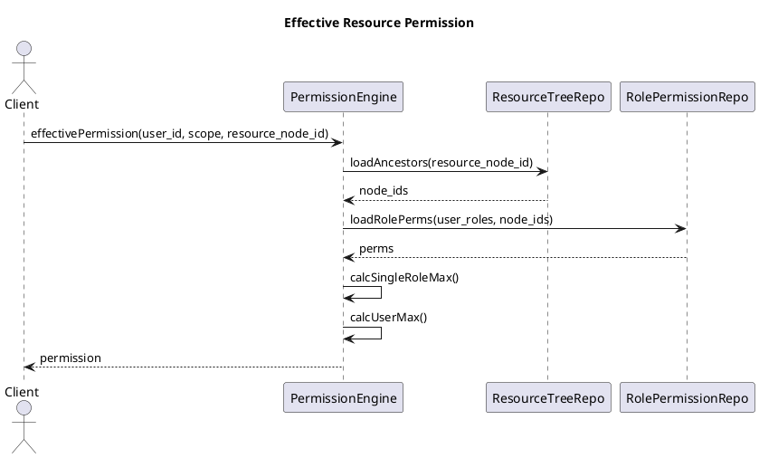

---

## 5.5 资源级权限（RolePermission）

### 5.5.1 RolePermission 的含义

RolePermission 表示：

> “某角色在某个资源树节点上的权限等级”。

节点可以是 Folder（默认权限）或资源节点（显式权限）。

### 5.5.2 覆盖规则总结（必须实现）

- 显式节点权限覆盖继承的 Folder 默认权限；
- 单角色在多处配置时取最大；
- 多角色合并再取最大；
- 若最终为 `NONE`，视为不可见且不可访问。

### 5.5.3 资源可见性与按钮可用性

- **可见性**：
  - `perm(U,R) == NONE`：资源在列表与树中不可见（后端必须过滤）；
  - `perm(U,R) >= VIEW`：可见。
- **按钮/操作**（后端必须强校验，前端仅作为提示）：
  - 查看详情：`>= VIEW`
  - 编辑：`>= EDIT`
  - 删除/移动/配置权限：`>= MANAGE`

---

## 5.6 表的“双权限项”约定（TABLE_SCHEMA / TABLE_DATA）

### 5.6.1 为什么需要双权限项

对表的访问分为两类：

- **结构类**：新增字段、修改字段、关系管理等（建模结构）；
- **数据类**：行数据的查询、导入、增删改等（数据访问）。

两者需要独立授权，因此表资源节点在 RolePermission 中必须支持：

- `resource_type=TABLE_SCHEMA`
- `resource_type=TABLE_DATA`

### 5.6.2 双权限项的授权与计算

- 表资源节点在加载权限时，对同一 `resource_tree_node_id` 必须分别计算：
  - `perm_schema(U, table_node)`
  - `perm_data(U, table_node)`
- Folder 默认权限若应用于表，必须对两项分别继承与合并（允许只配其一或两项均配）。

### 5.6.3 表操作与权限映射（后端强校验口径）

| 操作                                       | 需要权限                                             |
| ------------------------------------------ | ---------------------------------------------------- |
| 表结构新增/改名/删字段、关系维护           | `TABLE_SCHEMA >= EDIT`（管理类变更要求 `>= MANAGE`） |
| 表数据查询（预览、Dataset 读取、报表查询） | `TABLE_DATA >= VIEW`                                 |
| 表数据写入（增删改、导入）                 | `TABLE_DATA >= EDIT`                                 |
| 配置表的行/列权限                          | `TABLE_DATA >= MANAGE`（本期默认）                   |

---

## 5.7 行级权限（RowPermission）

### 5.7.1 定义与目标

RowPermission 用于控制：

> 在同一张表中，不同角色可访问哪些行数据。

RowPermission 基于统一 FilterDSL（见第 6 章 QueryEngine 的 DSL 编译约束），并与业务过滤叠加。

### 5.7.2 叠加规则（必须实现）

三类过滤按 **AND** 组合：

- `base_filter`：资产（如 Dataset）定义的基础过滤；
- `business_filter`：业务侧页面筛选（用户当次输入）；
- `row_permission_filter`：行权限过滤。

总 WHERE：

`WHERE = base_filter AND business_filter AND row_permission_filter`

约束：

- 业务过滤不得绕过行权限；
- 行权限只会收紧结果集，不会扩大结果集。

### 5.7.3 MANAGE 绕过策略（本期默认）

若用户对某表的 `TABLE_DATA` 有任一角色获得 `MANAGE`：

- 本期默认策略：该用户对该表**不受行权限限制**（row_permission_filter 绕过）。

### 5.7.4 多角色行权限合并策略（强约束）

同一用户多个角色对同一表存在多条 RowPermission 时：

- 合并为 `OR`（扩大可见行的集合），再与业务过滤 `AND`：
  - `row_permission_filter = (rp_role1) OR (rp_role2) OR ...`
- 若某角色未配置 RowPermission，则该角色对该表的行权限视为“无可见行”（即该角色不贡献可见集合）。
- 若触发 MANAGE 绕过，则 `row_permission_filter = TRUE`。

### 5.7.5 PlantUML：查询 WHERE 组合（含绕过）

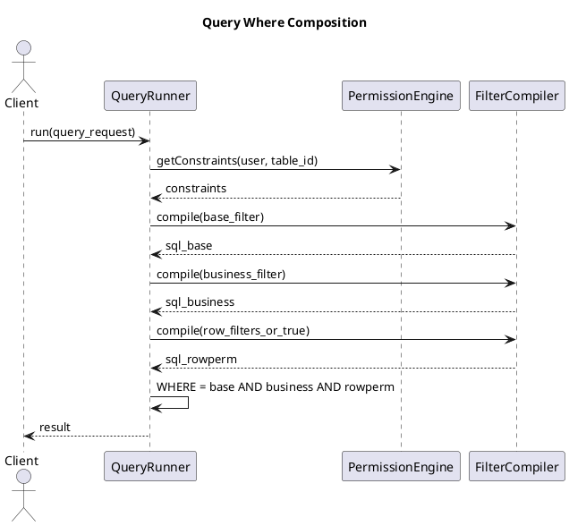

---

## 5.8 列级权限（ColumnPermission）

### 5.8.1 权限等级与行为

列权限用于控制字段的可见与可写性：

- `HIDDEN`：不可见（后端不得返回该字段；查询 SQL 中不得选择该列；写入时不得接受该字段）；
- `READONLY`：可见但不可写（写入时拒绝该字段）；
- `READWRITE`：可见且可写（仍需受 `TABLE_DATA` 权限约束）。

### 5.8.2 多角色列权限合并策略（强约束）

对同一字段 field：

1. 若任一角色为 `HIDDEN` → 最终为 `HIDDEN`；
2. 否则若任一角色为 `READWRITE` → 最终为 `READWRITE`；
3. 否则若任一角色为 `READONLY` → 最终为 `READONLY`；
4. 若没有任何配置 → 使用系统默认（建议 `READWRITE`）。

### 5.8.3 列权限与 TABLE_DATA 的约束关系

- 最终列权限仍受资源级 `TABLE_DATA` 控制：
  - 若 `perm_data(U, table) < EDIT`：
    - 即使某字段列权限为 `READWRITE`，也不允许写入；
  - 若 `perm_data(U, table) < VIEW`：
    - 不允许查询该表（优先按资源级拒绝）。

---

## 5.9 权限引擎（PermissionEngine）

### 5.9.1 输入与输出契约

输入：

- `tenant_id`
- `tenant_user_id`
- `roles[]`（通过 TenantUserRole 加载）
- `scope` / `resource_tree_node_id` / `table_id` 等

输出（最小集合）：

- `perm_schema` / `perm_data`（表双权限项）
- `bypass_row_permission: bool`
- `row_permission_filters[]`
- `allowed_columns[]`（HIDDEN 已剔除；附带 readonly 标记）
- `writable_columns[]`

### 5.9.2 缓存与失效（本期最小实现）

- 本期允许无缓存（直接读库），但必须保证性能：
  - RolePermission/RowPermission/ColumnPermission 加载必须按索引走；
- 若引入缓存（可选）：
  - key 至少包含 `(tenant_id, tenant_user_id, scope)`；
  - 权限变更必须触发失效（见 5.13 对接）。

### 5.9.3 伪代码（可映射到 Service/Repo）

```text
function getTableConstraints(tenant_id, tenant_user_id, table_node_id, table_id):
  roles = RoleRepo.listRolesOfUser(tenant_id, tenant_user_id)

  perm_data = calcEffectiveResourcePerm(roles, table_node_id, "TABLE_DATA")
  perm_schema = calcEffectiveResourcePerm(roles, table_node_id, "TABLE_SCHEMA")

  if perm_data == NONE:
    return error PERMISSION_DENIED

  bypass_row = (perm_data == MANAGE)

  row_filters = []
  if not bypass_row:
    for role in roles:
      dsl = RowPermissionRepo.getByRoleAndTable(tenant_id, role.id, table_id)
      if dsl exists and dsl.status == ACTIVE:
        row_filters.append(dsl.filter_dsl)

  fields = FieldRepo.listByTable(tenant_id, table_id)
  col_map = ColumnPermissionRepo.listByRolesAndTable(tenant_id, roles, table_id)

  allowed = []
  writable = []
  for f in fields:
    level = mergeColumnLevelAcrossRoles(roles, col_map, f.id)
    if level == HIDDEN:
      continue
    readonly = (level == READONLY) or (perm_data < EDIT)
    allowed.append({field_id:f.id, code:f.code, readonly:readonly})
    if not readonly:
      writable.append(f.code)

  return {
    perm_data, perm_schema,
    bypass_row,
    row_filters,
    allowed_columns: allowed,
    writable_columns: writable
  }
```

---

## 5.10 数据表设计（MySQL）

说明：ResourceTreeNode 表结构见第 6.2；本章仅定义其作为授权载体的引用字段（`resource_tree_node_id`）。

### 5.10.1 `role`（角色）

| 字段名      | 类型         | 是否可空 | 默认值            | 枚举/约束                    | 说明         |
| ----------- | ------------ | -------: | ----------------- | ---------------------------- | ------------ |
| id          | bigint       |       否 | —                 | PK                           | 角色 ID      |
| tenant_id   | bigint       |       否 | —                 | FK(tenant.id)                | 租户隔离     |
| code        | varchar(64)  |       否 | —                 | 租户内唯一；建议全大写下划线 | 角色编码     |
| name        | varchar(64)  |       否 | —                 | —                            | 角色名称     |
| description | varchar(255) |       是 | null              | —                            | 角色说明     |
| is_builtin  | tinyint(1)   |       否 | 0                 | 0/1                          | 是否系统内置 |
| status      | varchar(16)  |       否 | ACTIVE            | ACTIVE/DISABLED              | 状态         |
| created_at  | datetime     |       否 | CURRENT_TIMESTAMP | —                            | 创建时间     |
| created_by  | bigint       |       否 | —                 | FK(tenant_user.id)           | 创建人       |
| updated_at  | datetime     |       否 | CURRENT_TIMESTAMP | ON UPDATE                    | 更新时间     |
| updated_by  | bigint       |       否 | —                 | FK(tenant_user.id)           | 更新人       |

索引：

- 唯一索引：`uk_role_code (tenant_id, code)`
- 普通索引：`idx_role_status (tenant_id, status)`

### 5.10.2 `tenant_user_role`（成员-角色关系）

| 字段名         | 类型     | 是否可空 | 默认值            | 枚举/约束          | 说明     |
| -------------- | -------- | -------: | ----------------- | ------------------ | -------- |
| id             | bigint   |       否 | —                 | PK                 | 记录 ID  |
| tenant_id      | bigint   |       否 | —                 | FK(tenant.id)      | 租户隔离 |
| tenant_user_id | bigint   |       否 | —                 | FK(tenant_user.id) | 成员 ID  |
| role_id        | bigint   |       否 | —                 | FK(role.id)        | 角色 ID  |
| created_at     | datetime |       否 | CURRENT_TIMESTAMP | —                  | 创建时间 |
| created_by     | bigint   |       否 | —                 | FK(tenant_user.id) | 操作人   |

索引：

- 唯一索引：`uk_user_role (tenant_id, tenant_user_id, role_id)`
- 普通索引：`idx_role_users (tenant_id, role_id)`

### 5.10.3 `role_permission`（资源级权限）

| 字段名                | 类型        | 是否可空 | 默认值            | 枚举/约束                                      | 说明     |
| --------------------- | ----------- | -------: | ----------------- | ---------------------------------------------- | -------- |
| id                    | bigint      |       否 | —                 | PK                                             | 记录 ID  |
| tenant_id             | bigint      |       否 | —                 | FK(tenant.id)                                  | 租户隔离 |
| role_id               | bigint      |       否 | —                 | FK(role.id)                                    | 角色 ID  |
| resource_type         | varchar(32) |       否 | —                 | TABLE_SCHEMA/TABLE_DATA/FLOW/DATASET/DASHBOARD | 资源类型 |
| resource_tree_node_id | bigint      |       否 | —                 | FK(resource_tree_node.id)                      | 授权节点 |
| permission            | varchar(16) |       否 | NONE              | NONE/VIEW/EDIT/MANAGE                          | 权限等级 |
| created_at            | datetime    |       否 | CURRENT_TIMESTAMP | —                                              | 创建时间 |
| created_by            | bigint      |       否 | —                 | FK(tenant_user.id)                             | 创建人   |
| updated_at            | datetime    |       否 | CURRENT_TIMESTAMP | ON UPDATE                                      | 更新时间 |
| updated_by            | bigint      |       否 | —                 | FK(tenant_user.id)                             | 更新人   |

索引：

- 唯一索引：`uk_role_perm (tenant_id, role_id, resource_type, resource_tree_node_id)`
- 普通索引：`idx_perm_node (tenant_id, resource_tree_node_id)`
- 普通索引：`idx_perm_role (tenant_id, role_id)`

### 5.10.4 `row_permission`（行权限）

| 字段名     | 类型        | 是否可空 | 默认值            | 枚举/约束            | 说明       |
| ---------- | ----------- | -------: | ----------------- | -------------------- | ---------- |
| id         | bigint      |       否 | —                 | PK                   | 规则 ID    |
| tenant_id  | bigint      |       否 | —                 | FK(tenant.id)        | 租户隔离   |
| role_id    | bigint      |       否 | —                 | FK(role.id)          | 角色 ID    |
| table_id   | bigint      |       否 | —                 | FK(table.id)         | 表 ID      |
| name       | varchar(64) |       是 | null              | —                    | 规则名称   |
| filter_dsl | json        |       否 | —                 | 必须为合法 FilterDSL | 行过滤条件 |
| status     | varchar(16) |       否 | ACTIVE            | ACTIVE/DISABLED      | 状态       |
| created_at | datetime    |       否 | CURRENT_TIMESTAMP | —                    | 创建时间   |
| created_by | bigint      |       否 | —                 | FK(tenant_user.id)   | 创建人     |
| updated_at | datetime    |       否 | CURRENT_TIMESTAMP | ON UPDATE            | 更新时间   |
| updated_by | bigint      |       否 | —                 | FK(tenant_user.id)   | 更新人     |

`filter_dsl` JSON 结构定义（强制）：

| 字段                       | 类型   | 必填 | 枚举/上限                                                       | 说明     | 示例              |
| -------------------------- | ------ | ---: | --------------------------------------------------------------- | -------- | ----------------- |
| op                         | string |   是 | and/or                                                          | 组合逻辑 | "and"             |
| conditions                 | array  |   是 | 长度 1..200                                                     | 条件数组 | []                |
| conditions[].field         | string |   是 | ≤128                                                            | 字段编码 | "owner_id"        |
| conditions[].operator      | string |   是 | eq/ne/in/contains/gt/gte/lt/lte/is_null/not_null                | 操作符   | "eq"              |
| conditions[].value         | any    |   否 | —                                                               | 值或变量 | 123               |
| conditions[].value.**var** | string |   否 | CURRENT_USER_ID/CURRENT_TENANT_ID/CURRENT_DATE/CURRENT_DATETIME | 变量引用 | "CURRENT_USER_ID" |

索引：

- 唯一索引：`uk_rowperm (tenant_id, role_id, table_id)`
- 普通索引：`idx_rowperm_table (tenant_id, table_id)`

### 5.10.5 `column_permission`（列权限）

| 字段名       | 类型        | 是否可空 | 默认值            | 枚举/约束                 | 说明     |
| ------------ | ----------- | -------: | ----------------- | ------------------------- | -------- |
| id           | bigint      |       否 | —                 | PK                        | 记录 ID  |
| tenant_id    | bigint      |       否 | —                 | FK(tenant.id)             | 租户隔离 |
| role_id      | bigint      |       否 | —                 | FK(role.id)               | 角色 ID  |
| table_id     | bigint      |       否 | —                 | FK(table.id)              | 表 ID    |
| field_id     | bigint      |       否 | —                 | FK(field.id)              | 字段 ID  |
| access_level | varchar(16) |       否 | READWRITE         | HIDDEN/READONLY/READWRITE | 列权限   |
| created_at   | datetime    |       否 | CURRENT_TIMESTAMP | —                         | 创建时间 |
| created_by   | bigint      |       否 | —                 | FK(tenant_user.id)        | 创建人   |
| updated_at   | datetime    |       否 | CURRENT_TIMESTAMP | ON UPDATE                 | 更新时间 |
| updated_by   | bigint      |       否 | —                 | FK(tenant_user.id)        | 更新人   |

索引：

- 唯一索引：`uk_colperm (tenant_id, role_id, table_id, field_id)`
- 普通索引：`idx_colperm_role_table (tenant_id, role_id, table_id)`

---

## 5.11 接口清单与实现细则（租户侧 Settings：角色/授权/行列权限）

访问控制总则：本章所有“权限配置/成员角色调整”接口必须要求调用者具备 Settings 管理能力。  
本期最小实现：仅 Owner 可写；Data Engineer 仅可读（按默认角色约束）。

### 5.11.1 通用错误码（本章复用）

| code                   | HTTP | 场景                |
| ---------------------- | ---: | ------------------- |
| UNAUTHORIZED           |  401 | 未登录/Token 无效   |
| TENANT_CONTEXT_INVALID |  401 | 缺少/非法租户上下文 |
| TENANT_SUSPENDED       |  403 | 租户非 ACTIVE       |
| PERMISSION_DENIED      |  403 | 权限不足            |
| PARAM_INVALID          |  400 | 入参校验失败        |
| RESOURCE_NOT_FOUND     |  404 | 资源不存在          |
| CONFLICT               |  409 | 唯一冲突/状态冲突   |
| PRECONDITION_FAILED    |  412 | 前置条件不满足      |
| RATE_LIMITED           |  429 | 频控                |
| INTERNAL_ERROR         |  500 | 未分类内部错误      |

### 5.11.2 接口清单

- `GET /api/tenants/{tenant_id}/roles`
- `POST /api/tenants/{tenant_id}/roles`
- `PATCH /api/tenants/{tenant_id}/roles/{role_id}`
- `DELETE /api/tenants/{tenant_id}/roles/{role_id}`
- `POST /api/tenants/{tenant_id}/users/{tenant_user_id}/roles`
- `DELETE /api/tenants/{tenant_id}/users/{tenant_user_id}/roles/{role_id}`
- `POST /api/tenants/{tenant_id}/users/{tenant_user_id}/owner`
- `DELETE /api/tenants/{tenant_id}/users/{tenant_user_id}/owner`
- `GET /api/tenants/{tenant_id}/roles/{role_id}/resource-permissions?scope=...`
- `PUT /api/tenants/{tenant_id}/roles/{role_id}/resource-permissions?scope=...`
- `GET /api/tenants/{tenant_id}/tables/{table_id}/column-permissions?role_id=...`
- `PUT /api/tenants/{tenant_id}/tables/{table_id}/column-permissions?role_id=...`
- `GET /api/tenants/{tenant_id}/tables/{table_id}/row-permissions?role_id=...`
- `POST /api/tenants/{tenant_id}/tables/{table_id}/row-permissions?role_id=...`
- `PATCH /api/tenants/{tenant_id}/tables/{table_id}/row-permissions/{row_perm_id}`
- `DELETE /api/tenants/{tenant_id}/tables/{table_id}/row-permissions/{row_perm_id}`

> 具体每个接口的“字段级入参/出参、校验规则、异常分支、错误码、伪代码”应逐一展开到可实现粒度（同本章前述示例格式）。本文件为更新版骨架，后续可继续扩写每个接口的完整细则。

---

## 5.12 关键流程（编号步骤 + 异常分支）

### 5.12.1 “查询表数据”全链路权限应用（资源 + 列 + 行）

正常流程（示例：表数据查询）：

1. 客户端携带 token 与租户上下文访问查询接口；
2. 后端鉴权成功，解析 tenant_id、tenant_user_id；
3. 校验租户状态为 ACTIVE；
4. 解析本次查询目标 table_id 与对应表资源节点 table_node_id；
5. PermissionEngine 加载用户角色列表；
6. 计算 perm_data（TABLE_DATA）与 perm_schema（TABLE_SCHEMA）；
7. 若 perm_data == NONE：拒绝（403）；
8. 判断是否 perm_data == MANAGE，若是则 bypass_row=true；
9. 加载字段列表 fields；
10. 加载列权限（按角色），合并得出 allowed_columns 与 writable_columns；
11. 若业务请求的 select_fields 含 HIDDEN 字段：拒绝（400）；
12. 若请求包含写入字段且字段不在 writable_columns：拒绝（403）；
13. 若 bypass_row=false：加载每个角色的 RowPermission DSL；
14. 将 RowPermission 合并为 OR；
15. 将 base_filter、business_filter、row_permission_filter 按 AND 组合；
16. QueryEngine 编译 FilterDSL 为 SQL WHERE；
17. 执行查询，返回 columns（已裁剪）与 rows；
18. 写入审计（QUERY_RUN），包含 table_id、行数、耗时、是否绕过行权限。

异常分支（必须覆盖）：

- A1：租户不存在或不匹配 → TENANT_CONTEXT_INVALID
- A2：租户 SUSPENDED → TENANT_SUSPENDED
- A3：table_id 不存在 → RESOURCE_NOT_FOUND
- A4：权限不足 → PERMISSION_DENIED
- A5：FilterDSL 校验失败 → PARAM_INVALID
- A6：查询超时/数据库异常 → INTERNAL_ERROR（并记录错误原因摘要到审计）

---

## 5.13 权限变更审计对接（本章最小实现）

权限相关操作必须记录审计事件（写入点在 Service 层）：

- 角色：CREATE_ROLE / UPDATE_ROLE / DELETE_ROLE
- 成员角色：BIND_ROLE / UNBIND_ROLE / SET_OWNER / UNSET_OWNER
- 资源权限：SAVE_RESOURCE_PERMISSION
- 行权限：ROW_PERMISSION_CREATE / ROW_PERMISSION_UPDATE / ROW_PERMISSION_DELETE
- 列权限：COLUMN_PERMISSION_SAVE

审计字段最小要求：

- tenant_id、actor_tenant_user_id、module=SETTINGS
- action、target_type、target_id
- summary（不含敏感数据；可包含 role_id、scope、数量等）
- request_id（贯穿链路）

---

# 6 通用能力

## 6.0 章节定位与阅读顺序

本章定义跨模块复用的通用能力实现细节，包括：

- 资源树服务（Resource Tree）：目录/资源节点结构维护、移动、排序、懒加载；
- 查询引擎（QueryEngine：QueryBuilder/Runner）：统一查询执行、FilterDSL 编译、分页与限制；
- 租户工作区壳（Workspace Shell）：租户切换与基本信息加载（与第 4 章协作）；
- 站内通知（Notification）：列表/未读数/标记已读；
- LLM 辅助：编码/命名建议接口。

本章涉及权限校验时，仅引用第 5 章定义的口径（例如“需要 MANAGE”），不重复定义授权规则。

---

## 6.1 通用约束

### 6.1.1 统一返回结构（引用第 3 章）

接口返回统一采用：

- `code`：错误码或 OK；
- `message`：可读提示；
- `data`：业务数据；
- `request_id`：请求追踪 ID。

### 6.1.2 通用限制（本期最小实现）

- 默认分页：`limit<=200`，`offset<=10000`；
- 查询返回行数：默认 `<=200`，预览可更小（如 50）；
- CSV 导出最大行数：`<= 100000`；
- 资源树最大层级：`depth<=20`；
- Folder 同级同名禁止。

---

## 6.2 资源树服务（Resource Tree）

### 6.2.1 能力范围

- 按 scope 管理四类资源树：TABLE/FLOW/DATASET/DASHBOARD；
- 支持 Folder 组织与资源节点挂载；
- 支持懒加载 children；
- 支持重命名、移动、删除空目录、同级排序。

### 6.2.2 数据模型与约束

#### 6.2.2.1 `resource_tree_node`

| 字段名     | 类型          | 是否可空 | 默认值            | 枚举/约束                      | 说明                           |
| ---------- | ------------- | -------: | ----------------- | ------------------------------ | ------------------------------ |
| id         | bigint        |       否 | —                 | PK                             | 节点 ID                        |
| tenant_id  | bigint        |       否 | —                 | FK(tenant.id)                  | 租户隔离                       |
| scope      | varchar(32)   |       否 | —                 | TABLE/FLOW/DATASET/DASHBOARD   | 资源树范围                     |
| node_type  | varchar(16)   |       否 | —                 | FOLDER/RESOURCE                | 节点类型                       |
| name       | varchar(128)  |       否 | —                 | 同父同 scope 同 node_type 唯一 | 展示名称                       |
| parent_id  | bigint        |       是 | null              | FK(resource_tree_node.id)      | 父节点（根为 null）            |
| ref_type   | varchar(32)   |       是 | null              | TABLE/FLOW/DATASET/DASHBOARD   | 资源节点类型（仅 RESOURCE）    |
| ref_id     | bigint        |       是 | null              | —                              | 资源 ID（仅 RESOURCE）         |
| sort_order | int           |       否 | 0                 | ≥0                             | 同级排序                       |
| path       | varchar(1024) |       否 | "/"               | 必须以 `/` 开头结尾            | 物化路径（示例：`/12/45/78/`） |
| depth      | int           |       否 | 0                 | 0..20                          | 层级深度                       |
| is_deleted | tinyint(1)    |       否 | 0                 | 0/1                            | 软删除                         |
| created_by | bigint        |       否 | —                 | FK(tenant_user.id)             | 创建人                         |
| created_at | datetime      |       否 | CURRENT_TIMESTAMP | —                              | 创建时间                       |
| updated_by | bigint        |       否 | —                 | FK(tenant_user.id)             | 更新人                         |
| updated_at | datetime      |       否 | CURRENT_TIMESTAMP | ON UPDATE                      | 更新时间                       |

索引：

- 唯一索引：`uk_tree_name (tenant_id, scope, parent_id, node_type, name)`
- 普通索引：`idx_tree_parent (tenant_id, scope, parent_id, sort_order)`
- 普通索引：`idx_tree_ref (tenant_id, scope, ref_type, ref_id)`
- 普通索引：`idx_tree_path (tenant_id, scope, path(255))`

### 6.2.3 核心流程图（PlantUML）

#### 6.2.3.1 获取 children（懒加载）

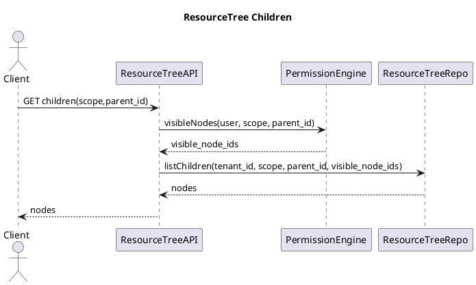

#### 6.2.3.2 移动节点（拖拽）

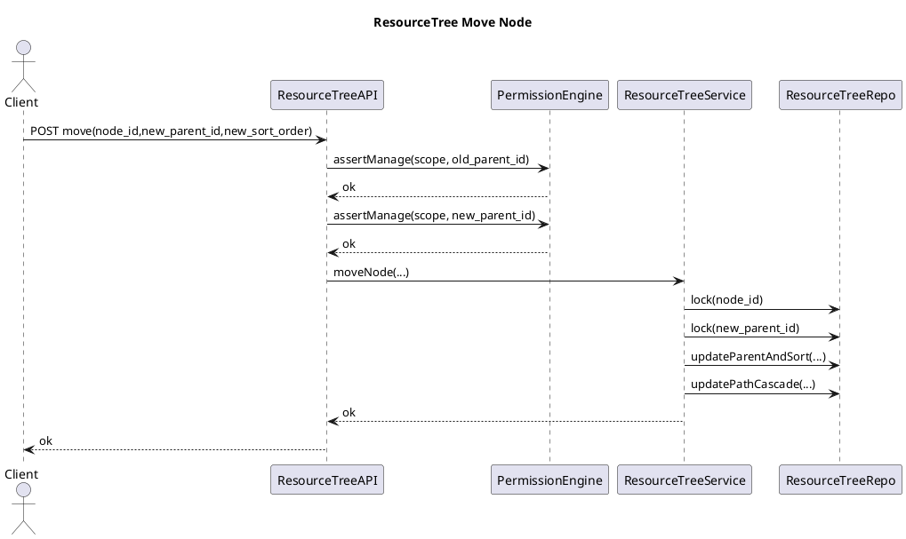

### 6.2.4 接口清单

- `GET /api/resource-trees/{scope}/children?parent_id={id|null}`
- `POST /api/resource-trees/{scope}/folders`
- `PATCH /api/resource-trees/{scope}/nodes/{id}`
- `POST /api/resource-trees/{scope}/move`
- `DELETE /api/resource-trees/{scope}/folders/{id}`
- `POST /api/resource-trees/{scope}/reorder`

---

## 6.3 查询引擎（Query Engine：QueryBuilder/Runner）

### 6.3.1 目标

- 为建模/Flow/报表模块提供统一的查询执行入口；
- 统一承载 FilterDSL 的编译与安全约束；
- 统一分页、排序、字段裁剪（列权限）、行过滤（行权限）应用。

### 6.3.2 核心对象

#### 6.3.2.1 QueryRequest（JSON）

| 字段            | 类型   | 必填 | 约束          | 说明               |
| --------------- | ------ | ---: | ------------- | ------------------ |
| datasource_type | string |   是 | TABLE/DATASET | 数据源类型         |
| datasource_id   | bigint |   是 | —             | 表 ID 或数据集 ID  |
| select_fields   | array  |   否 | ≤ 200         | 选择字段 code 列表 |
| filter          | object |   否 | FilterDSL     | 业务过滤           |
| sort            | array  |   否 | ≤ 10          | 排序               |
| paging          | object |   否 | —             | 分页               |
| paging.limit    | int    |   否 | 1..200        | 返回行数           |
| paging.offset   | int    |   否 | 0..10000      | 偏移               |

### 6.3.3 执行链路（PlantUML）

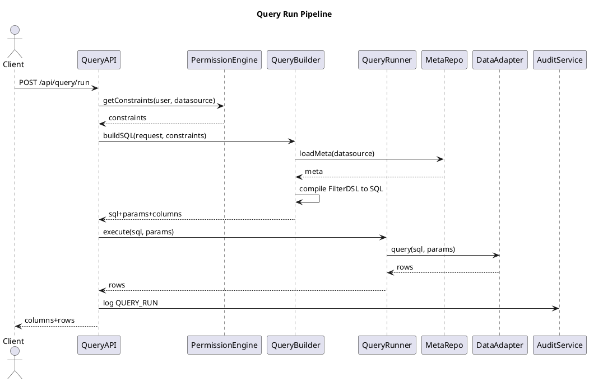

### 6.3.4 接口

- `POST /api/query/run`
- `POST /api/query/validate`
- `POST /api/query/export/csv`

### 6.3.5 FilterDSL 编译器实现要点（安全边界）

必须满足：

- 字段白名单：仅允许当前 datasource 的字段；
- 操作符白名单：eq/ne/in/contains/gt/gte/lt/lte/is_null/not_null；
- 值类型校验：in 必须 array；contains 必须 string；
- 变量替换：允许 CURRENT_USER_ID 等变量；
- 禁止注入：所有值必须参数化，禁止拼接原始字符串到 SQL。

---

## 6.4 站内通知（In-App Notification）

### 6.4.1 数据表

#### 6.4.1.1 `notification`

| 字段名                   | 类型         | 是否可空 | 默认值            | 枚举/约束          | 说明             |
| ------------------------ | ------------ | -------: | ----------------- | ------------------ | ---------------- |
| id                       | bigint       |       否 | —                 | PK                 | 通知 ID          |
| tenant_id                | bigint       |       否 | —                 | —                  | 租户             |
| recipient_tenant_user_id | bigint       |       否 | —                 | FK(tenant_user.id) | 接收人           |
| event_type               | varchar(64)  |       否 | —                 | 事件枚举           | 类型             |
| title                    | varchar(128) |       否 | —                 | —                  | 标题             |
| content                  | json         |       否 | —                 | JSON               | 内容（用于跳转） |
| is_read                  | tinyint(1)   |       否 | 0                 | 0/1                | 是否已读         |
| created_at               | datetime     |       否 | CURRENT_TIMESTAMP | —                  | 创建时间         |

content JSON 结构（最小）：

| 字段        | 类型   | 必填 | 枚举/上限              | 说明         | 示例                |
| ----------- | ------ | ---: | ---------------------- | ------------ | ------------------- |
| url         | string |   否 | ≤512                   | 前端跳转 URL | "/flows/123/runs/9" |
| entity_type | string |   否 | FLOW/DATASET/DASHBOARD | 关联实体     | "FLOW"              |
| entity_id   | bigint |   否 | —                      | 关联 ID      | 123                 |

索引：

- 普通索引：`idx_notif_user (tenant_id, recipient_tenant_user_id, is_read, created_at DESC)`

### 6.4.2 接口

- `GET /api/notifications?unread_only=0|1&limit=&offset=`
- `GET /api/notifications/unread-count`
- `POST /api/notifications/mark-read`

---

## 6.5 LLM 辅助（编码/命名建议）

### 6.5.1 接口

- `POST /api/assist/code-suggest`

# 7 建模

## 7.0 章节定位与目标

建模模块为租户提供** 业务表（Table）**与** 字段（Field）**的结构化管理能力，并提供表数据的浏览与 CRUD（Create/Read/Update/Delete）入口。其核心目标：

1. 在租户内以“目录（Folder）+ 表（Table）”的资源树方式组织业务模型，支撑后续 Flow、Dataset、报表等模块复用。
2. 以元数据（MySQL）驱动物理表结构（数仓/分析库）自动创建与演进，确保“结构变更可审计、可回溯、可控”。
3. 统一接入权限引擎（第 5 章）与查询引擎（第 6 章）：
   - 资源级权限：`TABLE_SCHEMA` / `TABLE_DATA`；
   - 数据级权限：行级（RowPermission / FilterDSL）与列级（ColumnPermission）。
4. 对关键建模操作形成完整审计（第 10 章审计模块落表；本章给出“必须记录什么”与写入点）。

本章只覆盖**建模模块自身的表/字段元数据与表数据 CRUD**；查询引擎（QueryBuilder/Runner）与资源树通用服务在第 6 章定义，本章作为调用方给出**明确的集成口径与接口清单**，避免实现歧义。

---

## 7.1 模块边界与依赖

### 7.1.1 依赖清单（必须复用）

- 租户上下文与认证：第 4 章（TenantContext + JWT）
- 权限体系与权限引擎：第 5 章（RolePermission / RowPermission / ColumnPermission / PermissionEngine）
- 通用能力：
  - 资源树服务（Folder/Node CRUD + move/path）：第 6 章
  - 查询引擎（FilterDSL、排序分页、导出、行列权限应用）：第 6 章
  - LLM 辅助（表/字段 code 生成）：第 6 章（失败可降级）
- 审计写入：第 10 章（AuditWriter / AuditLog 表）

### 7.1.2 本章覆盖范围（建模模块自身）

- 表元数据（TableMeta）管理：创建、编辑、删除、列表、详情
- 字段元数据（FieldMeta）管理：创建、编辑、删除、排序
- 关联字段（Reference Field）：
  - 元数据定义（无独立 Relation 实体）
  - 数据页展示、搜索候选、权限约束
- 表数据页（数据浏览 & CRUD）：
  - 列展示（列权限）
  - 数据查询（QueryEngine）
  - 新增/编辑/删除（含字段校验、关联字段校验）

---

## 7.2 名词、枚举与约束

### 7.2.1 表类型（TableType）

| 枚举值    | 说明   |
| --------- | ------ |
| DIMENSION | 维度表 |
| FACT      | 事实表 |
| CONFIG    | 配置表 |
| OTHER     | 其他   |

### 7.2.2 字段 UI 类型（FieldUiType）

| 枚举值    | 说明     | 默认底层类型（db_type）    |
| --------- | -------- | -------------------------- |
| TEXT      | 文本     | `varchar(255)`             |
| INTEGER   | 整数     | `bigint`                   |
| DECIMAL   | 小数     | `decimal(18,2)`            |
| DATE      | 日期     | `date`                     |
| DATETIME  | 日期时间 | `datetime`                 |
| BOOLEAN   | 布尔     | `tinyint(1)`               |
| REFERENCE | 关联     | 等于被关联字段的 `db_type` |

> 约束：`REFERENCE` 字段的 `db_type` 必须与 `ref_field` 的 `db_type` 一致；禁止用户选择或编辑。

### 7.2.3 关联字段输入模式（RefInputMode）

| 枚举值 | 说明                           |
| ------ | ------------------------------ |
| SELECT | 下拉选择（候选列表）           |
| SEARCH | 搜索选择（输入关键字查询候选） |

### 7.2.4 code 规范（表/字段统一）

- 仅允许字符：`a-z`、`0-9`、`_`；全部小写；蛇形命名（snake_case）
- 首字符必须是字母；若生成结果首字符非字母，自动加前缀 `t_`（表）或 `f_`（字段）
- 最大长度：50
- 租户内唯一性：
  - 表：`(tenant_id, code)` 唯一
  - 字段：`(tenant_id, table_id, code)` 唯一
- code 只读：创建成功后生命周期内不可变更

---

## 7.3 元数据模型（MySQL）

> 说明：本章仅定义“建模模块新增的元数据表”。目录结构（Folder/Node）属于资源树通用表（第 6 章），建模表与资源树通过 `resource_node_id` 关联。

### 7.3.1 表：`modeling_table`

| 字段名           | 类型         | 是否可空 | 默认值 | 枚举/约束                            | 说明                                     |
| ---------------- | ------------ | -------- | ------ | ------------------------------------ | ---------------------------------------- |
| id               | bigint       | 否       |        | PK                                   | 表元数据主键                             |
| tenant_id        | bigint       | 否       |        | FK(tenant)                           | 租户 ID                                  |
| resource_node_id | bigint       | 否       |        | 唯一；FK(resource_tree_node)         | 资源树节点 ID（该表对应的 Node）         |
| display_name     | varchar(50)  | 否       |        | 长度 1–50                            | 表展示名                                 |
| code             | varchar(50)  | 否       |        | 租户内唯一                           | 表编码（snake_case，只读）               |
| table_type       | varchar(16)  | 否       | OTHER  | DIMENSION/FACT/CONFIG/OTHER          | 表类型                                   |
| description      | varchar(200) | 否       |        |                                      | 表描述                                   |
| storage_engine   | varchar(16)  | 否       | DW     | DW                                   | 物理存储引擎标识（V1 固定为 DW，可扩展） |
| db_schema        | varchar(64)  | 否       |        |                                      | 物理库/Schema 名（由数据源决定）         |
| db_table         | varchar(64)  | 否       |        | 唯一(tenant_id, db_schema, db_table) | 物理表名（由系统生成）                   |
| status           | varchar(16)  | 否       | ACTIVE | ACTIVE/DELETING/DELETED              | 生命周期状态                             |
| created_by       | bigint       | 否       |        |                                      | 创建人 TenantUser.id                     |
| created_at       | datetime     | 否       | now()  |                                      | 创建时间                                 |
| updated_by       | bigint       | 否       |        |                                      | 最后更新人 TenantUser.id                 |
| updated_at       | datetime     | 否       | now()  |                                      | 最后更新时间（并发控制）                 |

**索引：**

- 唯一索引
  - `uk_modeling_table_tenant_code (tenant_id, code)`：租户内表编码唯一
  - `uk_modeling_table_resource_node (resource_node_id)`：一对一绑定资源树节点
  - `uk_modeling_table_db (tenant_id, db_schema, db_table)`：物理表唯一
- 普通索引
  - `idx_modeling_table_tenant (tenant_id)`：租户过滤
  - `idx_modeling_table_updated (tenant_id, updated_at)`：按更新时间筛选/并发校验

### 7.3.2 表：`modeling_field`

| 字段名               | 类型         | 是否可空 | 默认值 | 枚举/约束                                            | 说明                                                       |
| -------------------- | ------------ | -------- | ------ | ---------------------------------------------------- | ---------------------------------------------------------- |
| id                   | bigint       | 否       |        | PK                                                   | 字段元数据主键                                             |
| tenant_id            | bigint       | 否       |        | FK(tenant)                                           | 租户 ID                                                    |
| table_id             | bigint       | 否       |        | FK(modeling_table)                                   | 所属表                                                     |
| display_name         | varchar(50)  | 否       |        | 长度 1–50                                            | 字段展示名                                                 |
| code                 | varchar(50)  | 否       |        | 表内唯一                                             | 字段编码（snake_case，只读）                               |
| ui_type              | varchar(16)  | 否       |        | TEXT/INTEGER/DECIMAL/DATE/DATETIME/BOOLEAN/REFERENCE | UI 类型                                                    |
| db_type              | varchar(32)  | 否       |        |                                                      | 物理类型（系统生成/锁定）                                  |
| is_required          | tinyint(1)   | 否       | 0      | 0/1                                                  | 是否必填（NOT NULL）                                       |
| is_business_key      | tinyint(1)   | 否       | 0      | 0/1，单表最多 1 个                                   | 业务主键（V1：单一；落为 UNIQUE 索引，不改变系统 id 主键） |
| default_value_json   | json         | 是       | null   | 结构见下                                             | 默认值（非关联字段可用）                                   |
| description          | varchar(200) | 否       |        |                                                      | 字段描述                                                   |
| is_internal          | tinyint(1)   | 否       | 0      | 0/1                                                  | 是否系统字段（系统字段禁止删除/修改关键属性）              |
| sort_order           | int          | 否       | 0      | >=0                                                  | 展示顺序（仅 UI）                                          |
| ref_table_id         | bigint       | 是       | null   | 仅 REFERENCE 可填                                    | 关联表 ID                                                  |
| ref_field_id         | bigint       | 是       | null   | 仅 REFERENCE 可填                                    | 关联字段 ID（通常为目标表业务主键或系统 id）               |
| ref_display_field_id | bigint       | 是       | null   | 仅 REFERENCE 可填                                    | 关联展示字段 ID                                            |
| ref_input_mode       | varchar(16)  | 是       | null   | SELECT/SEARCH                                        | 关联输入模式                                               |
| created_by           | bigint       | 否       |        |                                                      | 创建人 TenantUser.id                                       |
| created_at           | datetime     | 否       | now()  |                                                      | 创建时间                                                   |
| updated_by           | bigint       | 否       |        |                                                      | 最后更新人 TenantUser.id                                   |
| updated_at           | datetime     | 否       | now()  |                                                      | 最后更新时间（并发控制）                                   |

**`default_value_json` JSON 结构定义：**

| 字段  | 类型   | 必填 | 枚举/上限                                  | 说明                              | 示例        |
| ----- | ------ | ---- | ------------------------------------------ | --------------------------------- | ----------- |
| type  | string | 是   | TEXT/INTEGER/DECIMAL/DATE/DATETIME/BOOLEAN | 默认值类型（必须与 ui_type 对应） | `"DECIMAL"` |
| value | any    | 是   |                                            | 默认值内容                        | `12.34`     |

> 约束：
>
> - `ui_type = REFERENCE` 时 `default_value_json` 必须为 `null`
> - `ui_type = DATE/DATETIME` 时 value 采用 ISO 字符串（与第 3 章时间规范一致）

**索引：**

- 唯一索引
  - `uk_modeling_field_table_code (tenant_id, table_id, code)`：字段编码唯一
- 普通索引
  - `idx_modeling_field_table (tenant_id, table_id, sort_order)`：字段列表
  - `idx_modeling_field_ref_table (tenant_id, ref_table_id)`：依赖检查（表删除）
  - `idx_modeling_field_ref_field (tenant_id, ref_field_id)`：依赖检查（字段删除）

---

## 7.4 物理表与字段映射（DDL 规则）

### 7.4.1 物理表命名规则（db_table）

- 规则：`t_{tenant_id}_{table_code}`
- 最大长度：64；若超出，采用：
  - `t_{tenant_id}_{hash8(table_code)}`
  - 并在 `modeling_table.code` 保持原值不变
- 禁止重名：依靠 `uk_modeling_table_db` 保证

### 7.4.2 创建物理表时的系统字段（强制）

创建物理表时必须自动创建系统字段（并写入 `modeling_field`，`is_internal=1`）：

| 字段 code  | ui_type  | db_type  | is_required | is_internal | 说明                            |
| ---------- | -------- | -------- | ----------: | ----------: | ------------------------------- |
| id         | INTEGER  | bigint   |           1 |           1 | 系统主键（写入时由后端生成 ID） |
| created_at | DATETIME | datetime |           1 |           1 | 创建时间                        |
| updated_at | DATETIME | datetime |           1 |           1 | 最后更新时间                    |
| created_by | INTEGER  | bigint   |           1 |           1 | 创建人 TenantUser.id            |
| updated_by | INTEGER  | bigint   |           1 |           1 | 最后修改人 TenantUser.id        |

> 说明：V1 统一采用后端生成 `id`（雪花/ULID 转 bigint），避免依赖不同存储引擎的自增能力。

### 7.4.3 UI 类型到 db_type 的映射（统一口径）

| ui_type   | db_type 生成规则                                     |
| --------- | ---------------------------------------------------- |
| TEXT      | `varchar(255)`（如需长文本，后续版本扩展 TEXT_LONG） |
| INTEGER   | `bigint`                                             |
| DECIMAL   | `decimal(18,2)`                                      |
| DATE      | `date`                                               |
| DATETIME  | `datetime`                                           |
| BOOLEAN   | `tinyint(1)`                                         |
| REFERENCE | 取 `ref_field.db_type`                               |

### 7.4.4 物理结构变更与一致性策略（必选）

建模涉及 MySQL 元数据与数仓物理 DDL，无法依赖分布式事务。V1 采用**“先落元数据为 PENDING，再执行 DDL，成功后置为 ACTIVE”**的可恢复策略：

- 表创建：

  1. MySQL：插入 `modeling_table(status=DELETING|PENDING_CREATE)` 与字段元数据（含系统字段与用户字段）
  2. DW：执行 `CREATE TABLE`
  3. MySQL：更新表状态为 `ACTIVE`
  4. 失败时：
     - MySQL 状态标记为 `PENDING_CREATE_FAILED`
     - 支持后台重试或人工清理（第 6 章通用能力的任务/重试策略复用）

- 字段变更（新增/删除/修改 NOT NULL）：
  1. MySQL：对 `modeling_table` 行加锁，校验并写入字段元数据变更为 `PENDING_*`
  2. DW：执行 `ALTER TABLE`
  3. MySQL：变更落为 `ACTIVE`
  4. 失败时：
     - MySQL：记录失败原因（建议落入审计或专门的 ddl_task 表；若系统已具备任务框架，直接复用）

> 若系统已在第 6 章定义统一的“DDLTask/Outbox”机制，本章实现必须按统一机制落地；不得另起炉灶。

---

## 7.5 关键流程（时序图 + 步骤）

### 7.5.1 新建表（包含资源树节点与物理建表）

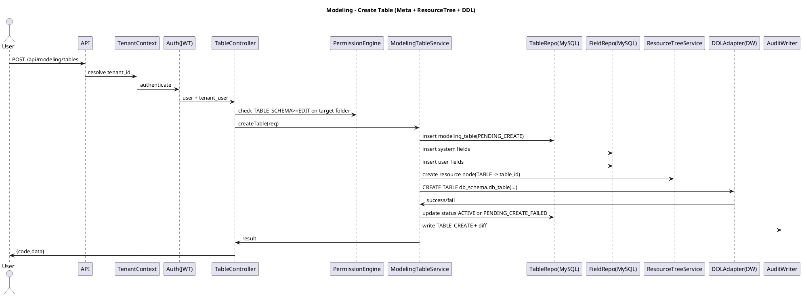

**步骤（含异常分支，必须全部实现）：**

1. Controller 解析 `X-Tenant-Id` 并由 TenantContext 校验租户状态为 `ACTIVE`。
2. JWT 鉴权成功后解析 `tenant_user_id`。
3. 校验入参 `display_name` 长度 1–50，`table_type` 枚举合法，`description` 长度 ≤200。
4. 解析目标目录：
   - 若传入 `parent_folder_node_id`：校验该节点属于 scope=TABLE 且为 Folder。
   - 若未传：默认根目录。
5. PermissionEngine 校验：当前用户对目标 Folder 具备 `TABLE_SCHEMA >= EDIT`。
6. 生成 `table_code`：
   - 先调用 LLM 辅助生成（第 6 章），失败则降级为本地规则；
   - 本地规则必须输出合法 snake*case，首字符非字母则加 `t*`；
   - 在 MySQL 中检查 `(tenant_id, code)` 唯一，不唯一则追加 `_1/_2/...`。
7. 生成 `db_table`：按 `t_{tenant_id}_{table_code}` 规则生成并截断/哈希保证 ≤64。
8. 组装初始字段集合：
   - 强制加入系统字段（7.4.2），`is_internal=1`；
   - 追加用户传入字段（若 V1 支持“建表同时建字段”；若不支持则忽略该段）。
9. 字段入参校验（对每个字段逐条校验）：
   - `display_name` 1–50；
   - `ui_type` 枚举合法；
   - `is_business_key`：单表最多 1 个；且 `ui_type != REFERENCE`；
   - `default_value_json` 与 `ui_type` 类型一致；REFERENCE 必须为 null。
10. MySQL 事务开始（REPEATABLE READ）：
    - 插入 `modeling_table(status=PENDING_CREATE)`；
    - 插入系统字段 + 用户字段到 `modeling_field`；
11. 事务提交成功后，调用 ResourceTreeService 创建 Node：
    - node.scope = TABLE
    - node.type = RESOURCE
    - node.resource_id = modeling_table.id
    - node.parent_id = parent_folder_node_id（或 root）
12. 若创建资源树节点失败：
    - 回滚策略：删除刚插入的 `modeling_table` 与 `modeling_field`（同租户），或将 `status` 标记为 `PENDING_CREATE_FAILED` 并记录错误原因；
    - 返回 `INTERNAL_ERROR` 或 `PRECONDITION_FAILED`（按失败原因）。
13. 调用 DDLAdapter 执行 `CREATE TABLE`：
    - 列集合 = 系统字段 + 用户字段；
    - 为 `is_business_key=1` 的字段创建 UNIQUE 索引；
14. 若 DDL 执行失败：
    - 更新 `modeling_table.status = PENDING_CREATE_FAILED`；
    - 记录失败原因（审计或 DDLTask）；
    - 返回 `DDL_EXECUTION_FAILED`。
15. 若 DDL 成功：
    - 更新 `modeling_table.status = ACTIVE`；
    - 写审计：`TABLE_CREATE`，记录表与字段关键属性（含 resource_node_id）。
16. 返回创建成功结果（包含 table_id、resource_node_id、code、db_table）。

---

### 7.5.2 新增字段（ALTER TABLE + 元数据一致性）

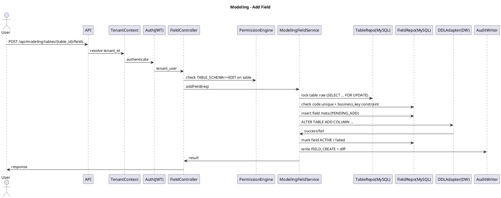

**步骤（含异常分支）：**

1. 校验表存在且 `status=ACTIVE`；否则 `RESOURCE_NOT_FOUND` 或 `PRECONDITION_FAILED`。
2. 权限校验：表节点上 `TABLE_SCHEMA >= EDIT`。
3. 校验字段入参：
   - `display_name` 1–50；
   - `ui_type` 合法；
   - 若 `ui_type=REFERENCE`：必须提供 `ref_table_id/ref_field_id/ref_display_field_id/ref_input_mode`；
4. 生成 `field_code`（LLM 优先，本地降级），并校验 `(tenant_id, table_id, code)` 唯一。
5. 若 `is_business_key=1`：
   - 校验该表不存在其他 `is_business_key=1` 字段；
   - 且 `ui_type != REFERENCE`；
6. 若 `ui_type=REFERENCE`：
   - 校验 `ref_table_id` 存在且同租户；
   - 校验 `ref_field_id` 属于 ref_table；
   - 校验 `ref_display_field_id` 属于 ref_table；
   - 计算 `db_type = ref_field.db_type`；
7. 事务开始，对 `modeling_table` 行加锁（`SELECT ... FOR UPDATE`），避免并发 schema 修改。
8. 写入 `modeling_field` 元数据（建议携带临时状态标记或在审计中记录“待执行 DDL”）。
9. 提交后执行 DDL：
   - `ALTER TABLE ADD COLUMN {code} {db_type} [NOT NULL] [DEFAULT ...]`
   - 若 `is_business_key=1`：创建 UNIQUE 索引；
10. 若 DDL 失败：
    - 将字段状态标记为失败（可在审计/ddl_task 中记录）；
    - 返回 `DDL_EXECUTION_FAILED`，并包含可读的失败信息（长度限制）。
11. 若 DDL 成功：
    - 写审计 `FIELD_CREATE`；
12. 返回字段详情（含 id/code/ui_type/db_type/sort_order/ref 信息）。

---

### 7.5.3 表数据查询（QueryEngine + 行列权限）

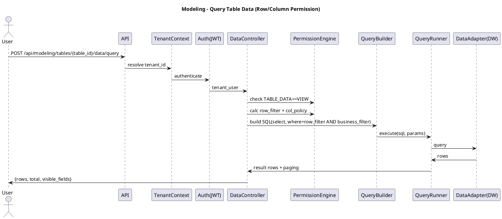

**步骤（含异常分支）：**

1. 校验表存在且 ACTIVE；否则 `RESOURCE_NOT_FOUND/PRECONDITION_FAILED`。
2. 权限校验：`TABLE_DATA >= VIEW`；否则 `PERMISSION_DENIED`。
3. 读取字段元数据（按 sort_order），并计算列权限策略：
   - HIDDEN：不出现在返回字段列表
   - READONLY：返回但在 UI 标记为只读
   - READWRITE：返回且可编辑（取决于 TABLE_DATA>=EDIT）
4. 解析入参 `filter_dsl`（业务过滤）并进行 DSL 语法校验；失败 `PARAM_INVALID` 或 `DSL_INVALID`。
5. PermissionEngine 计算行权限 `row_filter_dsl`。
6. 合并过滤：`where = AND(row_filter_dsl, filter_dsl)`（业务过滤不得绕过行权限）。
7. 解析 `order_by`：
   - 仅允许对“可见字段”排序；
   - 若排序字段隐藏：返回 `PRECONDITION_FAILED`。
8. 解析分页：`page`, `page_size`；限制 `page_size` 上限（与第 3 章规范一致）。
9. 由 QueryBuilder 构建 SQL：
   - SELECT 字段仅包含“可见字段”
   - WHERE 按合并 DSL
   - ORDER BY + LIMIT/OFFSET
10. 执行 QueryRunner；若超时/存储不可用：返回 `STORAGE_UNAVAILABLE` 或 `INTERNAL_ERROR`。
11. 返回结果中必须包含：
    - rows（已按列权限裁剪）
    - total（可选，若实现成本高可先返回 `-1` 并在 V1.1 完善）
    - visible_fields（字段元信息：code、display_name、ui_type、editable）
12. 对 REFERENCE 字段：
    - 默认返回“引用值”（ref_field 对应的原始值）
    - 若前端需要展示 display 值，需额外携带 `ref_display_field_id` 并由前端做二次查询或由 QueryBuilder 做 Join（V1 可先不做自动 Join）。

---

## 7.6 API 总览（建模模块完整清单）

> 说明：资源树通用接口定义在第 6 章，本章列出建模模块会调用的 scope=TABLE 相关接口，便于开发串联与端到端联调。

### 7.6.1 资源树（scope=TABLE）依赖接口

- `GET  /api/resource-trees/TABLE/children?parent_id={node_id}`
- `POST /api/resource-trees/TABLE/folders`
- `PATCH /api/resource-trees/TABLE/nodes/{node_id}`（重命名）
- `POST /api/resource-trees/TABLE/move`
- `DELETE /api/resource-trees/TABLE/nodes/{node_id}`（删除 Folder 或表 Node）

### 7.6.2 表元数据接口

- `GET  /api/modeling/tables`（按 Folder 列表/搜索）
- `POST /api/modeling/tables`（新建表）
- `GET  /api/modeling/tables/{table_id}`（表详情：基本信息 + 字段）
- `PATCH /api/modeling/tables/{table_id}`（编辑表信息）
- `DELETE /api/modeling/tables/{table_id}`（删除表：依赖检查 + 删除资源树节点 + 物理删表）

### 7.6.3 字段元数据接口

- `GET  /api/modeling/tables/{table_id}/fields`
- `POST /api/modeling/tables/{table_id}/fields`
- `PATCH /api/modeling/tables/{table_id}/fields/{field_id}`
- `DELETE /api/modeling/tables/{table_id}/fields/{field_id}`
- `POST /api/modeling/tables/{table_id}/fields/reorder`

### 7.6.4 关联字段辅助接口

- `GET  /api/modeling/tables/{ref_table_id}/reference-candidates`（下拉/搜索候选）

### 7.6.5 表数据接口

- `POST /api/modeling/tables/{table_id}/data/query`
- `GET  /api/modeling/tables/{table_id}/records/{id}`
- `POST /api/modeling/tables/{table_id}/records`
- `PATCH /api/modeling/tables/{table_id}/records/{id}`
- `DELETE /api/modeling/tables/{table_id}/records/{id}`
- `POST /api/modeling/tables/{table_id}/records/batch-delete`（可选）

---

## 7.7 通用错误码（本章新增/复用）

| code                   | HTTP | 场景                                       |
| ---------------------- | ---: | ------------------------------------------ |
| UNAUTHORIZED           |  401 | 未登录/Token 无效                          |
| TENANT_CONTEXT_INVALID |  401 | 缺少/非法租户上下文                        |
| TENANT_SUSPENDED       |  403 | 租户非 ACTIVE                              |
| PERMISSION_DENIED      |  403 | 权限不足                                   |
| PARAM_INVALID          |  400 | 入参校验失败                               |
| DSL_INVALID            |  400 | FilterDSL 语法非法                         |
| RESOURCE_NOT_FOUND     |  404 | 表/字段/记录不存在                         |
| CONFLICT               |  409 | 唯一冲突/并发冲突                          |
| PRECONDITION_FAILED    |  412 | 前置条件不满足（例如被引用、不可变更字段） |
| DDL_EXECUTION_FAILED   |  500 | 物理 DDL 执行失败                          |
| STORAGE_UNAVAILABLE    |  503 | 存储不可用/超时                            |
| INTERNAL_ERROR         |  500 | 未分类内部错误                             |

---

## 7.8 接口详细说明

> 统一约定：所有接口返回结构为
> `{"code":"OK|ERROR_CODE","message":"...","data":...,"request_id":"..."}`

### 7.8.1 GET /api/modeling/tables

**用途：**在选中 Folder（或根）时加载表列表，并支持搜索/筛选。

**权限：**

- 仅返回用户可见表（表节点上 `TABLE_SCHEMA>=VIEW` 或 `TABLE_DATA>=VIEW` 任一满足）
- 若用户对 Folder 无任何权限：返回空列表（不报错）

**请求参数：**

| 参数                | 位置  | 类型   | 必填 | 默认值 | 约束                         | 说明                       |
| ------------------- | ----- | ------ | ---- | ------ | ---------------------------- | -------------------------- |
| folder_node_id      | query | bigint | 否   | root   | 必须是 scope=TABLE 的 Folder | 当前选中目录               |
| include_descendants | query | bool   | 否   | false  |                              | 是否递归包含子目录表       |
| keyword             | query | string | 否   |        | 长度 ≤50                     | 模糊搜索 display_name/code |
| table_type          | query | string | 否   |        | TableType                    | 类型筛选                   |
| page                | query | int    | 否   | 1      | >=1                          | 分页页码                   |
| page_size           | query | int    | 否   | 20     | 1–200                        | 分页大小                   |

**响应 data：**

| 字段  | 类型  | 说明   |
| ----- | ----- | ------ |
| items | array | 表列表 |
| total | int   | 总数   |

**items[i] 字段：**

| 字段             | 类型   | 说明                                                          |
| ---------------- | ------ | ------------------------------------------------------------- |
| id               | bigint | table_id                                                      |
| resource_node_id | bigint | 资源树 node_id                                                |
| display_name     | string | 表名                                                          |
| code             | string | 表编码                                                        |
| table_type       | string | 表类型                                                        |
| description      | string | 描述                                                          |
| can_schema       | string | NONE/VIEW/EDIT/MANAGE（当前用户在 TABLE_SCHEMA 上的最终权限） |
| can_data         | string | NONE/VIEW/EDIT/MANAGE（当前用户在 TABLE_DATA 上的最终权限）   |
| updated_at       | string | 并发控制展示                                                  |

**校验规则与异常分支：**

1. folder_node_id 非法/不属于当前租户：`PARAM_INVALID`
2. folder_node_id 为资源节点但非 Folder：`PARAM_INVALID`
3. page/page_size 越界：`PARAM_INVALID`

**伪代码：**

```python
def list_tables(tenant_id, user_id, folder_node_id, include_desc, keyword, table_type, page, page_size):
    nodes = resource_tree_repo.list_descendant_resource_nodes(
        scope="TABLE",
        folder_node_id=folder_node_id,
        include_descendants=include_desc,
        resource_type="TABLE",   # resource nodes for tables
        tenant_id=tenant_id
    )
    table_ids = [n.resource_id for n in nodes]
    # 计算表级可见性：TABLE_SCHEMA or TABLE_DATA >= VIEW
    visible = permission_engine.filter_visible_tables(tenant_id, user_id, table_ids)
    items = table_repo.query_tables(tenant_id, visible, keyword, table_type, page, page_size)
    # 为 UI 回传 schema/data 权限
    perms = permission_engine.batch_calc_table_perms(tenant_id, user_id, [t.id for t in items])
    return assemble(items, perms)
```

---

### 7.8.2 POST /api/modeling/tables

**用途：**新建业务表（元数据 + 资源树节点 + 物理建表）。

**权限：**

- 目标 Folder：`TABLE_SCHEMA >= EDIT`

**请求 JSON：**

| 字段                  | 类型   | 必填 | 枚举/约束          | 说明                   |
| --------------------- | ------ | ---- | ------------------ | ---------------------- |
| display_name          | string | 是   | 1–50               | 表名                   |
| table_type            | string | 是   | TableType          | 表类型                 |
| description           | string | 否   | 0–200              | 描述                   |
| parent_folder_node_id | bigint | 否   | scope=TABLE Folder | 所属目录               |
| fields                | array  | 否   |                    | 可选：建表同时创建字段 |

**fields[i] 结构：**

| 字段                 | 类型   | 必填 | 枚举/约束     | 说明                     |
| -------------------- | ------ | ---- | ------------- | ------------------------ |
| display_name         | string | 是   | 1–50          | 字段名                   |
| ui_type              | string | 是   | FieldUiType   | 类型                     |
| is_required          | bool   | 否   |               | 必填                     |
| is_business_key      | bool   | 否   | 单表最多 1 个 | 业务主键                 |
| default_value_json   | object | 否   | 见 7.3.2      | 默认值（REFERENCE 禁止） |
| description          | string | 否   | 0–200         | 描述                     |
| ref_table_id         | bigint | 否   | 仅 REFERENCE  | 关联表                   |
| ref_field_id         | bigint | 否   | 仅 REFERENCE  | 关联字段                 |
| ref_display_field_id | bigint | 否   | 仅 REFERENCE  | 展示字段                 |
| ref_input_mode       | string | 否   | SELECT/SEARCH | 输入模式                 |

**响应 data：**

| 字段             | 类型   | 说明                         |
| ---------------- | ------ | ---------------------------- |
| id               | bigint | table_id                     |
| resource_node_id | bigint | node_id                      |
| display_name     | string | 表名                         |
| code             | string | 表编码                       |
| db_schema        | string | 物理库                       |
| db_table         | string | 物理表                       |
| status           | string | ACTIVE/PENDING_CREATE_FAILED |
| fields           | array  | 字段列表（含系统字段）       |

**错误码覆盖：**

| code                 | HTTP | 场景                           |
| -------------------- | ---: | ------------------------------ |
| PERMISSION_DENIED    |  403 | 目标目录无建表权限             |
| PARAM_INVALID        |  400 | 表/字段入参非法                |
| CONFLICT             |  409 | code 唯一冲突（并发创建同名）  |
| PRECONDITION_FAILED  |  412 | 关联字段引用非法、业务主键冲突 |
| DDL_EXECUTION_FAILED |  500 | 物理建表失败                   |
| INTERNAL_ERROR       |  500 | 资源树节点创建失败等           |

**伪代码：**

```python
@transactional
def create_table(req, tenant_id, tenant_user_id):
    folder = rts.ensure_folder(req.parent_folder_node_id or ROOT)
    permission_engine.assert_folder_perm(tenant_id, tenant_user_id, folder.id, "TABLE_SCHEMA", "EDIT")

    code = code_generator.gen_table_code(req.display_name, tenant_id)
    db_table = physical_namer.gen_db_table(tenant_id, code)

    table_id = id_gen.next()
    TR.insert({
        "id": table_id, "tenant_id": tenant_id,
        "display_name": req.display_name, "code": code,
        "db_schema": dw_config.schema, "db_table": db_table,
        "status": "PENDING_CREATE",
        "created_by": tenant_user_id, "updated_by": tenant_user_id,
    })

    # fields: system + user
    fields = system_fields(table_id, tenant_id, tenant_user_id) + validate_user_fields(req.fields or [], tenant_id)
    FR.batch_insert(fields)

    node_id = rts.create_resource_node(scope="TABLE", parent_id=folder.id, resource_id=table_id)

    # out of transaction: DDL
    ddl_sql = ddl_builder.create_table_sql(db_schema=dw_config.schema, db_table=db_table, fields=fields)
    try:
        ddl_adapter.exec(ddl_sql)
    except Exception as e:
        TR.update_status(table_id, tenant_id, "PENDING_CREATE_FAILED")
        audit_writer.write("TABLE_CREATE_FAILED", {...})
        raise ApiError("DDL_EXECUTION_FAILED", str(e))

    TR.update_status(table_id, tenant_id, "ACTIVE")
    audit_writer.write("TABLE_CREATE", {...})
    return TR.get_detail(table_id)
```

---

### 7.8.3 GET /api/modeling/tables/{table_id}

**用途：**表详情（基本信息 + 字段列表）。

**权限：**

- `TABLE_SCHEMA >= VIEW` 或 `TABLE_DATA >= VIEW` 之一满足即允许进入详情；
- 字段列表需应用列权限：对 `TABLE_DATA < VIEW` 的用户，字段可仅展示结构层（不包含数据权限信息）。

**路径参数：**

| 参数     | 类型   | 必填 | 说明  |
| -------- | ------ | ---- | ----- |
| table_id | bigint | 是   | 表 ID |

**响应 data：**

| 字段   | 类型   | 说明                      |
| ------ | ------ | ------------------------- |
| table  | object | 表基本信息                |
| fields | array  | 字段列表（按 sort_order） |

**table 字段：**

| 字段             | 类型   | 说明                 |
| ---------------- | ------ | -------------------- |
| id               | bigint | table_id             |
| resource_node_id | bigint | node_id              |
| display_name     | string | 表名                 |
| code             | string | 表编码               |
| table_type       | string | 表类型               |
| description      | string | 描述                 |
| db_schema        | string | 物理库               |
| db_table         | string | 物理表               |
| can_schema       | string | 当前用户 schema 权限 |
| can_data         | string | 当前用户 data 权限   |
| updated_at       | string | 并发控制             |

**错误码：**

- `RESOURCE_NOT_FOUND`：表不存在或不属于本租户
- `PERMISSION_DENIED`：无权限

---

### 7.8.4 PATCH /api/modeling/tables/{table_id}

**用途：**编辑表信息（表名/类型/描述/所属目录）。

**权限：**

- 表节点 `TABLE_SCHEMA >= EDIT`
- 若变更所属目录：需同时满足
  - 表节点 `TABLE_SCHEMA = MANAGE`
  - 目标目录 `TABLE_SCHEMA = MANAGE`

**请求 JSON：**

| 字段                  | 类型   | 必填 | 约束               | 说明                                  |
| --------------------- | ------ | ---- | ------------------ | ------------------------------------- |
| display_name          | string | 否   | 1–50               | 表名                                  |
| table_type            | string | 否   | TableType          | 类型                                  |
| description           | string | 否   | 0–200              | 描述                                  |
| target_folder_node_id | bigint | 否   | scope=TABLE Folder | 目标目录                              |
| expected_updated_at   | string | 是   |                    | 并发控制：必须携带加载时的 updated_at |

**校验与异常分支：**

1. `expected_updated_at` 与 DB 不一致：`CONFLICT`（资源被他人修改）
2. 修改 code：禁止，若出现则 `PARAM_INVALID`
3. move 权限不足：`PERMISSION_DENIED`

**伪代码：**

```python
@transactional
def update_table(table_id, req, tenant_id, tenant_user_id):
    table = TR.get_for_update(tenant_id, table_id)
    if table.updated_at != req.expected_updated_at:
        raise ApiError("CONFLICT", "table_modified")

    permission_engine.assert_table_perm(tenant_id, tenant_user_id, table_id, "TABLE_SCHEMA", "EDIT")

    if req.target_folder_node_id:
        permission_engine.assert_table_perm(tenant_id, tenant_user_id, table_id, "TABLE_SCHEMA", "MANAGE")
        permission_engine.assert_folder_perm(tenant_id, tenant_user_id, req.target_folder_node_id, "TABLE_SCHEMA", "MANAGE")
        rts.move_node(table.resource_node_id, req.target_folder_node_id)

    TR.update_basic(table_id, fields=..., updated_by=tenant_user_id)
    audit_writer.write("TABLE_UPDATE", diff=...)
    return TR.get_detail(table_id)
```

---

### 7.8.5 DELETE /api/modeling/tables/{table_id}

**用途：**删除表（必须做依赖检查，删除资源树节点，执行物理删表）。

**权限：**

- 表节点 `TABLE_SCHEMA = MANAGE`

**请求参数：**

| 参数                | 位置  | 类型   | 必填 | 说明     |
| ------------------- | ----- | ------ | ---- | -------- |
| expected_updated_at | query | string | 是   | 并发控制 |

**依赖检查（必须覆盖）：**

- 关联字段依赖：
  - 其他表字段满足 `ref_table_id = table_id` 的数量
- 权限依赖：
  - 行权限/列权限中绑定该表的数量（RowPermission/ColumnPermission）
- 下游模块依赖（按 PRD 口径）：
  - Flow 引用该表的数量
  - Dataset 引用该表的数量
  - Dashboard 引用该表的数量

**响应 data：**

- 成功：`null`
- 失败（被引用）：返回 `PRECONDITION_FAILED`，并返回结构化依赖信息：

| 字段       | 类型   | 说明     |
| ---------- | ------ | -------- |
| dependency | object | 依赖统计 |

dependency 示例：

```json
{
  "reference_fields": 1,
  "row_permissions": 2,
  "column_permissions": 1,
  "flows": 2,
  "datasets": 1,
  "dashboards": 0
}
```

**伪代码：**

```python
def delete_table(table_id, tenant_id, tenant_user_id, expected_updated_at):
    permission_engine.assert_table_perm(tenant_id, tenant_user_id, table_id, "TABLE_SCHEMA", "MANAGE")
    table = TR.get(tenant_id, table_id)
    if table.updated_at != expected_updated_at:
        raise ApiError("CONFLICT", "table_modified")

    dep = dependency_checker.count_table_dependencies(tenant_id, table_id)
    if any(v > 0 for v in dep.values()):
        raise ApiError("PRECONDITION_FAILED", "table_has_dependencies", data={"dependency": dep})

    # 标记删除，避免并发写
    TR.update_status(table_id, tenant_id, "DELETING")

    # 先删除资源树节点（避免 UI 再可见）
    rts.delete_node(table.resource_node_id)

    # 删除物理表
    try:
        ddl_adapter.exec(f"DROP TABLE {table.db_schema}.{table.db_table}")
    except Exception as e:
        # 物理删表失败：保留元数据，状态标记失败并可重试
        TR.update_status(table_id, tenant_id, "ACTIVE")
        audit_writer.write("TABLE_DELETE_FAILED", reason=str(e))
        raise ApiError("DDL_EXECUTION_FAILED", str(e))

    # 删除元数据（或置为 DELETED，按统一策略）
    TR.soft_delete(table_id, tenant_id)
    audit_writer.write("TABLE_DELETE", diff={"table_id": table_id})
```

---

### 7.8.6 GET /api/modeling/tables/{table_id}/fields

**用途：**字段列表（结构 Tab）。

**权限：**`TABLE_SCHEMA >= VIEW`

**响应 data：**

| 字段  | 类型  | 说明     |
| ----- | ----- | -------- |
| items | array | 字段列表 |

字段项包含 `ref_*` 信息（仅 REFERENCE），并包含 `editable_flags` 供前端控制“哪些字段可编辑”。

---

### 7.8.7 POST /api/modeling/tables/{table_id}/fields

**用途：**新增字段（见 7.5.2）。

**权限：**`TABLE_SCHEMA >= EDIT`

**请求 JSON：**同 7.8.2 的 fields[i]（不含 table_id）。

**错误码覆盖：**

| code                 | HTTP | 场景                        |
| -------------------- | ---: | --------------------------- |
| PERMISSION_DENIED    |  403 | 无 schema 编辑权限          |
| PARAM_INVALID        |  400 | 入参非法                    |
| PRECONDITION_FAILED  |  412 | 业务主键重复、引用关系非法  |
| CONFLICT             |  409 | 字段 code 唯一冲突/并发修改 |
| DDL_EXECUTION_FAILED |  500 | ALTER TABLE 失败            |

---

### 7.8.8 PATCH /api/modeling/tables/{table_id}/fields/{field_id}

**用途：**编辑字段（仅允许修改：display_name/description/is_required/default_value_json/sort_order）。

**权限：**

- `TABLE_SCHEMA >= EDIT`
- 若修改 `is_required: false -> true`，必须做数据校验（NULL 检查）

**请求 JSON：**

| 字段                | 类型   | 必填 | 约束         | 说明               |
| ------------------- | ------ | ---- | ------------ | ------------------ |
| display_name        | string | 否   | 1–50         | 展示名             |
| description         | string | 否   | 0–200        | 描述               |
| is_required         | bool   | 否   |              | 必填               |
| default_value_json  | object | 否   | 非 REFERENCE | 默认值             |
| expected_updated_at | string | 是   |              | 并发控制（字段级） |

**不可编辑项（出现即报错）：**

- code/ui*type/db_type/is_business_key/is_internal/ref*\*：`PRECONDITION_FAILED`

**关键校验：**

- is_required 由 false->true：
  - 必须查询物理表是否存在 NULL；若存在，返回 `PRECONDITION_FAILED`，并带 `null_count`
- default_value_json 类型必须与 ui_type 匹配

---

### 7.8.9 DELETE /api/modeling/tables/{table_id}/fields/{field_id}

**用途：**删除字段（ALTER TABLE DROP COLUMN）。

**权限：**`TABLE_SCHEMA >= EDIT`

**前置条件：**

- 不能删除系统字段：`is_internal=1`
- 不能删除业务主键字段：`is_business_key=1`
- 不能删除被引用字段：
  - 其他字段 `ref_field_id=field_id` 或 `ref_display_field_id=field_id` 存在

**错误码覆盖：**

| code                 | HTTP | 场景                             |
| -------------------- | ---: | -------------------------------- |
| PRECONDITION_FAILED  |  412 | 系统字段/被引用/业务主键等不可删 |
| DDL_EXECUTION_FAILED |  500 | DROP COLUMN 失败                 |

---

### 7.8.10 POST /api/modeling/tables/{table_id}/fields/reorder

**用途：**调整字段展示顺序（仅修改 `sort_order`，不改物理顺序）。

**权限：**`TABLE_SCHEMA >= EDIT`

**请求 JSON：**

| 字段              | 类型          | 必填 | 说明                               |
| ----------------- | ------------- | ---- | ---------------------------------- |
| ordered_field_ids | array[bigint] | 是   | 目标顺序（必须覆盖所有可排序字段） |

**校验：**

- 数量与该表字段数量一致（或仅包含非系统字段，按产品约定）
- 出现未知 field_id：`PARAM_INVALID`

---

### 7.8.11 GET /api/modeling/tables/{ref_table_id}/reference-candidates

**用途：**为 REFERENCE 字段提供候选（SELECT/SEARCH）。

**权限：**

- 必须对 ref_table 具备 `TABLE_DATA >= VIEW`
- 若无权限：
  - 返回 `PERMISSION_DENIED`
  - 前端应隐藏可编辑能力

**请求参数：**

| 参数             | 位置  | 类型   | 必填 | 默认值 | 说明              |
| ---------------- | ----- | ------ | ---- | ------ | ----------------- |
| display_field_id | query | bigint | 是   |        | 用于展示的字段    |
| q                | query | string | 否   |        | SEARCH 模式关键词 |
| limit            | query | int    | 否   | 20     | 1–50              |
| offset           | query | int    | 否   | 0      | >=0               |

**响应 data：**

| 字段  | 类型  | 说明     |
| ----- | ----- | -------- |
| items | array | 候选列表 |

items[i]：

| 字段      | 类型   | 说明                                     |
| --------- | ------ | ---------------------------------------- |
| ref_value | any    | ref_field 的值（通常为 id/business_key） |
| display   | string | display_field 的值                       |
| extra     | object | 可选：其他用于展示的信息                 |

---

### 7.8.12 POST /api/modeling/tables/{table_id}/data/query

见 7.5.3；本节补充请求结构。

**请求 JSON：**

| 字段       | 类型   | 必填 | 约束      | 说明     |
| ---------- | ------ | ---- | --------- | -------- |
| filter_dsl | object | 否   | FilterDSL | 业务筛选 |
| order_by   | array  | 否   |           | 排序     |
| page       | int    | 否   | >=1       | 页码     |
| page_size  | int    | 否   | 1–200     | 页大小   |

order_by[i]：

| 字段       | 类型   | 必填 | 枚举     | 说明      |
| ---------- | ------ | ---- | -------- | --------- |
| field_code | string | 是   |          | 字段 code |
| direction  | string | 是   | ASC/DESC | 排序方向  |

---

### 7.8.13 GET /api/modeling/tables/{table_id}/records/{id}

**用途：**读取单条记录（用于编辑页回显）。

**权限：**`TABLE_DATA >= VIEW`，且满足行权限过滤

**行为：**

- 若记录存在但不满足 RowPermission：返回 `RESOURCE_NOT_FOUND`（避免探测）

---

### 7.8.14 POST /api/modeling/tables/{table_id}/records

**用途：**新增记录。

**权限：**

- `TABLE_DATA >= EDIT`
- 需满足列权限：隐藏列不可写；只读列不可写

**请求 JSON：**

| 字段   | 类型   | 必填 | 说明                         |
| ------ | ------ | ---- | ---------------------------- |
| values | object | 是   | key=field_code，value=字段值 |

**校验（必须覆盖）：**

1. 字段存在性：未知字段 `PARAM_INVALID`
2. 列权限：HIDDEN/READONLY 写入 `PERMISSION_DENIED` 或 `PRECONDITION_FAILED`
3. 必填：is_required=1 的字段必须出现且非空（按类型定义空值）
4. 类型校验：ui_type 对应类型
5. REFERENCE 校验：
   - 写入值必须为 ref_field 类型
   - 若当前用户对 ref_table `TABLE_DATA < VIEW`：禁止写入（安全）
   - 若要求强校验：可校验引用值在 ref_table 中存在（可配置；V1 建议启用）
6. 业务主键唯一：若 is_business_key=1 字段存在，必须唯一，否则 `CONFLICT`

**落库规则：**

- 自动补齐系统字段：id/created_at/updated_at/created_by/updated_by

---

### 7.8.15 PATCH /api/modeling/tables/{table_id}/records/{id}

**用途：**编辑记录。

**权限：**`TABLE_DATA >= EDIT` 且满足行权限（否则按不存在处理）

**请求 JSON：**

| 字段                | 类型   | 必填 | 说明                         |
| ------------------- | ------ | ---- | ---------------------------- |
| values              | object | 是   | 需要更新的字段集合           |
| expected_updated_at | string | 否   | 可选：乐观锁（若物理表支持） |

---

### 7.8.16 DELETE /api/modeling/tables/{table_id}/records/{id}

**用途：**删除记录。

**权限：**`TABLE_DATA >= EDIT` 且满足行权限（否则按不存在处理）

**与关联字段关系（口径）：**

- 系统不维护数据库外键；
- 删除被指向表记录时，不级联删除；引用方展示为“已失效”。

---

### 7.8.17 POST /api/modeling/tables/{table_id}/records/batch-delete（可选）

**用途：**批量删除（前端可选启用）。

**请求 JSON：**

| 字段 | 类型          | 必填 | 说明                     |
| ---- | ------------- | ---- | ------------------------ |
| ids  | array[bigint] | 是   | 记录 id 列表（上限 500） |

---

## 7.9 建模操作审计（写入点与内容）

### 7.9.1 必须审计的操作类型（枚举）

- 表级：
  - TABLE_CREATE / TABLE_UPDATE / TABLE_DELETE
- 字段级：
  - FIELD_CREATE / FIELD_UPDATE / FIELD_DELETE / FIELD_REORDER
- 数据级（建议记录，若数据量极大可降级为仅记录“批量操作”）：
  - RECORD_CREATE / RECORD_UPDATE / RECORD_DELETE / RECORD_BATCH_DELETE

### 7.9.2 审计内容结构（最小集合）

每条记录至少包含：

- tenant_id、operator_tenant_user_id、operator_global_user_id、operator_display_name
- action_type、action_time（毫秒）
- target：
  - table_id/table_code
  - field_id/field_code（如适用）
  - record_id（如适用）
  - resource_node_id（如适用）
- diff：
  - 对编辑类操作记录变更字段的 from/to
- result：
  - SUCCESS/FAILED
  - failed_reason（限长 500）

### 7.9.3 写入时机（强制）

- 表创建：
  - DDL 成功后写 TABLE_CREATE（SUCCESS）
  - DDL 失败写 TABLE_CREATE（FAILED）或 TABLE_CREATE_FAILED
- 表编辑：MySQL 更新成功后写 TABLE_UPDATE
- 表删除：物理删表成功后写 TABLE_DELETE；失败写 FAILED
- 字段新增/删除：DDL 成功后写审计；失败写 FAILED
- 字段更新（尤其 is_required 变更）：DDL 成功后写审计；失败写 FAILED
- 数据 CRUD：写入成功后写审计（可在后续版本改为异步）

---

## 7.10 兼容性与限制（V1）

- 仅支持单表最多 1 个 `is_business_key=1` 字段
- REFERENCE 字段不创建数据库外键约束
- 字段创建后以下属性不可变更：
  - code、ui*type、db_type、is_business_key、is_internal、ref*\*
- 字段顺序仅影响 UI 展示，不影响物理列顺序
- 若 DW 存储引擎不支持某些 DDL（例如 DROP COLUMN），需在 DDLAdapter 内部做能力检测并返回明确错误：`DDL_EXECUTION_FAILED`

# 8 Flow（任务流）

## 8.0 章节定位与目标

Flow（任务流）模块为租户提供**批处理型数据处理编排能力**，通过可视化 DAG（有向无环图）将“读表 → 过滤/关联/聚合/计算 → 写表”等步骤配置化，并支持：

- **可视化编排：**在画布中添加节点、连线、配置节点参数，保存后形成可执行 DAG。
- **两类触发：**手动运行一次（Manual）与 Cron 调度触发（Schedule）。
- **运行可观测：**每次运行形成 FlowRun/NodeRun 记录，支持按节点查看状态、耗时、输入/输出行数与错误信息。
- **安全可控：**Flow 定义保存与 Flow 运行均进行表级权限校验；执行不叠加行/列权限，以避免结果不可预测。

本章内容覆盖 Flow 模块的**数据模型、流程链路、执行引擎、接口清单与实现细节**，可直接据此开工实现。

---

## 8.1 模块边界与依赖

### 8.1.1 模块边界

Flow 模块仅负责：

1. Flow 定义（Flow/Node/Edge）与资源树挂载；
2. 节点配置的校验、保存与读取；
3. 运行触发（手动/调度）与并发控制；
4. 执行引擎：按拓扑顺序执行节点，将中间结果与最终结果物化；
5. 运行记录与日志展示（FlowRun/NodeRun）；
6. Flow 相关操作审计事件的写入。

Flow 模块不负责：

- 表/字段的建模定义（由“建模”模块负责）；
- 通用权限模型与授权 UI 的全量实现（复用权限体系的资源授权能力，本章给出 Flow 侧调用方式与约束）；
- 外部系统 API 触发/事件驱动触发（本版本不提供）。

### 8.1.2 依赖模块

| 依赖             | 依赖点                                     | Flow 内使用方式                                                          |
| ---------------- | ------------------------------------------ | ------------------------------------------------------------------------ |
| 多租户与认证体系 | TenantContext、登录态、用户身份            | 所有 Flow API 需在 TenantContext 下执行；FlowRun.triggered_by 记录触发人 |
| 权限体系         | 资源权限（FLOW）、表数据权限（TABLE_DATA） | 保存/运行校验；列表可见性；调度配置权限                                  |
| 通用能力         | 资源树服务（scope=FLOW）                   | Folder/Flow 的组织与导航；列表筛选“所在目录”                             |
| 通用能力         | QueryBuilder/QueryRunner（查询引擎）       | 将节点配置编译为 SQL，并执行；记录 SQL 片段到 NodeRun.extra_info         |
| 审计模块         | 审计事件落库                               | Flow 创建/编辑/删除、调度变更、权限变更、运行触发与跳过等                |

---

## 8.2 名词、枚举与约束

### 8.2.1 核心实体

- **Flow：**任务流定义，包含若干 Node 与 Edge，形成一个 DAG。
- **Node：**Flow 内的处理单元，输入数据集，输出数据集（或终点写表）。
- **Edge：**节点依赖关系（有向边）。
- **FlowRun：**Flow 的一次运行实例（手动/调度）。
- **NodeRun：**某次 FlowRun 中某个节点的运行实例。

### 8.2.2 枚举

#### 8.2.2.1 NodeType

| 枚举值         | 说明                  |
| -------------- | --------------------- |
| TABLE_SOURCE   | 表数据源节点          |
| FILTER_PROJECT | 过滤 + 投影（列选择） |
| JOIN           | 关联节点              |
| AGGREGATE      | 聚合节点              |
| CALC_FIELD     | 计算字段节点          |
| TABLE_SINK     | 写入表节点            |

#### 8.2.2.2 FlowRunTriggerType

| 枚举值   | 说明                           |
| -------- | ------------------------------ |
| MANUAL   | 用户手动触发                   |
| SCHEDULE | 调度触发（系统账号记录触发人） |

#### 8.2.2.3 RunStatus

| 枚举值    | 说明                         |
| --------- | ---------------------------- |
| PENDING   | 已创建，待执行               |
| RUNNING   | 执行中                       |
| SUCCESS   | 成功                         |
| FAILED    | 失败                         |
| CANCELLED | 预留（本版本不提供取消能力） |

#### 8.2.2.4 NodeRunStatus

| 枚举值  | 说明             |
| ------- | ---------------- |
| PENDING | 待执行           |
| RUNNING | 执行中           |
| SUCCESS | 成功             |
| FAILED  | 失败             |
| SKIPPED | 上游失败导致跳过 |

#### 8.2.2.5 TableSinkWriteMode

| 枚举值          | 说明       |
| --------------- | ---------- |
| APPEND          | 追加写入   |
| TRUNCATE_INSERT | 清空后重写 |

#### 8.2.2.6 JoinType

| 枚举值 | 说明                                      |
| ------ | ----------------------------------------- |
| INNER  | 内连接                                    |
| LEFT   | 左连接                                    |
| RIGHT  | 右连接                                    |
| FULL   | 全连接（若底层引擎不支持则拒绝配置/执行） |

#### 8.2.2.7 AggregateFunc

| 枚举值 | 说明                              |
| ------ | --------------------------------- |
| COUNT  | 计数（COUNT(\*) 或 COUNT(field)） |
| SUM    | 求和                              |
| AVG    | 均值                              |
| MIN    | 最小值                            |
| MAX    | 最大值                            |

#### 8.2.2.8 CalcDataType

| 枚举值   | 说明     |
| -------- | -------- |
| TEXT     | 文本     |
| INT      | 整数     |
| DECIMAL  | 小数     |
| DATE     | 日期     |
| DATETIME | 日期时间 |
| BOOL     | 布尔     |

### 8.2.3 全局约束

1. **DAG 约束**

   - 不允许形成环路；
   - 不允许孤立节点（节点必须在“源 → 汇”的某条路径上）；
   - 必须至少包含 1 个 TABLE_SOURCE 与 1 个 TABLE_SINK；
   - TABLE_SOURCE 入边=0；TABLE_SINK 出边=0；
   - 其余类型：入边=1；出边 ≥0（JOIN 入边=2）。

2. **并发约束（同一 Flow）**

   - 同一时间仅允许 1 个 RUNNING 的 FlowRun；
   - 手动触发遇到 RUNNING：直接返回错误；
   - 调度触发遇到 RUNNING：记录“调度跳过”日志，不新建 FlowRun。

3. **权限约束**
   - 保存 Flow 时：对所有用到的源表/目标表，当前用户需满足 `TABLE_DATA ≥ EDIT`；
   - 运行 Flow 时：系统再次校验触发人对任意使用到的表仍满足 `TABLE_DATA ≥ EDIT`，否则本次运行直接 FAILED；
   - Flow 执行过程中不叠加行/列权限，仅受节点过滤条件与写入模式控制。

---

## 8.3 数据模型与表结构

### 8.3.1 表：flow（任务流定义）

| 字段名            | 类型         | 是否可空 | 默认值            | 枚举/约束                       | 说明                                                |
| ----------------- | ------------ | -------: | ----------------- | ------------------------------- | --------------------------------------------------- |
| id                | BIGINT       |       否 |                   | PK                              | 主键                                                |
| tenant_id         | BIGINT       |       否 |                   | IDX                             | 租户 ID                                             |
| resource_node_id  | BIGINT       |       否 |                   | UK(tenant_id, resource_node_id) | 资源树节点 ID（scope=FLOW，type=FLOW）              |
| code              | VARCHAR(64)  |       否 |                   | UK(tenant_id, code)             | 任务流编码（英文蛇形/短横线均可，但需统一校验规则） |
| display_name      | VARCHAR(50)  |       否 |                   | 1–50 字符                       | 任务流名称                                          |
| description       | VARCHAR(500) |       是 | NULL              |                                 | 描述                                                |
| owner_id          | BIGINT       |       否 |                   |                                 | 负责人（TenantUser.id）                             |
| enabled           | TINYINT      |       否 | 1                 | 0/1                             | 是否启用（仅影响调度触发；手动运行不受影响）        |
| schedule_cron     | VARCHAR(64)  |       是 | NULL              | 5 段 CRON                       | Cron 表达式；为空表示不调度                         |
| schedule_timezone | VARCHAR(64)  |       否 | 'Asia/Tokyo'      | IANA TZ                         | 时区（默认租户时区）                                |
| updated_graph_at  | DATETIME     |       是 | NULL              |                                 | 最近一次保存 DAG 的时间（用于列表展示/审计）        |
| created_by        | BIGINT       |       否 |                   |                                 | 创建人 TenantUser.id                                |
| updated_by        | BIGINT       |       否 |                   |                                 | 更新人 TenantUser.id                                |
| created_at        | DATETIME     |       否 | CURRENT_TIMESTAMP |                                 | 创建时间                                            |
| updated_at        | DATETIME     |       否 | CURRENT_TIMESTAMP | ON UPDATE                       | 更新时间                                            |

**索引**

- 唯一索引
  - `(tenant_id, code)`：任务流编码租户内唯一
  - `(tenant_id, resource_node_id)`：保证 Flow 与资源树节点一一对应
- 普通索引
  - `(tenant_id, enabled)`：列表过滤
  - `(tenant_id, owner_id)`：负责人过滤

---

### 8.3.2 表：flow_node（节点定义）

| 字段名     | 类型        | 是否可空 | 默认值            | 枚举/约束 | 说明                       |
| ---------- | ----------- | -------: | ----------------- | --------- | -------------------------- |
| id         | BIGINT      |       否 |                   | PK        | 主键                       |
| tenant_id  | BIGINT      |       否 |                   | IDX       | 冗余租户（便于查询与隔离） |
| flow_id    | BIGINT      |       否 |                   | IDX       | 所属 Flow                  |
| type       | VARCHAR(32) |       否 |                   | NodeType  | 节点类型                   |
| name       | VARCHAR(50) |       否 |                   | 1–50 字符 | 节点名称（可编辑）         |
| config     | JSON        |       否 |                   | 见 8.3.7  | 节点配置 JSON              |
| position   | JSON        |       否 |                   | 见 8.3.8  | 画布坐标（x,y）            |
| created_at | DATETIME    |       否 | CURRENT_TIMESTAMP |           | 创建时间                   |
| updated_at | DATETIME    |       否 | CURRENT_TIMESTAMP | ON UPDATE | 更新时间                   |

**索引**

- 普通索引
  - `(flow_id)`：按 Flow 拉取节点
  - `(tenant_id, flow_id, type)`：校验/统计

---

### 8.3.3 表：flow_edge（连线定义）

| 字段名       | 类型     | 是否可空 | 默认值            | 枚举/约束 | 说明      |
| ------------ | -------- | -------: | ----------------- | --------- | --------- |
| id           | BIGINT   |       否 |                   | PK        | 主键      |
| tenant_id    | BIGINT   |       否 |                   | IDX       | 冗余租户  |
| flow_id      | BIGINT   |       否 |                   | IDX       | 所属 Flow |
| from_node_id | BIGINT   |       否 |                   |           | 起点节点  |
| to_node_id   | BIGINT   |       否 |                   |           | 终点节点  |
| created_at   | DATETIME |       否 | CURRENT_TIMESTAMP |           | 创建时间  |

**索引**

- 普通索引
  - `(flow_id)`：按 Flow 拉取连线
  - `(flow_id, to_node_id)`：计算入度
  - `(flow_id, from_node_id)`：计算出度

**约束（应用层强校验）**

- 禁止 `from_node_id = to_node_id`；
- 保存时执行 DAG 校验，禁止环。

---

### 8.3.4 表：flow_run（任务流运行实例）

| 字段名       | 类型        | 是否可空 | 默认值            | 枚举/约束          | 说明                                          |
| ------------ | ----------- | -------: | ----------------- | ------------------ | --------------------------------------------- |
| id           | BIGINT      |       否 |                   | PK                 | 主键                                          |
| tenant_id    | BIGINT      |       否 |                   | IDX                | 租户                                          |
| flow_id      | BIGINT      |       否 |                   | IDX                | Flow                                          |
| trigger_type | VARCHAR(16) |       否 |                   | FlowRunTriggerType | 触发方式                                      |
| triggered_by | VARCHAR(64) |       否 |                   |                    | 触发人：手动为 TenantUser.id；调度为 'SYSTEM' |
| status       | VARCHAR(16) |       否 | 'PENDING'         | RunStatus          | 运行状态                                      |
| started_at   | DATETIME    |       是 | NULL              |                    | 开始时间                                      |
| finished_at  | DATETIME    |       是 | NULL              |                    | 结束时间                                      |
| summary      | JSON        |       是 | NULL              | 见 8.3.9           | 运行摘要                                      |
| created_at   | DATETIME    |       否 | CURRENT_TIMESTAMP |                    | 创建时间                                      |
| updated_at   | DATETIME    |       否 | CURRENT_TIMESTAMP | ON UPDATE          | 更新时间                                      |

**索引**

- 普通索引
  - `(flow_id, created_at DESC)`：按 Flow 查看最近运行
  - `(tenant_id, status)`：全租户运行监控（若有）

---

### 8.3.5 表：flow_node_run（节点运行实例）

| 字段名           | 类型          | 是否可空 | 默认值            | 枚举/约束     | 说明                                      |
| ---------------- | ------------- | -------: | ----------------- | ------------- | ----------------------------------------- |
| id               | BIGINT        |       否 |                   | PK            | 主键                                      |
| tenant_id        | BIGINT        |       否 |                   | IDX           | 租户                                      |
| flow_run_id      | BIGINT        |       否 |                   | IDX           | 所属 FlowRun                              |
| node_id          | BIGINT        |       否 |                   | IDX           | 节点 ID                                   |
| type             | VARCHAR(32)   |       否 |                   | NodeType      | 节点类型                                  |
| status           | VARCHAR(16)   |       否 | 'PENDING'         | NodeRunStatus | 状态                                      |
| started_at       | DATETIME      |       是 | NULL              |               | 开始时间                                  |
| finished_at      | DATETIME      |       是 | NULL              |               | 结束时间                                  |
| input_row_count  | BIGINT        |       是 | NULL              | >=0           | 输入行数（JOIN 可写入 extra_info）        |
| output_row_count | BIGINT        |       是 | NULL              | >=0           | 输出行数（TABLE_SINK 为写入行数）         |
| error_message    | VARCHAR(2000) |       是 | NULL              |               | 失败摘要（不写堆栈）                      |
| extra_info       | JSON          |       是 | NULL              | 见 8.3.10     | 扩展信息：SQL 片段、join 条件、分组配置等 |
| created_at       | DATETIME      |       否 | CURRENT_TIMESTAMP |               | 创建时间                                  |
| updated_at       | DATETIME      |       否 | CURRENT_TIMESTAMP | ON UPDATE     | 更新时间                                  |

**索引**

- 普通索引
  - `(flow_run_id)`：拉取该次运行全部节点
  - `(flow_run_id, status)`：运行中节点查询
  - `(node_id, created_at DESC)`：查看该节点历史表现（可选）

---

### 8.3.6 表：flow_run_log（运行日志，面向“调度跳过/系统事件”）

> 运行日志用于记录：调度触发是否跳过、触发拒绝原因、执行引擎关键阶段日志等。
> NodeRun.error_message 仅记录“失败摘要”，更细日志写入本表。

| 字段名      | 类型          | 是否可空 | 默认值            | 枚举/约束       | 说明                                        |
| ----------- | ------------- | -------: | ----------------- | --------------- | ------------------------------------------- |
| id          | BIGINT        |       否 |                   | PK              | 主键                                        |
| tenant_id   | BIGINT        |       否 |                   | IDX             | 租户                                        |
| flow_id     | BIGINT        |       否 |                   | IDX             | Flow                                        |
| flow_run_id | BIGINT        |       是 | NULL              |                 | 关联运行（调度跳过时可为空）                |
| level       | VARCHAR(16)   |       否 | 'INFO'            | INFO/WARN/ERROR | 日志级别                                    |
| event_type  | VARCHAR(64)   |       否 |                   |                 | 事件类型：SCHEDULE_SKIP、VALIDATION_FAIL 等 |
| message     | VARCHAR(2000) |       否 |                   |                 | 日志内容（可直接展示）                      |
| extra       | JSON          |       是 | NULL              |                 | 扩展信息（如 cron、上一次 run_id）          |
| created_at  | DATETIME      |       否 | CURRENT_TIMESTAMP |                 | 记录时间                                    |

**索引**

- 普通索引
  - `(flow_id, created_at DESC)`
  - `(flow_run_id, created_at ASC)`

---

### 8.3.7 Node.config JSON 结构定义（按 NodeType）

#### 8.3.7.1 TABLE_SOURCE.config

| 字段            | 类型            | 必填 | 枚举/约束   | 说明                           |
| --------------- | --------------- | ---: | ----------- | ------------------------------ |
| source_table_id | BIGINT          |   是 |             | 源表（建模表 ID）              |
| select_fields   | ARRAY\<STRING\> |   否 |             | 读取字段列表；为空表示全部字段 |
| filter          | JSON            |   否 | 见 8.3.11   | FilterDSL                      |
| order_by        | ARRAY\<JSON\>   |   否 | 见 8.3.12   | 排序规则                       |
| limit           | INT             |   否 | 1–1,000,000 | 最大读取行数                   |

**示例**

```json
{
  "source_table_id": 10001,
  "select_fields": ["order_id", "user_id", "pay_amount", "pay_time"],
  "filter": {
    "op": "AND",
    "items": [
      { "field": "pay_amount", "cmp": ">", "value": 0 },
      { "field": "pay_time", "cmp": ">=", "value": "2025-01-01" }
    ]
  },
  "order_by": [{ "field": "pay_time", "direction": "DESC" }],
  "limit": 100000
}
```

#### 8.3.7.2 FILTER_PROJECT.config

| 字段        | 类型            | 必填 | 枚举/约束 | 说明                   |
| ----------- | --------------- | ---: | --------- | ---------------------- |
| keep_fields | ARRAY\<STRING\> |   否 |           | 保留字段；为空表示全部 |
| filter      | JSON            |   否 | 见 8.3.11 | FilterDSL              |

**示例**

```json
{
  "keep_fields": ["order_id", "user_id", "pay_amount"],
  "filter": {
    "op": "AND",
    "items": [{ "field": "pay_amount", "cmp": ">", "value": 100 }]
  }
}
```

#### 8.3.7.3 JOIN.config

| 字段               | 类型          | 必填 | 枚举/约束    | 说明                                                 |
| ------------------ | ------------- | ---: | ------------ | ---------------------------------------------------- |
| join_type          | STRING        |   是 | JoinType     | Join 类型                                            |
| left_alias         | STRING        |   否 | 1–16 字符    | 左输入别名（默认 L）                                 |
| right_alias        | STRING        |   否 | 1–16 字符    | 右输入别名（默认 R）                                 |
| on                 | ARRAY\<JSON\> |   是 | 至少 1 项    | Join 条件列表                                        |
| select             | ARRAY\<JSON\> |   否 |              | 输出字段选择（默认输出左右全部字段；冲突字段需处理） |
| collision_strategy | STRING        |   是 | ERROR/PREFIX | 字段同名冲突策略：报错或加前缀                       |

**on 条件项**

| 字段        | 类型   | 必填 | 说明                 |
| ----------- | ------ | ---: | -------------------- |
| left_field  | STRING |   是 | 左字段名             |
| cmp         | STRING |   是 | 仅允许 '='（本版本） |
| right_field | STRING |   是 | 右字段名             |

**select 项（可选）**

| 字段  | 类型   | 必填 | 说明                       |
| ----- | ------ | ---: | -------------------------- |
| from  | STRING |   是 | 'L' 或 'R'                 |
| field | STRING |   是 | 字段名                     |
| as    | STRING |   否 | 输出字段名（为空表示原名） |

**示例**

```json
{
  "join_type": "LEFT",
  "left_alias": "L",
  "right_alias": "R",
  "on": [{ "left_field": "user_id", "cmp": "=", "right_field": "user_id" }],
  "collision_strategy": "PREFIX",
  "select": [
    { "from": "L", "field": "order_id" },
    { "from": "L", "field": "user_id" },
    { "from": "L", "field": "pay_amount" },
    { "from": "R", "field": "user_name", "as": "user_name" }
  ]
}
```

#### 8.3.7.4 AGGREGATE.config

| 字段     | 类型            | 必填 | 枚举/约束 | 说明                       |
| -------- | --------------- | ---: | --------- | -------------------------- |
| group_by | ARRAY\<STRING\> |   否 |           | 分组字段；为空表示全表聚合 |
| metrics  | ARRAY\<JSON\>   |   是 | 至少 1 项 | 聚合指标列表               |

**metrics 项**

| 字段  | 类型   | 必填 | 枚举/约束     | 说明                           |
| ----- | ------ | ---: | ------------- | ------------------------------ |
| as    | STRING |   是 | 1–64 字符     | 输出字段名                     |
| func  | STRING |   是 | AggregateFunc | 聚合函数                       |
| field | STRING |   否 |               | 输入字段（COUNT(\*) 时可为空） |

**示例**

```json
{
  "group_by": ["user_id"],
  "metrics": [
    { "as": "order_cnt", "func": "COUNT", "field": null },
    { "as": "pay_sum", "func": "SUM", "field": "pay_amount" },
    { "as": "pay_avg", "func": "AVG", "field": "pay_amount" }
  ]
}
```

#### 8.3.7.5 CALC_FIELD.config

| 字段   | 类型          | 必填 | 枚举/约束 | 说明         |
| ------ | ------------- | ---: | --------- | ------------ |
| fields | ARRAY\<JSON\> |   是 | 至少 1 项 | 计算字段列表 |

**fields 项**

| 字段      | 类型   | 必填 | 说明                      |
| --------- | ------ | ---: | ------------------------- |
| name      | STRING |   是 | 新字段名                  |
| data_type | STRING |   是 | CalcDataType              |
| expr      | JSON   |   是 | 列表达式 DSL（见 8.3.13） |

**示例**

```json
{
  "fields": [
    {
      "name": "pay_amount_yuan",
      "data_type": "DECIMAL",
      "expr": { "op": "/", "args": [{ "ref": "pay_amount" }, 100] }
    },
    {
      "name": "is_big",
      "data_type": "BOOL",
      "expr": { "op": ">", "args": [{ "ref": "pay_amount" }, 10000] }
    }
  ]
}
```

#### 8.3.7.6 TABLE_SINK.config

| 字段                  | 类型          | 必填 | 枚举/约束          | 说明                                           |
| --------------------- | ------------- | ---: | ------------------ | ---------------------------------------------- |
| target_table_id       | BIGINT        |   是 |                    | 目标表（建模表 ID）                            |
| write_mode            | STRING        |   是 | TableSinkWriteMode | 写入模式                                       |
| field_mapping         | ARRAY\<JSON\> |   是 |                    | 字段映射；至少覆盖目标表所有“非系统且必填字段” |
| allow_partial_mapping | BOOL          |   否 | 默认 false         | 是否允许未映射的可空字段写 NULL                |

**field_mapping 项**

| 字段         | 类型   | 必填 | 说明                         |
| ------------ | ------ | ---: | ---------------------------- |
| target_field | STRING |   是 | 目标表字段名                 |
| source_field | STRING |   是 | 上游字段名（或表达式字段名） |

**示例**

```json
{
  "target_table_id": 20001,
  "write_mode": "TRUNCATE_INSERT",
  "field_mapping": [
    { "target_field": "user_id", "source_field": "user_id" },
    { "target_field": "order_cnt", "source_field": "order_cnt" },
    { "target_field": "pay_sum", "source_field": "pay_sum" }
  ],
  "allow_partial_mapping": false
}
```

---

### 8.3.8 Node.position JSON 结构定义

| 字段 | 类型 | 必填 | 说明       |
| ---- | ---- | ---: | ---------- |
| x    | INT  |   是 | 画布横坐标 |
| y    | INT  |   是 | 画布纵坐标 |

**示例**

```json
{ "x": 320, "y": 180 }
```

---

### 8.3.9 FlowRun.summary JSON 结构定义

| 字段             | 类型   | 必填 | 说明                         |
| ---------------- | ------ | ---: | ---------------------------- |
| read_rows        | BIGINT |   否 | 本次运行累计读取行数（可选） |
| write_rows       | BIGINT |   否 | 本次运行累计写入行数（可选） |
| failed_node_id   | BIGINT |   否 | 失败节点 ID（若失败）        |
| failed_node_name | STRING |   否 | 失败节点名称（若失败）       |
| message          | STRING |   否 | 摘要文本                     |

---

### 8.3.10 NodeRun.extra_info JSON 结构定义（建议）

| 字段             | 类型   | 必填 | 说明                                                |
| ---------------- | ------ | ---: | --------------------------------------------------- |
| sql              | STRING |   否 | 执行 SQL（可截断到 64KB，超出写入对象存储或单独表） |
| left_input_rows  | BIGINT |   否 | JOIN 左输入行数                                     |
| right_input_rows | BIGINT |   否 | JOIN 右输入行数                                     |
| join_on          | ARRAY  |   否 | Join 条件快照                                       |
| aggregate        | JSON   |   否 | 聚合配置快照                                        |
| sink             | JSON   |   否 | 写入配置快照                                        |
| tmp_table        | STRING |   否 | 中间结果临时表名                                    |

---

### 8.3.11 FilterDSL（最小可实现结构）

> FilterDSL 用于 TABLE_SOURCE/FILTER_PROJECT 等节点的过滤条件表达。此处定义 Flow 执行需要的最小结构；更复杂的 DSL 扩展应保持向后兼容。

**结构**

| 字段  | 类型          | 必填 | 枚举/约束 | 说明       |
| ----- | ------------- | ---: | --------- | ---------- |
| op    | STRING        |   是 | AND/OR    | 组合方式   |
| items | ARRAY\<JSON\> |   是 | 1–100     | 子条件列表 |

**items 元素类型 A：比较条件**

| 字段   | 类型   | 必填 | 枚举/约束                                                         | 说明                                    |
| ------ | ------ | ---: | ----------------------------------------------------------------- | --------------------------------------- |
| field  | STRING |   是 |                                                                   | 字段名                                  |
| cmp    | STRING |   是 | =, !=, >, >=, <, <=, IN, NOT_IN, LIKE, BETWEEN, IS_NULL, NOT_NULL | 比较符                                  |
| value  | ANY    |   否 |                                                                   | 比较值（IS_NULL/NOT_NULL 不需要 value） |
| value2 | ANY    |   否 |                                                                   | BETWEEN 的第二个值                      |

**items 元素类型 B：嵌套组（递归）**

| 字段  | 类型   | 必填 | 说明   |
| ----- | ------ | ---: | ------ |
| op    | STRING |   是 | AND/OR |
| items | ARRAY  |   是 | 子条件 |

---

### 8.3.12 order_by 结构

| 字段      | 类型   | 必填 | 枚举/约束 | 说明     |
| --------- | ------ | ---: | --------- | -------- |
| field     | STRING |   是 |           | 排序字段 |
| direction | STRING |   是 | ASC/DESC  | 排序方向 |

---

### 8.3.13 列表达式 DSL（CALC_FIELD）

> 表达式 DSL 用于生成 SQL 表达式。本版本仅要求支持：字段引用、常量、算术运算、比较、逻辑运算、常用函数（可逐步扩展）。

**节点类型**

1. 字段引用

```json
{ "ref": "field_name" }
```

2. 常量

```json
{"const": 123}
{"const": "abc"}
{"const": true}
```

3. 运算/函数（通用）

```json
{"op": "+", "args": [<expr>, <expr>]}
{"op": "IF", "args": [<cond_expr>, <expr_true>, <expr_false>]}
{"op": "COALESCE", "args": [<expr1>, <expr2>, ...]}
```

**op 支持（最小集）**

- 算术：`+ - * /`
- 比较：`= != > >= < <=`
- 逻辑：`AND OR NOT`
- 函数：`IF COALESCE CONCAT LOWER UPPER`

---

## 8.4 关键流程与 PlantUML

### 8.4.1 Flow 列表加载（资源树 + 列表）

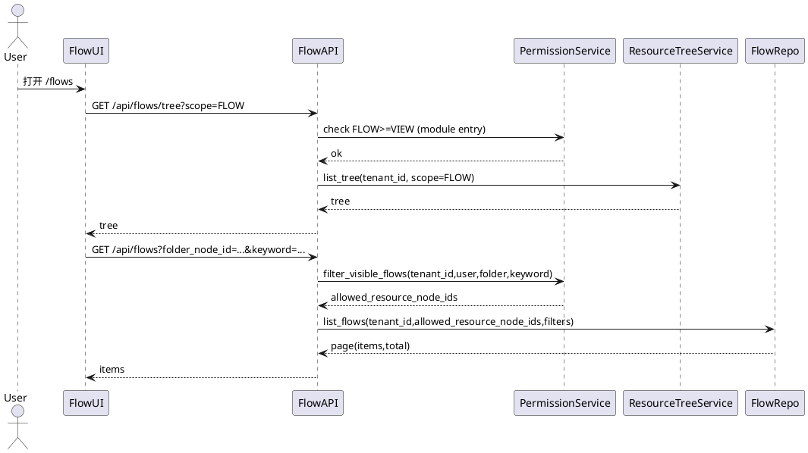

---

### 8.4.2 新建 Flow（创建定义 + 资源树节点）

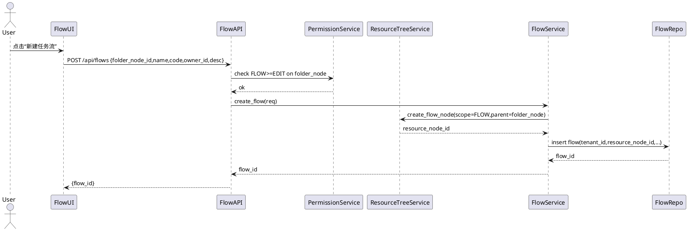

---

### 8.4.3 保存 DAG（节点/连线/配置）

```plantuml
@startuml
actor User
participant "FlowUI" as UI
participant "FlowAPI" as API
participant "PermissionService" as PS
participant "FlowService" as SVC
participant "FlowRepo" as FR
participant "ModelingRepo" as MR

User -> UI : 画布编辑并点击保存
UI -> API : PUT /api/flows/{id}/graph {nodes,edges}
API -> PS : check FLOW>=EDIT on flow
PS --> API : ok
API -> SVC : validate_and_save_graph(flow_id,payload)
SVC -> FR : lock_flow_for_update(flow_id)
FR --> SVC : flow_row

SVC -> SVC : 校验DAG(无环/无孤立/含源汇/入出度规则)
SVC -> SVC : 校验节点配置(必填/字段存在/映射覆盖)
SVC -> MR : load_tables_fields(tenant_id, used_table_ids)
MR --> SVC : meta
SVC -> PS : check TABLE_DATA>=EDIT for used tables (save-time)
PS --> SVC : ok

SVC -> FR : tx_begin
SVC -> FR : delete_nodes_edges(flow_id)
SVC -> FR : insert_nodes(flow_id, nodes)
SVC -> FR : insert_edges(flow_id, edges)
SVC -> FR : update flow.updated_graph_at
SVC -> FR : tx_commit
SVC --> API : ok
API --> UI : OK
@enduml
```

---

### 8.4.4 手动运行一次（创建 FlowRun + 执行）

```plantuml
@startuml
actor User
participant "FlowUI" as UI
participant "FlowAPI" as API
participant "PermissionService" as PS
participant "FlowService" as SVC
participant "FlowRepo" as FR
participant "Executor" as EXE

User -> UI : 点击“运行一次”
UI -> API : POST /api/flows/{id}/runs
API -> PS : check FLOW>=RUN on flow
PS --> API : ok
API -> SVC : create_run(flow_id, trigger=MANUAL, user)
SVC -> FR : has_running_run(flow_id)?
FR --> SVC : yes/no
alt running exists
  SVC --> API : error FLOW__RUN_ALREADY_RUNNING
else no running
  SVC -> SVC : 校验DAG/节点配置(同保存校验)
  SVC -> PS : check TABLE_DATA>=EDIT for used tables (run-time)
  PS --> SVC : ok
  SVC -> FR : insert flow_run(PENDING)
  FR --> SVC : run_id
  SVC -> EXE : enqueue(run_id)
  EXE --> SVC : accepted
  SVC --> API : {run_id}
end
API --> UI : {run_id}
@enduml
```

---

### 8.4.5 调度触发（跳过策略）

```plantuml
@startuml
participant "Scheduler" as SCH
participant "FlowService" as SVC
participant "FlowRepo" as FR
participant "Executor" as EXE
participant "RunLogRepo" as LR

SCH -> SVC : on_cron_tick(tenant_id, flow_id)
SVC -> FR : load_flow(flow_id)
FR --> SVC : flow(enabled,cron,...)
alt not enabled or cron empty
  SVC -> LR : insert_log(event=SCHEDULE_SKIP,message="disabled")
  LR --> SVC : ok
else enabled
  SVC -> FR : has_running_run(flow_id)?
  FR --> SVC : yes/no
  alt running exists
    SVC -> LR : insert_log(event=SCHEDULE_SKIP,message="previous still running")
    LR --> SVC : ok
  else no running
    SVC -> FR : insert flow_run(PENDING,trigger=SCHEDULE,triggered_by=SYSTEM)
    FR --> SVC : run_id
    SVC -> EXE : enqueue(run_id)
    EXE --> SVC : accepted
  end
end
@enduml
```

---

### 8.4.6 执行引擎：拓扑执行与 NodeRun 状态推进

```plantuml
@startuml
participant "Executor" as EXE
participant "FlowRepo" as FR
participant "QueryBuilder" as QB
participant "QueryRunner" as QR
participant "RunLogRepo" as LR

EXE -> FR : load_run(run_id)
FR --> EXE : FlowRun + Flow + Nodes + Edges
EXE -> FR : update FlowRun.status=RUNNING, started_at=now
FR --> EXE : ok

EXE -> EXE : topo_sort(nodes,edges)
EXE -> EXE : create NodeRun rows (PENDING)

loop each node in topo order
  EXE -> FR : update NodeRun.status=RUNNING
  FR --> EXE : ok
  EXE -> QB : compile_sql(node, upstream_tmp_tables)
  QB --> EXE : sql + tmp_table_name
  EXE -> QR : execute(sql)
  alt success
    QR --> EXE : {row_count}
    EXE -> FR : update NodeRun SUCCESS + output_row_count + extra_info(sql,tmp_table)
  else failure
    QR --> EXE : error
    EXE -> FR : update NodeRun FAILED + error_message
    EXE -> FR : mark downstream NodeRun SKIPPED
    EXE -> FR : update FlowRun FAILED + finished_at
    break
  end
end

alt all success
  EXE -> FR : update FlowRun SUCCESS + finished_at
end
@enduml
```

---

## 8.5 执行引擎（可直接实现的规则与步骤）

### 8.5.1 运行前校验（保存/运行共用）

> 校验入口：保存 DAG（PUT /graph）与运行触发（POST /runs）均必须执行。

#### 8.5.1.1 校验步骤（不少于 15 步，含异常分支）

1. 读取 Flow 基本信息（tenant_id、enabled、owner_id 等）；
2. 校验当前用户具备 FLOW 权限（保存需 EDIT，运行需 RUN）；
3. 读取所有 Node 与 Edge（保存时来自 payload，运行时来自 DB）；
4. 校验节点数量 ≥ 2；
5. 校验存在至少 1 个 TABLE_SOURCE；
6. 校验存在至少 1 个 TABLE_SINK；
7. 校验所有 node_id 唯一、edge 引用的 node_id 均存在；
8. 计算每个节点入度/出度；
9. 校验 TABLE_SOURCE 入度=0；否则报错；
10. 校验 TABLE_SINK 出度=0；否则报错；
11. 校验 JOIN 入度=2；否则报错；
12. 校验 FILTER_PROJECT/AGGREGATE/CALC_FIELD 入度=1；否则报错；
13. 校验无孤立节点：对每个节点，必须存在从某 TABLE_SOURCE 到该节点再到某 TABLE_SINK 的路径；
14. 执行拓扑排序（Kahn 算法）：
    - 若输出节点数 < 总节点数，则存在环路，报错；
15. 扫描所有节点配置，提取“使用到的表 ID 列表”：
    - TABLE_SOURCE.source_table_id
    - TABLE_SINK.target_table_id
16. 通过建模模块加载这些表及字段元数据；
17. 对每个 TABLE_SOURCE：校验源表存在，select_fields 均为该表字段；
18. 对每个 FILTER_PROJECT：校验 keep_fields 均为上游字段（上游字段集合由静态推导得到，见 8.5.2）；
19. 对 JOIN：
    - 校验 join_type 合法；
    - 校验 on 条件字段存在于左右输入；
    - 若 collision_strategy=ERROR，校验输出字段无同名冲突；
20. 对 AGGREGATE：
    - 校验 group_by 字段存在；
    - 校验 metrics 至少 1 项，func 合法；
    - 若 func≠COUNT 且 field 为空，报错；
21. 对 CALC_FIELD：
    - 校验字段名不与上游重复（或明确允许覆盖，若允许需写入规则；本版本默认不允许覆盖）；
    - 校验表达式 DSL 可解析、字段引用均存在；
22. 对 TABLE_SINK：
    - 校验目标表存在；
    - 校验 write_mode 合法；
    - 校验 field_mapping 覆盖目标表所有“非系统且必填字段”（allow_partial_mapping=false 时更严格）；
    - 校验 mapping 中 target_field 均为目标表字段、source_field 均为上游字段；
23. 保存场景：对“使用到的表”执行 `TABLE_DATA ≥ EDIT` 校验（保存时的当前用户）；
24. 运行场景：再次对“使用到的表”执行 `TABLE_DATA ≥ EDIT` 校验（触发人）；
25. 任一步失败：构造可定位的错误信息（包含 node_id、node_name、字段名/表名）并返回。

#### 8.5.1.2 典型异常分支（必须覆盖）

- A. Flow 不存在或不属于租户：返回 FLOW**NOT_FOUND / TENANT**MISMATCH；
- B. 权限不足：返回 FLOW**NO*PERMISSION*\* 或 FLOW**TABLE_PERMISSION_DENIED；
- C. DAG 有环：返回 FLOW\_\_DAG_HAS_CYCLE；
- D. 存在孤立节点：返回 FLOW\_\_DAG_ISOLATED_NODE；
- E. 缺少源/汇：返回 FLOW\_\_DAG_MISSING_SOURCE_SINK；
- F. JOIN 入边不足或多余：返回 FLOW\_\_JOIN_INVALID_INPUTS；
- G. TABLE_SINK 映射不完整：返回 FLOW\_\_SINK_MAPPING_INVALID；
- H. 表/字段不存在：返回 FLOW**TABLE_NOT_FOUND / FLOW**FIELD_NOT_FOUND；
- I. 表达式无法解析：返回 FLOW\_\_CALC_EXPR_INVALID；
- J. CRON 不合法：返回 FLOW\_\_SCHEDULE_INVALID_CRON。

---

### 8.5.2 字段集合静态推导（用于校验与 SQL 生成）

> 目标：在不执行 SQL 的情况下推导“每个节点输出字段集合”，用于：
>
> - FILTER_PROJECT.keep_fields 校验
> - JOIN.on 字段校验
> - TABLE_SINK.field_mapping 校验

**推导规则（按拓扑序）**

1. TABLE_SOURCE：输出字段 = select_fields（为空则为源表全部字段）；
2. FILTER_PROJECT：输出字段 = keep_fields（为空则继承上游输出字段）；
3. JOIN：
   - 若 select 为空：输出字段 = 左字段 ∪ 右字段（需处理冲突策略）；
   - 若 select 非空：输出字段 = select[].as（或 field）集合；
4. AGGREGATE：输出字段 = group_by ∪ metrics[].as；
5. CALC_FIELD：输出字段 = 上游字段 ∪ fields[].name；
6. TABLE_SINK：终点节点不需要输出字段集合，但需校验 mapping 依赖上游字段集合。

---

### 8.5.3 中间结果物化策略（最小可实现）

#### 8.5.3.1 物化原则

- 每个非 TABLE_SINK 节点都产生一个“可被下游引用的数据集”；
- 为保证可观测与可重试，推荐将节点输出**物化为临时表**（或临时视图）；
- 临时表的生命周期与 FlowRun 一致，FlowRun 结束后清理。

#### 8.5.3.2 临时表命名

- 命名：`tmp_flow_{flow_run_id}_{node_id}`
- 约束：
  - 最大长度需满足底层引擎限制（超过则使用 hash：`tmp_flow_{run_id}_{hash(node_id)}`）
  - 仅允许 `[a-zA-Z0-9_]+`

#### 8.5.3.3 清理策略

- 执行引擎在 FlowRun finished 后：
  - 遍历 NodeRun.extra_info.tmp_table，逐个 DROP；
  - DROP 失败仅写日志，不影响 FlowRun 最终状态。

---

### 8.5.4 SQL 生成规则（按 NodeType）

> QueryBuilder 负责将节点配置翻译为底层 SQL。
> QueryRunner 负责在对应数据源上执行 SQL 并返回受影响行数（读：select 行数；写：insert 行数）。

#### 8.5.4.1 TABLE_SOURCE

1. 生成 SELECT 子句：
   - select_fields 为空：`SELECT *`
   - 否则：`SELECT f1,f2,...`
2. 生成 FROM 子句：`FROM <physical_table>`
3. FilterDSL → WHERE：
   - AND/OR 递归生成
4. order_by → ORDER BY
5. limit → LIMIT
6. 物化：
   - `CREATE TABLE <tmp> AS <select_sql>`（若引擎不支持 CTAS，则先建表再 INSERT）

#### 8.5.4.2 FILTER_PROJECT

- 输入表：上游临时表 `<tmp_up>`
- 生成 SQL：
  - `SELECT <fields> FROM <tmp_up> WHERE <filter>`
- 物化：写入本节点临时表 `<tmp_cur>`

#### 8.5.4.3 JOIN

- 输入表：左 `<tmp_left>`，右 `<tmp_right>`
- Join 条件：仅支持等值条件（`=`），多条件用 AND
- 生成 SQL：
  - `SELECT <select_list> FROM <tmp_left> L <JOIN_TYPE> JOIN <tmp_right> R ON <on_expr>`
- 字段冲突：
  - collision*strategy=PREFIX：同名字段按 `L*`/`R\_` 前缀重命名（由 select_list 生成时处理）
  - collision_strategy=ERROR：编译期直接报错

#### 8.5.4.4 AGGREGATE

- 输入表：`<tmp_up>`
- group_by 为空：
  - `SELECT <metrics_expr> FROM <tmp_up>`
- group_by 非空：
  - `SELECT <group_fields>, <metrics_expr> FROM <tmp_up> GROUP BY <group_fields>`

metrics_expr 示例：

- COUNT(\*): `COUNT(1) AS order_cnt`
- SUM(field): `SUM(pay_amount) AS pay_sum`

#### 8.5.4.5 CALC_FIELD

- 输入表：`<tmp_up>`
- 生成 SQL：
  - `SELECT <up_fields>, <expr1> AS new1, <expr2> AS new2 ... FROM <tmp_up>`
- expr → SQL：
  - ref：字段名
  - const：常量（注意字符串转义）
  - op：映射到 SQL 运算符/函数

#### 8.5.4.6 TABLE_SINK

- 输入表：`<tmp_up>`
- 目标表：`<target_physical_table>`

写入模式：

1. APPEND

- `INSERT INTO <target>(t1,t2,...) SELECT s1,s2,... FROM <tmp_up>`

2. TRUNCATE_INSERT（最小可实现，要求底层支持事务或可接受短暂空窗）

- 方案 A（底层支持事务）：
  1. BEGIN
  2. TRUNCATE <target>
  3. INSERT INTO <target> SELECT ...
  4. COMMIT
- 方案 B（底层不支持事务，推荐）：
  1. 创建 staging 表：`<target>__stg__{run_id}`（结构与目标表一致）
  2. INSERT INTO staging SELECT ...
  3. 原子替换（若支持 rename swap）：rename 交换 staging 与 target
  4. 清理旧表

> 若底层引擎不支持“原子替换”，则 TRUNCATE_INSERT 在该引擎上必须被禁用（保存时校验不通过）。

---

### 8.5.5 执行状态推进规则

1. FlowRun 从 PENDING → RUNNING：由 Executor 开始执行时更新 started_at；
2. NodeRun 初始化：
   - 每个节点创建 1 条 NodeRun，初始 PENDING；
3. 每执行一个节点：
   - NodeRun PENDING → RUNNING，写 started_at；
   - 成功：RUNNING → SUCCESS，写 finished_at、output_row_count；
   - 失败：RUNNING → FAILED，写 finished_at、error_message；
4. 节点失败后：
   - 其所有下游节点 NodeRun 置为 SKIPPED；
   - FlowRun 置为 FAILED 并写 finished_at；
5. 全部节点 SUCCESS：
   - FlowRun 置为 SUCCESS 并写 finished_at。

---

## 8.6 接口清单与实现要求

> 统一返回结构：`{"code":"OK|ERROR_CODE","message":"","data":...,"request_id":"..."}`  
> 分页统一：`page`（从 1 开始）、`page_size`（默认 20，最大 200）

### 8.6.1 接口清单总览（Flow 模块）

#### A. 资源树（scope=FLOW，复用资源树服务）

- GET /api/resource-tree?scope=FLOW
- POST /api/resource-tree/folders（创建 Folder）
- PATCH /api/resource-tree/nodes/{node_id}（重命名/移动）
- DELETE /api/resource-tree/nodes/{node_id}（删除 Folder/Flow 节点）

#### B. Flow 定义

- GET /api/flows（列表）
- POST /api/flows（新建）
- GET /api/flows/{flow_id}（详情）
- PATCH /api/flows/{flow_id}（编辑基本信息）
- DELETE /api/flows/{flow_id}（删除）

#### C. DAG 画布

- GET /api/flows/{flow_id}/graph（读取画布数据）
- PUT /api/flows/{flow_id}/graph（保存画布数据）
- POST /api/flows/{flow_id}/validate（独立校验，可选，但建议提供）

#### D. 调度

- GET /api/flows/{flow_id}/schedule（读取调度配置）
- PUT /api/flows/{flow_id}/schedule（更新调度配置）

#### E. 运行与监控

- POST /api/flows/{flow_id}/runs（手动触发一次）
- GET /api/flows/{flow_id}/runs（运行记录列表）
- GET /api/flow-runs/{run_id}（运行详情 + DAG 着色数据）
- GET /api/flow-runs/{run_id}/node-runs（节点运行列表）
- GET /api/flow-node-runs/{node_run_id}（节点运行详情）
- GET /api/flow-runs/{run_id}/logs（运行日志）
- GET /api/flows/{flow_id}/logs（Flow 日志）

#### F. 权限配置（复用授权接口，资源类型=FLOW）

- GET /api/permissions/resources/{resource_node_id}?scope=FLOW
- POST /api/permissions/grants（授权）
- DELETE /api/permissions/grants/{grant_id}（回收）

---

### 8.6.2 错误码（Flow 模块）

| 错误码                           | HTTP | 触发场景                   | 处理建议                        |
| -------------------------------- | ---: | -------------------------- | ------------------------------- |
| FLOW\_\_NOT_FOUND                |  404 | flow_id 不存在或不属于租户 | 检查 ID/租户                    |
| FLOW\_\_NO_PERMISSION_VIEW       |  403 | 无 FLOW≥VIEW               | 申请权限                        |
| FLOW\_\_NO_PERMISSION_EDIT       |  403 | 无 FLOW≥EDIT               | 申请权限                        |
| FLOW\_\_NO_PERMISSION_RUN        |  403 | 无 FLOW≥RUN                | 申请权限                        |
| FLOW\_\_NO_PERMISSION_MANAGE     |  403 | 无 FLOW=MANAGE             | 申请权限                        |
| FLOW\_\_INVALID_NAME             |  400 | display_name 非法          | 1–50 字符                       |
| FLOW\_\_DUPLICATE_CODE           |  409 | code 冲突                  | 修改 code                       |
| FLOW\_\_DAG_HAS_CYCLE            |  400 | 保存/运行时发现环          | 修正连线                        |
| FLOW\_\_DAG_ISOLATED_NODE        |  400 | 存在孤立节点               | 确保源 → 汇路径                 |
| FLOW\_\_DAG_MISSING_SOURCE_SINK  |  400 | 缺少源/汇节点              | 添加 TABLE_SOURCE/TABLE_SINK    |
| FLOW\_\_NODE_TYPE_NOT_SUPPORTED  |  400 | 节点类型不支持             | 使用允许的 NodeType             |
| FLOW\_\_NODE_CONFIG_INVALID      |  400 | 节点 config 缺字段/非法    | 检查配置面板                    |
| FLOW\_\_TABLE_NOT_FOUND          |  404 | source/target 表不存在     | 重新选择表                      |
| FLOW\_\_FIELD_NOT_FOUND          |  404 | 字段不存在                 | 更新字段选择/映射               |
| FLOW\_\_TABLE_PERMISSION_DENIED  |  403 | TABLE_DATA<EDIT            | 申请表权限                      |
| FLOW\_\_SINK_MAPPING_INVALID     |  400 | 字段映射不完整/冲突        | 补齐必填字段映射                |
| FLOW\_\_JOIN_INVALID_INPUTS      |  400 | JOIN 入边不为 2/条件非法   | 调整连线与 on 条件              |
| FLOW\_\_AGGREGATE_INVALID_CONFIG |  400 | 聚合配置非法               | 修正 group/metrics              |
| FLOW\_\_CALC_EXPR_INVALID        |  400 | 表达式 DSL 不合法          | 修正表达式                      |
| FLOW\_\_SCHEDULE_INVALID_CRON    |  400 | cron 非 5 段或解析失败     | 改为合法 cron                   |
| FLOW\_\_RUN_ALREADY_RUNNING      |  409 | 同一 Flow 已有 RUNNING     | 等待或查看运行记录              |
| FLOW\_\_ENGINE_UNAVAILABLE       |  503 | 查询引擎不可用             | 稍后重试/联系运维               |
| FLOW\_\_SQL_EXEC_ERROR           |  500 | SQL 执行失败               | 查看 NodeRun.error_message/日志 |

---

## 8.7 接口详细说明（字段级、校验、异常分支、伪代码）

> 说明格式统一：用途 → 权限 → 入参/出参 → 校验与异常分支 → 错误码 → 伪代码

### 8.7.1 GET /api/flows

**用途：**Flow 列表区域加载（支持目录、搜索、排序、分页）。

**权限：**

- 模块入口：需具备 FLOW≥VIEW（任意一个可见 Flow 即可进入）
- 返回数据：仅返回用户具备 `FLOW≥VIEW` 的 Flow

**入参（Query）**

| 字段           | 类型   | 必填 | 说明                             |
| -------------- | ------ | ---: | -------------------------------- |
| folder_node_id | BIGINT |   否 | 资源树 folder 节点（scope=FLOW） |
| include_descendants | boolean | 否 | true | 是否包含子目录（后代）中的任务流；仅当 folder_node_id 指向目录节点时生效 |
| keyword        | STRING |   否 | 名称/编码模糊搜索                |
| owner_id       | BIGINT |   否 | 负责人过滤                       |
| enabled        | BOOL   |   否 | 是否启用过滤                     |
| sort           | STRING |   否 | created_at/updated_graph_at      |
| order          | STRING |   否 | ASC/DESC                         |
| page           | INT    |   否 | 默认 1                           |
| page_size      | INT    |   否 | 默认 20，最大 200                |

**出参 data**

```json
{
  "items": [
    {
      "id": 1,
      "code": "daily_user_kpi",
      "display_name": "每日用户指标",
      "description": "",
      "owner_id": 100,
      "enabled": true,
      "schedule_cron": "0 3 * * *",
      "schedule_timezone": "Asia/Tokyo",
      "updated_graph_at": "2025-12-20 10:00:00",
      "created_at": "2025-12-18 10:00:00"
    }
  ],
  "page": 1,
  "page_size": 20,
  "total": 123
}
```

**校验规则与异常分支**

1. 若 folder_node_id 不属于 scope=FLOW 或不在当前租户：返回 FLOW**NOT_FOUND（或 RESOURCE**NOT_FOUND）；
2. keyword 超长（>100）：返回 PARAM\_\_INVALID；
3. sort/order 非法：返回 PARAM\_\_INVALID；
4. 列表可见性：由权限服务先筛出可见 resource_node_id 列表。

**错误码**

- FLOW\_\_NO_PERMISSION_VIEW
- PARAM\_\_INVALID
- RESOURCE\_\_NOT_FOUND

**伪代码**

```python
def list_flows(tenant_id, user, q):
    allowed_nodes = permission_service.list_visible_resource_nodes(
        tenant_id=tenant_id, user=user, scope="FLOW", min_level="VIEW",
        folder_node_id=q.folder_node_id
    )
    return flow_repo.page_list(
        tenant_id=tenant_id,
        resource_node_ids=allowed_nodes,
        keyword=q.keyword,
        owner_id=q.owner_id,
        enabled=q.enabled,
        sort=q.sort,
        order=q.order,
        page=q.page,
        page_size=min(q.page_size, 200),
    )
```

---

### 8.7.2 POST /api/flows

**用途：**新建 Flow（生成 flow 记录 + 资源树节点）。

**权限：**

- 目标 folder_node：需 `FLOW≥EDIT`（或具备创建 Flow 的等价权限规则）

**入参（Body）**

| 字段           | 类型   | 必填 | 说明                                          |
| -------------- | ------ | ---: | --------------------------------------------- |
| folder_node_id | BIGINT |   是 | 资源树 folder 节点（scope=FLOW）              |
| code           | STRING |   是 | 1–64；租户内唯一；仅允许字母数字下划线/短横线 |
| display_name   | STRING |   是 | 1–50                                          |
| description    | STRING |   否 | ≤500                                          |
| owner_id       | BIGINT |   是 | 负责人（TenantUser.id）                       |
| enabled        | BOOL   |   否 | 默认 true                                     |

**出参 data**

```json
{ "id": 1 }
```

**校验规则与异常分支（不少于 10 条）**

1. folder_node_id 必须存在且 scope=FLOW；
2. 用户在 folder_node 上必须满足 FLOW≥EDIT，否则拒绝；
3. code 不能为空、长度 1–64；
4. code 正则校验：`^[a-zA-Z][a-zA-Z0-9_-]*$`；
5. code 租户内唯一，否则返回冲突；
6. display_name 长度 1–50；
7. owner_id 必须存在且属于当前租户；
8. 创建资源树节点失败：回滚并返回 RESOURCE\_\_CREATE_FAILED；
9. 写入 flow 失败：删除已创建资源树节点（补偿）并返回 DB\_\_ERROR；
10. 写审计失败：不影响主流程（记录 warning）。

**错误码**

- FLOW\_\_DUPLICATE_CODE
- FLOW\_\_INVALID_NAME
- FLOW\_\_NO_PERMISSION_EDIT
- RESOURCE**NOT_FOUND / RESOURCE**CREATE_FAILED
- DB\_\_ERROR

**伪代码**

```python
def create_flow(tenant_id, user, body):
    permission_service.assert_resource_level(tenant_id, user, body.folder_node_id, "FLOW", "EDIT")

    validate_code(body.code)
    validate_display_name(body.display_name)
    ensure_owner_exists(tenant_id, body.owner_id)

    # 先创建资源树节点，再创建 flow
    node_id = resource_tree_service.create_node(
        tenant_id=tenant_id, scope="FLOW", node_type="FLOW",
        parent_node_id=body.folder_node_id,
        display_name=body.display_name,
        code=body.code
    )

    try:
        flow_id = flow_repo.insert({
            "tenant_id": tenant_id,
            "resource_node_id": node_id,
            "code": body.code,
            "display_name": body.display_name,
            "description": body.description,
            "owner_id": body.owner_id,
            "enabled": body.enabled if body.enabled is not None else 1,
            "schedule_cron": None,
            "schedule_timezone": tenant_default_timezone(tenant_id),
            "created_by": user.id,
            "updated_by": user.id,
        })
    except Exception:
        resource_tree_service.delete_node(tenant_id, node_id)  # 补偿
        raise

    audit_service.write("CREATE_FLOW", actor=user, obj={"flow_id": flow_id, "code": body.code})
    return flow_id
```

---

### 8.7.3 GET /api/flows/{flow_id}

**用途：**Flow 详情页基础信息加载。

**权限：**

- 需 `FLOW≥VIEW`

**出参 data（示例）**

```json
{
  "id": 1,
  "code": "daily_user_kpi",
  "display_name": "每日用户指标",
  "description": "",
  "owner_id": 100,
  "enabled": true,
  "schedule_cron": "0 3 * * *",
  "schedule_timezone": "Asia/Tokyo",
  "updated_graph_at": "2025-12-20 10:00:00"
}
```

**异常分支**

- Flow 不存在：FLOW\_\_NOT_FOUND
- 无权限：FLOW\_\_NO_PERMISSION_VIEW

**伪代码**

```python
def get_flow(tenant_id, user, flow_id):
    flow = flow_repo.get(tenant_id, flow_id)
    if not flow: raise Err("FLOW__NOT_FOUND")
    permission_service.assert_flow_level(tenant_id, user, flow.resource_node_id, "VIEW")
    return flow
```

---

### 8.7.4 PATCH /api/flows/{flow_id}

**用途：**编辑 Flow 基本信息（名称、描述、负责人、enabled）。

**权限：**

- 需 `FLOW≥EDIT`；若修改调度配置则需 `FLOW=MANAGE`（调度配置走独立接口）

**入参（Body）**

| 字段         | 类型   | 必填 | 说明     |
| ------------ | ------ | ---: | -------- |
| display_name | STRING |   否 | 1–50     |
| description  | STRING |   否 | ≤500     |
| owner_id     | BIGINT |   否 | 负责人   |
| enabled      | BOOL   |   否 | 是否启用 |

**校验与异常分支**

1. Flow 存在性与租户归属校验；
2. 权限：FLOW≥EDIT；
3. display_name 校验；
4. owner_id 校验；
5. 同步资源树节点名称（display_name 改变时）：
   - 更新 resource_tree_node.display_name；
6. 写库失败返回 DB\_\_ERROR；
7. 写审计失败不影响主流程。

**错误码**

- FLOW\_\_NOT_FOUND
- FLOW\_\_NO_PERMISSION_EDIT
- FLOW\_\_INVALID_NAME
- DB\_\_ERROR

---

### 8.7.5 DELETE /api/flows/{flow_id}

**用途：**删除 Flow（删除定义与节点连线；保留 FlowRun/NodeRun 记录，不做物理删除）。

**权限：**

- 仅 `FLOW=MANAGE`

**实现要求**

- 删除 flow_node、flow_edge、flow（软删除或硬删除均可，但必须保留运行记录）
- 资源树节点也需删除（或标记 deleted），确保列表不再出现
- 若存在 RUNNING FlowRun：
  - 本版本不提供取消；删除应被拒绝，返回 FLOW\_\_RUN_ALREADY_RUNNING

**错误码**

- FLOW\_\_NO_PERMISSION_MANAGE
- FLOW\_\_RUN_ALREADY_RUNNING

---

### 8.7.6 GET /api/flows/{flow_id}/graph

**用途：**加载 DAG 画布数据（nodes + edges + position + config）。

**权限：**

- 需 `FLOW≥VIEW`

**出参 data（示例）**

```json
{
  "nodes": [
    {"id": 11, "type":"TABLE_SOURCE", "name":"表数据源_1", "position":{"x":200,"y":100}, "config": {...}},
    {"id": 12, "type":"TABLE_SINK", "name":"写入表_1", "position":{"x":700,"y":100}, "config": {...}}
  ],
  "edges": [
    {"id": 21, "from_node_id": 11, "to_node_id": 12}
  ]
}
```

**异常分支**

- Flow 不存在 / 无权限

---

### 8.7.7 PUT /api/flows/{flow_id}/graph

**用途：**保存 DAG（替换当前节点/连线配置；本版本不保留多历史版本）。

**权限：**

- 需 `FLOW≥EDIT`

**入参（Body）**

| 字段  | 类型  | 必填 | 说明                 |
| ----- | ----- | ---: | -------------------- |
| nodes | ARRAY |   是 | 节点数组（见 8.3.2） |
| edges | ARRAY |   是 | 连线数组（见 8.3.3） |

**校验规则与异常分支（必须覆盖）**

- 按 8.5.1 全量校验执行；
- 保存采用单事务：
  - 先删后插，保证与 edges 的外键引用一致；
- 任一校验失败：返回对应错误码，不落库；
- 落库成功后写审计：UPDATE_FLOW_GRAPH。

**错误码**

- FLOW**DAG_HAS_CYCLE / FLOW**DAG_ISOLATED_NODE / FLOW\_\_DAG_MISSING_SOURCE_SINK
- FLOW**NODE_CONFIG_INVALID / FLOW**TABLE_PERMISSION_DENIED / FLOW\_\_SINK_MAPPING_INVALID
- DB\_\_ERROR

**伪代码**

```python
def save_graph(tenant_id, user, flow_id, payload):
    flow = flow_repo.get_for_update(tenant_id, flow_id)
    permission_service.assert_flow_level(tenant_id, user, flow.resource_node_id, "EDIT")

    validate_graph(payload.nodes, payload.edges, tenant_id, user)  # 8.5.1

    with db.transaction():
        flow_edge_repo.delete_by_flow(flow_id)
        flow_node_repo.delete_by_flow(flow_id)
        flow_node_repo.bulk_insert(flow_id, tenant_id, payload.nodes)
        flow_edge_repo.bulk_insert(flow_id, tenant_id, payload.edges)
        flow_repo.update(flow_id, {"updated_graph_at": now(), "updated_by": user.id})

    audit_service.write("UPDATE_FLOW_GRAPH", actor=user, obj={"flow_id": flow_id})
```

---

### 8.7.8 POST /api/flows/{flow_id}/validate

**用途：**仅做校验，不落库（用于画布保存前的“预校验”按钮）。

**权限：**

- 需 `FLOW≥EDIT`

**行为：**

- 调用同一套 `validate_graph(...)`
- 返回校验结果列表（包含 node_id、field 等定位信息）

---

### 8.7.9 GET /api/flows/{flow_id}/schedule

**用途：**读取调度配置。

**权限：**

- 需 `FLOW≥VIEW`

**出参 data**

```json
{
  "enabled": true,
  "schedule_cron": "0 3 * * *",
  "schedule_timezone": "Asia/Tokyo"
}
```

---

### 8.7.10 PUT /api/flows/{flow_id}/schedule

**用途：**更新调度配置（是否启用、cron、时区）。

**权限：**

- 仅 `FLOW=MANAGE`

**入参（Body）**

| 字段              | 类型   | 必填 | 说明                    |
| ----------------- | ------ | ---: | ----------------------- |
| enabled           | BOOL   |   是 | 是否启用调度            |
| schedule_cron     | STRING |   否 | 5 段 CRON；为空则不调度 |
| schedule_timezone | STRING |   是 | IANA TZ                 |

**校验与异常分支**

1. schedule_timezone 必须为可识别 IANA TZ；
2. schedule_cron 为空且 enabled=true：
   - 允许（表示启用调度开关但未配置 cron），调度器应视为“不触发”，并写提示日志（可选）；
3. schedule_cron 非空：
   - 必须能解析为 5 段 cron（分/时/日/月/周）；
4. 更新成功后写审计：UPDATE_FLOW_SCHEDULE。

**错误码**

- FLOW\_\_NO_PERMISSION_MANAGE
- FLOW\_\_SCHEDULE_INVALID_CRON
- PARAM\_\_INVALID

---

### 8.7.11 POST /api/flows/{flow_id}/runs

**用途：**手动触发一次运行。

**权限：**

- 需 `FLOW≥RUN`

**出参 data**

```json
{ "run_id": 9001 }
```

**校验与异常分支（覆盖完全）**

1. Flow 存在性；
2. 权限：FLOW≥RUN；
3. 并发：存在 RUNNING FlowRun → 返回 FLOW\_\_RUN_ALREADY_RUNNING；
4. DAG/节点配置校验（同 8.5.1）；
5. 表权限校验（运行时再次检查）：`TABLE_DATA ≥ EDIT`；
6. 创建 FlowRun（PENDING）与所有 NodeRun（PENDING）：
   - 若 NodeRun 批量插入失败：回滚并删除 FlowRun；
7. 投递执行队列失败：
   - 将 FlowRun 置为 FAILED（message=enqueue failed），并返回 FLOW\_\_ENGINE_UNAVAILABLE；
8. 写审计：MANUAL_TRIGGER_RUN。

**错误码**

- FLOW\_\_RUN_ALREADY_RUNNING
- FLOW\_\_TABLE_PERMISSION_DENIED
- FLOW\_\_ENGINE_UNAVAILABLE

---

### 8.7.12 GET /api/flows/{flow_id}/runs

**用途：**运行记录列表。

**权限：**

- 需 `FLOW≥VIEW`

**出参 data（示例）**

```json
{
  "items": [
    {
      "id": 9001,
      "trigger_type": "MANUAL",
      "triggered_by": "100",
      "status": "SUCCESS",
      "started_at": "...",
      "finished_at": "..."
    },
    {
      "id": 9002,
      "trigger_type": "SCHEDULE",
      "triggered_by": "SYSTEM",
      "status": "FAILED",
      "started_at": "...",
      "finished_at": "..."
    }
  ],
  "page": 1,
  "page_size": 20,
  "total": 2
}
```

---

### 8.7.13 GET /api/flow-runs/{run_id}

**用途：**FlowRun 详情（基本信息 + DAG 着色数据）。

**权限：**

- 需对该 Flow 具备 `FLOW≥VIEW`

**出参 data（建议）**

```json
{
  "run": {...},
  "nodes": [{"node_id":11,"status":"SUCCESS"},{"node_id":12,"status":"FAILED"}],
  "edges": [{"from_node_id":11,"to_node_id":12}]
}
```

---

### 8.7.14 GET /api/flow-runs/{run_id}/node-runs

**用途：**节点运行列表（或用于前端构建节点详情面板）。

**权限：**

- `FLOW≥VIEW`

---

### 8.7.15 GET /api/flow-node-runs/{node_run_id}

**用途：**节点运行详情（含 extra_info 中 SQL 片段、join 条件、聚合规则等）。

**权限：**

- `FLOW≥VIEW`

---

### 8.7.16 GET /api/flow-runs/{run_id}/logs

**用途：**查看该次运行日志（含校验失败、执行阶段、调度跳过原因等）。

**权限：**

- `FLOW≥VIEW`

---

### 8.7.17 Flow 权限配置接口（复用授权接口）

> Flow 权限配置不单独发明新模型；复用权限体系的“资源授权”能力。  
> 关键点：授权对象 = resource_node_id（scope=FLOW）。

**接口**

1. GET /api/permissions/resources/{resource_node_id}?scope=FLOW
2. POST /api/permissions/grants
3. DELETE /api/permissions/grants/{grant_id}

**Flow 侧关键校验**

- 只有 `FLOW=MANAGE` 的用户允许修改授权；
- 授权的 subject（用户/角色/用户组）必须属于同一租户；
- 授权 level 必须属于 FLOW 资源支持的级别集合：VIEW/EDIT/RUN/MANAGE。

---

## 8.8 调度器实现要点（本版本）

### 8.8.1 Cron 解析与触发

- Cron 为 5 段：分、时、日、月、周；
- 以 Flow.schedule_timezone 作为解析时区；
- 每次 tick 扫描“enabled=true 且 schedule_cron 非空”的 Flow；
- 若系统不可用导致错过执行：
  - 不补跑；
  - 恢复后从下一次 cron 时间点开始；
  - 需要补跑则由用户手动运行一次。

### 8.8.2 调度跳过日志

- 当同一 Flow 已有 RUNNING 时：
  - 不新建 FlowRun；
  - 写入 flow_run_log：
    - event_type=SCHEDULE_SKIP
    - message="previous run still running"
    - extra 包含上一次 run_id 与 cron 时间点（可选）

---

## 8.9 审计事件（Flow 侧）

### 8.9.1 需要记录的审计事件

- CREATE_FLOW
- UPDATE_FLOW_BASIC
- UPDATE_FLOW_GRAPH
- DELETE_FLOW
- UPDATE_FLOW_SCHEDULE
- UPDATE_FLOW_PERMISSION
- MANUAL_TRIGGER_RUN
- SCHEDULE_TRIGGER_RUN
- RUN_SUCCESS / RUN_FAILED
- MANUAL_TRIGGER_REJECTED_RUNNING（手动触发被拒绝）
- SCHEDULE_SKIP_RUNNING（调度跳过）

### 8.9.2 审计字段最小集

- actor：TenantUser / GlobalUser（系统触发写 SYSTEM）
- time
- action_type
- object：flow_id/flow_code，run_id（若有）
- diff：编辑前后值（仅编辑类事件）
- result：success/failed + reason（失败摘要）

---

## 8.10 兼容性与扩展点（预留）

- Flow 版本管理：当前不提供；未来可引入 flow_version 表并在 run 时固化版本快照；
- 取消运行：状态 CANCELLED 已预留，后续可在 Executor 中实现中断与清理；
- 增量读取：TABLE_SOURCE 已明确本版本不提供；
- 事件驱动触发：本版本不提供；
- 节点类型扩展：NodeType 与 Node.config 采用 JSON，可在保持向后兼容前提下扩展。

# 9 报表（数据集 / 图表 / 仪表盘）

> 本章统一名词：Dataset / Chart / Dashboard（仪表盘）。历史实现中的 Board/Widget 属于旧命名，不再作为对外模型/API 口径；如需兼容，仅允许在内部做别名映射。

---

## 9.1 模块定位与依赖

### 9.1.1 资产链路

V1 的报表链路为：

1) **Dataset（数据集）**：基于 Base Table 定义过滤/列选择，并刷新为 DW 物化表  
2) **Chart（图表）**：绑定一个 Dataset，保存 query_config_json + viz_config_json  
3) **Dashboard（仪表盘）**：通过 DashboardItem 引用多个 Chart，并以 layout_json 保存布局

### 9.1.2 依赖的公共能力

- 多租户隔离：TenantContext（tenant_id、timezone）
- 资源树与授权：scope=DATASET、scope=DASHBOARD 的 ResourceNode，权限模型见第 5 章
- Query Engine：负责将 query_config_json 编译为 SQL 并执行（读取 dataset_table）
- Scheduler/Worker：DatasetRefresh 与 Export 统一走 TaskRunInstance 执行框架
- 文件存储：导出文件上传到对象存储并返回 file_url

---

## 9.2 V1 边界（必须遵守）

1. **Dashboard filters_json（全局筛选）固定为空（null 或 []）**  
   - 后端在保存/更新 Dashboard 时必须强校验：若 filters_json 非空，返回错误 `DASHBOARD_FILTERS_NOT_SUPPORTED`  
2. **不支持整页 Dashboard 导出**（PDF/全页截图等）  
   - 仅支持**单个 Chart**导出：数据（CSV）或图片（PNG）  
3. Dataset 刷新仅支持**全量覆盖式物化**  
4. 不支持外部文件数据源直接作为 Dataset 输入（后续版本能力）

---

## 9.3 数据集（Dataset）

### 9.3.1 概念与落地

- Dataset 是“可复用的数据结果表”资产：**先定义、再刷新、再消费**
- Dataset 的定义保存在元数据表 `dataset`
- Dataset 刷新后在 DW 生成一张物化表（以下简称 dataset_table）：
  - 表名：`ds_{tenant_id}_{dataset_id}`（示例）
  - 写入策略：临时表写入 + 原子 swap
- **所有 Chart 查询必须读取 dataset_table**，不得绕过 Dataset 直接读 base_table

### 9.3.2 状态机（与 PRD 10.5 对齐）

#### 状态枚举（必须实现）

- `DRAFT`（可选）：仅保存配置，尚未首次刷新  
  - 若产品侧不需要草稿，可用 `ACTIVE + last_success_at=NULL` 表示“未就绪”
- `ACTIVE`：可正常刷新、可被查询（**满足可查询还需 last_success_at 非空**）
- `REFRESHING`：刷新进行中（同一数据集禁止并发刷新）
- `FAILED`：刷新失败（配置错误、源表不可用、超时等）
- `BLOCKED`：刷新被阻断（Owner 合规校验不通过，详见 9.3.3）
- `PAUSED`：Owner/管理员主动暂停（仅影响 CRON；手动刷新仍可触发）

#### 展示态（UI Tag，非存储枚举）

- `READY`：`status=ACTIVE` 且 `last_success_at != NULL`
- `NOT_READY`：`status=ACTIVE` 且 `last_success_at == NULL`（创建后未首次刷新）

> 说明：PRD 在刷新章节使用了 “首次刷新成功进入 READY” 的表述；实现上以 **展示态 READY** 表达即可，避免引入第二套存储状态源。

#### 迁移规则（核心）

- 创建：
  - 有草稿：`DRAFT`
  - 无草稿：`ACTIVE` 且 `last_success_at=NULL`
- 启用：`DRAFT -> ACTIVE`（不改变 last_success_at）
- 刷新触发：
  - `ACTIVE/FAILED/PAUSED -> REFRESHING`
  - `BLOCKED`：禁止刷新（返回 `DATASET_OWNER_BLOCKED`）
  - `REFRESHING`：拒绝并发刷新（返回 `DATASET_REFRESH_ALREADY_RUNNING`）
- 刷新成功：`REFRESHING -> ACTIVE`，并写入：
  - `last_success_at=now`
  - `last_failed_reason=NULL`
  - `last_refresh_duration_ms`
- 刷新失败：`REFRESHING -> FAILED`，并写入：
  - `last_failed_reason`
  - `last_failure_at=now`
- Owner 校验失败：`ACTIVE/FAILED/PAUSED/DRAFT -> BLOCKED`
- 暂停：`ACTIVE/FAILED -> PAUSED`
- 恢复：`PAUSED -> ACTIVE`（不改变 last_success_at）

#### 可查询判定（统一规则）

- 当且仅当：
  - `status in (ACTIVE, FAILED, PAUSED)` 且
  - `last_success_at != NULL` 且
  - `dataset_table 存在`
- 否则对外统一报：`DATASET_NOT_READY`

---

### 9.3.3 Owner 合规校验（强制，阻断刷新）

> PRD 要求：数据集的范围（列范围 + 行范围）以“创建时快照”为准，不得因 Owner 权限扩大而自动扩大；也不得因权限收紧而悄悄改变既有范围（必须阻断刷新并提示原因）。

#### 9.3.3.1 数据集范围快照定义（存储）

- **列范围快照（Allowed Columns Snapshot）**：创建时 Owner 在来源表上可见的列集合（去掉 HIDDEN），存入 `allowed_columns_snapshot_json`
- **行范围快照（RowScopeFilter Snapshot）**：创建时 Owner 在来源表上的行权限合并结果（RowPermission 的 OR 合并），存入 `row_scope_filter_snapshot_json`
- **数据集基础过滤（DatasetBaseFilter）**：用户配置的 `base_filter_json`（FilterDSL）
- **最终范围表达式**：
  - `FinalScope = RowScopeFilterSnapshot AND DatasetBaseFilter`
  - RowScopeFilterSnapshot 为空视为 TRUE；DatasetBaseFilter 为空视为 TRUE

#### 9.3.3.2 刷新前必须校验的项目（按顺序执行，任一失败则阻断）

1) **配置可用性校验**
- base_table 仍存在（table_catalog 可解析）
- 选择字段仍存在且类型兼容（字段删除/类型变更会导致失败）
- `base_filter_json` 可解析、可编译（FilterDSL 合法）

2) **Owner 基本有效性**
- owner_user_id 必须存在且属于当前租户（TenantUser）
- Owner 未被禁用、未离开租户、未被系统封禁

3) **Owner 列权限覆盖校验（关键）**
- 计算 Owner 在来源表上的当前列权限结果 `current_allowed_columns`
- 要求：`allowed_columns_snapshot ⊆ current_allowed_columns`
  - 若任一快照列在当前变为 HIDDEN/不可见 → 不通过（返回 `DATASET_OWNER_COLUMN_PERMISSION_SHRINK`）

4) **Owner 行权限覆盖校验（关键）**
- 计算 Owner 在来源表上的当前行权限合并结果 `current_row_scope_filter`（OR 合并后归一化）
- 要求：`RowScopeFilterSnapshot` 必须被 `current_row_scope_filter` 覆盖  
  - V1 实现约束：仅支持“OR-of-clauses”的行权限归一化结构（与 RowPermission 合并规则一致）
  - 校验方式：`snapshot_clauses ⊆ current_clauses`
  - 若 Owner 权限收紧导致缺少任一快照 clause → 不通过（返回 `DATASET_OWNER_ROW_PERMISSION_SHRINK`）
  - 若 Owner 权限扩大（current_clauses 增多）→ 允许刷新（数据集范围不扩大，仍按快照）

5) **通过则允许刷新，否则进入 BLOCKED**
- 若 3/4 任一失败：
  - `dataset.status = BLOCKED`
  - 写入 `blocked_reason_code` 与 `blocked_reason_detail_json`
  - 返回 `DATASET_OWNER_BLOCKED`（并携带原因详情，供前端引导“转移 Owner/调整范围/重新创建”）

#### 9.3.3.3 产出结构（供前端展示）

- `blocked_reason_code`：
  - `OWNER_NOT_FOUND`
  - `OWNER_DISABLED`
  - `OWNER_COLUMN_PERMISSION_SHRINK`
  - `OWNER_ROW_PERMISSION_SHRINK`
  - `BASE_FILTER_INVALID`
  - `BASE_TABLE_NOT_FOUND`
- `blocked_reason_detail_json`：
  - missing_columns：数组
  - missing_row_clauses：数组（规范化后的 clause 哈希或可读表达式）
  - base_filter_error：可选（解析错误信息）

---

### 9.3.4### 9.3.4 刷新触发与 cron

- 刷新触发类型：
  - MANUAL：手动刷新
  - CRON：定时刷新
- cron 规则：
  - cron 语法必须合法
  - 最小间隔 5 分钟
  - 启用 cron 后必须计算 `next_run_at`（按 tenant timezone）

### 9.3.5 物化执行（Worker）

输入：

- base_table 的真实 DW 表名（由 table_catalog 映射）
- base_filter_json（Dataset 定义过滤）
- Dataset 列选择（如 dataset_columns_json 或从 Dataset 字段中派生）
- 当前 owner 的行/列权限（若平台对 base_table 实施 row/col permission）

输出：

- dataset_table（覆盖式物化）

执行步骤（成功路径）：

1. 校验 dataset 当前状态允许刷新（非 DRAFT；非 BLOCKED）
2. 校验 owner 合规（见 9.3.3）
3. dataset.status = REFRESHING；写 dataset.last_run_id
4. 创建 refresh_run（RUNNING）
5. 生成临时表名 `tmp_{dataset_table}_{run_id}`
6. 编译 SELECT SQL（FROM base_table + filters + column projection）
7. `CREATE TABLE tmp AS SELECT ...`
8. 原子 swap：tmp -> dataset_table（或 rename swap）
9. 统计行数 row_count
10. refresh_run=SUCCESS；dataset.status=ACTIVE；last_success_at=now
11. 计算 next_run_at（如果 cron_enabled）

失败路径（任意一步失败）：

- refresh_run=FAILED，记录 error_code/error_message（截断 2KB）
- dataset.status=FAILED（若 owner 校验失败则 BLOCKED）
- 清理 tmp 表（best-effort）

### 9.3.6 API

#### 9.3.6.1 GET /api/datasets

用途：数据集列表（资源树过滤）

Query：

| 参数 | 类型 | 必填 | 默认 | 说明 |
| --- | --- | --- | --- | --- |
| folder_node_id | string | 否 | null | 资源树目录节点 id（scope=DATASET） |
| include_descendants | boolean | 否 | true | 是否包含后代节点 |
| keyword | string | 否 | null | 关键字（name） |
| page | int | 否 | 1 | - |
| page_size | int | 否 | 20 | 最大 100 |

返回字段（核心）：
- dataset_id, name, status
- owner_user（id/name）
- next_run_at, last_success_at
- base_table_id

错误码（至少）：
- AUTH_REQUIRED
- TENANT_NOT_FOUND
- DATASET_FORBIDDEN_FOLDER
- PARAM_INVALID_PAGE
- PARAM_INVALID_PAGE_SIZE
- RESOURCE_NODE_NOT_FOUND
- RESOURCE_NODE_SCOPE_MISMATCH
- INTERNAL_ERROR

#### 9.3.6.2 POST /api/datasets

用途：创建数据集（DRAFT）

Body：

| 字段 | 类型 | 必填 | 说明 |
| --- | --- | --- | --- |
| name | string | 是 | 名称 |
| folder_node_id | string | 是 | scope=DATASET 的目录节点 |
| base_table_id | string | 是 | 基础表 |
| owner_user_id | string | 是 | owner |

返回：dataset_id + 初始字段

错误码：
- DATASET_NAME_DUPLICATE
- RESOURCE_NODE_SCOPE_MISMATCH
- BASE_TABLE_NOT_FOUND
- OWNER_NOT_FOUND
- OWNER_NOT_IN_TENANT
- DATASET_FORBIDDEN_CREATE
- PARAM_INVALID
- INTERNAL_ERROR

#### 9.3.6.3 GET /api/datasets/{dataset_id}

返回：Dataset 详情（含 base_filter_json、cron、状态、最近一次 run 概要）

错误码：
- DATASET_NOT_FOUND
- DATASET_FORBIDDEN
- INTERNAL_ERROR

#### 9.3.6.4 PATCH /api/datasets/{dataset_id}

可更新字段：

| 字段 | 类型 | 说明 |
| --- | --- | --- |
| name | string | - |
| base_filter_json | json | 过滤 DSL |
| owner_user_id | string | 变更 owner |
| refresh_mode | enum(MANUAL/CRON) | - |
| cron_expr | string | cron |
| cron_enabled | boolean | 启停 |

强校验：
- base_filter_json 必须通过 DSL 校验
- cron_enabled=true 时必须可计算 next_run_at

错误码（节选）：
- DATASET_NOT_FOUND
- DATASET_FORBIDDEN
- DATASET_STATUS_NOT_EDITABLE
- DATASET_FILTER_INVALID
- DATASET_CRON_INVALID
- OWNER_BLOCKED
- PARAM_INVALID
- INTERNAL_ERROR

#### 9.3.6.5 POST /api/datasets/{dataset_id}/enable

用途：从 DRAFT 启用为 ACTIVE（配置完整性校验）

校验项：
- base_table_id、owner_user_id、folder_node_id 合法
- base_filter_json 结构合法

错误码：
- DATASET_NOT_FOUND
- DATASET_FORBIDDEN
- DATASET_STATUS_NOT_ENABLEABLE
- DATASET_CONFIG_INVALID
- INTERNAL_ERROR

#### 9.3.6.6 POST /api/datasets/{dataset_id}/refresh

用途：手动触发刷新（MANUAL）

流程：
1) owner 合规校验  
2) 创建 refresh_run（RUNNING）  
3) 提交 TaskRunInstance（task_type=DATASET_REFRESH, task_id=dataset_id）  
4) 返回 run_id

错误码：
- DATASET_NOT_FOUND
- DATASET_FORBIDDEN
- DATASET_STATUS_NOT_REFRESHABLE
- DATASET_OWNER_BLOCKED
- TASK_SUBMIT_FAILED
- INTERNAL_ERROR

#### 9.3.6.7 GET /api/datasets/{dataset_id}/refresh-runs

用途：刷新日志列表（默认最近 20 条）

Query：page/page_size（最大 100）

错误码：
- DATASET_NOT_FOUND
- DATASET_FORBIDDEN
- PARAM_INVALID
- INTERNAL_ERROR

#### 9.3.6.8 POST /api/datasets/{dataset_id}/preview

用途：预览数据（不落表）

Body：

| 字段 | 类型 | 必填 | 说明 |
| --- | --- | --- | --- |
| runtime_filter_json | json | 否 | 运行时过滤 |
| limit | int | 否 | 默认 200，最大 200 |

规则：
- 若 dataset.status=ACTIVE 且 last_success_at 非空 且 dataset_table 存在：从 dataset_table 读
- 否则：从 base_table 以当前定义“模拟执行”（不写入 dataset_table）

错误码：
- DATASET_NOT_FOUND
- DATASET_FORBIDDEN
- DATASET_FILTER_INVALID
- DATASET_PREVIEW_FAILED
- INTERNAL_ERROR

### 9.3.7 表结构

#### 9.3.7.1 表：dataset

| 字段 | 类型 | 来源 | 更新时机 | 可编辑 | 审计策略 |
| --- | --- | --- | --- | --- | --- |
| dataset_id | string | 系统 | 创建 | 否 | CREATE_DATASET |
| tenant_id | string | TenantContext | 创建 | 否 | - |
| folder_node_id | string | 前端 | 创建/移动 | 是 | UPDATE_DATASET |
| name | string | 前端 | 创建/更新 | 是 | UPDATE_DATASET |
| base_table_id | string | 前端 | 创建 | 否（V1） | - |
| owner_user_id | string | 前端 | 创建/更新 | 是 | UPDATE_DATASET |
| base_filter_json | json | 前端 | 更新 | 是 | UPDATE_DATASET |
| allowed_columns_snapshot_json | json | 系统 | 创建/显式修改范围 | 是（仅范围编辑） | UPDATE_DATASET_SCOPE |
| row_scope_filter_snapshot_json | json | 系统 | 创建/显式修改范围 | 是（仅范围编辑） | UPDATE_DATASET_SCOPE |
| blocked_reason_code | string | 系统 | 进入 BLOCKED | 否 | - |
| blocked_reason_detail_json | json | 系统 | 进入 BLOCKED | 否 | - |
| last_failure_at | datetime | 系统 | 刷新失败 | 否 | - |
| last_failed_reason | string | 系统 | 刷新失败 | 否 | - |
| last_refresh_duration_ms | int | 系统 | 刷新结束 | 否 | - |
| status | enum | 系统 | 状态迁移 | 否 | - |
| dataset_table_name | string | 系统 | 创建 | 否 | - |
| refresh_mode | enum | 前端 | 更新 | 是 | UPDATE_DATASET |
| cron_expr | string | 前端 | 更新 | 是 | UPDATE_DATASET |
| cron_enabled | boolean | 前端 | 更新 | 是 | UPDATE_DATASET |
| next_run_at | datetime | 系统 | 计算 | 否 | - |
| last_run_id | string | 系统 | 刷新触发 | 否 | - |
| last_success_at | datetime | 系统 | 刷新成功 | 否 | - |
| created_at/updated_at | datetime | 系统 | 创建/更新 | 否 | - |

#### 9.3.7.2 表：dataset_refresh_run

| 字段 | 类型 | 来源 | 更新时机 | 可编辑 | 审计策略 |
| --- | --- | --- | --- | --- | --- |
| run_id | string | 系统 | 触发刷新 | 否 | - |
| tenant_id | string | TenantContext | 触发刷新 | 否 | - |
| dataset_id | string | 系统 | 触发刷新 | 否 | - |
| trigger | enum(MANUAL/CRON) | 系统 | 触发刷新 | 否 | - |
| status | enum(RUNNING/SUCCESS/FAILED) | 系统 | 运行/结束 | 否 | - |
| started_at/finished_at | datetime | 系统 | 运行/结束 | 否 | - |
| row_count | bigint | DW | 成功结束 | 否 | - |
| error_code | string | 系统 | 失败结束 | 否 | - |
| error_message | string | 系统 | 失败结束 | 否 | - |

---

## 9.4 图表（Chart）

### 9.4.1 资产定义

- Chart 绑定 dataset_id
- Chart 保存两份配置：
  - query_config_json：如何查询数据
  - viz_config_json：如何展示

### 9.4.2 QueryConfig（V1 结构校验）

最小示例：

```json
{
  "version": 1,
  "dimensions": [{"field": "city", "alias": "城市"}],
  "metrics": [{"agg": "sum", "field": "gmv", "alias": "GMV"}],
  "filters": [],
  "orders": [{"by": "GMV", "dir": "desc"}],
  "limit": 100
}
```

校验规则（必须）：

- version=1
- dimensions/metrics 至少一个非空
- 所有 field 必须存在于 dataset_table 的列集合（由 dataset schema 缓存提供）
- orders.by 只能引用 alias 或 field
- limit 最大 10000（超过返回 CHART_LIMIT_TOO_LARGE）

### 9.4.3 VizConfig（V1 结构校验）

最小示例：

```json
{
  "version": 1,
  "chart_type": "bar",
  "x": "城市",
  "y": ["GMV"],
  "options": {"stack": false}
}
```

校验规则（必须）：

- chart_type 必须属于白名单：bar/line/pie/table（V1）
- x/y 引用必须存在于 query 输出字段集合

### 9.4.4 执行规则（Preview / Render / Export 共用）

1. **读表**：FROM dataset.dataset_table_name
2. **权限**：执行前必须校验用户对 dataset 的 DATASET>=VIEW；同时对底层表字段行列权限按第 5 章规则应用（若平台启用）
3. **运行时过滤**：preview 可叠加 runtime_filter_json（仅本次执行，不落库）
4. **分页限制**：
   - table 型预览默认 limit=200，最大 200
   - 其他图表默认 limit=1000，最大 10000

### 9.4.5 API

#### 9.4.5.1 POST /api/charts/preview

用途：不保存 Chart 的临时预览

Body：

| 字段 | 类型 | 必填 | 说明 |
| --- | --- | --- | --- |
| dataset_id | string | 是 | Dataset |
| query_config_json | json | 是 | QueryConfig |
| viz_config_json | json | 否 | 可选（table 预览可不传） |
| runtime_filter_json | json | 否 | 仅本次 |
| limit | int | 否 | - |

返回：
- data：表格数据或图表数据序列
- schema：列信息（name/type）
- warnings：可选（如字段被权限裁剪）

错误码（节选）：
- DATASET_NOT_FOUND
- DATASET_NOT_READY
- DATASET_FORBIDDEN
- CHART_QUERY_INVALID
- CHART_VIZ_INVALID
- QUERY_EXEC_TIMEOUT
- QUERY_RESULT_TOO_LARGE
- INTERNAL_ERROR

#### 9.4.5.2 POST /api/charts

用途：保存 Chart

规则：
- 允许在被 Dashboard 引用时更新（不锁定）；更新会立即影响所有引用该 Chart 的 Dashboard 渲染结果。

Body：

| 字段 | 类型 | 必填 |
| --- | --- | --- |
| name | string | 是 |
| dataset_id | string | 是 |
| query_config_json | json | 是 |
| viz_config_json | json | 是 |

错误码：
- CHART_NAME_DUPLICATE
- DATASET_NOT_READY
- CHART_QUERY_INVALID
- CHART_VIZ_INVALID
- CHART_FORBIDDEN_CREATE
- INTERNAL_ERROR

#### 9.4.5.3 GET /api/charts

Query：
- dataset_id（可选）
- keyword（可选）
- page/page_size

返回：仅返回用户有权限访问的数据集下的 charts（DATASET>=VIEW）

错误码：
- PARAM_INVALID
- INTERNAL_ERROR

#### 9.4.5.4 GET /api/charts/{chart_id}

#### 9.4.5.5 PATCH /api/charts/{chart_id}

可更新：name/query_config_json/viz_config_json

错误码：
- CHART_NOT_FOUND
- CHART_FORBIDDEN
- CHART_QUERY_INVALID
- CHART_VIZ_INVALID
- CHART_DELETE_CONFIRM_REQUIRED（删除前需要二次确认，返回影响范围）
- INTERNAL_ERROR

#### 9.4.5.6 DELETE /api/charts/{chart_id}

规则（与 PRD 对齐：允许删除，但必须做影响提示）：
- 若 ref_count>0（被 Dashboard 引用）：
  - 第一次调用（未携带 force=true）：返回 `CHART_DELETE_CONFIRM_REQUIRED`，并在响应中带 `affected_dashboards_count`（可选带前 N 个 dashboard_id）
  - 确认后再次调用：`DELETE ...?force=true`，执行级联清理（详见 9.5 dashboard_item / layout_json 一致性规则）
- 若 ref_count=0：直接删除


### 9.4.6 表结构

#### 9.4.6.1 表：chart

| 字段 | 类型 | 来源 | 更新时机 | 可编辑 | 审计策略 |
| --- | --- | --- | --- | --- | --- |
| chart_id | string | 系统 | 创建 | 否 | CREATE_CHART |
| tenant_id | string | TenantContext | 创建 | 否 | - |
| name | string | 前端 | 创建/更新 | 是 | UPDATE_CHART |
| dataset_id | string | 前端 | 创建 | 否 | - |
| query_config_json | json | 前端 | 创建/更新 | 是 | UPDATE_CHART |
| viz_config_json | json | 前端 | 创建/更新 | 是 | UPDATE_CHART |
| ref_count | int | 系统 | 引用变更 | 否 | - |
| created_by/updated_by | string | TenantUser | 创建/更新 | 否 | - |
| created_at/updated_at | datetime | 系统 | 创建/更新 | 否 | - |

---

## 9.5 仪表盘（Dashboard）

### 9.5.1 资源树组织

- Dashboard 资产在资源树 scope=DASHBOARD 下组织：
  - 目录节点：node_type=FOLDER
  - 叶子节点：node_type=DASHBOARD（resource_id=dashboard_id）

### 9.5.2 Dashboard 定义

- dashboard.filters_json：V1 固定为空（null 或 []）
- dashboard.layout_json：保存所有 DashboardItem 的位置/尺寸（唯一真实来源）
- dashboard_item：只负责“引用关系”，不保存位置

layout_json 示例：

```json
{
  "version": 1,
  "cols": 24,
  "items": [
    {"id": "di_1", "x": 0, "y": 0, "w": 12, "h": 8}
  ]
}
```

### 9.5.3 API

#### 9.5.3.1 GET /api/dashboards

Query：

| 参数 | 类型 | 必填 | 默认 | 说明 |
| --- | --- | --- | --- | --- |
| folder_node_id | string | 否 | null | scope=DASHBOARD |
| include_descendants | boolean | 否 | true | - |
| keyword | string | 否 | null | - |
| page | int | 否 | 1 | - |
| page_size | int | 否 | 20 | 最大 100 |

#### 9.5.3.2 POST /api/dashboards

Body：name、folder_node_id、description（可选）

行为：
1) 创建 dashboard  
2) 创建资源树叶子节点并绑定 dashboard_id  

错误码：
- DASHBOARD_NAME_DUPLICATE
- DASHBOARD_FORBIDDEN_CREATE
- RESOURCE_NODE_SCOPE_MISMATCH
- INTERNAL_ERROR

#### 9.5.3.3 GET /api/dashboards/{dashboard_id}

返回：
- dashboard（含 layout_json、auto_refresh）
- items（dashboard_item 列表）
- charts（批量返回 items 引用的 charts，便于前端一次拿齐配置）

错误码：
- DASHBOARD_NOT_FOUND
- DASHBOARD_FORBIDDEN
- INTERNAL_ERROR

#### 9.5.3.4 PATCH /api/dashboards/{dashboard_id}

可更新：name/description/auto_refresh/auto_refresh_interval_min

强校验：
- filters_json 若出现且非空：拒绝（DASHBOARD_FILTERS_NOT_SUPPORTED）

错误码：
- DASHBOARD_NOT_FOUND
- DASHBOARD_FORBIDDEN
- DASHBOARD_FILTERS_NOT_SUPPORTED
- PARAM_INVALID
- INTERNAL_ERROR

#### 9.5.3.5 POST /api/dashboards/{dashboard_id}/items

用途：添加一个 Chart 到 Dashboard（创建 DashboardItem）

Body：chart_id

行为：
1) 校验用户对 dashboard 有 DASHBOARD>=EDIT  
2) 校验 chart 可访问（DATASET>=VIEW）  
3) 创建 dashboard_item  
4) chart.ref_count +1  
5) 返回 dashboard_item_id（默认位置由前端后续提交 layout）

错误码：
- DASHBOARD_NOT_FOUND
- DASHBOARD_FORBIDDEN
- CHART_NOT_FOUND
- CHART_FORBIDDEN
- DASHBOARD_ITEM_LIMIT_EXCEEDED（可选：上限 50）
- INTERNAL_ERROR

#### 9.5.3.6 DELETE /api/dashboards/{dashboard_id}/items/{dashboard_item_id}

行为：
1) 删除 dashboard_item  
2) 从 dashboard.layout_json.items 中移除对应项（若存在）  
3) chart.ref_count -1

错误码：
- DASHBOARD_NOT_FOUND
- DASHBOARD_FORBIDDEN
- DASHBOARD_ITEM_NOT_FOUND
- INTERNAL_ERROR

#### 9.5.3.7 PUT /api/dashboards/{dashboard_id}/layout

Body：layout_json（必须）

校验（与 PRD layout_json schema 对齐）：
- version=1
- cols 固定为 24（V1）
- items 数量 <= 50
- layout_json 序列化后大小 <= 256KB
- items[].id 必须对应该 dashboard 下的 dashboard_item_id
- items[].id 不得重复
- x/y/w/h 均为非负整数，且 w>0、h>0
- x + w <= cols

错误码：
- DASHBOARD_NOT_FOUND
- DASHBOARD_FORBIDDEN
- DASHBOARD_LAYOUT_INVALID
- INTERNAL_ERROR


#### 9.5.3.X POST /api/dashboards/{dashboard_id}/items

用途：向仪表盘添加一个图表卡片（创建 dashboard_item）

Body：

| 字段 | 类型 | 必填 | 说明 |
| --- | --- | --- | --- |
| chart_id | string | 是 | 目标图表 |
| title_override | string | 否 | 局部标题覆盖 |
| note | string | 否 | 局部备注 |

行为：
1) 校验 dashboard 存在且可编辑（DASHBOARD>=EDIT）
2) 校验 chart 存在且可访问（CHART>=VIEW）
3) 校验 dashboard 当前 item 数量 < 50（上限由 PRD 固定）
4) 创建 dashboard_item
5) chart.ref_count += 1
6) 返回 dashboard_item_id
7) **位置/尺寸不在本接口写入**：前端必须随后调用 `PUT /api/dashboards/{id}/layout` 保存布局

错误码（至少）：
- DASHBOARD_NOT_FOUND
- DASHBOARD_FORBIDDEN
- CHART_NOT_FOUND
- CHART_FORBIDDEN
- DASHBOARD_ITEM_LIMIT_EXCEEDED
- VALIDATION_FAILED
- INTERNAL_ERROR

#### 9.5.3.X PATCH /api/dashboards/{dashboard_id}/items/{dashboard_item_id}

用途：编辑卡片局部标题/备注（title_override / note）

Body（至少包含一个字段）：

| 字段 | 类型 | 必填 |
| --- | --- | --- |
| title_override | string | 否 |
| note | string | 否 |

规则：
- 仅更新 dashboard_item，不影响 chart
- 允许空字符串（表示清空）

错误码：
- DASHBOARD_NOT_FOUND
- DASHBOARD_FORBIDDEN
- DASHBOARD_ITEM_NOT_FOUND
- VALIDATION_FAILED
- INTERNAL_ERROR

#### 9.5.3.X DELETE /api/dashboards/{dashboard_id}/items/{dashboard_item_id}

用途：从仪表盘移除一个卡片

行为：
1) 校验 dashboard 可编辑
2) 校验 dashboard_item 属于该 dashboard
3) 删除 dashboard_item
4) chart.ref_count -= 1
5) 后端必须同步更新 dashboard.layout_json：剔除 items[].id=dashboard_item_id
6) 写审计：REMOVE_DASHBOARD_ITEM

错误码：
- DASHBOARD_NOT_FOUND
- DASHBOARD_FORBIDDEN
- DASHBOARD_ITEM_NOT_FOUND
- DASHBOARD_LAYOUT_WRITE_FAILED
- INTERNAL_ERROR

#### 9.5.3.8（不提供）服务端 render 接口

- PRD 的打开/渲染流程为“前端并发拉取 dashboard_items + charts + chart preview”，因此 V1 **不对外提供** `POST /api/dashboards/{dashboard_id}/render`。
- 若后续需要做服务端聚合优化，可作为内部接口实现，但不得作为对外稳定 API（避免与前端渲染职责冲突）。


### 9.5.4 表结构

#### 9.5.4.1 表：dashboard

| 字段 | 类型 | 来源 | 更新时机 | 可编辑 | 审计策略 |
| --- | --- | --- | --- | --- | --- |
| dashboard_id | string | 系统 | 创建 | 否 | CREATE_DASHBOARD |
| tenant_id | string | TenantContext | 创建 | 否 | - |
| resource_node_id | string | 系统 | 创建 | 否 | - |
| name | string | 前端 | 创建/更新 | 是 | UPDATE_DASHBOARD |
| description | string | 前端 | 创建/更新 | 是 | UPDATE_DASHBOARD |
| filters_json | json | 系统 | 创建/更新 | 否（V1 固定空） | - |
| layout_json | json | 前端 | 更新布局 | 是 | UPDATE_DASHBOARD_LAYOUT |
| auto_refresh | boolean | 前端 | 更新 | 是 | UPDATE_DASHBOARD |
| auto_refresh_interval_min | int | 前端 | 更新 | 是 | UPDATE_DASHBOARD |
| created_by/updated_by | string | TenantUser | 创建/更新 | 否 | - |
| created_at/updated_at | datetime | 系统 | 创建/更新 | 否 | - |

#### 9.5.4.2 表：dashboard_item

| 字段 | 类型 | 来源 | 更新时机 | 可编辑 | 审计策略 |
| --- | --- | --- | --- | --- | --- |
| dashboard_item_id | string | 系统 | 添加图表 | 否 | ADD_DASHBOARD_ITEM |
| tenant_id | string | TenantContext | 创建 | 否 | - |
| dashboard_id | string | 系统 | 创建 | 否 | - |
| chart_id | string | 前端 | 创建 | 否 | - |
| created_by | string | TenantUser | 创建 | 否 | - |
| created_at | datetime | 系统 | 创建 | 否 | - |

---


#### 9.5.4.2 表：dashboard_item

> 说明：dashboard_item 只负责“引用关系 + 局部展示覆盖”，**位置与尺寸仅存于 dashboard.layout_json**（唯一真实来源）。

| 字段 | 类型 | 来源 | 更新时机 | 可编辑 | 审计策略 |
| --- | --- | --- | --- | --- | --- |
| dashboard_item_id | string | 系统 | 创建 | 否 | ADD_DASHBOARD_ITEM |
| tenant_id | string | TenantContext | 创建 | 否 | - |
| dashboard_id | string | 前端 | 创建 | 否 | - |
| chart_id | string | 前端 | 创建 | 否 | - |
| title_override | string | 前端 | 创建/更新 | 是 | UPDATE_DASHBOARD_ITEM |
| note | string | 前端 | 创建/更新 | 是 | UPDATE_DASHBOARD_ITEM |
| created_by/updated_by | string | TenantUser | 创建/更新 | 否 | - |
| created_at/updated_at | datetime | 系统 | 创建/更新 | 否 | - |

一致性规则（必须实现）：
1. 新增 item：
   - 插入 dashboard_item
   - 同步 `chart.ref_count += 1`
   - 前端随后调用 `PUT /api/dashboards/{id}/layout` 把该 item.id 写入 layout_json
2. 删除 item：
   - 删除 dashboard_item
   - 同步 `chart.ref_count -= 1`
   - 后端必须同步从 `dashboard.layout_json.items[]` 中剔除对应 id（防止脏布局）
3. 删除 chart（force=true）：
   - 必须级联删除所有引用它的 dashboard_item
   - 必须对每个受影响 dashboard 做 layout_json 剔除
   - 受影响 dashboard 需要写审计：REMOVE_DASHBOARD_ITEM（system actor=chart_delete）

## 9.6 导出（Export）

### 9.6.1 支持范围（V1）

- 仅支持**单 Chart**导出：
  - DATA + CSV
  - IMAGE + PNG
- 明确不支持：Dashboard 全量导出

### 9.6.2 API

#### 9.6.2.1 POST /api/charts/{chart_id}/exports

Body：

| 字段 | 类型 | 必填 | 说明 |
| --- | --- | --- | --- |
| export_type | enum(DATA/IMAGE) | 是 | - |
| format | enum(CSV/PNG) | 是 | - |

流程：
1) 校验 chart 可访问  
2) 创建 export_job（PENDING）  
3) 提交 TaskRunInstance（task_type=EXPORT, task_id=export_job_id）  
4) 返回 export_job_id  

错误码：
- CHART_NOT_FOUND
- CHART_FORBIDDEN
- EXPORT_TYPE_NOT_SUPPORTED
- EXPORT_FORMAT_NOT_SUPPORTED
- TASK_SUBMIT_FAILED
- INTERNAL_ERROR

#### 9.6.2.2 GET /api/exports/{export_job_id}

返回：status/file_url/error_message

### 9.6.3 Worker 执行

- DATA/CSV：执行 chart preview 逻辑得到结果集，生成 CSV 上传
- IMAGE/PNG：后端根据 viz_config 渲染为图片（或调用渲染服务），上传

### 9.6.4 表结构

#### 表：export_job

| 字段 | 类型 | 来源 | 更新时机 | 可编辑 | 审计策略 |
| --- | --- | --- | --- | --- | --- |
| export_job_id | string | 系统 | 创建 | 否 | CREATE_EXPORT |
| tenant_id | string | TenantContext | 创建 | 否 | - |
| object_type | enum(CHART) | 系统 | 创建 | 否 | - |
| object_id | string | chart_id | 创建 | 否 | - |
| export_type | enum(DATA/IMAGE) | 前端 | 创建 | 否 | - |
| format | enum(CSV/PNG) | 前端 | 创建 | 否 | - |
| status | enum(PENDING/RUNNING/SUCCESS/FAILED) | 系统 | 运行/结束 | 否 | - |
| file_url | string | 系统 | 成功结束 | 否 | - |
| error_message | string | 系统 | 失败结束 | 否 | - |
| created_by | string | TenantUser | 创建 | 否 | - |
| created_at/updated_at | datetime | 系统 | 创建/更新 | 否 | - |

---

## 9.7 PlantUML（关键流程）

### 9.7.1 Dataset Refresh（MANUAL）

```plantuml
@startuml
actor User
participant "API" as API
participant "Scheduler" as SCH
participant "Worker" as WK
database "MetaDB" as MDB
database "DW" as DW

User -> API: POST /api/datasets/{id}/refresh
API -> MDB: load dataset + owner
API -> MDB: create refresh_run(status=RUNNING)
API -> MDB: update dataset(status=REFRESHING)

API -> SCH: submit TaskRunInstance(DATASET_REFRESH)
SCH -> WK: dispatch run
WK -> MDB: load dataset definition
WK -> DW: create tmp table as select ...
WK -> DW: swap tmp -> dataset_table
WK -> MDB: update refresh_run(status=SUCCESS)
WK -> MDB: update dataset(status=ACTIVE)

API --> User: run_id
@enduml
```

### 9.7.2 Dashboard Render（with_data=true）

```plantuml
@startuml
actor User
participant "API" as API
database "MetaDB" as MDB
database "DW" as DW

User -> API: GET /api/dashboards/{id}
API -> MDB: load dashboard + dashboard_items + layout_json
API --> User: dashboard + items + layout_json

loop for each dashboard_item
  User -> API: POST /api/charts/preview(chart_id, runtime_filter_json=null)
  API -> MDB: load chart + dataset
  API -> DW: execute query on dataset_table
  API --> User: chart preview data
end

@enduml
```

---

## 9.8 关键一致性校验（写死在后端）

- Dashboard.filters_json 必须为 null 或 []（V1）
- DashboardItem 不得保存 position_json（V1 不存在该字段；如遗留字段必须强制为 null）
- ExportJob.object_type 仅允许 CHART（V1）
- Dataset last_success_at 为空或 dataset_table 不存在时：
  - 禁止 Chart 保存（返回 DATASET_NOT_READY）
  - 禁止 Chart preview/export（返回 DATASET_NOT_READY）
# 10 审计模块（Audit Logs）

## 10.0 章节定位与目标

审计模块用于统一承接系统内的“操作审计 / 变更追踪”，为租户提供**只读查询入口**，支持按时间、操作人、操作类型快速定位关键变更，并保证以下能力可追溯：

- 权限变更（角色/成员/资源授权/行列权限）；
- 高风险结构变更（建模表/字段/关系等）；
- Flow 与报表资产（Flow/数据集/看板/组件/导出）变更与关键运行事件；
- 失败尝试可追溯（result=FAILED，包含可读的 error_message）。

审计日志必须满足：

1. **完整性**：写入点位在 Service 层，覆盖成功与失败分支。
2. **不可篡改（租户侧）**：租户侧不提供新增/修改/删除审计日志的 API；仅提供查询与详情。
3. **可关联**：每条日志必须包含 `request_id`，用于串联请求链路（含 QueryRun、任务触发等）。
4. **保留与清理**：默认保留最近 **180 天**；超期数据由定时任务清理；本版本不提供 UI 配置入口。

---

## 10.1 模块边界与依赖

### 10.1.1 模块边界

审计模块负责：

- 审计日志数据模型（表结构、索引、保留策略）；
- 审计写入协议（字段要求、diff/summary 规则、写入时机）；
- 审计查询 API（租户侧只读 + 平台后台预留跨租户查询）；
- 审计清理任务（180 天保留）。

审计模块不负责：

- 权限规则本身的定义（见第 5 章）；
- 建模/Flow/报表的业务逻辑实现（见第 7/8/9 章）；
- 查询引擎的 SQL 编译与执行实现（见第 6 章通用能力）。

### 10.1.2 依赖

| 依赖             | 依赖点                             | 审计模块使用方式                               |
| ---------------- | ---------------------------------- | ---------------------------------------------- |
| 多租户与认证体系 | TenantContext / request_id / actor | 审计写入与查询的租户隔离、操作者信息、链路关联 |
| 权限体系         | Owner 判定 / 角色权限              | 审计查询入口仅对 Owner（或平台管理员）开放     |
| 通用能力         | QueryRunner（可选）                | 平台后台或审计导出（本版本不提供导出 UI）      |
| 存储             | MySQL 元数据库                     | 审计日志落库、索引与清理                       |

---

## 10.2 枚举与字段规范

### 10.2.1 模块枚举 AuditModule

| 枚举值   | 说明                                    |
| -------- | --------------------------------------- |
| SETTINGS | 租户设置与权限相关（角色/授权/成员）    |
| MODELING | 建模相关（表/字段/关系/数据）           |
| FLOW     | Flow 配置与运行                         |
| REPORT   | 报表资产（Dataset/Board/Widget/Export） |
| QUERY    | 查询执行（QueryRun / Export 运行等）    |
| SYSTEM   | 系统任务（清理任务、系统自动修复等）    |

### 10.2.2 目标类型枚举 TargetType

> target_type 用于统一标识“操作对象”。target_id/target_code 可为空（例如系统任务）。

| 枚举值        | 说明                       |           target_id 示例 |
| ------------- | -------------------------- | -----------------------: |
| ROLE          | 角色                       |                  role.id |
| TENANT_USER   | 租户成员                   |           tenant_user.id |
| RESOURCE_NODE | 资源树节点（folder/asset） |    resource_tree_node.id |
| TABLE         | 建模表                     |        modeling_table.id |
| FIELD         | 建模字段                   |        modeling_field.id |
| FLOW          | 任务流                     |                  flow.id |
| FLOW_RUN      | 运行实例                   |              flow_run.id |
| DATASET       | 数据集                     |               dataset.id |
| DASHBOARD         | 看板                       |                 board.id |
| CHART        | 看板组件                   |          board_widget.id |
| EXPORT_JOB    | 导出任务                   |     report_export_job.id |
| QUERY_RUN     | 查询执行记录               | query_run.id（若已实现） |
| TENANT        | 租户（平台后台使用）       |        tenant.id（可选） |

### 10.2.3 操作类型枚举 ActionType（最小集合）

> ActionType 来自各业务模块的审计对接点，必须至少覆盖以下集合（新增不破坏兼容性）。

#### 10.2.3.1 SETTINGS（权限体系）

- 角色：
  - CREATE_ROLE / UPDATE_ROLE / DELETE_ROLE
- 成员角色关系：
  - BIND_ROLE / UNBIND_ROLE / SET_OWNER / UNSET_OWNER
- 资源权限：
  - SAVE_RESOURCE_PERMISSION
- 行权限：
  - ROW_PERMISSION_CREATE / ROW_PERMISSION_UPDATE / ROW_PERMISSION_DELETE
- 列权限：
  - COLUMN_PERMISSION_SAVE

#### 10.2.3.2 MODELING（建模）

- 表级：
  - TABLE_CREATE / TABLE_UPDATE / TABLE_DELETE
- 字段级：
  - FIELD_CREATE / FIELD_UPDATE / FIELD_DELETE / FIELD_REORDER
- 数据级（本版本建议记录）：
  - RECORD_CREATE / RECORD_UPDATE / RECORD_DELETE / RECORD_BATCH_DELETE

#### 10.2.3.3 FLOW

- 配置与授权：
  - CREATE_FLOW / UPDATE_FLOW_BASIC / UPDATE_FLOW_GRAPH / UPDATE_FLOW_SCHEDULE / UPDATE_FLOW_PERMISSION / DELETE_FLOW
- 运行：
  - MANUAL_TRIGGER_RUN / SCHEDULE_TRIGGER_RUN
  - RUN_SUCCESS / RUN_FAILED
  - MANUAL_TRIGGER_REJECTED_RUNNING / SCHEDULE_SKIP_RUNNING

#### 10.2.3.4 REPORT（报表资产）

- 数据集：
  - CREATE_DATASET / UPDATE_DATASET / DELETE_DATASET
- 看板：
  - CREATE_DASHBOARD / UPDATE_DASHBOARD_BASIC / UPDATE_DASHBOARD_LAYOUT / DELETE_DASHBOARD
- 组件：
  - CREATE_CHART / UPDATE_CHART / DELETE_CHART
- 导出：
  - CREATE_EXPORT / EXPORT_SUCCESS / EXPORT_FAILED

#### 10.2.3.5 QUERY（查询执行）

- QUERY_RUN（任意查询执行：预览/渲染/导出执行）
- QUERY_TIMEOUT / QUERY_FAILED（可选拆分；若不拆分则使用 QUERY_RUN + result=FAILED）

---

## 10.3 数据模型与表结构

### 10.3.1 表：audit_log（审计日志主表）

| 字段名               | 类型          | 是否可空 | 默认值            | 枚举/约束      | 说明                                                          |
| -------------------- | ------------- | -------: | ----------------- | -------------- | ------------------------------------------------------------- |
| id                   | BIGINT        |       否 |                   | PK             | 主键                                                          |
| tenant_id            | BIGINT        |       否 |                   | IDX            | 租户 ID                                                       |
| request_id           | VARCHAR(64)   |       否 |                   | IDX            | 请求链路 ID（贯穿请求/任务）                                  |
| module               | VARCHAR(16)   |       否 |                   | AuditModule    | 所属模块                                                      |
| action               | VARCHAR(64)   |       否 |                   | ActionType     | 操作类型                                                      |
| target_type          | VARCHAR(32)   |       否 |                   | TargetType     | 操作对象类型                                                  |
| target_id            | BIGINT        |       是 | NULL              |                | 操作对象 ID（若有）                                           |
| target_code          | VARCHAR(128)  |       是 | NULL              |                | 操作对象编码（如 table_code/flow_code/dataset_code 等，若有） |
| summary              | VARCHAR(2000) |       否 | ''                |                | 变更摘要（不含敏感数据）                                      |
| diff_json            | JSON          |       是 | NULL              | 见 10.3.3      | 变更明细（编辑类事件）                                        |
| context_json         | JSON          |       否 | '{}'              | 见 10.3.4      | 请求上下文（接口、IP、UA、耗时等）                            |
| result               | VARCHAR(16)   |       否 | 'SUCCESS'         | SUCCESS/FAILED | 操作结果                                                      |
| error_code           | VARCHAR(64)   |       是 | NULL              |                | 失败错误码（FAILED 时必填）                                   |
| error_message        | VARCHAR(2000) |       是 | NULL              |                | 失败原因摘要（FAILED 时必填）                                 |
| actor_tenant_user_id | BIGINT        |       是 | NULL              | IDX            | 操作人（TenantUser.id；系统任务可为空）                       |
| actor_global_user_id | BIGINT        |       是 | NULL              |                | 操作人（GlobalUser.id；若存在）                               |
| actor_display_name   | VARCHAR(100)  |       否 | ''                |                | 操作人展示名（快照，避免后续改名影响）                        |
| created_at           | DATETIME      |       否 | CURRENT_TIMESTAMP | IDX            | 记录时间                                                      |

**索引**

- 唯一索引
  - 无（允许同 request_id 多条日志）
- 普通索引
  - `(tenant_id, created_at DESC)`：租户列表默认排序
  - `(tenant_id, actor_tenant_user_id, created_at DESC)`：按操作人筛选
  - `(tenant_id, module, created_at DESC)`：按模块筛选
  - `(tenant_id, action, created_at DESC)`：按操作类型筛选
  - `(tenant_id, target_type, target_id)`：按对象定位
  - `(tenant_id, request_id)`：链路定位
- 可选索引（数据量大时启用）
  - `FULLTEXT(summary, target_code)`：关键字搜索（需评估 MySQL 版本与配置）

---

### 10.3.2 字段写入规范（强制）

1. **summary 不得包含敏感数据**
   - 禁止写入：密码、Token、连接串明文、个人隐私信息（手机号/邮箱等）。
2. **失败必须可读**
   - result=FAILED 时必须填 `error_code` 与 `error_message`；
   - error_message 仅保留“可给业务/测试理解”的摘要，不写堆栈。
3. **actor 快照必须写入**
   - actor_display_name 必须写入，避免后续改名导致历史难以定位。
4. **request_id 必须贯穿**
   - HTTP 请求：来自中间件 TenantContext；
   - 异步任务：创建任务时生成并传递到 worker（或沿用触发请求的 request_id）。

---

### 10.3.3 diff_json 结构定义（DiffSpec）

> diff_json 用于编辑类事件的“前后对比”。对于创建/删除类事件可为空或仅写 after/before。

| 字段    | 类型            | 必填 | 说明                       |
| ------- | --------------- | ---: | -------------------------- |
| before  | OBJECT          |   否 | 变更前快照（仅存关键字段） |
| after   | OBJECT          |   否 | 变更后快照（仅存关键字段） |
| changes | ARRAY\<OBJECT\> |   否 | 字段级变更列表（建议）     |

**changes 项**

| 字段   | 类型   | 必填 | 说明                                                          |
| ------ | ------ | ---: | ------------------------------------------------------------- |
| field  | STRING |   是 | 字段路径（例如 "display_name" / "columns.amount.permission"） |
| before | ANY    |   否 | 变更前值                                                      |
| after  | ANY    |   否 | 变更后值                                                      |

**示例**

```json
{
  "before": { "display_name": "销售表", "description": "v1" },
  "after": { "display_name": "销售表（新）", "description": "v2" },
  "changes": [
    { "field": "display_name", "before": "销售表", "after": "销售表（新）" },
    { "field": "description", "before": "v1", "after": "v2" }
  ]
}
```

---

### 10.3.4 context_json 结构定义（ContextSpec）

| 字段    | 类型   | 必填 | 说明                    |
| ------- | ------ | ---: | ----------------------- |
| http    | OBJECT |   否 | HTTP 请求上下文         |
| job     | OBJECT |   否 | 异步任务上下文          |
| metrics | OBJECT |   否 | 性能指标（耗时/行数等） |

**http**

| 字段        | 类型   | 必填 | 说明                  |
| ----------- | ------ | ---: | --------------------- |
| method      | STRING |   是 | GET/POST/PATCH/DELETE |
| path        | STRING |   是 | 请求路径（不含域名）  |
| ip          | STRING |   否 | 客户端 IP             |
| user_agent  | STRING |   否 | UA 摘要               |
| status_code | INT    |   否 | 响应码（写入时可填）  |

**job**

| 字段     | 类型   | 必填 | 说明                           |
| -------- | ------ | ---: | ------------------------------ |
| job_type | STRING |   是 | FLOW_RUN / EXPORT / CLEANUP 等 |
| job_id   | STRING |   否 | 任务/队列 ID                   |
| trigger  | STRING |   否 | MANUAL/SCHEDULE/SYSTEM         |

**metrics**

| 字段        | 类型 | 必填 | 说明                         |
| ----------- | ---- | ---: | ---------------------------- |
| duration_ms | INT  |   否 | 耗时                         |
| rows        | INT  |   否 | 影响行数（如 QueryRun/导出） |
| bytes       | INT  |   否 | 导出文件大小（可选）         |

---

## 10.4 关键流程与 PlantUML

### 10.4.1 写审计（通用写入模式：成功与失败均记录）

```plantuml
@startuml
actor Client
participant "API View" as VIEW
participant "Service" as SVC
participant "Repo" as REPO
participant "AuditWriter" as AW
participant "AuditRepo" as AR

Client -> VIEW : HTTP Request
VIEW -> SVC : call service(...)
SVC -> SVC : validate + load before snapshot
SVC -> REPO : execute business operation (tx)
alt success
  REPO --> SVC : ok
  SVC -> SVC : build summary/diff
  SVC -> AW : write_audit(result=SUCCESS)
  AW -> AR : insert audit_log
  AR --> AW : ok
  SVC --> VIEW : response OK
else failed
  REPO --> SVC : error/exception
  SVC -> SVC : map to error_code/message
  SVC -> AW : write_audit(result=FAILED)
  AW -> AR : insert audit_log
  AR --> AW : ok
  SVC --> VIEW : raise error
end
VIEW --> Client : HTTP Response
@enduml
```

---

### 10.4.2 查询审计日志（列表 + 详情）

```plantuml
@startuml
actor User
participant "AuditUI" as UI
participant "AuditAPI" as API
participant "PermissionService" as PS
participant "AuditRepo" as AR

User -> UI : 打开审计日志
UI -> API : GET /api/audit-logs?...
API -> PS : assert owner (tenant)
PS --> API : ok
API -> AR : query list (tenant_id + filters)
AR --> API : items,total
API --> UI : {items,page,total}

User -> UI : 查看详情
UI -> API : GET /api/audit-logs/{id}
API -> PS : assert owner (tenant)
PS --> API : ok
API -> AR : get by id (tenant_id)
AR --> API : log_detail
API --> UI : {log_detail}
@enduml
```

---

### 10.4.3 清理任务（保留 180 天）

```plantuml
@startuml
participant "Scheduler" as SCH
participant "AuditCleanupJob" as JOB
participant "AuditRepo" as AR

SCH -> JOB : daily trigger
JOB -> JOB : calc cutoff = now - 180 days
loop batch delete
  JOB -> AR : delete where created_at < cutoff limit N
  AR --> JOB : deleted_count
end
JOB -> JOB : write SYSTEM audit (optional)
@enduml
```

---

## 10.5 接口清单（必须完整）

### 10.5.1 租户侧（Owner 只读）

- GET `/api/audit-logs`（列表查询）
- GET `/api/audit-logs/{audit_id}`（详情）
- GET `/api/audit-logs/meta/actions`（操作类型枚举与分组）
- GET `/api/audit-logs/meta/target-types`（目标类型枚举）

> 说明：本版本不提供创建/编辑/删除审计日志的 API。

### 10.5.2 平台后台（预留跨租户查询能力）

- GET `/api/platform/audit-logs`（跨租户列表）
- GET `/api/platform/audit-logs/{audit_id}`（跨租户详情）
- GET `/api/platform/audit-logs/meta/actions`
- GET `/api/platform/audit-logs/meta/target-types`

---

## 10.6 错误码（审计模块）

| 错误码                       | HTTP | 触发场景                           | 处理建议           |
| ---------------------------- | ---: | ---------------------------------- | ------------------ |
| AUDIT\_\_NO_PERMISSION       |  403 | 非 Owner 访问租户审计              | 使用 Owner 账号    |
| AUDIT\_\_NOT_FOUND           |  404 | audit_id 不存在或不属于租户        | 检查 ID            |
| AUDIT\_\_INVALID_TIME_RANGE  |  400 | 时间范围非法（start>end/跨度过大） | 调整时间范围       |
| AUDIT\_\_INVALID_PARAM       |  400 | action/module/target_type 枚举非法 | 修正参数           |
| AUDIT\_\_PAGE_SIZE_TOO_LARGE |  400 | page_size>200                      | 降低 page_size     |
| PLATFORM\_\_NO_PERMISSION    |  403 | 非平台管理员访问平台接口           | 使用平台管理员账号 |
| DB\_\_ERROR                  |  500 | DB 异常                            | 重试/告警          |

---

## 10.7 接口详细说明（字段级、校验、异常分支、伪代码）

> 统一返回结构：`{"code":"OK|ERROR_CODE","message":"","data":...,"request_id":"..."}`  
> 分页：`page` 从 1 开始；`page_size` 默认 20，最大 200。

### 10.7.1 GET /api/audit-logs

**用途：**审计日志列表查询（只读）。

**权限：**

- 仅允许 `tenant_user.is_owner=1` 访问；
- 其它角色一律返回 `AUDIT__NO_PERMISSION`。

**入参（Query）**

| 字段                 | 类型   | 必填 | 说明                                       |
| -------------------- | ------ | ---: | ------------------------------------------ |
| start_time           | STRING |   是 | 开始时间（ISO8601 或 yyyy-MM-dd HH:mm:ss） |
| end_time             | STRING |   是 | 结束时间                                   |
| module               | STRING |   否 | AuditModule                                |
| action               | STRING |   否 | ActionType                                 |
| target_type          | STRING |   否 | TargetType                                 |
| target_id            | BIGINT |   否 | 对象 ID                                    |
| actor_tenant_user_id | BIGINT |   否 | 操作人                                     |
| result               | STRING |   否 | SUCCESS/FAILED                             |
| keyword              | STRING |   否 | 搜索 summary/target_code（≤100）           |
| request_id           | STRING |   否 | 精确匹配（≤64）                            |
| page                 | INT    |   否 | 默认 1                                     |
| page_size            | INT    |   否 | 默认 20，最大 200                          |

**出参 data（示例）**

```json
{
  "items": [
    {
      "id": 900001,
      "created_at": "2025-12-20 10:00:00",
      "module": "SETTINGS",
      "action": "SAVE_RESOURCE_PERMISSION",
      "target_type": "ROLE",
      "target_id": 101,
      "target_code": "analyst",
      "result": "SUCCESS",
      "actor_display_name": "张三",
      "summary": "role=101 scope=DATASET permissions=3 updated"
    }
  ],
  "page": 1,
  "page_size": 20,
  "total": 1
}
```

**校验规则与异常分支（必须覆盖）**

1. 权限校验：
   - 若当前 tenant_user 非 owner：`AUDIT__NO_PERMISSION`。
2. 时间范围校验：
   - start_time/end_time 必填；
   - start_time > end_time：`AUDIT__INVALID_TIME_RANGE`；
   - 查询跨度 > 90 天：`AUDIT__INVALID_TIME_RANGE`（避免全表扫描）。
3. 枚举校验：
   - module/action/target_type 若提供，必须在枚举表中：否则 `AUDIT__INVALID_PARAM`。
4. page_size 校验：
   - page_size>200：`AUDIT__PAGE_SIZE_TOO_LARGE`。
5. keyword 校验：
   - 长度>100：`AUDIT__INVALID_PARAM`。
6. DB 异常：`DB__ERROR`。

**错误码**

- AUDIT\_\_NO_PERMISSION
- AUDIT\_\_INVALID_TIME_RANGE
- AUDIT\_\_INVALID_PARAM
- AUDIT\_\_PAGE_SIZE_TOO_LARGE
- DB\_\_ERROR

**伪代码**

```python
def list_audit_logs(ctx, q):
    permission_service.assert_owner(ctx.tenant_id, ctx.tenant_user_id)  # raises AUDIT__NO_PERMISSION

    start, end = parse_time(q.start_time), parse_time(q.end_time)
    if start > end: raise Err("AUDIT__INVALID_TIME_RANGE")
    if (end - start).days > 90: raise Err("AUDIT__INVALID_TIME_RANGE")

    if q.module and q.module not in AUDIT_MODULES: raise Err("AUDIT__INVALID_PARAM")
    if q.action and q.action not in ACTION_TYPES: raise Err("AUDIT__INVALID_PARAM")
    if q.target_type and q.target_type not in TARGET_TYPES: raise Err("AUDIT__INVALID_PARAM")
    if q.page_size and q.page_size > 200: raise Err("AUDIT__PAGE_SIZE_TOO_LARGE")

    return audit_repo.page_query(
        tenant_id=ctx.tenant_id,
        start_time=start, end_time=end,
        module=q.module, action=q.action,
        target_type=q.target_type, target_id=q.target_id,
        actor_tenant_user_id=q.actor_tenant_user_id,
        result=q.result,
        keyword=q.keyword,
        request_id=q.request_id,
        page=q.page or 1,
        page_size=q.page_size or 20,
        order_by="created_at DESC"
    )
```

---

### 10.7.2 GET /api/audit-logs/{audit_id}

**用途：**审计日志详情（含 diff/context）。

**权限：**Owner only。

**出参 data（示例）**

```json
{
  "id": 900001,
  "tenant_id": 1,
  "request_id": "req_xxx",
  "module": "MODELING",
  "action": "FIELD_DELETE",
  "target_type": "FIELD",
  "target_id": 5001,
  "target_code": "amount",
  "summary": "delete field amount from table sales failed: referenced by dataset pay_ds",
  "diff_json": { "before": { "field_code": "amount", "is_required": 1 } },
  "context_json": {
    "http": {
      "method": "DELETE",
      "path": "/api/modeling/fields/5001",
      "ip": "1.2.3.4"
    },
    "metrics": { "duration_ms": 120 }
  },
  "result": "FAILED",
  "error_code": "MODEL__FIELD_REFERENCED",
  "error_message": "字段被数据集引用，禁止删除",
  "actor_tenant_user_id": 100,
  "actor_display_name": "李四",
  "created_at": "2025-12-20 10:00:00"
}
```

**校验与异常分支**

1. 校验 Owner 权限；
2. audit_id 必须属于当前 tenant_id，否则返回 `AUDIT__NOT_FOUND`；
3. DB 异常：`DB__ERROR`。

**错误码**

- AUDIT\_\_NO_PERMISSION
- AUDIT\_\_NOT_FOUND
- DB\_\_ERROR

**伪代码**

```python
def get_audit_log_detail(ctx, audit_id):
    permission_service.assert_owner(ctx.tenant_id, ctx.tenant_user_id)
    log = audit_repo.get_by_id(tenant_id=ctx.tenant_id, audit_id=audit_id)
    if not log: raise Err("AUDIT__NOT_FOUND")
    return log
```

---

### 10.7.3 GET /api/audit-logs/meta/actions

**用途：**返回 action 枚举（按 module 分组），用于前端筛选器。

**权限：**Owner only（保持一致）。

**出参 data（示例）**

```json
{
  "modules": [
    {
      "module": "SETTINGS",
      "actions": [
        "CREATE_ROLE",
        "UPDATE_ROLE",
        "DELETE_ROLE",
        "SAVE_RESOURCE_PERMISSION"
      ]
    },
    {
      "module": "MODELING",
      "actions": ["TABLE_CREATE", "FIELD_UPDATE", "RECORD_DELETE"]
    }
  ]
}
```

**错误码**

- AUDIT\_\_NO_PERMISSION

---

### 10.7.4 GET /api/audit-logs/meta/target-types

**用途：**返回 target_type 枚举列表。
**权限：**Owner only。

**出参 data（示例）**

```json
{
  "target_types": [
    "ROLE",
    "TENANT_USER",
    "TABLE",
    "FIELD",
    "FLOW",
    "DATASET",
    "DASHBOARD",
    "CHART",
    "EXPORT_JOB",
    "QUERY_RUN"
  ]
}
```

---

## 10.8 平台后台接口（跨租户）

> 说明：本版本不提供平台 UI，但必须预留可查询接口，供平台管理员排查高风险操作。  
> 平台接口必须额外校验 `is_platform_admin=1`（鉴权来源见第 4 章）。

### 10.8.1 GET /api/platform/audit-logs

**用途：**跨租户审计列表查询。

**权限：**平台管理员。

**入参（Query）**

| 字段                 | 类型   | 必填 | 说明                     |
| -------------------- | ------ | ---: | ------------------------ |
| tenant_id            | BIGINT |   否 | 指定租户（为空表示全量） |
| start_time           | STRING |   是 | 开始时间                 |
| end_time             | STRING |   是 | 结束时间                 |
| module               | STRING |   否 | AuditModule              |
| action               | STRING |   否 | ActionType               |
| target_type          | STRING |   否 | TargetType               |
| target_id            | BIGINT |   否 | 对象 ID                  |
| actor_global_user_id | BIGINT |   否 | 操作人（平台全局）       |
| result               | STRING |   否 | SUCCESS/FAILED           |
| keyword              | STRING |   否 | ≤100                     |
| page                 | INT    |   否 | 默认 1                   |
| page_size            | INT    |   否 | 默认 20，最大 200        |

**异常分支**

- 非平台管理员：`PLATFORM__NO_PERMISSION`
- 时间范围非法：`AUDIT__INVALID_TIME_RANGE`
- tenant_id 不存在：本接口不强制校验（允许查询空结果）

---

### 10.8.2 GET /api/platform/audit-logs/{audit_id}

**用途：**跨租户审计详情。

**权限：**平台管理员。

**异常分支**

- 非平台管理员：`PLATFORM__NO_PERMISSION`
- audit_id 不存在：`AUDIT__NOT_FOUND`

---

## 10.9 审计写入对接（各模块必须遵守）

### 10.9.1 AuditWriter 接口（内部服务）

**接口定义（Service 内部调用）**

- `write_audit(event: AuditEvent) -> None`

**AuditEvent 字段（最小集合）**

| 字段                 | 类型   | 必填 | 说明           |
| -------------------- | ------ | ---: | -------------- |
| tenant_id            | BIGINT |   是 | 租户           |
| request_id           | STRING |   是 | 链路           |
| module               | STRING |   是 | AuditModule    |
| action               | STRING |   是 | ActionType     |
| target_type          | STRING |   是 | TargetType     |
| target_id            | BIGINT |   否 | 目标 ID        |
| target_code          | STRING |   否 | 目标编码       |
| summary              | STRING |   是 | 摘要           |
| diff_json            | JSON   |   否 | DiffSpec       |
| context_json         | JSON   |   否 | ContextSpec    |
| result               | STRING |   是 | SUCCESS/FAILED |
| error_code           | STRING |   否 | FAILED 必填    |
| error_message        | STRING |   否 | FAILED 必填    |
| actor_tenant_user_id | BIGINT |   否 | 系统任务可为空 |
| actor_global_user_id | BIGINT |   否 | 可为空         |
| actor_display_name   | STRING |   是 | 快照           |

### 10.9.2 必须写审计的写入点（强制）

1. **权限变更（第 5 章）**
   - 角色 CRUD、成员绑定/解绑、资源授权保存、行列权限保存；
   - 成功与失败均记录；
   - target_type 与 target_id：
     - 角色相关：ROLE + role_id
     - 行/列权限：TABLE/FIELD + 对应 id（或 ROLE + role_id，建议同时在 summary 写 table_id/field_id）
2. **建模（第 7 章）**
   - 表/字段的 DDL 成功与失败；
   - 删除受引用限制的失败尝试必须记录 result=FAILED（验收用例）。
3. **Flow（第 8 章）**
   - Flow 配置与授权变更；
   - 触发运行（MANUAL/SCHEDULE）与最终结果（RUN_SUCCESS/RUN_FAILED）。
4. **报表（第 9 章）**
   - Dataset/Board/Widget 的创建/编辑/删除；
   - 导出任务创建与结果（CREATE_EXPORT/EXPORT_SUCCESS/EXPORT_FAILED）。
5. **查询执行（第 6 章通用能力）**
   - QueryRunner 执行（QUERY_RUN），记录 table_id/行数/耗时/是否绕过行权限（写入 context_json.metrics）。

### 10.9.3 关键字段构造规则（强制）

- summary：
  - 必须可读，包含关键定位信息（对象类型/对象 id/影响范围）；
  - 示例：`"role=101 scope=DATASET grants=12 updated"`、`"delete field amount failed: referenced by dataset pay_ds"`。
- diff_json：
  - 仅记录关键字段，不记录完整对象；
  - 对权限/字段列表等大结构，使用 changes 列表描述差异（数量上限 200，超出截断并在 summary 提示）。
- context_json：
  - HTTP：method/path/ip/user_agent；
  - 异步：job_type/job_id/trigger；
  - metrics：duration_ms/rows 等。

---

## 10.10 清理任务（180 天保留）

### 10.10.1 执行规则

- 调度频率：每日 02:00（租户时区取系统默认；本版本无需按租户时区差异化）
- cutoff：`now - 180 days`
- 批量删除：每批 `N=5000` 行，循环直至本次删除量为 0
- 删除顺序：优先按 `(created_at ASC)` 删除（避免锁竞争）

### 10.10.2 失败处理

- DB 连接失败：记录系统日志并告警（不写租户审计）
- 删除失败（死锁/锁等待超时）：
  - 重试 3 次（指数退避：1s/3s/9s）
  - 仍失败：记录告警

---

## 10.11 验收要点（与 PRD 对齐）

必须满足以下可验证行为：

1. **权限变更可追溯**
   - 创建角色 → 配置资源/行/列权限 → 审计日志可按操作人/时间筛选到记录，详情含 summary 与 diff_json（至少包含变更前后值或 changes）。
2. **失败尝试可追溯**
   - 尝试删除被数据集引用的字段 → 操作失败 → 审计记录 result=FAILED 且 error_message 可读。
3. **报表资产审计**
   - 创建看板 → 添加组件 → 保存布局 → 至少产生 CREATE_DASHBOARD / CREATE_CHART / UPDATE_DASHBOARD_LAYOUT。
4. **权限不可越权**
   - 非 Owner 访问 `/api/audit-logs` 返回 AUDIT\_\_NO_PERMISSION；
   - Owner 可正常访问并查询。
