# 1 文档基本信息

## 1.1 文档目的

本文档用于定义《多租户配置化数据建模与报表平台》在 V1.0 的需求边界、核心概念、关键行为约束与跨团队统一口径，作为产品/研发/测试/运维的共同基线。

## 1.2 产品能力概览

平台提供以下核心能力域（V1.0）：多租户、配置化建模、可视化任务流（ETL）、报表（数据集/图表/仪表盘）、权限（资源/行/列）与审计、LLM 辅助命名（本地 ollama）。 

## 1.3 适用读者与使用方式

适用读者包括：产品经理、后端研发、前端研发、测试工程师、运维/平台管理员、业务方/实施顾问；使用方式为“先统一概念与边界，再在技术设计中落到实现”。

## 1.4 范围边界

### 1.4.1 In Scope（V1.0 必做）

* 多租户与平台后台：GlobalUser/Tenant/TenantUser 管理；租户停用后禁止访问并停止调度。
* 租户工作区框架：租户切换；Modeling / Flows / Reports / Settings 四大模块导航。
* Modeling：表资源树、表结构管理、表数据基础 CRUD、关系管理。
* Flows：资源树、DAG 画布（Source/Transform/Sink）、调度与 Run 记录。
* Reports：Datasets（基于来源表生成可复用数据集表）、Charts（探索分析并保存为图表资产）、Dashboards（资源树、布局、添加图表实例、分享与导出）。
* 权限与 DSL：统一过滤 JSON DSL；资源级权限；行/列权限配置与应用。

### 1.4.2 Out of Scope（V1.0 明确不做）

字段类型在线变更、跨租户联邦查询、字段级血缘可视化、通知中心/消息中心（Flow 运行通知除外）、多语言国际化。

## 1.5 成功指标与质量红线

* 任务流运行：每日 Flow Run 成功率目标 ≥ 99%；关注平均运行耗时用于优化。
* 权限稳定性红线：不允许未授权用户看到敏感数据；不允许合法用户被完全阻断。

---

# 2 整体情况（技术视角）

> 本章仅描述整体架构与关键链路（请求/查询/执行），不出现具体接口定义。

## 2.1 系统空间划分与访问边界

系统从产品与访问边界上分为两类工作空间：平台后台（面向 Platform Admin）与租户工作区（面向租户内用户）。平台管理员可查看租户元信息但默认不直接访问租户业务数据；租户用户只能访问自身租户。

## 2.2 模块与核心资产总览

### 2.2.1 租户工作区模块

租户工作区包含：Modeling、Flows、Reports（Datasets/Charts/Dashboards）、Tenant Settings（用户/角色/权限）。

### 2.2.2 核心资产与依赖关系

* Dataset：基于来源表生成“可复用数据集表”，封装字段选择、base_filter 与刷新策略，用于稳定支撑下游分析展示。
* Chart：在可视化查询中保存的“查询配置 + 可视化配置”，归属某 Dataset，可复用。
* Dashboard：聚合多个图表实例（DashboardItem），包含布局等配置。

推荐的端到端链路为：创建数据集 → 保存图表 → 创建仪表盘并添加图表。

### 2.2.3 平台后台（Platform Admin Console）能力域

平台后台面向 Platform Admin，包含平台用户（GlobalUser）管理、租户（Tenant）管理、租户成员（TenantUser）管理等能力。

## 2.3 总体逻辑架构图（概念级）

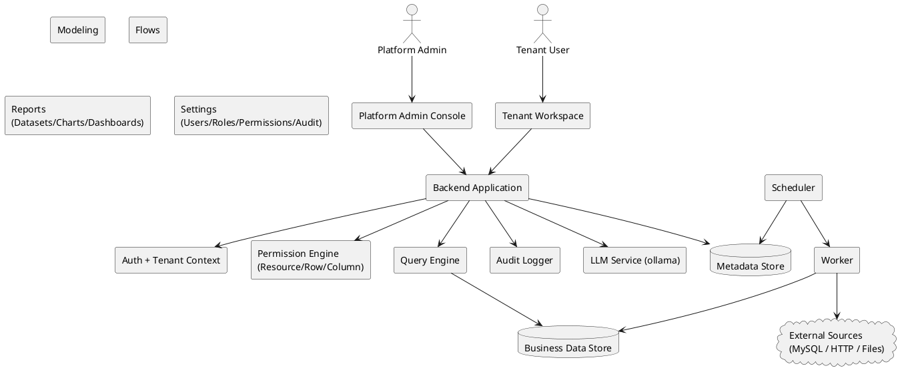

说明：平台在“交互入口（后台/工作区）”之下共享统一的身份认证、租户上下文、权限、审计与查询执行能力；Flows 的执行由调度器触发并由执行器实际跑节点逻辑。

## 2.4 关键链路一：请求链路（统一鉴权与租户上下文）

**目标**：任何进入后端的请求都必须同时完成“身份识别（GlobalUser）”与“租户上下文确定（Tenant + TenantUser）”，并在进入业务逻辑前完成权限决策。

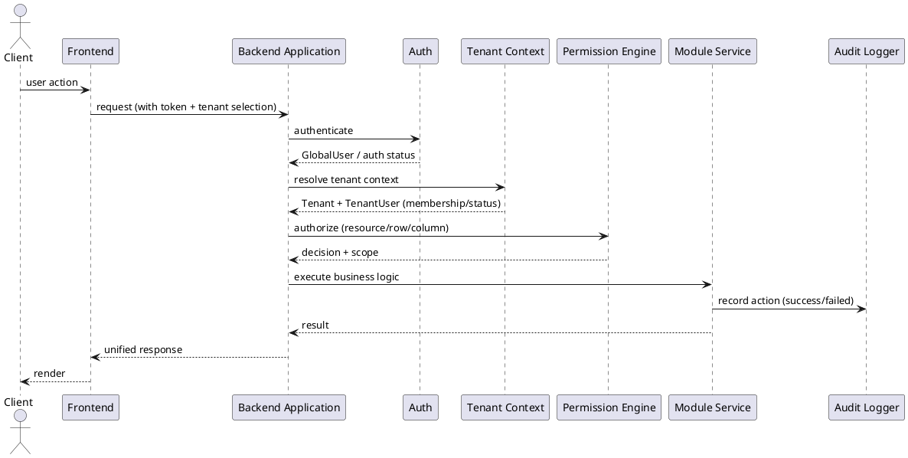

* 租户隔离的关键点在于：后端必须校验用户是否属于该租户且租户处于可用状态，并据此决定是否继续处理。
* 租户被停用（SUSPENDED）时：租户用户无法访问工作区，调度类 Flow 不再触发。

## 2.5 关键链路二：查询链路（表/数据集/图表/仪表盘共用）

**统一目标**：所有“读数据”的场景共享同一条查询链路：先做权限裁剪（资源/行/列），再把业务过滤转成统一 FilterDSL，并以统一顺序叠加到最终查询。

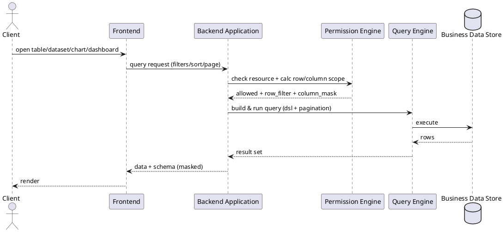

* 行/列权限需要在“表数据页、Flow 节点查询、Dataset/Chart 查询”等所有入口一致生效。
* Charts 与 Dashboards 属于报表资产化与复用体系的一部分：Chart 可被多个仪表盘复用，Dashboard 聚合多个图表实例。

## 2.6 关键链路三：执行链路（Flow 调度与运行）

**统一目标**：Flows 的“调度触发/手动触发”最终都会落到一次 Run（运行实例），Run 以节点为单位执行，写入内部表或对外写入。

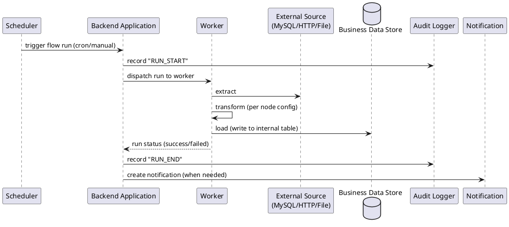

通知范围在 V1.0 限定为“任务流运行结果提醒”：手动触发完成（成功/失败）与调度触发失败；成功的调度运行通常不通知。

## 2.7 全局能力的产品约束对架构的影响

* 全局搜索：V1.0 不提供跨模块全局搜索，各模块仅在自身列表页提供搜索/筛选能力。
* 国际化：V1.0 不提供语言切换；时间/日期/数字格式可统一采用固定格式（如 `YYYY-MM-DD HH:mm:ss`）。

---

# 3 全局规范（只写规则）

## 3.1 多租户隔离规范（强制）

### 3.1.1 数据隔离原则

* 所有与业务数据相关的表（含元数据与实际数据表）必须包含 `tenant_id`。
* 所有查询/修改必须约束在当前租户：WHERE 条件必须包含 `tenant_id = 当前租户`。
* 禁止跨租户 JOIN 或写入（即使同库同实例）。

### 3.1.2 访问路径与成员校验

* 访问租户工作区时，必须同时校验：用户属于该租户（TenantUser 存在且 ACTIVE）+ 租户处于 ACTIVE 状态。

### 3.1.3 租户停用行为（SUSPENDED）

* 租户停用后：租户下所有用户无法访问工作区；调度型 Flow 不再触发新的 Run；重新启用后恢复。

## 3.2 角色与访问边界规范

* 平台维度存在 Platform Admin；租户维度存在 Owner / Data Engineer / Analyst / Viewer 等角色分工，实际权限以 Role 配置为准。
* 平台后台仅允许平台管理员访问，其身份由 GlobalUser 上的 `is_platform_admin` 标识决定。

## 3.3 API 响应与错误码规范（统一）

### 3.3.1 响应结构（成功/失败统一壳）

所有 API 统一返回结构（字段语义固定）：`success`、`code`、`message`、`data`、`trace_id`。

### 3.3.2 错误码命名规则

* 统一前缀：`ERR_` + 模块前缀 + 简要说明。
* 模块前缀建议集合：USER_/TENANT_/MODEL_/FLOW_/REPORT_/PERM_/LLM_。

### 3.3.3 错误展示统一要求（面向用户）

* 权限相关错误需要给出明确可执行的提示（如联系租户管理员）。

## 3.4 FilterDSL（统一过滤 JSON）规范

### 3.4.1 目标约束

* 所有过滤条件在任何场景下必须转换为统一 JSON DSL，以实现语义一致、安全可控、可视化编辑与可扩展。

### 3.4.2 结构定义

* DSL 节点只有两类：Group（`{ op, conditions }`）与 Condition（`{ field, operator, value }`）；顶层可以是 Group 或单 Condition。

### 3.4.3 操作符集合与类型约束

* 操作符集合包含：比较、集合、范围、文本、空值判断等；前端必须根据字段类型限制可选 operator，避免生成不可执行 DSL。

### 3.4.4 动态变量（内置变量）

* DSL 支持内置变量：CURRENT_USER_ID / CURRENT_TENANT_ID / CURRENT_DATE / CURRENT_DATETIME，由后端解析。

### 3.4.5 版本与兼容性

* V1 允许未来增加 operator 或结构字段，但不得改变既有字段语义；如需多版本可在顶层增加 version 字段。

## 3.5 行级权限（RowPermission）规范

### 3.5.1 合并规则

* 同一（role, table）下允许 0~N 条规则，规则间以 OR 合并；若该角色未配置规则，视为不施加额外行级限制（前提是资源级 TABLE_DATA 允许）。
* 用户多角色合并：对各角色的 row_filter 再做 OR（行权限是“放开的合集”，不会因多角色被收窄）。

### 3.5.2 与业务过滤的叠加顺序（统一口径）

对任意查询统一顺序：Dataset.base_filter → 业务过滤（Chart/Flow 等配置）→ RowPermission；三者以 AND 组合，任何业务过滤不得绕过行级权限。

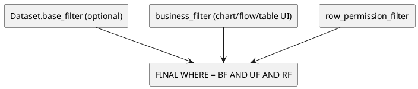

## 3.6 列级权限（ColumnPermission）规范

### 3.6.1 权限级别定义

列权限级别为：HIDDEN（不可见）、READONLY（可见不可改）、READWRITE（可见可改），并规定查询结果、表数据页、字段选择器等一致行为。

### 3.6.2 多角色合并规则

* 若所有角色均为 HIDDEN → 最终 HIDDEN；否则：任一 READWRITE 优先，其次 READONLY。

## 3.7 删除策略规范（如启用软删除）

* 若对某实体引入 `is_deleted` 实现逻辑删除，则必须在该实体对应章节明确说明删除语义为“软删除”，并保证前端不展示被软删除记录。

## 3.8 全局功能开关与统一格式

* 全局搜索：V1 不做。
* 通知：仅任务流运行结果相关。
* 国际化：V1 不提供语言切换；时间/日期格式可统一采用 `YYYY-MM-DD HH:mm:ss`。


# 第 4 章 多租户与认证体系

> 目标：定义“平台级账号（GlobalUser）—租户（Tenant）—租户成员（TenantUser）”三层身份体系、认证会话、平台后台访问控制、租户上下文装载与租户停用行为，保证：
> 1）平台后台仅 Platform Admin 可访问；2）租户工作区严格租户隔离；3）租户停用后前台不可访问且调度停止。 

---

## 4.1 身份域与多租户边界

### 4.1.1 核心对象关系（概念级）

* **GlobalUser（平台用户）**：平台级账号，可加入多个租户；禁用后不可登录任何租户。 
* **Tenant（租户）**：平台中的逻辑隔离单元，字段包含 `code/name/status/plan`；当 `SUSPENDED` 时前台不可访问且停止调度。 
* **TenantUser（租户用户）**：GlobalUser 在某个租户内的成员关系；`(tenant_id,user_id)` 唯一，且每租户至少 1 个 `is_owner=true`。 

### 4.1.2 平台后台与租户前台的访问边界

* 平台后台（`/admin/*`）仅 `is_platform_admin=true` 的 GlobalUser 可访问。 
* 平台管理员默认仅查看租户**元信息**，不通过前台身份直接查看租户业务数据；如需运维排查须走专用接口并记录审计。 

---

## 4.2 数据模型（表结构）

> 字段类型以 MySQL 为准（示例：`BIGINT/ VARCHAR / TINYINT / DATETIME / JSON`）。`created_at/updated_at` 统一由后端维护。

### 4.2.1 `global_user`（平台用户）

| 字段名               |           类型 | 是否可空 |               默认值 | 枚举/约束           | 说明                   |
| ----------------- | -----------: | :--: | ----------------: | --------------- | -------------------- |
| id                |       BIGINT |   否  |                 — | PK              | 主键                   |
| login_name        |  VARCHAR(64) |   否  |                 — | 全局唯一；不可修改       | 登录名                  |
| display_name      |  VARCHAR(64) |   否  |                 — | —               | 显示名                  |
| email             | VARCHAR(128) |   否  |                 — | 格式校验            | 邮箱                   |
| password_hash     | VARCHAR(255) |   否  |                 — | —               | 密码哈希（bcrypt/argon2）  |
| is_platform_admin |   TINYINT(1) |   否  |                 0 | 0/1             | 平台管理员标识              |
| status            |  VARCHAR(16) |   否  |            ACTIVE | ACTIVE/DISABLED | 禁用后无法登录任何租户          |
| last_tenant_id    |       BIGINT |   是  |              NULL | FK→tenant.id    | 最近一次进入的租户（用于下次登录跳转）  |
| last_login_at     |     DATETIME |   是  |              NULL | —               | 最近一次登录时间             |
| created_at        |     DATETIME |   否  | CURRENT_TIMESTAMP | —               | 创建时间                 |
| updated_at        |     DATETIME |   否  | CURRENT_TIMESTAMP | —               | 更新时间                 |

**索引**

* 唯一索引：`uk_global_user_login_name(login_name)`
* 唯一索引：`uk_global_user_email(email)`
* 普通索引：`idx_global_user_status(status)`（后台筛选）
* 普通索引：`idx_global_user_is_platform_admin(is_platform_admin)`（后台筛选）

---

### 4.2.2 `tenant`（租户）

| 字段名        |           类型 | 是否可空 |               默认值 | 枚举/约束                | 说明                     |
| ---------- | -----------: | :--: | ----------------: | -------------------- | ---------------------- |
| id         |       BIGINT |   否  |                 — | PK                   | 主键                     |
| code       |  VARCHAR(64) |   否  |                 — | 全局唯一；不可修改            | 租户编码                   |
| name       | VARCHAR(128) |   否  |                 — | —                    | 租户名称（**允许编辑**）         |
| status     |  VARCHAR(16) |   否  |            ACTIVE | ACTIVE/SUSPENDED     | SUSPENDED：前台 403、调度停止  |
| plan       |  VARCHAR(16) |   否  |             BASIC | BASIC/PRO/ENTERPRISE | 套餐                     |
| created_at |     DATETIME |   否  | CURRENT_TIMESTAMP | —                    | 创建时间                   |
| updated_at |     DATETIME |   否  | CURRENT_TIMESTAMP | —                    | 更新时间                   |

**索引**

* 唯一索引：`uk_tenant_code(code)`
* 普通索引：`idx_tenant_status(status)`
* 普通索引：`idx_tenant_plan(plan)`
* 普通索引：`idx_tenant_name(name)`（模糊检索可配合前缀索引/全文索引视规模决定）

---

### 4.2.3 `tenant_user`（租户成员）

| 字段名        |          类型 | 是否可空 |               默认值 | 枚举/约束             | 说明                  |
| ---------- | ----------: | :--: | ----------------: | ----------------- | ------------------- |
| id         |      BIGINT |   否  |                 — | PK                | 主键                  |
| tenant_id  |      BIGINT |   否  |                 — | FK→tenant.id      | 租户                  |
| user_id    |      BIGINT |   否  |                 — | FK→global_user.id | 平台用户                |
| status     | VARCHAR(16) |   否  |            ACTIVE | ACTIVE/DISABLED   | 仅影响该租户内访问           |
| is_owner   |  TINYINT(1) |   否  |                 0 | 0/1               | 租户 Owner（至少存在 1 个）  |
| last_login |    DATETIME |   是  |              NULL | —                 | 最近一次进入该租户时间         |
| created_at |    DATETIME |   否  | CURRENT_TIMESTAMP | —                 | 创建时间                |
| updated_at |    DATETIME |   否  | CURRENT_TIMESTAMP | —                 | 更新时间                |

**索引**

* 唯一索引：`uk_tenant_user(tenant_id, user_id)` 
* 普通索引：`idx_tenant_user_tenant(tenant_id)`（租户成员列表）
* 普通索引：`idx_tenant_user_user(user_id)`（用户所属租户枚举）
* 普通索引：`idx_tenant_user_status(tenant_id, status)`（筛选）

---

### 4.2.4 `auth_session`（登录会话 / RefreshToken 存储）

> PRD 未限定 token/cookie 方案；为满足“退出登录”“多端会话管理”“禁用用户立即失效”等工程需求，本章给出可落地的 V1 会话表设计。

| 字段名                |           类型 | 是否可空 |               默认值 | 枚举/约束                  | 说明                 |
| ------------------ | -----------: | :--: | ----------------: | ---------------------- | ------------------ |
| id                 |       BIGINT |   否  |                 — | PK                     | 主键                 |
| user_id            |       BIGINT |   否  |                 — | FK→global_user.id      | 账号                 |
| refresh_token_hash | VARCHAR(255) |   否  |                 — | 唯一（同一 token 不重复）       | refresh token 哈希存储 |
| status             |  VARCHAR(16) |   否  |            ACTIVE | ACTIVE/REVOKED/EXPIRED | 会话状态               |
| issued_at          |     DATETIME |   否  | CURRENT_TIMESTAMP | —                      | 签发时间               |
| expires_at         |     DATETIME |   否  |                 — | —                      | 过期时间               |
| revoked_at         |     DATETIME |   是  |              NULL | —                      | 撤销时间               |
| meta               |         JSON |   是  |              NULL | —                      | UA/IP/设备信息（可选）     |

**`meta` JSON 结构定义**

| 字段         | 类型     |  必填 | 枚举/上限 | 示例             | 说明         |
| ---------- | ------ | :-: | ----- | -------------- | ---------- |
| user_agent | string |  否  | ≤512  | `"Chrome/..."` | 浏览器 UA     |
| ip         | string |  否  | ≤64   | `"1.2.3.4"`    | 登录 IP      |
| device_id  | string |  否  | ≤64   | `"web-xxx"`    | 客户端生成的设备标识 |

**索引**

* 唯一索引：`uk_auth_session_refresh_hash(refresh_token_hash)`
* 普通索引：`idx_auth_session_user(user_id, status)`
* 普通索引：`idx_auth_session_expires(expires_at)`

---

## 4.3 认证与会话（Auth）

### 4.3.1 认证形态

* **Access Token（JWT）**：短期有效（例如 15 分钟），用于鉴权与携带 `user_id/is_platform_admin` 等声明。
* **Refresh Token**：长期有效（例如 7–30 天），服务端落库 `auth_session`，用于换发 access token 与“退出登录/禁用即失效”。

> `/api/me` 用于登录后获取当前用户信息，并包含 `is_platform_admin` 用于是否展示平台后台入口。 

---

## 4.4 租户上下文（TenantContext）与停用行为

### 4.4.1 租户上下文装载规则

* 前端路由中存在 `tenantId`（租户切换时 URL 更新）。 
* 后端对“租户域接口”统一要求携带 `X-Tenant-Id`（由前端用路由参数注入）；服务端中间件执行：

  1. 解析 `X-Tenant-Id`
  2. 校验 Tenant 存在
  3. 校验 Tenant 状态为 ACTIVE（否则 403）
  4. 校验 TenantUser 存在且为 ACTIVE（否则 403）
  5. 将 `tenant/tenant_user` 挂载到 RequestContext，供后续权限与数据访问使用

### 4.4.2 租户切换与“最近租户”记忆

* 若用户仅属于一个租户：登录后直接进入该租户工作区。 
* 若属于多个租户：首次登录展示租户选择或顶部下拉；下拉仅展示状态为 ACTIVE 的租户并支持搜索。 
* 系统需记住最近一次进入的租户，用于下次登录直接跳转。 

落地规则：当发生以下任一事件，更新 `global_user.last_tenant_id`：

* 调用 `POST /api/tenants/switch` 成功；
* 任意一次租户域请求通过 TenantContext 校验（以请求头的 `X-Tenant-Id` 为准）；

### 4.4.3 访问被停用租户

* 当用户尝试进入 `SUSPENDED` 租户：后端返回 403；前端展示“租户已停用”提示页且不展示业务菜单。 
* 当租户状态从 ACTIVE → SUSPENDED：该租户下 CRON 调度的 Flow 不再触发新的 Run；在运行中的 Flow 可自然结束（是否强杀由运维策略决定）。 

---

## 4.5 关键链路图（PlantUML）

### 4.5.1 租户域 API 请求链路（带 TenantContext）

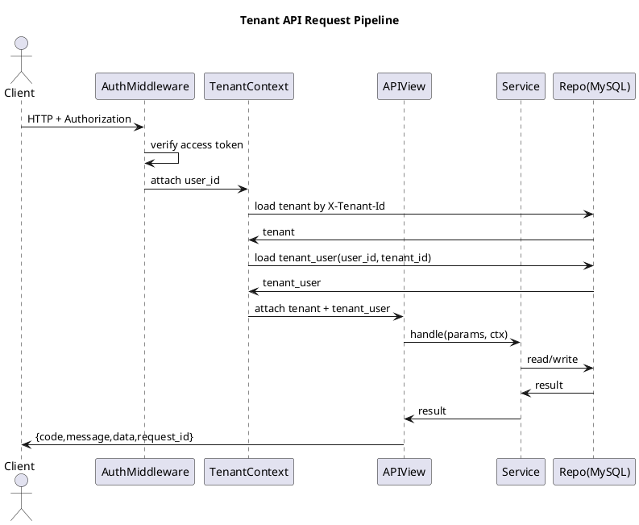

### 4.5.2 平台后台（/admin/*）请求链路（AdminGuard）

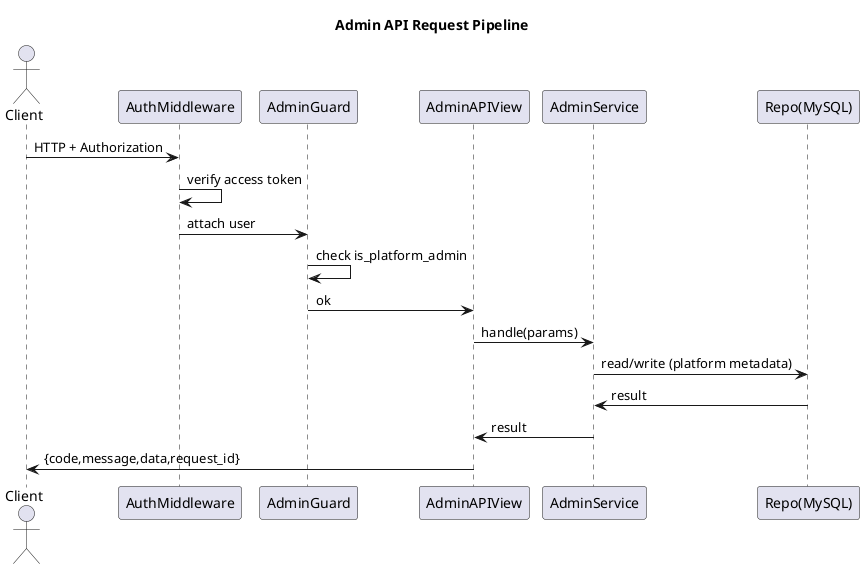

### 4.5.3 登录后租户跳转（单租户 / 多租户 / 最近租户）

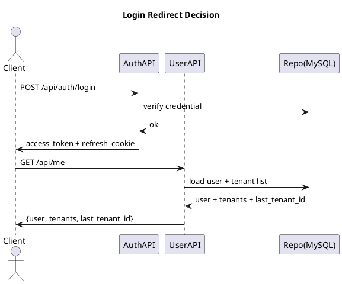

### 4.5.4 顶部租户切换（只展示 ACTIVE）

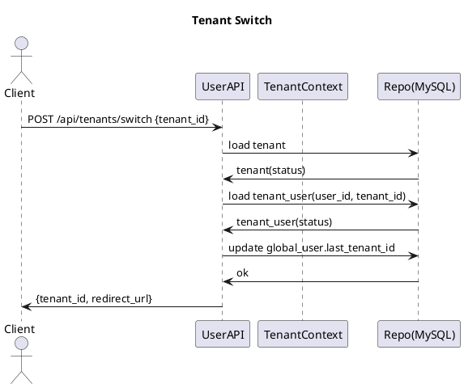

---

## 4.6 接口清单（本章范围）

> 说明：
>
> * **租户域接口**统一要求：登录态 + `X-Tenant-Id`（除非接口本身是全局接口）。
> * **平台后台接口**统一要求：登录态 + `is_platform_admin=true`，且路径位于 `/admin/*`（页面与接口）。 

### 4.6.1 全局认证与用户态

1. `POST /api/auth/login`（登录）
2. `POST /api/auth/logout`（退出登录）
3. `POST /api/auth/refresh`（换发 access token）
4. `GET /api/me`（获取当前用户信息、可访问租户列表、is_platform_admin） 

### 4.6.2 租户选择与切换（Tenant Workspace Shell）

5. `POST /api/tenants/switch`（切换租户并记录最近租户） 
6. `GET /api/tenants`（列出当前用户可访问的 ACTIVE 租户，用于下拉与搜索） 

### 4.6.3 平台后台（Platform Admin）接口组（必须单独成组）

> 平台后台能力：GlobalUser 管理、Tenant 管理、TenantUser 管理。 
> **补齐项（必须实现）**：编辑租户时允许修改租户名称（`name`），不得遗漏。 

7. `GET /admin/api/users`（GlobalUser 列表：搜索/筛选） 

8. `POST /admin/api/users`（创建 GlobalUser：含初始密码策略） 

9. `PATCH /admin/api/users/{id}`（编辑 GlobalUser：显示名/邮箱/is_platform_admin/status） 

10. `POST /admin/api/users/{id}/enable`（启用）

11. `POST /admin/api/users/{id}/disable`（禁用） 

12. `POST /admin/api/users/{id}/reset_password`（可选：重置密码） 

13. `GET /admin/api/tenants`（Tenant 列表：搜索/筛选） 

14. `POST /admin/api/tenants`（创建 Tenant：code/name/plan/status） 

15. `PATCH /admin/api/tenants/{id}`（编辑 Tenant：**name/plan/status**；code 不可改） 

16. `POST /admin/api/tenants/{id}/enable`（启用）

17. `POST /admin/api/tenants/{id}/suspend`（停用） 

18. `GET /admin/api/tenants/{tenantId}/users`（租户成员列表） 

19. `POST /admin/api/tenants/{tenantId}/users`（添加成员：从 GlobalUser 搜索添加，可批量，可设 Owner，可选初始角色） 

20. `PATCH /admin/api/tenants/{tenantId}/users/{tenantUserId}`（修改成员：状态/Owner/角色） 

21. `DELETE /admin/api/tenants/{tenantId}/users/{tenantUserId}`（移除成员：删除 TenantUser） 

---

## 4.7 接口实现规范（逐接口：入参/出参/校验/错误码/伪代码）

> 统一响应封装（本章落地约定）：
>
> * 成功：`{ code: "OK", message: "OK", data: <object>, request_id: <string> }`
> * 失败：`{ code: <string>, message: <string>, data: null, request_id: <string>, details?: <object> }`

---

### 4.7.1 `POST /api/auth/login`

**请求 Body**

| 字段         | 类型     |  必填 | 约束    | 说明               |
| ---------- | ------ | :-: | ----- | ---------------- |
| login_name | string |  是  | 1–64  | 登录名              |
| password   | string |  是  | 8–128 | 明文密码（仅 HTTPS 传输） |

**响应 data**

| 字段           | 类型     |  必填 | 说明                                                         |
| ------------ | ------ | :-: | ---------------------------------------------------------- |
| access_token | string |  是  | JWT                                                        |
| expires_in   | int    |  是  | 秒                                                          |
| user         | object |  是  | `{id, login_name, display_name, email, is_platform_admin}` |

**校验与异常分支**

* `login_name` 不存在 → 登录失败（不暴露是否存在，统一提示）。
* GlobalUser.status=DISABLED → 拒绝登录。 
* 密码不匹配 → 登录失败。
* 登录成功 → 写入 `global_user.last_login_at`；创建 `auth_session`；下发 refresh cookie（HttpOnly）。

**错误码**

* `AUTH_INVALID_CREDENTIALS`（401）
* `AUTH_USER_DISABLED`（403）
* `AUTH_TOO_MANY_ATTEMPTS`（429）
* `VALIDATION_REQUIRED`（400）
* `VALIDATION_FORMAT`（400）
* `SECURITY_TLS_REQUIRED`（400）
* `SESSION_CREATE_FAILED`（500）
* `INTERNAL_ERROR`（500）

**伪代码（Service/Repo 可映射）**

```text
AuthService.login(login_name, password, request_meta):
  user = GlobalUserRepo.find_by_login_name(login_name)
  if user is None: return error(AUTH_INVALID_CREDENTIALS, 401)
  if user.status != "ACTIVE": return error(AUTH_USER_DISABLED, 403)
  if not PasswordHasher.verify(password, user.password_hash):
      RateLimit.bump(login_name, ip)
      return error(AUTH_INVALID_CREDENTIALS, 401)

  access = Jwt.issue({user_id:user.id, is_platform_admin:user.is_platform_admin}, ttl=900)
  refresh = Token.random()
  AuthSessionRepo.create(user_id=user.id, refresh_hash=hash(refresh), meta=request_meta, expires_at=now+30d)

  GlobalUserRepo.update_last_login(user.id, now)
  return ok({access_token:access, expires_in:900, user:PublicUser(user)}, set_cookie_refresh=refresh)
```

---

### 4.7.2 `GET /api/me`

> 登录后前端通过 `/api/me` 获取当前用户信息，并包含 `is_platform_admin` 用于平台后台入口控制。 

**请求 Header**

* `Authorization: Bearer <access_token>`

**响应 data**

| 字段      | 类型     |  必填 | 说明                                                                                 |
| ------- | ------ | :-: | ---------------------------------------------------------------------------------- |
| user    | object |  是  | `{id, login_name, display_name, email, is_platform_admin, status, last_tenant_id}` |
| tenants | array  |  是  | 用户可访问租户列表（仅 ACTIVE）                                                                |

`tenants[]` 结构：

| 字段        | 类型     |  必填 | 说明                    |
| --------- | ------ | :-: | --------------------- |
| tenant_id | number |  是  | 租户 ID                 |
| code      | string |  是  | 租户编码                  |
| name      | string |  是  | 租户名称                  |
| plan      | string |  是  | BASIC/PRO/ENTERPRISE  |

**校验与异常分支**

* token 无效/过期 → 401
* GlobalUser 被禁用 → 403（并可主动撤销其所有会话）
* 返回的 tenants 必须过滤 `tenant.status=ACTIVE` 

**错误码**

* `AUTH_UNAUTHORIZED`（401）
* `AUTH_TOKEN_EXPIRED`（401）
* `AUTH_USER_DISABLED`（403）
* `DATA_INTEGRITY_ERROR`（500）
* `RATE_LIMITED`（429）
* `VALIDATION_HEADER_MISSING`（400）
* `INTERNAL_ERROR`（500）
* `SERVICE_UNAVAILABLE`（503）

**伪代码**

```text
UserService.me(user_id):
  user = GlobalUserRepo.get(user_id)
  if user.status != "ACTIVE": return error(AUTH_USER_DISABLED, 403)

  tenant_users = TenantUserRepo.list_by_user(user_id, status="ACTIVE")
  tenant_ids = [tu.tenant_id for tu in tenant_users]
  tenants = TenantRepo.list_by_ids(tenant_ids, status="ACTIVE")  # 只返回 ACTIVE
  return ok({user:PublicUser(user), tenants:MapTenants(tenants), last_tenant_id:user.last_tenant_id})
```

---

### 4.7.3 `POST /api/tenants/switch`

> 切换后 URL 中 `tenantId` 更新并跳转工作区首页；系统需记住最近一次进入的租户。

**请求 Body**

| 字段        | 类型     |  必填 | 约束 | 说明   |
| --------- | ------ | :-: | -- | ---- |
| tenant_id | number |  是  | >0 | 目标租户 |

**响应 data**

| 字段           | 类型     |  必填 | 说明                                   |
| ------------ | ------ | :-: | ------------------------------------ |
| tenant_id    | number |  是  | 切换成功的租户                              |
| redirect_url | string |  是  | 前端跳转地址（例如 `/t/{tenant_id}/modeling`） |

**校验与异常分支**

* tenant 不存在 → 404
* tenant.status=SUSPENDED → 403（前端展示“租户已停用”页） 
* TenantUser 不存在/被禁用 → 403
* 切换成功 → 更新 `global_user.last_tenant_id`

**错误码**

* `AUTH_UNAUTHORIZED`（401）
* `TENANT_NOT_FOUND`（404）
* `TENANT_SUSPENDED`（403）
* `TENANT_ACCESS_DENIED`（403）
* `TENANT_USER_DISABLED`（403）
* `VALIDATION_REQUIRED`（400）
* `CONFLICT_STATE_CHANGED`（409）
* `INTERNAL_ERROR`（500）

**伪代码**

```text
TenantService.switch_tenant(user_id, tenant_id):
  tenant = TenantRepo.get(tenant_id)
  if tenant is None: return error(TENANT_NOT_FOUND, 404)
  if tenant.status != "ACTIVE": return error(TENANT_SUSPENDED, 403)

  tu = TenantUserRepo.get_by_unique(tenant_id, user_id)
  if tu is None: return error(TENANT_ACCESS_DENIED, 403)
  if tu.status != "ACTIVE": return error(TENANT_USER_DISABLED, 403)

  GlobalUserRepo.update_last_tenant(user_id, tenant_id)
  return ok({tenant_id:tenant_id, redirect_url: "/t/"+tenant_id+"/modeling"})
```

---

## 4.8 平台后台（Platform Admin）接口组（逐接口）

> 平台后台仅 `is_platform_admin=true` 可访问；未登录 401，非平台管理员 403。 

> 注意：平台后台“编辑租户”必须支持修改租户名称（`name`），租户编码（`code`）不可修改。 

以下接口均要求：

* Header：`Authorization: Bearer <access_token>`
* 路径前缀：`/admin/api/*`

---

### 4.8.1 `GET /admin/api/users`（GlobalUser 列表）

**Query 参数**

| 参数                | 类型     |  必填 | 约束              | 说明                                    |
| ----------------- | ------ | :-: | --------------- | ------------------------------------- |
| q                 | string |  否  | ≤128            | 按 login_name/display_name/email 模糊查询  |
| status            | string |  否  | ACTIVE/DISABLED | 状态筛选                                  |
| is_platform_admin | bool   |  否  | true/false      | 管理员筛选                                 |
| page              | int    |  否  | ≥1              | 分页                                    |
| page_size         | int    |  否  | 1–200           | 分页                                    |

**响应 data**

| 字段    | 类型    |  必填 | 说明   |
| ----- | ----- | :-: | ---- |
| total | int   |  是  | 总数   |
| items | array |  是  | 用户列表 |

`items[]` 字段（与后台展示一致） 

**错误码**

* `AUTH_UNAUTHORIZED`（401）
* `ADMIN_FORBIDDEN`（403）
* `VALIDATION_PAGINATION`（400）
* `VALIDATION_FORMAT`（400）
* `RATE_LIMITED`（429）
* `DB_QUERY_TIMEOUT`（504）
* `INTERNAL_ERROR`（500）
* `SERVICE_UNAVAILABLE`（503）

**伪代码**

```text
AdminUserService.list(q, status, is_platform_admin, page, page_size):
  AdminGuard.require_platform_admin()
  return GlobalUserRepo.search(q, status, is_platform_admin, page, page_size)
```

---

### 4.8.2 `POST /admin/api/tenants`（创建租户）

**请求 Body**（来自 PRD 表单字段） 

| 字段                     | 类型            |  必填 | 枚举/约束                | 说明                      |
| ---------------------- | ------------- | :-: | -------------------- | ----------------------- |
| code                   | string        |  是  | 全局唯一；1–64            | 租户编码                    |
| name                   | string        |  是  | 1–128                | 租户名称                    |
| plan                   | string        |  是  | BASIC/PRO/ENTERPRISE | 套餐                      |
| status                 | string        |  否  | ACTIVE/SUSPENDED     | 默认 ACTIVE               |
| initial_owner_user_ids | array<number> |  是  | 至少 1 个               | 用于满足“每租户至少一个 Owner”的约束  |

**响应 data**

| 字段        | 类型     |  必填 | 说明     |
| --------- | ------ | :-: | ------ |
| tenant_id | number |  是  | 新租户 ID |

**校验与异常分支**

* code 重复 → 409
* initial_owner_user_ids 中存在不存在/禁用 GlobalUser → 400/403
* 创建 Tenant 成功后必须在同一事务内写入对应 TenantUser（is_owner=1）

**错误码**

* `AUTH_UNAUTHORIZED`（401）
* `ADMIN_FORBIDDEN`（403）
* `TENANT_CODE_DUPLICATE`（409）
* `VALIDATION_REQUIRED`（400）
* `VALIDATION_ENUM`（400）
* `OWNER_REQUIRED`（400）
* `USER_NOT_FOUND`（400）
* `INTERNAL_ERROR`（500）

**伪代码（含事务）**

```text
AdminTenantService.create(payload):
  AdminGuard.require_platform_admin()

  validate code unique
  validate plan/status enum
  validate initial_owner_user_ids non-empty

  tx.begin()
    tenant_id = TenantRepo.insert(code,name,plan,status)
    for uid in initial_owner_user_ids:
        u = GlobalUserRepo.get(uid)
        if u is None: tx.rollback(); return error(USER_NOT_FOUND, 400)
        if u.status != "ACTIVE": tx.rollback(); return error(AUTH_USER_DISABLED, 403)
        TenantUserRepo.insert(tenant_id, uid, status="ACTIVE", is_owner=1)
  tx.commit()
  return ok({tenant_id:tenant_id})
```

---

### 4.8.3 `PATCH /admin/api/tenants/{id}`（编辑租户：必须支持改名称）

> 编辑 Tenant：`code` 不可修改；可修改 `name/plan/status`。 

**请求 Path**

* `id`: tenant id

**请求 Body**

| 字段     | 类型     |  必填 | 枚举/约束                | 说明             |
| ------ | ------ | :-: | -------------------- | -------------- |
| name   | string |  否  | 1–128                | 租户名称（**补齐必做**） |
| plan   | string |  否  | BASIC/PRO/ENTERPRISE | 套餐             |
| status | string |  否  | ACTIVE/SUSPENDED     | 状态             |

**状态变更语义**

* `SUSPENDED`：该租户所有 TenantUser 前台访问 403，Flow 调度停止触发新的 Run。 
* `ACTIVE`：恢复访问与调度。 

**错误码**

* `AUTH_UNAUTHORIZED`（401）
* `ADMIN_FORBIDDEN`（403）
* `TENANT_NOT_FOUND`（404）
* `VALIDATION_ENUM`（400）
* `VALIDATION_FORMAT`（400）
* `CONFLICT_NO_OWNER`（409）（若后续实现要求启用前必须存在 Owner）
* `SCHEDULER_UPDATE_FAILED`（500）
* `INTERNAL_ERROR`（500）

**伪代码**

```text
AdminTenantService.update(tenant_id, patch):
  AdminGuard.require_platform_admin()
  tenant = TenantRepo.get(tenant_id)
  if tenant is None: return error(TENANT_NOT_FOUND, 404)

  if "name" in patch: validate len/name
  if "plan" in patch: validate enum
  if "status" in patch: validate enum

  tx.begin()
    TenantRepo.update_fields(tenant_id, patch)
    if patch.status changed to "SUSPENDED":
        SchedulerService.pause_all_cron_flows(tenant_id)   # 仅停止触发，不强杀运行中实例 :contentReference[oaicite:76]{index=76}
    if patch.status changed to "ACTIVE":
        SchedulerService.resume_all_cron_flows(tenant_id)
  tx.commit()
  return ok({})
```

---

### 4.8.4 `POST /admin/api/tenants/{tenantId}/users`（添加成员，支持批量）

> 添加成员：从 GlobalUser 搜索添加，可批量；可选设 Owner；可选初始角色；平台后台不提供注册新用户流程。 

**请求 Body**

| 字段               | 类型            |  必填 | 约束    | 说明               |
| ---------------- | ------------- | :-: | ----- | ---------------- |
| user_ids         | array<number> |  是  | 1–200 | GlobalUser.id 列表 |
| set_owner        | bool          |  否  | —     | 是否将新增成员设为 Owner  |
| initial_role_ids | array<number> |  否  | —     | 初始角色（角色表详见权限体系章） |

**响应 data**

| 字段      | 类型    |  必填 | 说明                       |
| ------- | ----- | :-: | ------------------------ |
| created | int   |  是  | 创建数量                     |
| skipped | int   |  是  | 已存在跳过数量                  |
| items   | array |  是  | 创建结果明细（含 tenant_user_id） |

**校验与异常分支**

* tenant 不存在 → 404
* tenant.status=SUSPENDED 时是否允许“后台加人”：允许（平台操作不受前台限制），但新增成员仍需满足约束
* user_ids 任一不存在 → 400
* `(tenant_id,user_id)` 已存在 → 跳过或 409（建议返回明细）
* 若设置/取消 Owner 导致租户无 Owner → 阻止并提示 

**错误码**

* `AUTH_UNAUTHORIZED`（401）
* `ADMIN_FORBIDDEN`（403）
* `TENANT_NOT_FOUND`（404）
* `USER_NOT_FOUND`（400）
* `CONFLICT_MEMBER_EXISTS`（409）
* `CONFLICT_NO_OWNER`（409）
* `VALIDATION_LIMIT_EXCEEDED`（400）
* `INTERNAL_ERROR`（500）

**伪代码（含事务与批量）**

```text
AdminTenantUserService.add_members(tenant_id, user_ids, set_owner, role_ids):
  AdminGuard.require_platform_admin()
  if TenantRepo.get(tenant_id) is None: return error(TENANT_NOT_FOUND, 404)

  tx.begin()
    results = []
    for uid in user_ids:
      if GlobalUserRepo.get(uid) is None:
         tx.rollback(); return error(USER_NOT_FOUND, 400)
      if TenantUserRepo.exists(tenant_id, uid):
         results.append({uid, status:"SKIPPED_EXISTS"})
         continue
      tu_id = TenantUserRepo.insert(tenant_id, uid, status="ACTIVE", is_owner=set_owner?1:0)
      if role_ids not empty: TenantUserRoleRepo.batch_insert(tu_id, role_ids)
      results.append({uid, tenant_user_id:tu_id, status:"CREATED"})
    ensure_owner_invariant(tenant_id)  # 至少 1 个 owner，否则 rollback :contentReference[oaicite:79]{index=79}
  tx.commit()
  return ok(summary(results))
```


# 5 权限体系

## 5.1 目标与范围

权限体系由三层组成，后端强校验为唯一安全边界：资源级（RolePermission）、行级（RowPermission）、列级（ColumnPermission）。前端权限仅用于隐藏/禁用按钮改善体验，不得替代后端校验。

本章覆盖：

* 角色（Role）与用户-角色关系（TenantUserRole）
* 资源树权限（RolePermission）：表/Flow/Dataset/Dashboard，支持 Folder 默认权限与继承、多角色合并
* 表数据级权限：行权限（RowPermission）与列权限（ColumnPermission），含多角色合并与与业务过滤叠加顺序
* 权限配置入口与保存行为（Settings/Modeling 页面）
* 权限变更审计的最小可追溯要求

---

## 5.2 核心概念与关系

### 5.2.1 权限对象

* **TenantUser**：租户内成员；Owner（is_owner）用于兜底管理与强约束（至少 1 个 Owner，不能移除最后一个 Owner）
* **Role**：租户级角色；支持系统初始化模板角色（is_system=true），本期不施加不可编辑/不可删除等强约束（仅表示来源）。
* **ResourceTree**：资源树，包含 Folder 节点与资源节点；目录节点可嵌套目录，资源节点不可挂载目录；前端展示“可查看资源 + 父目录链路”。
* **RolePermission**：资源级权限（NONE/VIEW/EDIT/MANAGE），支持 Folder 默认权限继承、多角色取最大值合并。
* **RowPermission**：表维度行过滤，FilterDSL JSON；角色内 OR、多角色再 OR；与 Dataset/业务过滤按 AND 叠加；TABLE_DATA=MANAGE 可绕过行权限。
* **ColumnPermission**：表字段级可见/可写（HIDDEN/READONLY/READWRITE），多角色合并规则见 5.5；并受 TABLE_DATA 权限上限约束。

### 5.2.2 PlantUML：权限域对象关系图

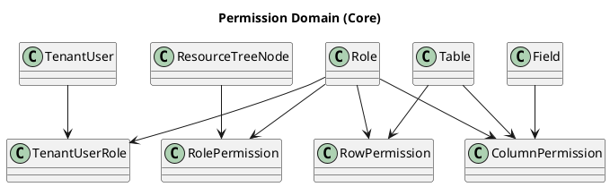

---

## 5.3 统一权限校验原则

### 5.3.1 后端强校验

所有受控接口必须在后端强校验三类权限：资源级、行级、列级。

### 5.3.2 HTTP 与提示

* 未登录/Token 失效：401
* 已登录但权限不足：403
  并统一提示“没有权限执行该操作”。

### 5.3.3 权限变更审计

涉及角色/成员角色关系/资源权限/行权限/列权限的变更必须可追溯，记录操作人、时间、类型、对象、变更摘要、结果。

---

## 5.4 资源级权限（RolePermission）

### 5.4.1 资源类型与权限等级

资源类型（resource_type）范围：TABLE_SCHEMA、TABLE_DATA、FLOW、DATASET、DASHBOARD。
权限等级：NONE < VIEW < EDIT < MANAGE。

### 5.4.2 Folder 默认权限与继承

Folder 节点可配置默认权限；子资源未单独配置时，取最近祖先 Folder 默认权限；资源节点显式配置覆盖默认值。

合并顺序（单角色内部）：从资源节点向上回溯到根 Folder，收集权限设置，取最大权限等级作为该角色最终资源权限。

多角色合并（Effective Resource Permission）：对用户所有角色分别算单角色权限后，再取最大值。

### 5.4.3 表权限的“双权限项”约定

表资源需配置两项：表结构权限（TABLE_SCHEMA）与表数据权限（TABLE_DATA）；Folder 也支持默认表结构/默认表数据权限。

> 操作权限映射（强制）

* 任何“建模变更”（字段新增/修改等）：必须满足 TABLE_SCHEMA ≥ EDIT（涉及删除/移动/配置权限必须 ≥ MANAGE）
* 任何“数据读写”（表数据页、Flow 节点查询、Dataset/Chart 查询、记录增删改）：必须满足 TABLE_DATA ≥ VIEW（写入至少 ≥ EDIT）

### 5.4.4 PlantUML：资源权限计算（含继承、多角色合并）

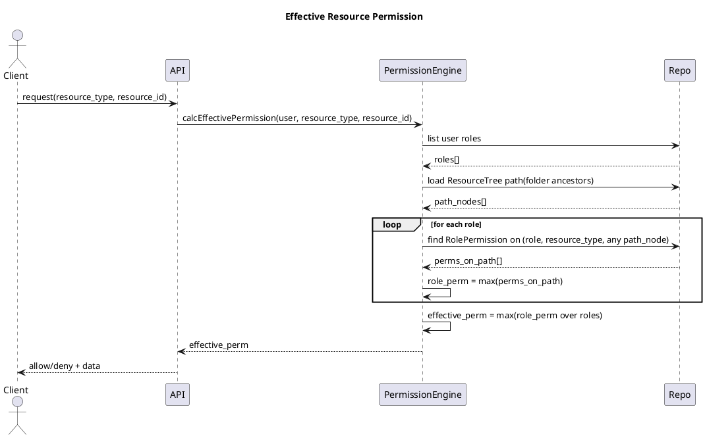

---

## 5.5 列级权限（ColumnPermission）

### 5.5.1 权限等级与行为

针对（role, table, column）：

* HIDDEN：字段不可见；查询结果不返回；表数据页不显示；Chart 字段选择器不列出（尽可能）。
* READONLY：字段可见不可编辑；API 不接受该字段修改。
* READWRITE：完整读写。

多角色合并：若所有角色都是 HIDDEN → HIDDEN；否则有任一 READWRITE → READWRITE；否则有任一 READONLY → READONLY。
并且最终列权限仍受 TABLE_DATA 权限控制：TABLE_DATA < EDIT 时，即使列权限为 READWRITE 也不得写入。

### 5.5.2 后端强制行为（查询/写入）

* **查询返回列裁剪**：返回字段集合 = `requested_fields ∩ visible_fields`，其中 `visible_fields` = 最终列权限 ≠ HIDDEN 的字段集合。对 HIDDEN 字段必须从 SELECT 列表中剔除。
* **写入字段校验**：

  * READONLY：前端应禁用；若仍传入，后端必须“忽略或报错（统一决策）”。本期约定：**直接报错**，避免静默丢数据。
  * READWRITE：允许写入，但仍需 TABLE_DATA ≥ EDIT。

### 5.5.3 PlantUML：列权限在查询中的应用

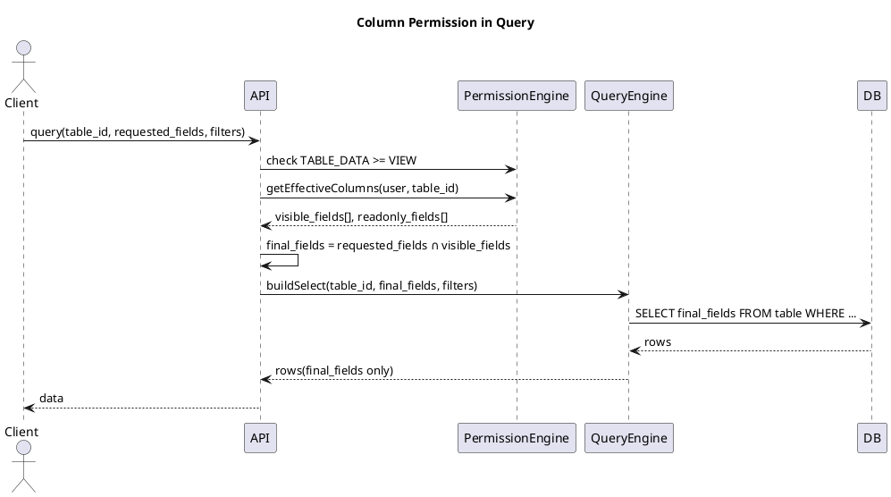

---

## 5.6 行级权限（RowPermission）

### 5.6.1 FilterDSL（用于 RowPermission 与业务过滤）

FilterDSL 目标：统一表达过滤条件；可被 QueryEngine 编译为 SQL WHERE 条件；支持嵌套 and/or。

#### JSON 结构定义（存储/传输）

| 字段         | 类型     |         必填 | 枚举/约束                                                       | 说明                       |
| ---------- | ------ | ---------: | ----------------------------------------------------------- | ------------------------ |
| op         | string |          是 | and / or                                                    | 组合逻辑                     |
| conditions | array  |          是 | 长度 ≥ 1                                                      | 子条件列表（condition 或 group） |
| field      | string |       条件必填 | 仅允许白名单字段                                                    | 字段编码（如 `order_amount`）   |
| operator   | string |       条件必填 | eq/ne/gt/gte/lt/lte/in/not_in/between/like/is_null/not_null | 操作符                      |
| value      | any    | 视 operator | 类型与字段类型匹配                                                   | 常量或“特殊变量注入对象”            |

#### 特殊变量（动态值注入）

支持将 value 写为 `{"__var__": "CURRENT_USER_ID"}` 等形式（示例：限制“仅看自己负责的客户”）。

> 实现要求

* QueryEngine 编译 SQL 前必须先将 `__var__` 解析为运行时常量（来自 TenantContext + Auth 上下文）。
* 变量解析失败（缺少上下文/不支持变量名）必须报参数错误，不得忽略。

### 5.6.2 合并规则与叠加顺序

* **角色内多条规则 OR**；**多角色再 OR**；并与 Dataset.base_filter、业务过滤按 AND 组合：
  `总 WHERE = base_filter AND business_filter AND row_permission_filter`。
* **MANAGE 绕过**：若用户在表的 TABLE_DATA 上任一角色为 MANAGE，则该表默认不受行权限限制（兜底/调试）。

### 5.6.3 PlantUML：行权限合并与叠加

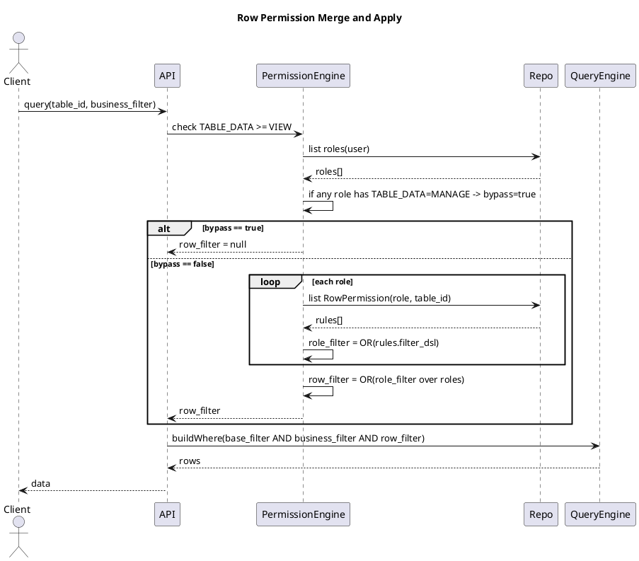

---

## 5.7 数据表设计（MySQL）

> 约定：所有表默认包含审计字段 `created_at/created_by/updated_at/updated_by`；`created_by/updated_by` 存 TenantUser.id。

### 5.7.1 role（角色）

| 字段名         | 类型           | 是否可空 | 默认值               | 枚举/约束     | 说明                 |
| ----------- | ------------ | ---: | ----------------- | --------- | ------------------ |
| id          | bigint       |    否 |                   | PK        | 角色ID               |
| tenant_id   | bigint       |    否 |                   | FK        | 租户ID               |
| name        | varchar(64)  |    否 |                   | 同租户唯一     | 角色名称               |
| description | varchar(255) |    是 | null              |           | 角色描述               |
| is_system   | tinyint      |    否 | 0                 | 0/1       | 是否系统初始化模板角色        |
| created_at  | datetime     |    否 | CURRENT_TIMESTAMP |           | 创建时间               |
| created_by  | bigint       |    否 |                   |           | 创建人（TenantUser.id） |
| updated_at  | datetime     |    否 | CURRENT_TIMESTAMP | ON UPDATE | 更新时间               |
| updated_by  | bigint       |    否 |                   |           | 更新人（TenantUser.id） |

索引（独立列出）：

* 唯一索引：`uk_role_tenant_name (tenant_id, name)`（防重复）
* 普通索引：`idx_role_tenant (tenant_id)`（租户内列表）

### 5.7.2 tenant_user_role（成员-角色关系）

| 字段名            | 类型       | 是否可空 | 默认值               | 枚举/约束 | 说明   |
| -------------- | -------- | ---: | ----------------- | ----- | ---- |
| id             | bigint   |    否 |                   | PK    | 关系ID |
| tenant_id      | bigint   |    否 |                   | FK    | 租户ID |
| tenant_user_id | bigint   |    否 |                   | FK    | 成员ID |
| role_id        | bigint   |    否 |                   | FK    | 角色ID |
| created_at     | datetime |    否 | CURRENT_TIMESTAMP |       | 创建时间 |
| created_by     | bigint   |    否 |                   |       | 操作人  |

索引：

* 唯一索引：`uk_tur_unique (tenant_id, tenant_user_id, role_id)`（同成员不可重复绑定同角色）
* 普通索引：`idx_tur_role (tenant_id, role_id)`、`idx_tur_user (tenant_id, tenant_user_id)`

### 5.7.3 role_permission（资源级权限）

| 字段名                   | 类型          | 是否可空 | 默认值               | 枚举/约束                                          | 说明                               |
| --------------------- | ----------- | ---: | ----------------- | ---------------------------------------------- | -------------------------------- |
| id                    | bigint      |    否 |                   | PK                                             | 权限记录ID                           |
| tenant_id             | bigint      |    否 |                   | FK                                             | 租户ID                             |
| role_id               | bigint      |    否 |                   | FK                                             | 角色ID                             |
| resource_type         | varchar(32) |    否 |                   | TABLE_SCHEMA/TABLE_DATA/FLOW/DATASET/DASHBOARD | 资源类型                             |
| resource_tree_node_id | bigint      |    否 |                   | FK                                             | ResourceTree 节点ID（Folder 或 资源节点） |
| permission            | varchar(16) |    否 | NONE              | NONE/VIEW/EDIT/MANAGE                          | 权限等级                             |
| created_at            | datetime    |    否 | CURRENT_TIMESTAMP |                                                | 创建时间                             |
| created_by            | bigint      |    否 |                   |                                                | 创建人                              |
| updated_at            | datetime    |    否 | CURRENT_TIMESTAMP | ON UPDATE                                      | 更新时间                             |
| updated_by            | bigint      |    否 |                   |                                                | 更新人                              |

索引：

* 唯一索引：`uk_rp_unique (tenant_id, role_id, resource_type, resource_tree_node_id)`（同节点同类型仅一条）
* 普通索引：`idx_rp_role (tenant_id, role_id, resource_type)`（加载某角色某类型全量权限）
* 普通索引：`idx_rp_node (tenant_id, resource_type, resource_tree_node_id)`（节点反查）

### 5.7.4 row_permission（行权限）

| 字段名        | 类型          | 是否可空 | 默认值               | 枚举/约束           | 说明                    |
| ---------- | ----------- | ---: | ----------------- | --------------- | --------------------- |
| id         | bigint      |    否 |                   | PK              | 规则ID                  |
| tenant_id  | bigint      |    否 |                   | FK              | 租户ID                  |
| role_id    | bigint      |    否 |                   | FK              | 角色ID                  |
| table_id   | bigint      |    否 |                   | FK              | 表ID                   |
| name       | varchar(64) |    是 | null              |                 | 规则名称（可空）              |
| filter_dsl | json        |    否 |                   | 必须为合法 FilterDSL | 行过滤条件（FilterDSL JSON） |
| created_at | datetime    |    否 | CURRENT_TIMESTAMP |                 | 创建时间                  |
| created_by | bigint      |    否 |                   |                 | 创建人                   |
| updated_at | datetime    |    否 | CURRENT_TIMESTAMP | ON UPDATE       | 更新时间                  |
| updated_by | bigint      |    否 |                   |                 | 更新人                   |

`filter_dsl` JSON 结构（强制补充）：

* 顶层必须为 group：`{ "op": "and|or", "conditions": [...] }`
* condition 节点：`{ "field": "...", "operator": "...", "value": ... }`
* value 可使用特殊变量：`{ "__var__": "CURRENT_USER_ID" }`
* 示例：

  * `{"op":"and","conditions":[{"field":"owner_id","operator":"eq","value":{"__var__":"CURRENT_USER_ID"}}]}`

索引：

* 普通索引：`idx_rowperm_role_table (tenant_id, role_id, table_id)`（加载某角色在某表规则）
* 普通索引：`idx_rowperm_table (tenant_id, table_id)`（按表排查）

### 5.7.5 column_permission（列权限）

| 字段名          | 类型          | 是否可空 | 默认值               | 枚举/约束                     | 说明   |
| ------------ | ----------- | ---: | ----------------- | ------------------------- | ---- |
| id           | bigint      |    否 |                   | PK                        | 记录ID |
| tenant_id    | bigint      |    否 |                   | FK                        | 租户ID |
| role_id      | bigint      |    否 |                   | FK                        | 角色ID |
| table_id     | bigint      |    否 |                   | FK                        | 表ID  |
| field_id     | bigint      |    否 |                   | FK                        | 字段ID |
| access_level | varchar(16) |    否 | READWRITE         | HIDDEN/READONLY/READWRITE | 列权限  |
| created_at   | datetime    |    否 | CURRENT_TIMESTAMP |                           | 创建时间 |
| created_by   | bigint      |    否 |                   |                           | 创建人  |
| updated_at   | datetime    |    否 | CURRENT_TIMESTAMP | ON UPDATE                 | 更新时间 |
| updated_by   | bigint      |    否 |                   |                           | 更新人  |

索引：

* 唯一索引：`uk_colperm_unique (tenant_id, role_id, table_id, field_id)`（覆盖写入时可 upsert）
* 普通索引：`idx_colperm_role_table (tenant_id, role_id, table_id)`（页面加载）
* 普通索引：`idx_colperm_table (tenant_id, table_id)`（排查）

---

## 5.8 接口清单（租户侧 Settings / Modeling 数据权限页）

> 访问控制总则：本章所有“权限配置/成员角色调整”接口必须要求调用者具备“Settings 管理权限”。该权限可由 Owner 或被授权角色持有（具体授予方式见 5.8.1）。

### 5.8.1 Settings 管理权限的落地（实现约定）

为满足“仅具有 Settings 管理权限的角色可访问 Settings 模块”的产品约束，后端采用以下判定：

* `allow_settings(user) = (TenantUser.is_owner == true) OR (permission(user, SETTINGS_RESOURCE) >= MANAGE)`
* SETTINGS_RESOURCE 为虚拟资源：`resource_type="SETTINGS"`、`resource_tree_node_id = tenant_root_settings_node_id`

  * 该节点不出现在业务资源树 UI，仅用于权限判定与授权。

> 若当前版本暂不实现 SETTINGS 虚拟资源节点，则本期最小实现可直接：仅 Owner 可访问 Settings；后续再扩展为可授权。

---

### 5.8.2 角色管理（Role）

#### API 1：查询角色列表

* `GET /api/tenants/{tenant_id}/roles`

入参：

| 字段        | 位置   | 类型     | 必填 | 约束 | 说明   |
| --------- | ---- | ------ | -: | -- | ---- |
| tenant_id | path | bigint |  是 |    | 租户ID |

出参（data）：

| 字段                  | 类型          | 说明     |
| ------------------- | ----------- | ------ |
| items               | array       | 角色列表   |
| items[].id          | bigint      | 角色ID   |
| items[].name        | string      | 名称     |
| items[].description | string/null | 描述     |
| items[].is_system   | boolean     | 是否模板角色 |

校验与异常分支：

1. 校验 token 与 tenant 上下文（401/403）
2. 校验 allow_settings（403）
3. tenant_id 不存在或被停用（404/403，按租户模块约定）

错误码（覆盖场景）：

* ERR_AUTH_REQUIRED（未登录/Token 失效 → 401）
* ERR_TENANT_NOT_FOUND
* ERR_TENANT_SUSPENDED
* ERR_SETTINGS_FORBIDDEN（无 Settings 权限 → 403）

伪代码：

```text
RoleService.listRoles(tenant_id, actor):
  assert Auth.requireLogin(actor)
  assert TenantContext.requireTenantActive(tenant_id)
  assert PermissionEngine.allowSettings(actor, tenant_id)
  return RoleRepo.listByTenant(tenant_id, order_by=name)
```

---

#### API 2：创建角色

* `POST /api/tenants/{tenant_id}/roles`

入参（body）：

| 字段          | 类型      | 必填 | 约束          | 说明                |
| ----------- | ------- | -: | ----------- | ----------------- |
| name        | string  |  是 | 1..64，同租户唯一 | 角色名               |
| description | string  |  否 | ≤255        | 描述                |
| is_system   | boolean |  否 | 默认为 false   | 是否模板角色（一般仅系统初始化用） |

出参（data）：

| 字段 | 类型     | 说明    |
| -- | ------ | ----- |
| id | bigint | 新角色ID |

校验与异常分支：

1. allow_settings 校验失败 → 403
2. name 为空/超长 → 400
3. name 重复（同 tenant）→ 409
4. DB 写入失败 → 500

错误码：

* ERR_SETTINGS_FORBIDDEN
* ERR_PARAM_INVALID（name/description）
* ERR_ROLE_NAME_CONFLICT
* ERR_DB_WRITE_FAILED

伪代码：

```text
RoleService.createRole(tenant_id, actor, payload):
  requireLogin + tenantActive + allowSettings
  validate payload.name (not blank, len<=64)
  if RoleRepo.existsName(tenant_id, payload.name): raise CONFLICT
  begin tx
    role_id = RoleRepo.insert(...)
    Audit.log(actor, "ROLE_CREATE", target=role_id, summary="create role")
  commit
  return role_id
```

---

#### API 3：编辑角色（名称/描述）

* `PATCH /api/tenants/{tenant_id}/roles/{role_id}`

入参（body）：

| 字段          | 类型     | 必填 | 约束          | 说明  |
| ----------- | ------ | -: | ----------- | --- |
| name        | string |  否 | 1..64，同租户唯一 | 新名称 |
| description | string |  否 | ≤255        | 新描述 |

校验与异常分支：

* role_id 不存在/不属于 tenant → 404
* 修改后 name 冲突 → 409
* 修改 owner 模板/系统模板是否允许：本期允许修改（is_system 不作强约束）

错误码：

* ERR_ROLE_NOT_FOUND
* ERR_ROLE_NAME_CONFLICT
* ERR_DB_WRITE_FAILED
* ERR_SETTINGS_FORBIDDEN

伪代码（同上，事务 + 审计）略。

---

#### API 4：删除角色

* `DELETE /api/tenants/{tenant_id}/roles/{role_id}`

强制规则（实现）：

1. 不允许删除仍被绑定到成员的角色（需要先解绑），或采用“删除时自动解绑”策略。为避免误伤权限，本期约定：**必须先解绑**。
2. 角色删除必须同步清理该角色的 RolePermission/RowPermission/ColumnPermission。
3. is_system 角色本期允许删除（PRD 明确不施加特殊约束）。

错误码：

* ERR_ROLE_NOT_FOUND
* ERR_ROLE_IN_USE（仍有成员绑定）
* ERR_SETTINGS_FORBIDDEN
* ERR_DB_WRITE_FAILED

伪代码：

```text
RoleService.deleteRole(tenant_id, actor, role_id):
  requireLogin + tenantActive + allowSettings
  role = RoleRepo.get(tenant_id, role_id) else NOT_FOUND
  if TenantUserRoleRepo.countMembers(tenant_id, role_id) > 0: raise ROLE_IN_USE
  begin tx
    RolePermissionRepo.deleteByRole(...)
    RowPermissionRepo.deleteByRole(...)
    ColumnPermissionRepo.deleteByRole(...)
    RoleRepo.delete(role_id)
    Audit.log(actor, "ROLE_DELETE", target=role_id, summary="delete role")
  commit
```

---

### 5.8.3 成员角色关系与 Owner

#### API 5：为成员绑定角色

* `POST /api/tenants/{tenant_id}/users/{tenant_user_id}/roles`
* body：`{ "role_id": 123 }`

异常场景（覆盖）：

* tenant_user_id 不存在/不属于租户
* role_id 不存在/不属于租户
* 已绑定（幂等返回成功或 409，本期约定：幂等成功）
* 无 Settings 权限
* 租户停用/成员禁用

#### API 6：移除成员角色

* `DELETE /api/tenants/{tenant_id}/users/{tenant_user_id}/roles/{role_id}`

异常场景（覆盖）：

* 关系不存在（幂等成功）
* 移除后成员无任何角色：允许（最终权限可能变为 NONE）
* 若成员是 Owner：移除角色不影响 Owner 身份；Owner 约束由 Owner 接口维护

#### API 7：设置 Owner / 取消 Owner

* `POST /api/tenants/{tenant_id}/users/{tenant_user_id}/owner`
* `DELETE /api/tenants/{tenant_id}/users/{tenant_user_id}/owner`

强约束：

* 租户至少保留 1 个 Owner；取消 Owner 前必须校验当前 Owner 数量 > 1，否则拒绝。

PlantUML：设置/取消 Owner 流程

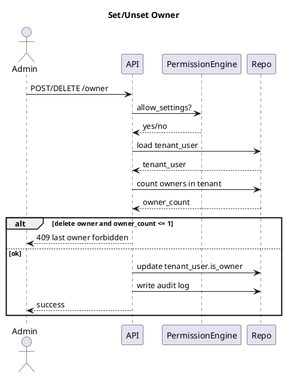

> 上述 5 个接口（5~7）均必须记录审计：添加/移除角色、设置/取消 Owner。

---

### 5.8.4 资源树权限配置（RolePermission）

页面行为：角色选择 + Tabs（表/Flow/Dataset/Dashboard）；表权限 tab 对表节点配置表结构/表数据两项；Folder 节点配置默认值；所有更改一个“保存”统一提交。

#### API 8：加载资源树与当前角色权限（按 scope）

* `GET /api/tenants/{tenant_id}/roles/{role_id}/resource-permissions?scope=TABLE|FLOW|DATASET|DASHBOARD`

出参（data）：

| 字段                                  | 类型          | 说明                               |
| ----------------------------------- | ----------- | -------------------------------- |
| tree                                | array       | ResourceTree 节点（Folder/Resource） |
| tree[].node_id                      | bigint      | ResourceTreeNode.id              |
| tree[].parent_id                    | bigint/null | 父节点                              |
| tree[].node_type                    | string      | FOLDER/RESOURCE                  |
| tree[].name                         | string      | 展示名                              |
| tree[].resource_id                  | bigint/null | 资源ID（资源节点）                       |
| permissions                         | array       | 当前角色已显式配置的权限列表                   |
| permissions[].resource_type         | string      | TABLE_SCHEMA/TABLE_DATA/...      |
| permissions[].resource_tree_node_id | bigint      | 节点ID                             |
| permissions[].permission            | string      | NONE/VIEW/EDIT/MANAGE            |

校验与异常分支：

* role_id 不存在/不属于 tenant → 404
* scope 非法 → 400

#### API 9：保存资源权限（覆盖式批量提交）

* `PUT /api/tenants/{tenant_id}/roles/{role_id}/resource-permissions?scope=...`

入参（body）：

| 字段                            | 类型     | 必填 | 约束                    | 说明                          |
| ----------------------------- | ------ | -: | --------------------- | --------------------------- |
| items                         | array  |  是 | 允许空数组                 | 显式配置列表                      |
| items[].resource_type         | string |  是 | 与 scope 匹配            | TABLE_SCHEMA/TABLE_DATA/... |
| items[].resource_tree_node_id | bigint |  是 | 必须属于该 scope 的资源树      | 节点ID                        |
| items[].permission            | string |  是 | NONE/VIEW/EDIT/MANAGE | 权限值                         |

实现规则（强制）：

1. **覆盖式保存**：以（tenant_id, role_id, scope 对应 resource_type 集合）为维度，先删后插（或 upsert），保证“保存即当前配置”。
2. 对表 scope：必须允许同时提交 TABLE_SCHEMA 与 TABLE_DATA 两类记录。
3. 数据一致性校验失败（节点不属于 scope、节点不存在、resource_type 非法）必须返回明确错误信息。
4. 成功后立即生效。

错误码（覆盖场景）：

* ERR_ROLE_NOT_FOUND
* ERR_SCOPE_INVALID
* ERR_RESOURCE_TREE_NODE_INVALID
* ERR_PERMISSION_ENUM_INVALID
* ERR_SETTINGS_FORBIDDEN
* ERR_DB_WRITE_FAILED

伪代码：

```text
RolePermissionService.saveScope(tenant_id, actor, role_id, scope, items):
  requireLogin + tenantActive + allowSettings
  assert role exists in tenant
  validate scope -> allowed resource_types
  for each item:
    assert item.resource_type in allowed_types
    assert ResourceTreeNode belongs to (tenant, scope) and exists
    assert item.permission in [NONE,VIEW,EDIT,MANAGE]
  begin tx
    RolePermissionRepo.deleteByRoleAndTypes(tenant_id, role_id, allowed_types)
    RolePermissionRepo.bulkInsert(items)
    Audit.log(actor, "ROLE_PERMISSION_SAVE", target=role_id, summary="save scope="+scope)
  commit
```

---

### 5.8.5 列权限配置（ColumnPermission）

页面结构：顶部角色选择；中部字段列表表格（展示 Field.display_name/code/type；列权限下拉）；保存即覆盖该角色在该表上的列权限配置；未显式配置字段使用系统默认策略（建议默认 READWRITE，仅受 TABLE_DATA 约束）。

#### API 10：加载某表某角色的列权限

* `GET /api/tenants/{tenant_id}/tables/{table_id}/column-permissions?role_id=...`

出参（data）：

| 字段                    | 类型     | 说明                            |
| --------------------- | ------ | ----------------------------- |
| fields                | array  | 字段列表（含当前 role 的 access_level） |
| fields[].field_id     | bigint | 字段ID                          |
| fields[].code         | string | Field.code                    |
| fields[].display_name | string | Field.display_name            |
| fields[].type         | string | Field.type                    |
| fields[].access_level | string | HIDDEN/READONLY/READWRITE     |

#### API 11：保存列权限（覆盖式）

* `PUT /api/tenants/{tenant_id}/tables/{table_id}/column-permissions?role_id=...`

入参（body）：

| 字段                   | 类型     | 必填 | 约束                        | 说明     |
| -------------------- | ------ | -: | ------------------------- | ------ |
| items                | array  |  是 | 可为空                       | 字段权限列表 |
| items[].field_id     | bigint |  是 | 必须属于 table_id             | 字段     |
| items[].access_level | string |  是 | HIDDEN/READONLY/READWRITE | 列权限    |

强制校验：

* field_id 必须属于该表
* access_level 枚举合法
* 可选约束：系统字段（如主键 id）最低 READONLY，不允许 HIDDEN（按需实现）

错误码：

* ERR_TABLE_NOT_FOUND
* ERR_ROLE_NOT_FOUND
* ERR_FIELD_NOT_IN_TABLE
* ERR_ACCESS_LEVEL_INVALID
* ERR_SETTINGS_FORBIDDEN
* ERR_DB_WRITE_FAILED

伪代码：

```text
ColumnPermissionService.save(tenant_id, actor, table_id, role_id, items):
  requireLogin + tenantActive + allowSettings
  assert table exists; assert role exists in tenant
  load table fields set S
  for item in items:
    assert item.field_id in S
    assert access_level in [HIDDEN,READONLY,READWRITE]
  begin tx
    ColumnPermissionRepo.deleteByRoleAndTable(tenant_id, role_id, table_id)
    ColumnPermissionRepo.bulkInsert(items)
    Audit.log(actor, "COLUMN_PERMISSION_SAVE", target=table_id, summary="role="+role_id)
  commit
```

---

### 5.8.6 行权限配置（RowPermission）

页面结构：顶部角色选择；中部规则列表（每条为 RowPermission）；支持新建/编辑/删除；保存时将可视化条件序列化为 FilterDSL JSON 存储。

#### API 12：查询行权限规则列表

* `GET /api/tenants/{tenant_id}/tables/{table_id}/row-permissions?role_id=...`

#### API 13：新建行权限规则

* `POST /api/tenants/{tenant_id}/tables/{table_id}/row-permissions?role_id=...`

入参（body）：

| 字段         | 类型     | 必填 | 约束           | 说明   |
| ---------- | ------ | -: | ------------ | ---- |
| name       | string |  否 | ≤64          | 规则名  |
| filter_dsl | json   |  是 | 合法 FilterDSL | 过滤条件 |

校验要点：

* FilterDSL 结构校验（op/conditions、operator/value 类型、字段白名单、特殊变量合法性）
* role_id 必须属于 tenant
* table_id 存在

错误码：

* ERR_FILTER_DSL_INVALID
* ERR_FILTER_VAR_INVALID
* ERR_FIELD_NOT_ALLOWED
* ERR_SETTINGS_FORBIDDEN
* ERR_DB_WRITE_FAILED

#### API 14：编辑行权限规则

* `PATCH /api/tenants/{tenant_id}/tables/{table_id}/row-permissions/{row_perm_id}`

#### API 15：删除行权限规则

* `DELETE /api/tenants/{tenant_id}/tables/{table_id}/row-permissions/{row_perm_id}`

> 规则生效逻辑必须严格遵循：角色内 OR、多角色 OR、与业务过滤 AND。

---

## 5.9 关键流程（编号步骤 + 异常分支）

### 5.9.1 “查询表数据”全链路权限应用（资源+列+行）

1. API 接收请求，解析 tenant_id、table_id、requested_fields、business_filter。
2. 校验登录态与 token（失败→401）。
3. 校验 tenant 上下文存在且可用（失败→ERR_TENANT_*）。
4. PermissionEngine 计算用户对该表的 TABLE_DATA effective permission（继承 + 多角色 max）。
5. 若 TABLE_DATA == NONE → 403。
6. 若请求包含写入动作（新增/编辑）且 TABLE_DATA < EDIT → 403。
7. 计算用户对该表各字段最终 ColumnPermission（多角色合并）。
8. 将 HIDDEN 字段从 requested_fields 中剔除（必须不出现在 SELECT）。
9. 若业务强制必须字段被剔除（例如主键），按“可选约束”策略处理：要么强制 READONLY，要么返回字段权限错误。
10. 计算 RowPermission：

* 若 TABLE_DATA=MANAGE 绕过→ row_filter=null；否则：角色内 OR、多角色 OR。

11. 组合总 WHERE：base_filter AND business_filter AND row_permission_filter。
12. QueryEngine 编译 FilterDSL → SQL（含 `__var__` 解析）。
13. 发送 SQL 到数据库执行。
14. 返回结果 rows（仅包含 final_fields）。
15. 记录访问日志（若审计要求覆盖查询可扩展；本期最小要求覆盖变更类操作）。
16. 响应给前端。
17. **异常分支 A**：FilterDSL 非法（结构/字段/变量）→ 400 + ERR_FILTER_DSL_INVALID。
18. **异常分支 B**：历史 Chart 引用了当前用户 HIDDEN 字段 → 返回字段权限错误并提示“无权使用字段 X”。
19. **异常分支 C**：权限不足 → 403。
20. **异常分支 D**：DB/超时 → 500/504（按全局错误码规范）。

---

## 5.10 权限变更审计对接（本章最小实现）

本期至少保证后端可追溯记录，覆盖：角色管理、成员角色关系、资源权限、行权限、列权限等。

审计记录字段（强制）：

* actor：TenantUser.id + GlobalUser 标识
* time、action_type（枚举）、target（对象ID）、summary（变更摘要）、result（成功/失败原因）

> 审计存储表结构与查询接口在“审计模块”章节定义；本章要求各 Service 在事务提交成功后写入审计（失败也需记录失败原因，可写独立失败日志）。
